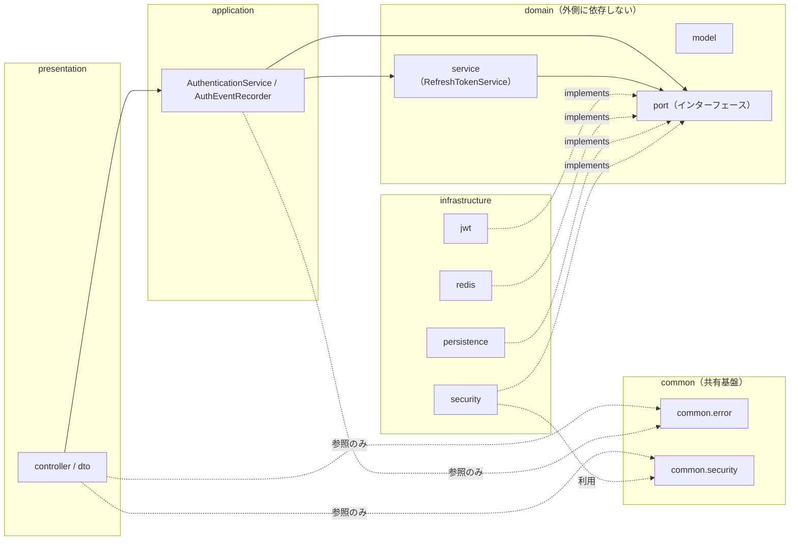
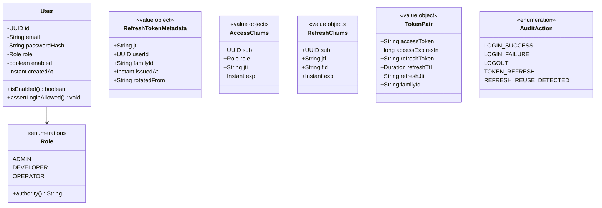
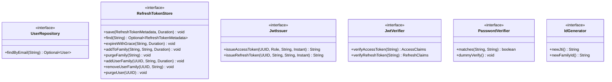
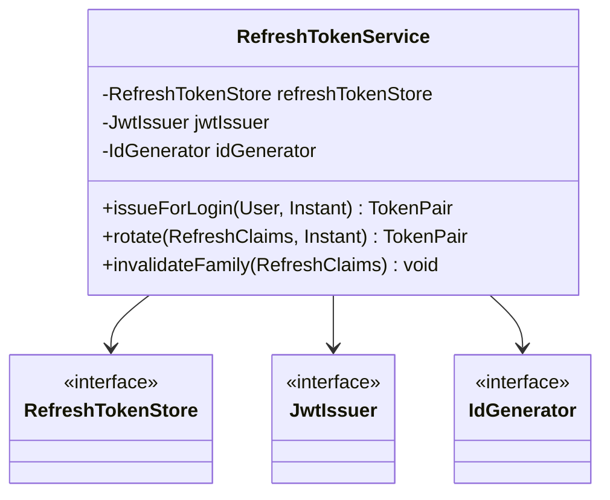
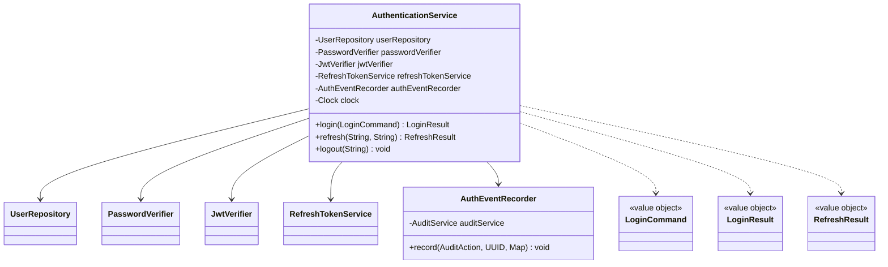
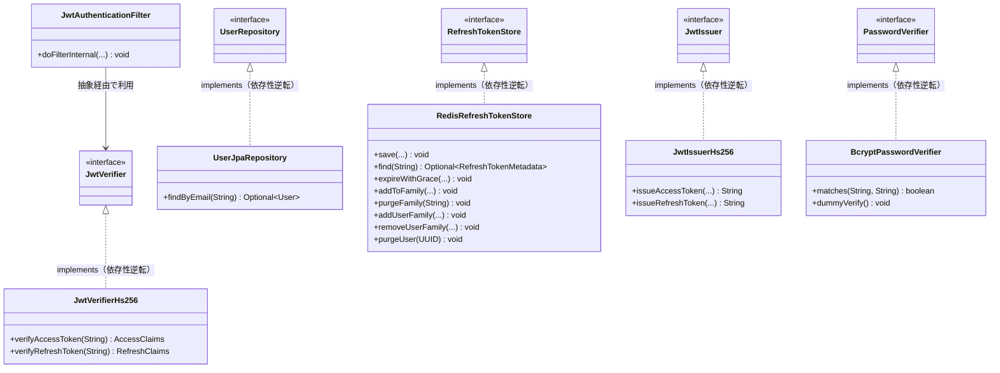
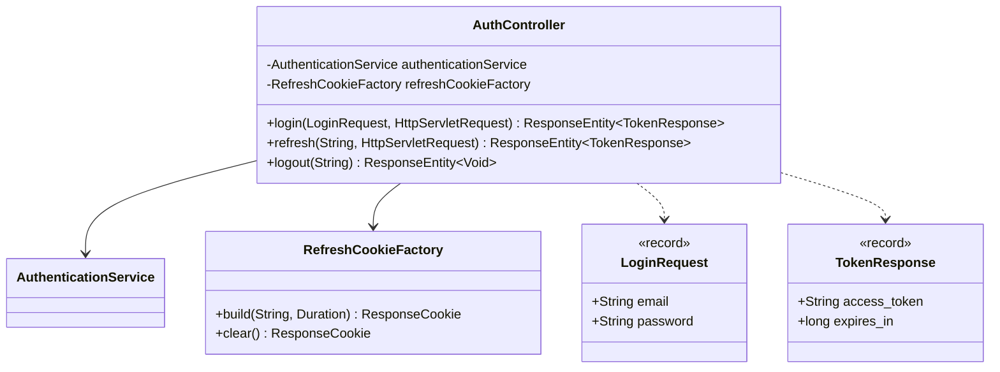
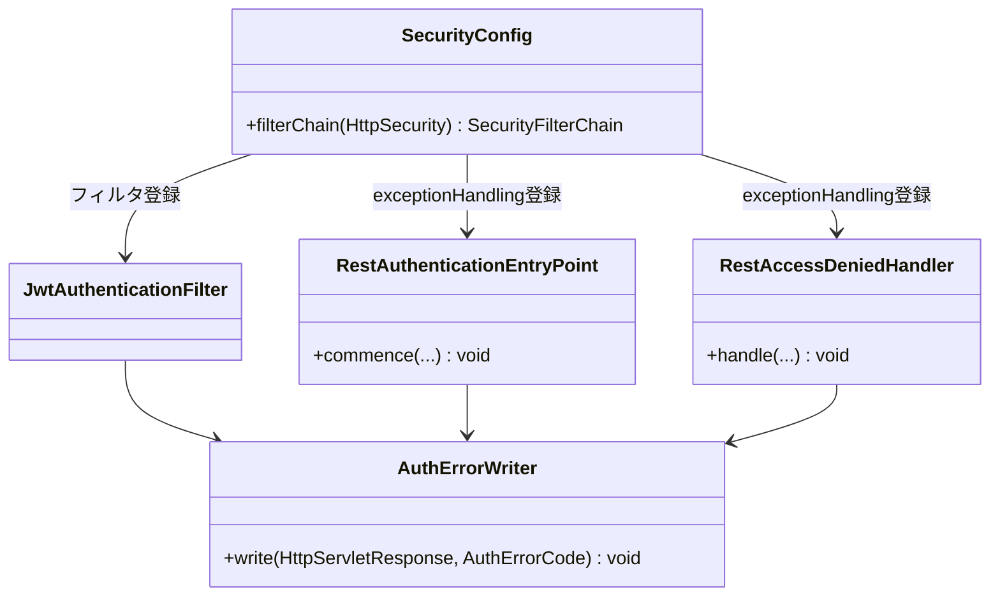
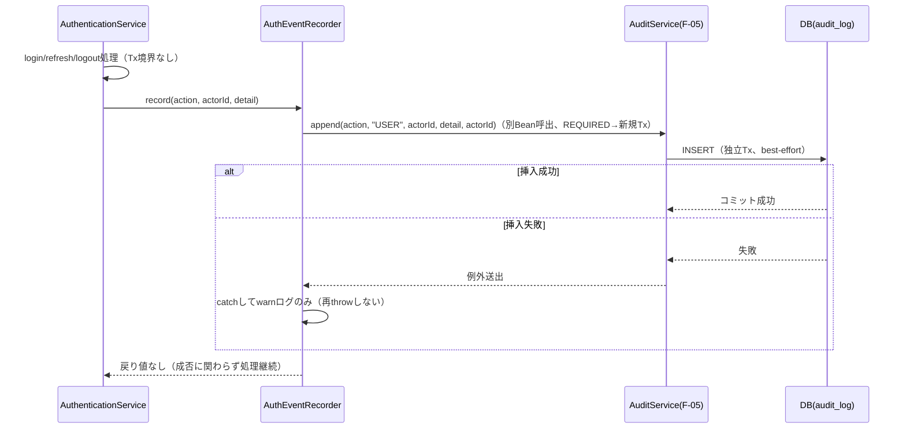

# F-01 JWT認証・認可 バックエンドクラス設計書（Phase1 MVP）

## 改訂履歴

| 版   | 日付       | 変更内容                     |
| ---- | ---------- | ---------------------------- |
| v0.1 | 2026-07-05 | 初版（backend-class-design-planner のプランを正式クラス設計書に展開） |

## 0. 位置付け・参照

本書は `docs/design/basic/f-01-jwt-auth.md`（詳細設計書）を実装可能な粒度のJava/Spring Bootクラス設計へ展開したものである。業務要件・API仕様・シーケンス・エラーコードの根拠は詳細設計書側にあり、本書はそれをクラス・パッケージ・依存関係・メソッドシグネチャへ変換することに専念する。詳細設計書に対して本書が新たな業務決定を追加することはない。

参照: `docs/requirements.md`、`docs/design/basic/f-01-jwt-auth.md`、`docs/design/basic/f-05-audit-log.md`。

**絶対制約（再掲・全章共通）**: 以下はプラン段階での絶対制約であり、本書のいずれの章の実装判断もこれに反してはならない。詳細は各該当章および末尾「12. 未決事項」を参照。

1. 認証イベント5種の監査記録は`AuthEventRecorder`による独立best-effort Txとし、失敗を認証結果へ伝播させない（warnログのみ）。
2. AT検証（`JwtAuthenticationFilter`/`JwtVerifierHs256`）はDB・Redis非参照の完全ステートレス。
3. パスワード平文はDB・ログ・例外メッセージへ一切出力せず、`BcryptPasswordVerifier`に閉じる。
4. JWTはHS256のみallowlistで検証し、`alg=none`/`RS256`混入は検証前に拒否する。
5. `SecurityConfig`は`anyRequest().authenticated()`のデフォルトdenyを敷き、注釈忘れによる全許可を防止する。

## 1. パッケージ構成と依存方向

### 1.1 パッケージ一覧

| パッケージ | 役割 |
| ---------- | ---- |
| `com.forgehub.auth.domain.model` | エンティティ・値オブジェクト・enum |
| `com.forgehub.auth.domain.port` | domainが要求する抽象（インターフェース） |
| `com.forgehub.auth.domain.service` | 業務ルール本体（ドメインサービス） |
| `com.forgehub.auth.application` | ユースケース調整（アプリケーションサービス、Tx境界） |
| `com.forgehub.auth.infrastructure.jwt` | JWT発行・検証の具象実装 |
| `com.forgehub.auth.infrastructure.redis` | Redisを用いたRT永続化の具象実装 |
| `com.forgehub.auth.infrastructure.persistence` | JPAによるユーザー検索の具象実装 |
| `com.forgehub.auth.infrastructure.security` | パスワード照合・認証フィルタ等のセキュリティ具象実装 |
| `com.forgehub.auth.presentation.controller` | 認証エンドポイントの公開 |
| `com.forgehub.auth.presentation.dto` | HTTP入出力DTO |
| `com.forgehub.common.error`（共有） | `ErrorResponse`・例外基底・`@RestControllerAdvice`ハンドラ |
| `com.forgehub.common.security`（共有） | `SecurityConfig`・`EntryPoint`・`AccessDeniedHandler`・エラー整形 |

### 1.2 依存方向の規約

依存方向は `presentation → application → domain ← infrastructure` を厳守する。

- `domain`（model/port/service）はいかなる外側レイヤ（application/infrastructure/presentation）にも依存しない。domainが必要とする外部機能（DB、Redis、JWTライブラリ、パスワードハッシュ等）はすべて`domain.port`のインターフェースとして宣言し、実装は`infrastructure`側に置く（依存性逆転）。
- `infrastructure`は`domain.port`のインターフェースを実装する（`implements`）ことでのみdomainと接続し、domain側からinfrastructureの具象クラスを参照することは一切ない。
- `application`は`domain.port`と`domain.service`にのみ依存し、`infrastructure`の具象クラス（`RedisTemplate`、`BCryptPasswordEncoder`等）を直接注入・参照しない。
- `presentation`は`application`のユースケースクラス（`AuthenticationService`）にのみ依存し、`domain`や`infrastructure`を直接参照しない。
- DIはコンストラクタ注入のみを用いる。フィールド注入・セッター注入は用いない（テスト容易性・不変性確保のため）。
- `com.forgehub.common.*`はF-01専用ではなく全機能共有の基盤パッケージであり、F-01はこれを再利用するのみで独自に重複定義しない。



図中の破線（`-. implements .->`）は依存性逆転（infrastructureがdomainのportを実装する側であり、domainからinfrastructureへ向かう矢印は存在しない）を示す。実線はレイヤ間の通常の呼び出し依存を示す。

## 2. ドメインモデル（値オブジェクト/エンティティ）

`com.forgehub.auth.domain.model`配下。

| クラス | 種別 | 責務 |
| ------ | ---- | ---- |
| `Role` | enum（F-02と共有） | ロール定義と権限文字列変換 |
| `User` | JPAエンティティ（オーナーはF-02、F-01は読取参照のみ） | ユーザー識別とログイン可否の不変条件 |
| `RefreshTokenMetadata` | 値オブジェクト（不変） | Redis保存するRTメタ情報 |
| `AccessClaims` | 値オブジェクト | AT検証結果クレーム保持 |
| `RefreshClaims` | 値オブジェクト | RT検証結果クレーム保持 |
| `TokenPair` | 値オブジェクト | 発行済みAT+RT文字列とTTLの束 |
| `AuditAction` | enum | F-01監査アクション定義（`AuditService.append`第1引数） |

### 2.1 Role

```java
public enum Role {
    ADMIN, DEVELOPER, OPERATOR;

    public String authority() {
        return "ROLE_" + name();
    }
}
```

`User`の管理オーナーはF-02（ユーザー・ロール管理）側backend-class設計であり、本書ではF-02が定義する`Role`を共有・参照するのみである。※本項目は「12. 未決事項」の4に対応する連携確認事項であり、F-02側backend-class設計確定時にパッケージ配置（`com.forgehub.user.domain`等への集約）を突合する必要がある。

### 2.2 User

```java
@Entity
@Table(name = "users")
public class User {

    @Id
    private UUID id;

    @Column(nullable = false)
    private String email;

    @Column(name = "password_hash", nullable = false)
    private String passwordHash;

    @Enumerated(EnumType.STRING)
    @Column(nullable = false)
    private Role role;

    @Column(nullable = false)
    private boolean enabled;

    @Column(name = "created_at", nullable = false)
    private Instant createdAt;

    protected User() { } // JPA用

    public boolean isEnabled() {
        return enabled;
    }

    public void assertLoginAllowed() throws AccountDisabledException {
        if (!enabled) {
            throw new AccountDisabledException();
        }
    }

    // getter のみ公開。setterは非公開とし、永続化ロジックはRepository実装側に閉じる。
}
```

不変条件: setterは非公開とし、`passwordHash`はbcryptハッシュのみを保持する（平文は一切保持しない）。JPAアノテーションは`@Entity`/`@Id`/`@Column`等の宣言的アノテーションのみを許容し、永続化ロジック自体はエンティティに書かない。

SOLID: S（本クラスは「ログイン可否の状態判定」のみを責務とし、トークン発行等の責務は一切持たない）。

`User`テーブル・カラム定義自体はF-02が最終オーナーである（本書は読取参照のみを前提とする）。※本項目は「12. 未決事項」参照。

### 2.3 RefreshTokenMetadata

```java
public final class RefreshTokenMetadata {

    private final String jti;
    private final UUID userId;
    private final String familyId;
    private final Instant issuedAt;
    private final String rotatedFrom; // nullable（初回発行時はnull）

    public RefreshTokenMetadata(String jti, UUID userId, String familyId,
                                 Instant issuedAt, String rotatedFrom) {
        this.jti = Objects.requireNonNull(jti);
        this.userId = Objects.requireNonNull(userId);
        this.familyId = Objects.requireNonNull(familyId);
        this.issuedAt = Objects.requireNonNull(issuedAt);
        this.rotatedFrom = rotatedFrom;
    }

    // 全フィールドgetterのみ。setterなし（不変）。
}
```

### 2.4 AccessClaims / RefreshClaims / TokenPair

```java
public final class AccessClaims {
    private final UUID sub;
    private final Role role;
    private final String jti;
    private final Instant exp;
    // コンストラクタ・getterのみ（不変）
}

public final class RefreshClaims {
    private final UUID sub;
    private final String jti;
    private final String fid; // familyId
    private final Instant exp;
    // コンストラクタ・getterのみ（不変）
}

public final class TokenPair {
    private final String accessToken;
    private final long accessExpiresIn;
    private final String refreshToken;
    private final Duration refreshTtl;
    private final String refreshJti;
    private final String familyId;
    // コンストラクタ・getterのみ（不変）
}
```

### 2.5 AuditAction

```java
public enum AuditAction {
    LOGIN_SUCCESS,
    LOGIN_FAILURE,
    LOGOUT,
    TOKEN_REFRESH,
    REFRESH_REUSE_DETECTED
}
```

`AuditAction`はF-05（監査ログ）のaction語彙レジストリ（`docs/design/basic/f-05-audit-log.md` 4章）のAUTHグループと1対1で対応する。F-05側の`AuditAction` enum定義との重複管理・突合は「12. 未決事項」参照（F-05側backend-class設計確定時の突合要）。



## 3. ポート（domainインターフェース）

`com.forgehub.auth.domain.port`配下。すべてinterfaceであり、domain/applicationはこれらの抽象にのみ依存する。実装は「6. インフラ実装」参照。

| インターフェース | 責務 | 主メソッド |
| ---------------- | ---- | ---------- |
| `UserRepository` | ユーザー取得の抽象 | `Optional<User> findByEmail(String email)` |
| `RefreshTokenStore` | RT/family/user索引の永続・失効操作の抽象 | 下記参照 |
| `JwtIssuer` | 署名付きJWT発行の抽象 | `issueAccessToken` / `issueRefreshToken` |
| `JwtVerifier` | JWT検証の抽象 | `verifyAccessToken` / `verifyRefreshToken` |
| `PasswordVerifier` | パスワード照合とユーザー列挙防止ダミー演算の抽象 | `matches` / `dummyVerify` |
| `IdGenerator` | jti/familyId生成の抽象（テスト差替可） | `newJti` / `newFamilyId` |

```java
public interface UserRepository {
    Optional<User> findByEmail(String email);
}
```

SOLID: I（認証に必要な検索メソッドのみに限定し、F-02が必要とするCRUD操作は別インターフェースへ分離する）。D（`AuthenticationService`はこの抽象にのみ依存する）。

```java
public interface RefreshTokenStore {
    void save(RefreshTokenMetadata metadata, Duration ttl);
    Optional<RefreshTokenMetadata> find(String jti);
    void expireWithGrace(String jti, Duration grace);
    void addToFamily(String familyId, String jti, Duration ttl);
    void purgeFamily(String familyId);
    void addUserFamily(UUID userId, String familyId, Duration ttl);
    void removeUserFamily(UUID userId, String familyId);
    void purgeUser(UUID userId);
}
```

Redisアクセス失敗は実装側で`AuthServiceUnavailableException`にラップして送出する（呼出元にRedisクライアント例外を漏らさない）。`purgeUser`はF-02（アカウント無効化・パスワードリセット時の一括セッション失効）にも共有ポートとして公開される。

SOLID: D（`RefreshTokenService`が依存する抽象）。I（発行・検証・失効の用途別にメソッド粒度を保ち、1メソッドに複数責務を混在させない）。

```java
public interface JwtIssuer {
    String issueAccessToken(UUID userId, Role role, String jti, Instant now);
    String issueRefreshToken(UUID userId, String jti, String familyId, Instant now);
}
```

SOLID: I（発行のみを責務とし、検証（`JwtVerifier`）とは別インターフェースに分離する）。

```java
public interface JwtVerifier {
    AccessClaims verifyAccessToken(String token) throws TokenExpiredException, TokenInvalidException;
    RefreshClaims verifyRefreshToken(String token) throws TokenInvalidException;
}
```

SOLID: I（検証のみを責務とし、発行とは分離する）。

```java
public interface PasswordVerifier {
    boolean matches(String raw, String hash);
    void dummyVerify();
}
```

SOLID: I（照合のみを責務とする）。

```java
public interface IdGenerator {
    String newJti();
    String newFamilyId();
}
```

SOLID: D（`UUID.randomUUID()`等の静的呼出をdomain/applicationから排除し、テスト時に決定的な値へ差替可能にする）。

なお、`IdGenerator`の具象実装クラス（infrastructure側でのUUIDベースの単純な実装）は本プランの`CLASS`行として明示されていない。実装自体は自明（`UUID.randomUUID().toString()`を返すのみ）であり業務ルールを含まないため、本書ではクラス名を新規に確定せず、`com.forgehub.auth.infrastructure.security`配下に1クラスとして配置する方針のみを記す。正式なクラス名の決定は実装時に委ねる（新規業務決定ではなく命名上の詳細のため、末尾「12. 未決事項」には計上しない）。同様に`Clock`は`java.time.Clock`（JDK標準）をSpring Beanとして注入する前提であり、独自のportとしては定義しない。



## 4. ドメインサービス（業務ルール本体）

`com.forgehub.auth.domain.service`配下。RTローテーション/再利用検知/family失効の業務ルールは、本層の`RefreshTokenService`に集約し、application層やfilterへ漏出させない（プランDECISIONSの絶対方針）。

### 4.1 RefreshTokenService

```java
public class RefreshTokenService {

    private final RefreshTokenStore refreshTokenStore;
    private final JwtIssuer jwtIssuer;
    private final IdGenerator idGenerator;

    public RefreshTokenService(RefreshTokenStore refreshTokenStore,
                                JwtIssuer jwtIssuer,
                                IdGenerator idGenerator) {
        this.refreshTokenStore = refreshTokenStore;
        this.jwtIssuer = jwtIssuer;
        this.idGenerator = idGenerator;
    }

    public TokenPair issueForLogin(User user, Instant now) {
        // 新規jti/familyId発行 → AT/RT生成 → store.save/addToFamily/addUserFamily
    }

    public TokenPair rotate(RefreshClaims claims, Instant now) throws RefreshRevokedException {
        // store.find(claims.jti())が不在の場合:
        //   purgeFamily(claims.fid()) + removeUserFamily(claims.sub(), claims.fid())
        //   → RefreshRevokedException（再利用検知）
        // 存在する場合:
        //   新AT/RT発行 + 旧jtiをexpireWithGrace(60秒, rotatedFrom記録) + addToFamily
    }

    public void invalidateFamily(RefreshClaims claims) {
        // logout用: 当該familyの全RTを失効
    }
}
```

- 依存: `RefreshTokenStore`、`JwtIssuer`、`IdGenerator`（いずれもコンストラクタ注入、抽象のみ）。
- `rotate`の挙動: `store.find(jti)`が不在（＝grace期間を超えて既に使用済みのRTの再提示、または不正な使い回し）の場合は`purgeFamily(fid)`と`removeUserFamily(userId, fid)`を実行したうえで`RefreshRevokedException`を送出する（再利用検知）。存在する場合は新AT/RTを発行し、旧jtiに対して`expireWithGrace(60秒)`（`rotatedFrom`記録込み）と`addToFamily`を実行する。
- SOLID: S（RTの状態遷移ルール（発行・ローテーション・再利用検知・family/user失効）のみを責務とし、HTTP・監査・DB検索等の関心事は一切持たない）。
- 業務ルールの配置: 本クラスがRTローテーション/再利用検知/family・user索引失効の**唯一の実装箇所**である。`AuthenticationService`（application）や`JwtAuthenticationFilter`（infrastructure）にこのロジックを重複実装しない。

`User.assertLoginAllowed()`（enabled判定、2.2節参照）も同様にドメイン側の不変条件として保持され、application層やcontrollerに判定ロジックを漏出させない。



## 5. アプリケーションサービスとTx境界

`com.forgehub.auth.application`配下。login/refresh/logoutのユースケース調整と監査イベント発火を担う。RTローテーション等の業務ルールそのものは4章の`RefreshTokenService`に委譲し、本層は調整役にとどめる（SOLID S、後述「11. 設計上の検討事項」参照）。

### 5.1 LoginCommand / LoginResult / RefreshResult

```java
public final class LoginCommand {
    private final String email;
    private final String password;
    private final String clientIp; // servlet型（HttpServletRequest等）を層に持ち込まない
}

public final class LoginResult {
    private final String accessToken;
    private final long expiresIn;
    private final String refreshToken;
    private final Duration refreshTtl;
}

public final class RefreshResult {
    private final String accessToken;
    private final long expiresIn;
    private final String refreshToken;
    private final Duration refreshTtl;
}
```

### 5.2 AuthenticationService

```java
public class AuthenticationService {

    private final UserRepository userRepository;
    private final PasswordVerifier passwordVerifier;
    private final JwtVerifier jwtVerifier;
    private final RefreshTokenService refreshTokenService;
    private final AuthEventRecorder authEventRecorder;
    private final Clock clock;

    public AuthenticationService(UserRepository userRepository,
                                  PasswordVerifier passwordVerifier,
                                  JwtVerifier jwtVerifier,
                                  RefreshTokenService refreshTokenService,
                                  AuthEventRecorder authEventRecorder,
                                  Clock clock) {
        // 全依存はコンストラクタ注入。フィールド注入は用いない。
    }

    public LoginResult login(LoginCommand cmd)
            throws InvalidCredentialsException, AccountDisabledException, AuthServiceUnavailableException {
        // 1. userRepository.findByEmail(cmd.email())
        // 2. 不在時: passwordVerifier.dummyVerify() → AuthEventRecorder.record(LOGIN_FAILURE, ...) → InvalidCredentialsException
        // 3. 存在時: passwordVerifier.matches(cmd.password(), user.passwordHash())
        //    不一致: AuthEventRecorder.record(LOGIN_FAILURE, ...) → InvalidCredentialsException
        //    一致: user.assertLoginAllowed()（enabled=false時はAccountDisabledException）
        //          → refreshTokenService.issueForLogin(user, clock.instant())
        //          → AuthEventRecorder.record(LOGIN_SUCCESS, ...)
        //          → LoginResult組立
    }

    public RefreshResult refresh(String rt, String clientIp)
            throws RefreshRevokedException, TokenInvalidException, AuthServiceUnavailableException {
        // jwtVerifier.verifyRefreshToken(rt) → refreshTokenService.rotate(claims, clock.instant())
        // → AuthEventRecorder.record(TOKEN_REFRESH, ...) または REFRESH_REUSE_DETECTED
    }

    public void logout(String rt) {
        // rtがnull、またはjwtVerifier.verifyRefreshToken(rt)がTokenInvalidExceptionを送出した場合:
        //   invalidateFamily/AuthEventRecorder.record(LOGOUT, ...)は呼ばずreturn（例外を投げない）
        // rtが有効な場合:
        //   refreshTokenService.invalidateFamily(claims) → AuthEventRecorder.record(LOGOUT, ...)
        // いずれの分岐でも呼出元（AuthController.logout）は204 No Contentを返す
        //   （rt無効時も含め常に204とすることで、Cookieクリアと合わせクライアント側の
        //     ログアウト操作をべき等にする）
    }
}
```

- Tx境界: `@Transactional`は付与しない。認証処理はDB書込を持たず（`users`テーブルは読取専用の単発クエリのみ）、RT操作はRedisに対する操作であるため、DBトランザクション境界を張る対象が存在しない。ユーザー検索は単発の読取専用クエリとして扱う（※本項目は末尾「12. 未決事項」の絶対制約1にも関連するため、実装時に`@Transactional(readOnly = true)`の要否を含め改めて確認すること）。
- SOLID: S（login/refresh/logoutの調整のみを責務とし、RTの状態遷移ルールは`RefreshTokenService`、監査発火の失敗吸収は`AuthEventRecorder`へ分離済み）。D（依存はすべて`domain.port`または`domain.service`の抽象であり、`RedisTemplate`や`BCryptPasswordEncoder`等のinfrastructure具象を直接参照しない）。

### 5.3 AuthEventRecorder

```java
@Component
public class AuthEventRecorder {

    private final AuditService auditService; // F-05

    public AuthEventRecorder(AuditService auditService) {
        this.auditService = auditService;
    }

    public void record(AuditAction action, UUID actorId, Map<String, Object> detail) {
        try {
            auditService.append(action, "USER", actorId, detail, actorId);
        } catch (Exception e) {
            // warnログのみ。再throwしない（認証結果へ失敗を伝播させない絶対制約）。
        }
    }
}
```

Tx境界の詳細は「10. F-05監査連携」参照。SOLID: S（監査発火の失敗吸収のみを責務とし、認証結果には一切影響を与えない）。



## 6. インフラ実装（JWT/Redis/JPA/Filter）

`com.forgehub.auth.infrastructure`配下。いずれも「3. ポート」で定義したインターフェースを実装し、domain/applicationからは抽象経由でのみ利用される（依存性逆転）。

| クラス | パッケージ | 実装インターフェース | 責務 |
| ------ | ---------- | -------------------- | ---- |
| `JwtIssuerHs256` | `.infrastructure.jwt` | `JwtIssuer` | HS256署名でAT/RT生成 |
| `JwtVerifierHs256` | `.infrastructure.jwt` | `JwtVerifier` | HS256限定検証（alg allowlist、leeway30秒、typ判定） |
| `RedisRefreshTokenStore` | `.infrastructure.redis` | `RefreshTokenStore` | `rt:{jti}`/`rtfam:{familyId}`/`rtuser:{userId}`のRedis操作 |
| `UserJpaRepository` | `.infrastructure.persistence` | `UserRepository` | citext email一意検索 |
| `BcryptPasswordVerifier` | `.infrastructure.security` | `PasswordVerifier` | bcrypt(cost10)照合とダミー演算 |
| `JwtAuthenticationFilter` | `.infrastructure.security` | `OncePerRequestFilter`を継承（portは実装しない） | SEQ_verify（Bearer AT検証→SecurityContext設定） |

### 6.1 JwtIssuerHs256

```java
@Component
public class JwtIssuerHs256 implements JwtIssuer {

    private final String secret;      // @Value("${jwt.secret}")
    private final long accessTtlSec;  // @Value("${jwt.access-ttl}")
    private final long refreshTtlSec; // @Value("${jwt.refresh-ttl}")

    public JwtIssuerHs256(@Value("${jwt.secret}") String secret,
                           @Value("${jwt.access-ttl}") long accessTtlSec,
                           @Value("${jwt.refresh-ttl}") long refreshTtlSec) {
        // ...
    }

    @Override
    public String issueAccessToken(UUID userId, Role role, String jti, Instant now) {
        // iss=forgehub, aud=forgehub-api, typ=access を付与
    }

    @Override
    public String issueRefreshToken(UUID userId, String jti, String familyId, Instant now) {
        // iss=forgehub, aud=forgehub-api, typ=refresh, fid=familyId を付与
    }
}
```

SOLID: S（署名発行のみを責務とする）。

### 6.2 JwtVerifierHs256

```java
@Component
public class JwtVerifierHs256 implements JwtVerifier {

    private final String secret; // @Value("${jwt.secret}")
    private final Clock clock;

    @Override
    public AccessClaims verifyAccessToken(String token) throws TokenExpiredException, TokenInvalidException {
        // alg != HS256（none/RS256混入含む）→ TokenInvalidException
        // iss != "forgehub" → TokenInvalidException
        // aud != "forgehub-api" → TokenInvalidException
        // exp超過（leeway 30秒） → TokenExpiredException
        // typ != access → TokenInvalidException
    }

    @Override
    public RefreshClaims verifyRefreshToken(String token) throws TokenInvalidException {
        // alg != HS256 → TokenInvalidException
        // iss != "forgehub" → TokenInvalidException
        // aud != "forgehub-api" → TokenInvalidException
        // exp超過 → TokenInvalidException（RTはExpiredではなくInvalid扱い）
        // typ != refresh → TokenInvalidException
    }
}
```

SOLID: S。セキュリティ: algを許可リスト（HS256のみ）に固定し、`alg=none`・`RS256`等の混入を検証前に拒否する（絶対制約4）。

### 6.3 RedisRefreshTokenStore

```java
@Component
public class RedisRefreshTokenStore implements RefreshTokenStore {

    private final StringRedisTemplate redisTemplate;

    @Override
    public void save(RefreshTokenMetadata metadata, Duration ttl) {
        // rt:{jti} = metadataのJSON + EXPIRE(ttl)
    }

    @Override
    public Optional<RefreshTokenMetadata> find(String jti) { /* rt:{jti} 取得 */ }

    @Override
    public void expireWithGrace(String jti, Duration grace) { /* rt:{jti}のEXPIREをgraceへ短縮 */ }

    @Override
    public void addToFamily(String familyId, String jti, Duration ttl) { /* rtfam:{familyId} へSADD + EXPIRE */ }

    @Override
    public void purgeFamily(String familyId) { /* rtfam:{familyId}配下の全rt:{jti}削除 */ }

    @Override
    public void addUserFamily(UUID userId, String familyId, Duration ttl) { /* rtuser:{userId} へSADD + EXPIRE更新（ローリングTTL） */ }

    @Override
    public void removeUserFamily(UUID userId, String familyId) { /* rtuser:{userId} からSREM */ }

    @Override
    public void purgeUser(UUID userId) { /* rtuser:{userId}配下の全familyをpurgeFamily */ }
}
```

Redis接続失敗時はすべてのメソッドで`AuthServiceUnavailableException`（503）にラップして送出する。SOLID: S。L（`RefreshTokenStore`の契約を満たす形で置換可能な実装であり、将来的に別ストア（例: DB）へ差し替えてもdomain/application側の契約を変えずに済む）。

### 6.4 UserJpaRepository

```java
@Repository
public class UserJpaRepository implements UserRepository {

    private final SpringDataUserJpaRepository delegate; // Spring Data JPAへ委譲

    @Override
    public Optional<User> findByEmail(String email) {
        return delegate.findByEmail(email); // citext列に対する一意検索
    }
}
```

SOLID: D（domainの`UserRepository`ポートを実装し、application側はこの具象を一切知らない）。

### 6.5 BcryptPasswordVerifier

```java
@Component
public class BcryptPasswordVerifier implements PasswordVerifier {

    private final BCryptPasswordEncoder encoder; // strength = 10

    @Override
    public boolean matches(String raw, String hash) {
        return encoder.matches(raw, hash);
    }

    @Override
    public void dummyVerify() {
        // 固定ダミーハッシュに対してmatchesを実行し、応答時間を平準化する（ユーザー列挙防止）
        encoder.matches("dummy-password", DUMMY_HASH);
    }
}
```

SOLID: S。セキュリティ: 平文パスワードをログ・例外へ一切出力しない（絶対制約3）。

### 6.6 JwtAuthenticationFilter

```java
public class JwtAuthenticationFilter extends OncePerRequestFilter {

    private final JwtVerifier jwtVerifier;
    private final AuthErrorWriter authErrorWriter;

    @Override
    protected void doFilterInternal(HttpServletRequest request,
                                     HttpServletResponse response,
                                     FilterChain filterChain) throws ServletException, IOException {
        // Bearerヘッダ無し → 素通り（EntryPointが後続で401を返す）
        // verify成功 → UsernamePasswordAuthenticationToken(sub, authorities=ROLE_xxx) をSecurityContextへ設定
        // TokenExpiredException/TokenInvalidException → authErrorWriter経由でコード別401書き出し
    }
}
```

SOLID: S（AT検証とセキュリティコンテキスト設定のみを責務とし、認可（ロール判定そのもの）は`@PreAuthorize`側に委ねる）。制約: 本フィルタはAT検証においてDB・Redisを一切参照しない完全ステートレス実装とする（絶対制約2）。



## 7. プレゼンテーション/DTO/Cookie

`com.forgehub.auth.presentation`配下。

| クラス | パッケージ | 責務 |
| ------ | ---------- | ---- |
| `AuthController` | `.presentation.controller` | 認証エンドポイント公開とCookie組立 |
| `RefreshCookieFactory` | `.presentation`（`@Component`） | RT Cookie生成/クリア |
| `LoginRequest` | `.presentation.dto` | ログイン入力（record） |
| `TokenResponse` | `.presentation.dto` | AT応答本文（record） |

### 7.1 AuthController

```java
@RestController
@RequestMapping("/api/v1/auth")
public class AuthController {

    private final AuthenticationService authenticationService;
    private final RefreshCookieFactory refreshCookieFactory;

    @PostMapping("/login")
    public ResponseEntity<TokenResponse> login(@Valid @RequestBody LoginRequest req,
                                                HttpServletRequest http) {
        // LoginCommand組立(clientIp=http由来) → authenticationService.login
        // → TokenResponse本文 + Set-Cookie(refresh_token)
    }

    @PostMapping("/refresh")
    public ResponseEntity<TokenResponse> refresh(
            @CookieValue(name = "refresh_token", required = false) String rt,
            HttpServletRequest http) {
        // authenticationService.refresh(rt, clientIp) → TokenResponse + 新Set-Cookie
    }

    @PostMapping("/logout")
    public ResponseEntity<Void> logout(
            @CookieValue(name = "refresh_token", required = false) String rt) {
        // authenticationService.logout(rt) → Cookieクリア + 204
    }
}
```

Tx境界: なし（HTTP境界変換のみを担い、業務ロジック・Tx制御は持たない）。SOLID: S。制約: `User`エンティティや`passwordHash`をHTTPレスポンスへ直接返すことは一切行わない（`TokenResponse`は`access_token`/`expires_in`のみを保持する）。

### 7.2 RefreshCookieFactory

```java
@Component
public class RefreshCookieFactory {

    public ResponseCookie build(String rt, Duration ttl) {
        // httpOnly + Secure + SameSite=Strict + path=/api/v1/auth
    }

    public ResponseCookie clear() {
        // 同一属性で maxAge=0 のCookieを返す
    }
}
```

### 7.3 DTO

```java
public record LoginRequest(
        @Email String email,
        @NotBlank String password
) { }

public record TokenResponse(
        String access_token,
        long expires_in
) { }
```

`TokenResponse`にRT本文を含めない。RTは`httpOnly` Cookie（`SameSite=Strict`、`path=/api/v1/auth`）経由のみで受け渡す。



## 8. SecurityConfigとRBAC実装位置

`com.forgehub.common.security`配下（F-01専用ではなく全機能共有の横断設定基盤）。

| クラス | 責務 |
| ------ | ---- |
| `SecurityConfig` | `SecurityFilterChain`定義 |
| `RestAuthenticationEntryPoint` | 未認証401 |
| `RestAccessDeniedHandler` | 認可失敗403 |
| `AuthErrorWriter` | Filter/EntryPoint/Handlerからの`{code, message, details}`直書き出し統一 |

### 8.1 SecurityConfig

```java
@Configuration
@EnableMethodSecurity
public class SecurityConfig {

    @Bean
    public SecurityFilterChain filterChain(HttpSecurity http) throws Exception {
        // SessionCreationPolicy.STATELESS
        // csrf無効化（Bearer方式のため）
        // /api/v1/auth/login, /api/v1/auth/refresh, /api/v1/auth/logout は permitAll
        //   （詳細設計書7章の認可要件: login=不要、refresh=有効なRT、logout=有効なRT/ATであり、
        //     いずれも有効なATの保有を前提としないため。RT/ATの検証自体は
        //     AuthenticationService.refresh/logout（Service層）で行う）
        // それ以外は anyRequest().authenticated()（デフォルトdeny、有効なAT必須）
        // JwtAuthenticationFilter を UsernamePasswordAuthenticationFilter の前段に追加
        // exceptionHandling に RestAuthenticationEntryPoint / RestAccessDeniedHandler を設定
    }
}
```

SOLID: O（RBACの拡張は各機能Controllerの`@PreAuthorize`アノテーションで行い、`SecurityConfig`自体は横断設定（STATELESS、フィルタ登録、例外ハンドリング登録）のみを責務とし、リソースごとの認可要件の追加によって本クラスを変更する必要がない）。

**RBAC実装位置についての絶対制約（再掲）**: F-01が提供するのは認可の設定基盤（`@EnableMethodSecurity`、`STATELESS`、`EntryPoint`/`AccessDeniedHandler`）のみである。各リソース（`/api/v1/users`、`/api/v1/apis`等）の`@PreAuthorize`は各機能のController（F-02〜F-04）が個別に付与する。F-01側のControllerがこれを一括で肩代わりすることはない。デフォルトdeny（`anyRequest().authenticated()`）により、注釈忘れのエンドポイントは「認証済みであること」のみが要求され、意図しない全ロール許可を防止する。

### 8.2 RestAuthenticationEntryPoint / RestAccessDeniedHandler / AuthErrorWriter

```java
@Component
public class RestAuthenticationEntryPoint implements AuthenticationEntryPoint {
    @Override
    public void commence(HttpServletRequest request, HttpServletResponse response,
                          AuthenticationException authException) throws IOException {
        // AUTH_UNAUTHENTICATED + WWW-Authenticate: Bearer
    }
}

@Component
public class RestAccessDeniedHandler implements AccessDeniedHandler {
    @Override
    public void handle(HttpServletRequest request, HttpServletResponse response,
                        AccessDeniedException accessDeniedException) throws IOException {
        // AUTH_FORBIDDEN
    }
}

@Component
public class AuthErrorWriter {
    public void write(HttpServletResponse response, AuthErrorCode code) throws IOException {
        // {code, message, details} を直接書き出す（Filter/EntryPoint/Handler間で重複実装しない単一実装）
    }
}
```

SOLID（`AuthErrorWriter`）: S（エラー整形の単一実装であり、`JwtAuthenticationFilter`・`RestAuthenticationEntryPoint`・`RestAccessDeniedHandler`の3箇所での重複実装を排除する）。



## 9. 例外階層とエラーコード対応

`com.forgehub.common.error`配下（全機能共有）。

### 9.1 例外階層

```java
public abstract class AuthException extends RuntimeException {
    public abstract String getCode();
    public abstract HttpStatus getStatus();
}

public class InvalidCredentialsException extends AuthException { /* code=AUTH_INVALID_CREDENTIALS, status=401 */ }
public class AccountDisabledException extends AuthException { /* code=AUTH_ACCOUNT_DISABLED, status=403 */ }
public class TokenExpiredException extends AuthException { /* code=AUTH_TOKEN_EXPIRED, status=401 */ }
public class TokenInvalidException extends AuthException { /* code=AUTH_TOKEN_INVALID, status=401 */ }
public class RefreshRevokedException extends AuthException { /* code=AUTH_REFRESH_REVOKED, status=401 */ }
public class AuthServiceUnavailableException extends AuthException { /* code=AUTH_SERVICE_UNAVAILABLE, status=503 */ }
```

SOLID（`AuthException`）: L（全サブ型が`getCode()`/`getStatus()`という同一契約のみを実装し、独自のHTTPステータス解決ロジックを個別に持たない。これにより`AuthExceptionHandler`は`AuthException`型として一律にキャッチ・変換でき、リスコフ置換に反しない）。

### 9.2 AuthExceptionHandler

```java
@RestControllerAdvice
public class AuthExceptionHandler {

    @ExceptionHandler(AuthException.class)
    public ResponseEntity<ErrorResponse> handle(AuthException e) {
        // e.getStatus()/e.getCode()から一律変換。401応答にはWWW-Authenticate: Bearerを付与。
    }

    @ExceptionHandler(MethodArgumentNotValidException.class)
    public ResponseEntity<ErrorResponse> handleValidation(MethodArgumentNotValidException e) {
        // バリデーションエラーの変換
    }
}
```

SOLID: S（HTTP例外変換の単一箇所）。

```java
public record ErrorResponse(String code, String message, Object details) { }
```

`ErrorResponse`は既存共有の`com.forgehub.common.error`定義を再利用し、F-01独自に重複定義しない。

### 9.3 エラーコード対応表

| コード | HTTPステータス | 例外クラス | 発生条件 |
| ------ | --------------- | ---------- | -------- |
| `AUTH_INVALID_CREDENTIALS` | 401 | `InvalidCredentialsException` | ログイン失敗（ユーザー不存在含めユーザー列挙防止のため同一コードに統一） |
| `AUTH_ACCOUNT_DISABLED` | 403 | `AccountDisabledException` | `enabled=false`のユーザーによるログイン試行 |
| `AUTH_TOKEN_EXPIRED` | 401 | `TokenExpiredException` | ATの有効期限切れ |
| `AUTH_TOKEN_INVALID` | 401 | `TokenInvalidException` | 署名不正、許可外アルゴリズム混入、`typ`不一致 |
| `AUTH_REFRESH_REVOKED` | 401 | `RefreshRevokedException` | RTがRedis上に存在しない、または再利用検知が成立 |
| `AUTH_UNAUTHENTICATED` | 401 | （`RestAuthenticationEntryPoint`が直接書き出し、例外クラスは介さない） | トークン未提示 |
| `AUTH_FORBIDDEN` | 403 | （`RestAccessDeniedHandler`が直接書き出し） | ロール不足による認可失敗 |
| `AUTH_SERVICE_UNAVAILABLE` | 503 | `AuthServiceUnavailableException` | Redis不通によりlogin/refreshが実行できない場合 |

いずれの401応答にも`WWW-Authenticate: Bearer`ヘッダを付与する。エラーコード8種は`docs/design/basic/f-01-jwt-auth.md` 10章と1対1で対応しており、本書での追加・削除はない。

## 10. F-05監査連携（独立best-effort Tx）

**絶対制約（再掲）**: 認証イベント5種（`LOGIN_SUCCESS`/`LOGIN_FAILURE`/`LOGOUT`/`TOKEN_REFRESH`/`REFRESH_REUSE_DETECTED`）の監査記録は`AuthEventRecorder`による独立best-effort Txとし、記録の失敗を認証結果へ一切伝播させない。これは`docs/design/basic/f-05-audit-log.md` 7章「例外: AUTH系イベントの独立best-effort Tx」の確定事項に対応する、F-01側backend-class実装の対応クラスである。

### 10.1 Tx境界の仕組み

- `AuthenticationService`のlogin/refresh/logoutメソッドには`@Transactional`を付与しない（5.2節参照）。すなわち呼出元スレッドにはアクティブなトランザクションが存在しない。
- `AuthEventRecorder.record(...)`は`AuthenticationService`とは別のSpring Bean（`@Component`）として実装されるため、`auditService.append(...)`呼び出しはBean境界を越えた呼出しとなり、Spring AOPプロキシによる`@Transactional`（`AuditService.append`側はデフォルトの`REQUIRED`伝播）が正しく作動する。呼出元に既存Txが無いため、`REQUIRED`伝播は新規Txを開始し、結果として認証本処理から独立した短命Txとしてbest-effort実行される。
- 同一クラス内の自己呼出し（self-invocation）によるプロキシ非作動の問題は、`AuthEventRecorder`が`AuthenticationService`とは別Beanであるため該当しない。
- `AuthEventRecorder.record`内部の`try/catch`で例外を捕捉し、warnログのみを出力して再throwしない。これにより監査記録の失敗が認証処理（ログイン成否等）へ影響することはない。

### 10.2 シーケンス（SEQ_auth_event、F-05設計書10.3節と対応）



### 10.3 監査アクションとdetail

`detail`形式は`docs/design/basic/f-05-audit-log.md` 4章の`detail`形式canon（AUTH系は一律`{email, ip, reason_code}`）に従う。本書はこのcanonにfamilyId/jti等の独自フィールドを追加しない（F-05側canonの変更は本書のスコープ外であり、本書は詳細設計書・F-05に無い新たな業務決定を追加しない）。

| `AuditAction` | 発火タイミング | detail想定内容（非機密のみ、F-05 4章canon準拠） |
| ------------- | -------------- | ----------------------------- |
| `LOGIN_SUCCESS` | ログイン成功時 | `{email, ip, reason_code}`（`reason_code`は`null`） |
| `LOGIN_FAILURE` | ユーザー不在・パスワード不一致・アカウント無効時 | `{email, ip, reason_code}`（パスワードは含めない） |
| `LOGOUT` | ログアウト時 | `{email, ip, reason_code}`（`reason_code`は`null`） |
| `TOKEN_REFRESH` | RTローテーション成功時 | `{email, ip, reason_code}`（`reason_code`は`null`） |
| `REFRESH_REUSE_DETECTED` | 再利用検知時 | `{email, ip, reason_code}`（`reason_code`は`null`） |

`detail`はproducer（`AuthEventRecorder`）側で非機密情報のみを組み立てる（`docs/design/basic/f-05-audit-log.md` 12章のdenylist二重防御の対象にもなる）。LOGIN_FAILUREの`detail`にパスワードを含めることは絶対制約3により禁止される。

F-05側`AuditService`のインターフェース詳細・Tx実装（`@Transactional`伝播設定含む）はF-05のbackend-class設計書側が最終オーナーであり、本書は呼出前提（`append(action, targetType, targetId, detail, actorId)`シグネチャ）のみを参照する。※本項目は「12. 未決事項」参照（F-05側backend-class設計確定時の突合要）。

## 11. テスト方針

プラン段階の敵対評価「テスト容易性」への対処（`Clock`/`IdGenerator`のポート化、全依存の抽象化、コンストラクタ注入の徹底）を前提に、レイヤごとに以下の方針でテストする。

| レイヤ | 方針 |
| ------ | ---- |
| `domain.service`（`RefreshTokenService`） | Spring非依存の純粋単体テスト。`RefreshTokenStore`/`JwtIssuer`/`IdGenerator`をモック化し、rotate時の再利用検知分岐（`store.find`不在→`purgeFamily`+`removeUserFamily`+`RefreshRevokedException`）、grace付き失効、family/user索引更新を検証する。`Clock`固定により時刻依存を排除する。 |
| `domain.model`（`User`） | `assertLoginAllowed()`の`enabled=false`時の例外送出をユニットテストで検証する。 |
| `application`（`AuthenticationService`） | `UserRepository`/`PasswordVerifier`/`JwtVerifier`/`RefreshTokenService`/`AuthEventRecorder`/`Clock`をすべてモック化し、login/refresh/logoutの分岐（不在時dummyVerify呼出、不一致時、enabled=false時、正常系）を検証する。監査発火が呼ばれること（回数・引数）をモック検証で確認する。 |
| `application`（`AuthEventRecorder`） | `AuditService`をモック化し、正常時のappend呼出と、例外送出時にcatchしてwarnログのみで再throwしないことを検証する。 |
| `infrastructure.jwt` | 実際のJWTライブラリを用いた統合的な単体テスト。`alg=none`/`RS256`混入トークンの拒否、leeway 30秒境界値、`typ`不一致の拒否を検証する。 |
| `infrastructure.redis`（`RedisRefreshTokenStore`） | Testcontainers等の実Redisに対する統合テストで、`rt:{jti}`/`rtfam:{familyId}`/`rtuser:{userId}`のキー操作・TTL設定・接続断時の`AuthServiceUnavailableException`変換を検証する。 |
| `infrastructure.persistence`（`UserJpaRepository`） | `@DataJpaTest`でcitext一意検索を検証する。 |
| `infrastructure.security`（`JwtAuthenticationFilter`） | `MockHttpServletRequest`/`MockFilterChain`を用い、Bearer無し時の素通り、検証成功時のSecurityContext設定、Expired/Invalid時のAuthErrorWriter呼出を検証する。DB/Redisアクセスが発生しないことをモックの未呼出検証で担保する。 |
| `presentation`（`AuthController`） | `MockMvc`（`@WebMvcTest`＋`AuthenticationService`モック）でHTTPステータス・`Set-Cookie`属性（httpOnly/Secure/SameSite=Strict/path）・レスポンス本文（`access_token`/`expires_in`のみ）を検証する。 |
| `common.security`（`SecurityConfig`） | `@SpringBootTest`＋`MockMvc`で、未認証時401、ロール不足時403、`/api/v1/auth/login`のpermitAll、その他エンドポイントのデフォルトdenyを統合的に検証する。 |
| 例外階層 | `AuthExceptionHandler`の単体テストで、各`AuthException`サブ型に対する`ErrorResponse`変換とHTTPステータス・`WWW-Authenticate`ヘッダ付与を検証する。 |

## 12. 設計上の検討事項（敵対評価）

design-doc-plannerによるクラス設計レビュー段階で行われた攻撃的な観点からの指摘（ATTACK）と、それに対する対処（RESOLVED、最終的にCLASS/DECISIONSへどう反映されたか）を残す。実装者はこの章のみを読めば、本クラス設計が何を懸念しどう対処したかを把握できる。

### 12.1 SOLID原則ごとの検査結果

| 原則 | 指摘（シナリオ） | 対処（RESOLVED） |
| ---- | ---------------- | ----------------- |
| S（単一責任） | `AuthenticationService`がlogin/refresh/logout＋監査発火＋RTローテーションを1クラスに詰め込むと、変更理由が複数（業務ルール変更・監査要件変更・調整フロー変更）になり単一責任に反する。 | RTローテーション/再利用検知等の業務ルールを`RefreshTokenService`（domain.service）へ、監査失敗吸収を`AuthEventRecorder`（application）へ分離し、`AuthenticationService`はユースケース調整のみに縮退させた（4章・5章参照）。 |
| O（開放閉鎖） | 将来のRS256移行・`kid`複数鍵対応時に、`JwtVerifierHs256`内部でalg分岐が散在する懸念がある。 | `JwtVerifier`/`JwtIssuer`をport化し、実装差替（例: `JwtVerifierRs256`の追加）で拡張可能な構成とした。ただしPhase1はHS256単一実装であり、現時点でRS256切替インターフェースの過剰な抽象化（例: alg別Strategyパターンの先取り導入）は行わない旨を明記する（3章・6章参照）。 |
| L（リスコフ置換） | `AuthException`のサブ型の一部が独自のHTTPステータス解決ロジックを持つと、`AuthExceptionHandler`側で型ごとの分岐が必要になり、サブ型が基底型と置換不能になる。 | 全サブ型が`getCode()`/`getStatus()`という同一契約のみを実装する構成とし、`AuthExceptionHandler`が`AuthException`型で一律キャッチ・変換できるようにした（9章参照）。 |
| I（インターフェース分離） | `UserRepository`にF-02が必要とするCRUD操作まで載せると、認証クライアント（`AuthenticationService`）に不要なメソッドが流入する。`RefreshTokenStore`も発行・検証・失効を1メソッドに混在させると肥大化する。 | `UserRepository`は`findByEmail`のみに限定し、F-02のCRUDは別インターフェースへ分離した。`RefreshTokenStore`も`save`/`find`/`expireWithGrace`/`addToFamily`/`purgeFamily`/`addUserFamily`/`removeUserFamily`/`purgeUser`と用途別にメソッド粒度を保った（3章参照）。 |
| D（依存性逆転） | `AuthenticationService`が`RedisTemplate`や`BCryptPasswordEncoder`を直接参照すると、application層がinfrastructure具象へ依存してしまう。 | `AuthenticationService`（application）・`RefreshTokenService`（domain）は`RefreshTokenStore`/`PasswordVerifier`/`JwtVerifier`/`JwtIssuer`/`UserRepository`という抽象（domain.port）にのみ依存し、具象実装（`RedisRefreshTokenStore`等）はinfrastructureに配置してDIで解決する構成とした（1章・3章・6章参照）。 |

### 12.2 その他の観点

| # | 観点 | シナリオ | 対処（RESOLVED） |
| - | ---- | -------- | ----------------- |
| 1 | ドメインロジック漏出 | 再利用検知時のfamily purgeを`JwtAuthenticationFilter`やController層に書いてしまうと、ドメイン層が貧血症（Anemic Domain）化し業務ルールが分散する。 | `RefreshTokenService.rotate`に再利用検知ロジックを封入し、`User.assertLoginAllowed()`にenabled判定をドメイン側へ配置した（4章・2.2節参照）。 |
| 2 | 依存循環・逆流 | domainが`RedisTemplate`を直接参照すると依存の逆流（domain→infrastructure）が生じる。Controllerが`UserRepository`を直接呼び出すとapplication層を迂回してしまう。 | ポート定義をdomain、実装をinfrastructureに配置し依存を外→内へ統一した。Controllerは`AuthenticationService`経由のみでdomain/infrastructureを直接参照しない（1章参照）。 |
| 3 | トランザクション | 認証イベント監査を業務Txに巻き込むと、F-05確定事項D（業務操作と同一Tx）と矛盾し、かつRedis操作を伴う認証処理が監査記録失敗によって阻害されうる。 | `AuthEventRecorder`を別Beanとし、`AuditService.append`（`REQUIRED`伝播）を非Tx下から呼び出すことで独立Tx化し、`try/catch`で認証本体を保護した。self-invocationにも該当しない構成である（5.3節・10章参照）。 |
| 4 | 例外設計 | Redis不通時にRT発行途中の状態を握りつぶすと、クライアントに不整合な成功応答を返してしまう。 | login/refreshにおいてRedis不通は`AuthServiceUnavailableException`（503）として明示的に送出する。監査記録のみをbest-effort扱いとし、認証本体の処理結果は握りつぶさない（9章・10章参照）。 |
| 5 | セキュリティ（HTTP露出） | `User`エンティティや`passwordHash`をHTTPレスポンスへ直接シリアライズしてしまう。監査`detail`にパスワードやAPIキー等の機密が混入する。 | `TokenResponse`を`access_token`/`expires_in`のみに限定した。`LOGIN_FAILURE`の`detail`は`email`/`ip`/`reason_code`のみとし、パスワードを含めない。RTはCookie経由に限定した（7章・10.3節参照）。F-05側denylistとの二重防御も維持する。 |
| 6 | IDOR | refresh/logoutの対象RTを、リクエストボディの`familyId`パラメータから受け取ってしまうと、他ユーザーのfamilyIdを指定した不正操作（IDOR）が成立し得る。 | refresh/logoutの対象RTはCookie提示のRT文字列を検証して得た`jti`/`fid`のみを採用し、リクエストボディから`familyId`を受領する経路を設けない（7章のController実装、`@CookieValue`のみで受理）。 |
| 7 | テスト容易性 | `jti`/`familyId`の生成に`UUID.randomUUID()`を、時刻取得に`Instant.now()`を直接呼び出すと、単体テストで決定的な値を注入できない。 | `IdGenerator`/`Clock`をポート化・注入対象とし、`PasswordVerifier`/`JwtVerifier`もモック可能な抽象とした。全Beanをコンストラクタ注入とすることでテストダブルの差替を容易にした（3章・11章参照）。 |
| 8 | 設計書との整合 | login/refresh/logout、エラーコード8種、監査5種、grace60秒、`rtuser`索引等の詳細設計書側の要素がクラス設計へ欠落する。 | `AuthController`の3メソッド、`AuthException`系6サブ型＋2ハンドラ直書きコード、`AuditAction` enum5値、`RefreshTokenService.rotate`のgrace実装、`RefreshTokenStore.addUserFamily`/`removeUserFamily`/`purgeUser`をそれぞれ1対1でクラス・メソッドへ対応付けた（2章・3章・4章・9章参照）。 |

## 13. 未決事項

以下は本設計において解決に至らず`OPEN`として残された事項である。実装・レビュー時には特に注意すること（関連する各章の本文中にも同様の注記を配置済み）。

**絶対制約（再掲・全章共通）**: 認証監査は`AuthEventRecorder`によるbest-effort独立Txとし、失敗が認証結果へ波及しない実装を厳守する。AT検証（`JwtAuthenticationFilter`/`JwtVerifierHs256`）はステートレスでDB・Redis非参照を厳守する。

1. **発行済みATの無効化不可によるロール変更・アカウント無効化反映の遅延（最大15分）**: ATはステートレスであるため個別無効化ができず、ロール変更・アカウント無効化後も発行済みATは最大15分（AT TTL）有効なままとなる。Phase2でRedisベースのATブラックリスト導入を検討する（`docs/design/basic/f-01-jwt-auth.md` 16章-1、本書「6.2 JwtVerifierHs256」「4.1 RefreshTokenService」参照）。
2. **HS256単一鍵のローテーション手順とkid複数鍵対応**: Phase1では単一鍵・手動ローテーションを前提とする。`kid`クレームによる複数鍵対応の設計・実装はPhase2で検討する（`docs/design/basic/f-01-jwt-auth.md` 16章-2、本書「6.1/6.2 JwtIssuerHs256/JwtVerifierHs256」参照）。
3. **AUTH系best-effort追記の失敗許容度の妥当性レビュー**: `AuthEventRecorder`が採用するbest-effort独立Tx方式（記録失敗を許容し認証結果へ影響させない設計）が、セキュリティ要件上妥当であるかは別途レビューが必要である（`docs/design/basic/f-05-audit-log.md` 16章-4、本書「10章 F-05監査連携」参照）。
4. **共有クラスの最終オーナーとの突合要**: `User`エンティティ、`UserRepository`（の`User`部分）、`Role`、`AuditService`／`AuditAction`の最終的な設計・パッケージ配置は、それぞれF-02（ユーザー・ロール管理）・F-05（監査ログ）側backend-class設計が最終オーナーである。本書（F-01）はこれらをread参照・呼出前提として扱っているに過ぎず、各設計確定時に重複定義の有無とパッケージ配置（例: `com.forgehub.user.domain`への集約）を突合する必要がある（本書「2.2 User」「2.5 AuditAction」「10.3節」参照）。

（プラン段階のATTACK/RESOLVEDにより解消済みの指摘は「12. 設計上の検討事項（敵対評価）」に対処結果を記載済みであり、本節には計上しない。）
