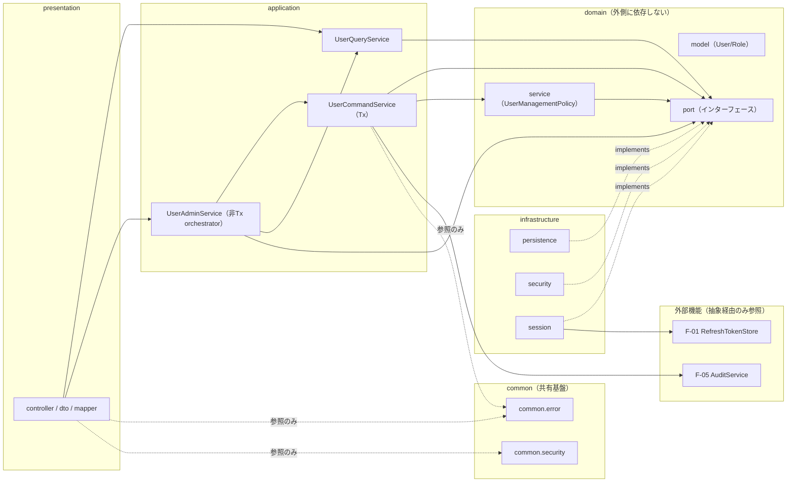
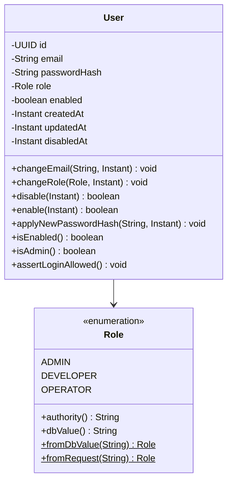
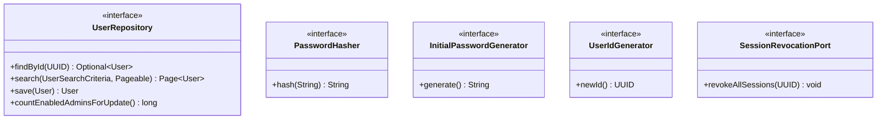
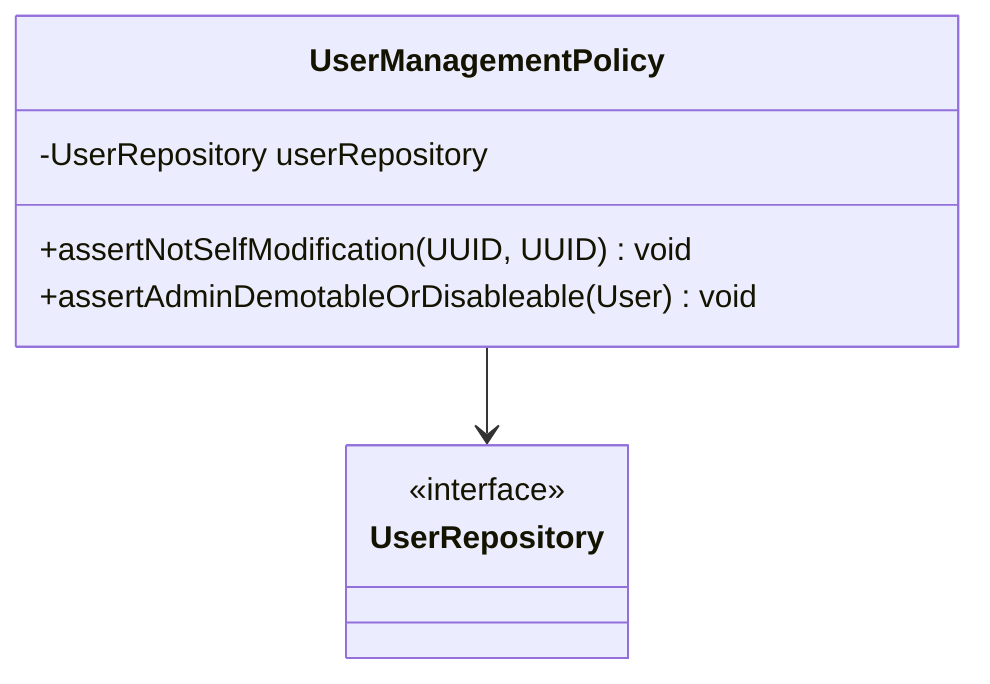
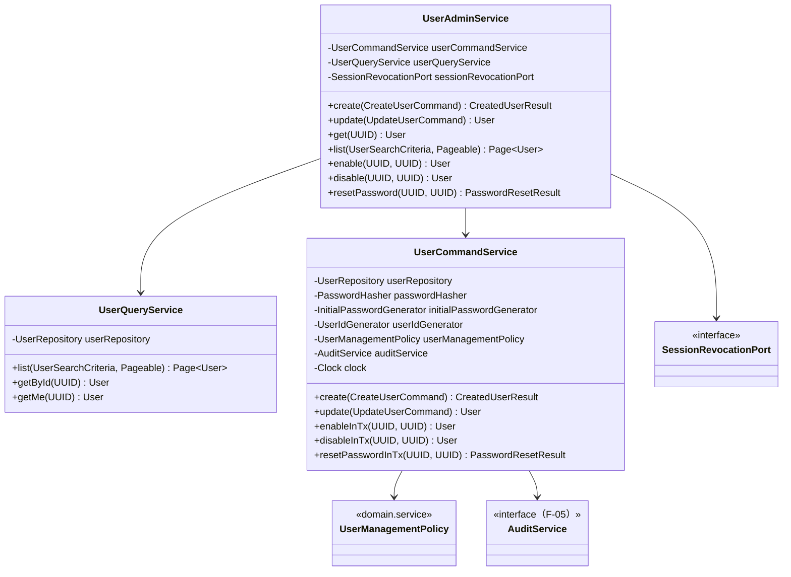
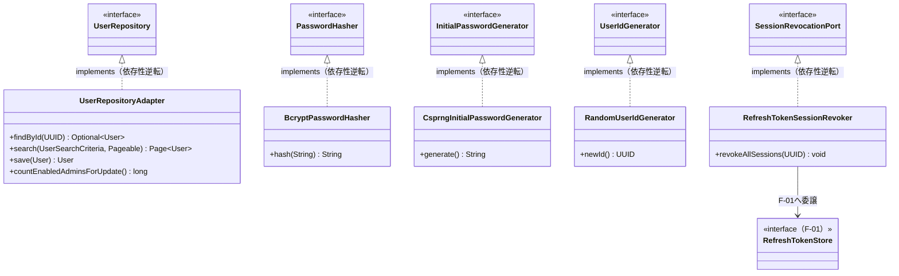
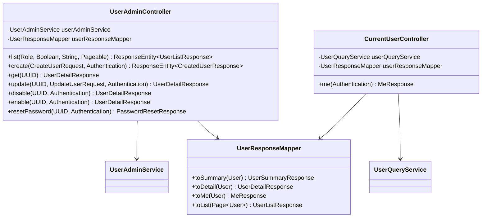
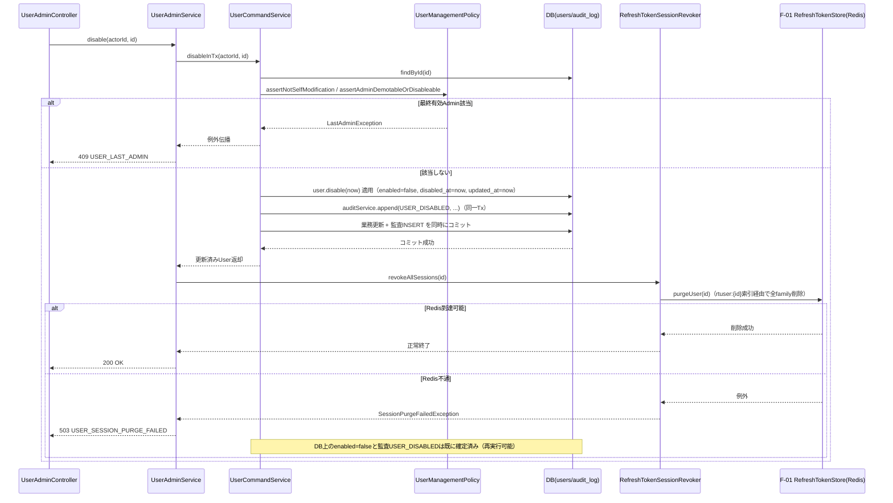

# F-02 ユーザー・ロール管理 バックエンドクラス設計書（Phase1 MVP）

## 改訂履歴

| 版   | 日付       | 変更内容                     |
| ---- | ---------- | ---------------------------- |
| v0.1 | 2026-07-06 | 初版（backend-class-design-planner のプランを正式クラス設計書に展開） |
| v0.2 | 2026-07-06 | F-05バックエンドクラス設計（`docs/design/class/f-05-audit-log-backend-class.md`）確定に伴い、`AuditService.append`シグネチャ・`@Transactional(REQUIRED)`伝播の突合OPEN（14章(4)）を解消 |

## 1. 位置付け・参照/絶対制約

本書は `docs/design/basic/f-02-user-role-management.md`（詳細設計書）をEP1〜EP8全域にわたって実装可能な粒度のJava/Spring Bootクラス設計へ展開したものである。業務要件・API仕様・エラーコード・監査アクション語彙の根拠は詳細設計書側にあり、本書はそれをパッケージ・クラス・メソッドシグネチャ・依存関係へ変換することに専念する。詳細設計書に対して本書が新たな業務決定を追加することはない。プランに明記されていない新規クラス・メソッド・依存関係も追加しない。

参照: `docs/requirements.md`、`docs/design/basic/f-02-user-role-management.md`、`docs/design/class/f-01-jwt-auth-backend-class.md`、`docs/design/basic/f-05-audit-log.md`。

**絶対制約（再掲・全章共通）**: 以下はプラン段階での絶対制約であり、本書のいずれの章の実装判断もこれに反してはならない。詳細は各該当章および末尾「14. 未決事項」を参照。

1. 監査追記`USER_*`6種（`USER_CREATED`/`USER_UPDATED`/`USER_ROLE_CHANGED`/`USER_DISABLED`/`USER_ENABLED`/`USER_PASSWORD_RESET`）は`UserCommandService`の`@Transactional`メソッド内で`AuditService.append`（`REQUIRED`伝播）を同一トランザクション呼出しし、業務更新と原子化する（F-05確定事項D準拠）。F-01のAUTH系イベントのようなbest-effort独立Txとはしない。`append`失敗時は業務更新ごとrollbackする。
2. 平文パスワード（初期パスワード含む）・`password_hash`は、監査ログの`detail`・アプリケーションログ・例外メッセージ・一覧/詳細レスポンスのいずれにも一切出力しない。`detail`は`role`/`email`/`enabled`のbefore/after差分のみを記録する。
3. ロール値は`Admin`/`Developer`/`Operator`の3種に固定する。enum外の値の指定は400（`USER_INVALID_ROLE`）とし、DBの`CHECK`制約と二重に防御する。
4. ハード削除・MFA・self-serviceパスワード変更・複数ロール割当はMVP対象外である（詳細設計書1章準拠）。

## 2. パッケージ構成と依存方向

### 2.1 パッケージ一覧

| パッケージ | 役割 |
| ---------- | ---- |
| `com.forgehub.user.domain.model` | エンティティ・enum（`User`/`Role`） |
| `com.forgehub.user.domain.port` | domainが要求する抽象（インターフェース） |
| `com.forgehub.user.domain.service` | 業務ルール本体（自己変更禁止・最終Admin保護） |
| `com.forgehub.user.application` | ユースケース調整（アプリケーションサービス、Tx境界） |
| `com.forgehub.user.application.command` | コマンド/クエリ/結果を表すrecord群 |
| `com.forgehub.user.infrastructure.persistence` | JPAによるユーザー永続・検索の具象実装 |
| `com.forgehub.user.infrastructure.security` | bcryptハッシュ化・CSPRNG生成・ID採番の具象実装 |
| `com.forgehub.user.infrastructure.session` | F-01 RefreshTokenStoreへのセッション失効委譲の具象実装 |
| `com.forgehub.user.presentation.controller` | ユーザー管理エンドポイントの公開 |
| `com.forgehub.user.presentation.dto` | HTTP入出力DTO |
| `com.forgehub.user.presentation.mapper` | domainモデル→応答DTOの変換 |
| `com.forgehub.common.error`（共有・再利用） | `ErrorResponse`・例外基底・`@RestControllerAdvice`ハンドラ |
| `com.forgehub.common.security`（共有・F-01再利用） | `SecurityConfig`・`EntryPoint`・`AccessDeniedHandler` |

### 2.2 依存方向の規約

依存方向は `presentation → application → domain(model/port/service) ← infrastructure` を厳守する。

- `domain`（model/port/service）はいかなる外側レイヤ（application/infrastructure/presentation）にも依存しない。DB永続・bcryptハッシュ化・CSPRNG生成・ID採番・F-01セッション失効といった外部機能は、すべて`domain.port`のインターフェースとして宣言し、実装は`infrastructure`側に置く（依存性逆転）。
- `infrastructure`は`domain.port`のインターフェースを`implements`することでのみdomainと接続し、domain側からinfrastructureの具象クラスを参照することは一切ない。
- `application`は`domain.port`と`domain.service`にのみ依存し、`infrastructure`の具象クラス（`SpringDataUserRepository`、`BCryptPasswordEncoder`、`SecureRandom`、F-01の`RefreshTokenStore`実装）を直接注入・参照しない。
- `presentation`は`application`のユースケースクラス（`UserAdminService`/`UserQueryService`）にのみ依存し、`domain`や`infrastructure`を直接参照しない。
- DIはコンストラクタ注入のみを用いる。フィールド注入・セッター注入は用いない。
- F-01（JWT認証）・F-05（監査ログ）はF-02から見て外側の別機能であり、`SessionRevocationPort`（F-01 `RefreshTokenStore#purgeUser`への narrow adapter）・`AuditService`（F-05のサービスIF）という抽象/サービスIF経由でのみ参照する。F-01/F-05の具象クラスをdomain/applicationから直接参照することはない。
- `com.forgehub.common.*`はF-02専用ではなく全機能共有の基盤パッケージであり、F-02はこれを再利用するのみで独自に重複定義しない。



図中の破線（`-. implements .->`）は依存性逆転（infrastructureがdomainのportを実装する側であり、domainからinfrastructureへ向かう矢印は存在しない）を示す。実線はレイヤ間の通常の呼び出し依存を示す。`ISess → F01`は`infrastructure.session`がF-01の`RefreshTokenStore`を直接呼び出す唯一の箇所であり、domain/applicationはこれを`SessionRevocationPort`という自層の抽象越しにしか知らない。

## 3. ドメインモデル（`User`/`Role`と不変条件）

`com.forgehub.user.domain.model`配下。`User`/`Role`のオーナーはF-02であり、F-01は読取参照のみを行う（F-01側backend-class設計書「12. 未決事項」4、および本書「14. 未決事項」(1)(2)参照）。

| クラス | 種別 | 責務 |
| ------ | ---- | ---- |
| `Role` | enum（F-02がowner） | ロール定義とDB格納値/Spring権限文字列/API入力値の相互変換 |
| `User` | JPAエンティティ（F-02がowner、F-01は読取参照） | ユーザーの状態遷移と不変条件 |

### 3.1 Role

```java
public enum Role {
    ADMIN, DEVELOPER, OPERATOR;

    public String authority() {
        return "ROLE_" + name();
    }

    public String dbValue() {
        return switch (this) {
            case ADMIN -> "Admin";
            case DEVELOPER -> "Developer";
            case OPERATOR -> "Operator";
        };
    }

    public static Role fromDbValue(String value) {
        return switch (value) {
            case "Admin" -> ADMIN;
            case "Developer" -> DEVELOPER;
            case "Operator" -> OPERATOR;
            default -> throw new IllegalStateException("unknown db role value: " + value);
        };
    }

    public static Role fromRequest(String value) throws InvalidRoleException {
        try {
            return fromDbValue(value);
        } catch (IllegalStateException e) {
            throw new InvalidRoleException();
        }
    }
}
```

SOLID: S（DB格納値/Spring権限文字列/API入力値の相互変換のみを責務とする）。

※注記: DB格納値`'Admin'`とenum名`ADMIN`は文字表現が不一致であるため、永続化時は`RoleAttributeConverter`（「7. インフラ実装」参照）で変換する。F-01側backend-class設計が`@Enumerated(EnumType.STRING)`を用いている場合、enum名`'ADMIN'`がそのままDBへ格納されCHECK制約（`role IN ('Admin','Developer','Operator')`）に違反するリスクがある。本項目は「14. 未決事項」(2)としてF-01/F-02間の突合を要する未決事項であり、本書では解決しない。

### 3.2 User

```java
@Entity
@Table(name = "users")
public class User {

    @Id
    private UUID id;

    @Column(nullable = false)
    private String email;

    @Column(name = "password_hash", nullable = false)
    private String passwordHash;

    @Convert(converter = RoleAttributeConverter.class)
    @Column(nullable = false)
    private Role role;

    @Column(nullable = false)
    private boolean enabled;

    @Column(name = "created_at", nullable = false)
    private Instant createdAt;

    @Column(name = "updated_at", nullable = false)
    private Instant updatedAt;

    @Column(name = "disabled_at")
    private Instant disabledAt; // nullable（有効時はnull）

    protected User() { } // JPA用

    public void changeEmail(String newEmail, Instant now) {
        this.email = Objects.requireNonNull(newEmail);
        this.updatedAt = now;
    }

    public void changeRole(Role newRole, Instant now) {
        if (newRole == null) {
            throw new IllegalArgumentException("role must not be null");
        }
        this.role = newRole;
        this.updatedAt = now;
    }

    public boolean disable(Instant now) {
        if (!this.enabled) {
            return false; // 既にdisabled。冪等no-op（呼出元は現状返却し監査追記しない）
        }
        this.enabled = false;
        this.disabledAt = now;
        this.updatedAt = now;
        return true;
    }

    public boolean enable(Instant now) {
        if (this.enabled) {
            return false; // 既にenabled。冪等no-op
        }
        this.enabled = true;
        this.disabledAt = null;
        this.updatedAt = now;
        return true;
    }

    public void applyNewPasswordHash(String hash, Instant now) {
        this.passwordHash = Objects.requireNonNull(hash);
        this.updatedAt = now;
    }

    public boolean isEnabled() {
        return enabled;
    }

    public boolean isAdmin() {
        return role == Role.ADMIN;
    }

    public void assertLoginAllowed() throws AccountDisabledException {
        if (!enabled) {
            throw new AccountDisabledException();
        }
    }

    // getterのみ公開。setterは非公開とし、状態遷移は上記の振る舞いメソッド経由のみで行う（貧血ドメイン回避）。
}
```

依存: なし。Tx: なし（エンティティ自身はTx境界を持たない。呼出元の`UserCommandService`の`@Transactional`に参加する）。

SOLID: S（自己状態遷移と不変条件の保持のみを責務とし、永続化・検索・監査・認可判定は一切持たない）。

不変条件: `role`非null（`changeRole`はnullを`IllegalArgumentException`で拒否）／`email`非null／`passwordHash`はbcryptハッシュのみを保持し平文は一切保持しない／setterは非公開とし振る舞いメソッド経由でのみ状態を更新する（貧血ドメイン回避）。JPAアノテーションは`@Entity`/`@Id`/`@Column`/`@Convert`等の宣言的アノテーションのみを許容し、永続化ロジック自体はエンティティに書かない。

※注記: `assertLoginAllowed()`が送出する`AccountDisabledException`は現時点でF-01側（`com.forgehub.auth`配下）の例外型として定義されている。F-02が`User`エンティティのオーナーとなったことに伴い、本メソッドの例外型の所有パッケージ（F-01/F-02いずれの配下に置くか、あるいは共有パッケージへ移すか）は未確定である。この点は「14. 未決事項」(1)(2)に対応する連携確認事項であり、本書では解決しない。



## 4. ドメインポート（抽象）

`com.forgehub.user.domain.port`配下。すべてinterfaceであり、domain/applicationはこれらの抽象にのみ依存する。実装は「7. インフラ実装」参照。

| インターフェース | 責務 | 主メソッド |
| ---------------- | ---- | ---------- |
| `UserRepository` | F-02のユーザー永続・検索・最終Adminカウントの抽象 | `findById`/`search`/`save`/`countEnabledAdminsForUpdate` |
| `PasswordHasher` | bcrypt(cost10)ハッシュ化の抽象 | `hash` |
| `InitialPasswordGenerator` | CSPRNG24文字初期パスワード生成の抽象 | `generate` |
| `UserIdGenerator` | ユーザーID採番の抽象 | `newId` |
| `SessionRevocationPort` | 当該ユーザー全RT一括失効の抽象 | `revokeAllSessions` |

```java
public interface UserRepository {
    Optional<User> findById(UUID id);
    Page<User> search(UserSearchCriteria criteria, Pageable pageable);
    User save(User user);
    long countEnabledAdminsForUpdate();
}
```

SOLID: I（F-01の`UserRepository#findByEmail`とは別インターフェースとし、認証クライアントに管理系CRUD操作を流入させない）。D（`UserQueryService`/`UserCommandService`/`UserManagementPolicy`はこの抽象のみに依存する）。

```java
public interface PasswordHasher {
    String hash(String raw);
}
```

SOLID: I（照合のみを担うF-01の`PasswordVerifier`とは分離し、hash専用インターフェースとする）。

```java
public interface InitialPasswordGenerator {
    String generate();
}
```

SOLID: D（`SecureRandom`の直接呼出をapplicationから排除し、テスト時に決定的な値へ差替可能にする）。

```java
public interface UserIdGenerator {
    UUID newId();
}
```

SOLID: D（`UUID.randomUUID()`の静的呼出を排除し、テスト決定化を可能にする）。

```java
public interface SessionRevocationPort {
    void revokeAllSessions(UUID userId) throws SessionPurgeFailedException;
}
```

SOLID: I（F-01の`RefreshTokenStore`の肥大インターフェース〔`save`/`find`/`expireWithGrace`/`addToFamily`/`purgeFamily`/`addUserFamily`/`removeUserFamily`/`purgeUser`〕に直接依存せず、F-02が必要とする単一メソッドへ分離する）。D（`UserAdminService`はこの抽象のみに依存し、F-01の実装詳細を知らない）。



## 5. ドメインサービス（自己変更・最終Admin業務ルール）

`com.forgehub.user.domain.service`配下。自己変更禁止・最終有効Admin保護の業務ルールは本層の`UserManagementPolicy`に集約し、Controller/applicationへ漏出させない（プランDECISIONSの絶対方針）。

### 5.1 UserManagementPolicy

```java
public class UserManagementPolicy {

    private final UserRepository userRepository;

    public UserManagementPolicy(UserRepository userRepository) {
        this.userRepository = userRepository;
    }

    public void assertNotSelfModification(UUID actorId, UUID targetId)
            throws SelfModificationForbiddenException {
        if (actorId.equals(targetId)) {
            throw new SelfModificationForbiddenException();
        }
    }

    public void assertAdminDemotableOrDisableable(User target) throws LastAdminException {
        // targetが現に有効なAdminである場合のみカウントし、それ以外は制約対象外
        if (target.isAdmin() && target.isEnabled()) {
            long enabledAdmins = userRepository.countEnabledAdminsForUpdate();
            if (enabledAdmins <= 1) {
                throw new LastAdminException();
            }
        }
    }
}
```

依存: `UserRepository`（`countEnabledAdminsForUpdate`のみ利用、コンストラクタ注入）。Tx: なし（呼出元〔`UserCommandService`〕の`@Transactional`内で実行される）。

責務: 自己変更禁止・最終有効Admin保護という、認可（誰がアクセスできるか）を越えた業務ルール本体を保持する。

SOLID: S（認可越境の業務ルールのみを責務とし、`UserAdminController`や`UserCommandService`へロジックを漏出させない）。

※注記: 最終Admin判定は`countEnabledAdminsForUpdate()`が発行する悲観ロック（`SELECT ... FOR UPDATE`、`WHERE role='Admin' AND enabled=true`）でカウントし、同一トランザクション内の更新と原子化することで並行実行時のレースを防止する。本ロックの実装詳細は「7. インフラ実装」の`SpringDataUserRepository#countEnabledAdmins`参照。※本項目のTx境界（同一Tx内での悲観ロック要否）は末尾「14. 未決事項」でも重複配置している設計上の重要制約である。



## 6. アプリケーションサービスとTx境界

`com.forgehub.user.application`（サービス）および`com.forgehub.user.application.command`（コマンド/クエリ/結果record）配下。EP1〜EP7（Admin系）・EP8（自己プロフィール）のユースケース調整と、監査追記の同一Tx原子化・disable/reset時のpost-commitセッション失効を担う。

### 6.1 コマンド/クエリ/結果（record）

| クラス | フィールド | 用途 |
| ------ | ---------- | ---- |
| `CreateUserCommand` | `String email, Role role, UUID actorId` | EP2入力 |
| `UpdateUserCommand` | `UUID targetId, String email(nullable), Role role(nullable), UUID actorId` | EP4入力 |
| `UserSearchCriteria` | `Role role(nullable), Boolean enabled(nullable), String q(nullable)` | EP1検索条件 |
| `CreatedUserResult` | `UUID id, String email, Role role, boolean enabled, String initialPassword` | EP2/EP7結果（応答一度きり、監査detail非出力） |
| `PasswordResetResult` | `String initialPassword` | EP7結果 |

```java
public record CreateUserCommand(String email, Role role, UUID actorId) { }

public record UpdateUserCommand(UUID targetId, String email, Role role, UUID actorId) { }

public record UserSearchCriteria(Role role, Boolean enabled, String q) { }

public record CreatedUserResult(UUID id, String email, Role role, boolean enabled, String initialPassword) { }

public record PasswordResetResult(String initialPassword) { }
```

`CreatedUserResult#initialPassword`と`PasswordResetResult#initialPassword`は応答一度きりの平文であり、監査`detail`・ログには出力しない（絶対制約2、「1. 位置付け・参照/絶対制約」参照）。

### 6.2 UserQueryService（参照系: EP1/EP3/EP8）

```java
@Service
public class UserQueryService {

    private final UserRepository userRepository;

    public UserQueryService(UserRepository userRepository) {
        this.userRepository = userRepository;
    }

    @Transactional(readOnly = true)
    public Page<User> list(UserSearchCriteria criteria, Pageable pageable) {
        return userRepository.search(criteria, pageable);
    }

    @Transactional(readOnly = true)
    public User getById(UUID id) throws UserNotFoundException {
        return userRepository.findById(id).orElseThrow(UserNotFoundException::new);
    }

    @Transactional(readOnly = true)
    public User getMe(UUID actorId) throws UserNotFoundException {
        return userRepository.findById(actorId).orElseThrow(UserNotFoundException::new);
    }
}
```

依存: `UserRepository`（コンストラクタ注入）。Tx: 全メソッド`@Transactional(readOnly = true)`。責務: EP1/EP3/EP8の問合せユースケース。

SOLID: S（問合せのみを責務とし、状態変更・業務ルール判定は一切持たない）。

### 6.3 UserCommandService（更新系Tx本体: EP2/EP4/EP5-DB部/EP6/EP7-DB部）

```java
@Service
public class UserCommandService {

    private final UserRepository userRepository;
    private final PasswordHasher passwordHasher;
    private final InitialPasswordGenerator initialPasswordGenerator;
    private final UserIdGenerator userIdGenerator;
    private final UserManagementPolicy userManagementPolicy;
    private final AuditService auditService; // F-05
    private final Clock clock;

    public UserCommandService(UserRepository userRepository,
                               PasswordHasher passwordHasher,
                               InitialPasswordGenerator initialPasswordGenerator,
                               UserIdGenerator userIdGenerator,
                               UserManagementPolicy userManagementPolicy,
                               AuditService auditService,
                               Clock clock) {
        // 全依存はコンストラクタ注入。フィールド注入は用いない。
    }

    @Transactional
    public CreatedUserResult create(CreateUserCommand cmd) {
        // 1. initialPasswordGenerator.generate() でCSPRNG24文字平文生成
        // 2. passwordHasher.hash(plain) でbcryptハッシュ化
        // 3. userIdGenerator.newId() でID採番、User組立
        // 4. userRepository.save(user) → flush → DataIntegrityViolationException捕捉時はEmailConflictException(409)へ変換
        // 5. auditService.append(USER_CREATED, "USER", user.id, {before:null, after:{email,role,enabled}}, cmd.actorId())（同一Tx・REQUIRED）
        // 6. CreatedUserResult組立（initialPasswordは平文のままこのレスポンス限り保持、監査detailには含めない）
    }

    @Transactional
    public User update(UpdateUserCommand cmd) throws UserNotFoundException, SelfModificationForbiddenException,
            LastAdminException, EmailConflictException, InvalidRoleException {
        // 1. userRepository.findById(cmd.targetId()) → 不在ならUserNotFoundException
        // 2. cmd.role()が非nullの場合: userManagementPolicy.assertNotSelfModification(actorId, targetId)
        //    かつ降格に該当する場合はuserManagementPolicy.assertAdminDemotableOrDisableable(target)
        // 3. before(role/email/enabled)を保持 → user.changeEmail/changeRole適用（role差分の有無を判定）
        // 4. userRepository.save(user) → flush → 一意制約違反はEmailConflictException変換
        // 5. role差分あり→auditService.append(USER_ROLE_CHANGED,...) / 差分なし→auditService.append(USER_UPDATED,...)（同一Tx）
    }

    @Transactional
    public User enableInTx(UUID actorId, UUID id) throws UserNotFoundException {
        // 1. findById → user.enable(clock.instant())
        // 2. 戻り値true（状態変化あり）の場合のみ auditService.append(USER_ENABLED, "USER", id, {before:{enabled:false}, after:{enabled:true}}, actorId)
        // 3. 戻り値false（冪等no-op）の場合は監査追記せず現状返却
    }

    @Transactional
    public User disableInTx(UUID actorId, UUID id) throws UserNotFoundException {
        // 1. findById → user.disable(clock.instant())
        // 2. 状態変化ありの場合のみ auditService.append(USER_DISABLED, "USER", id, {before:{enabled:true}, after:{enabled:false}}, actorId)
        // 3. 冪等no-opの場合は監査追記せず現状返却
        // ※Redis RT失効はここに含めない。post-commitでUserAdminServiceが実施する。
    }

    @Transactional
    public PasswordResetResult resetPasswordInTx(UUID actorId, UUID id) throws UserNotFoundException {
        // 1. findById → initialPasswordGenerator.generate() → passwordHasher.hash(plain)
        // 2. user.applyNewPasswordHash(hash, clock.instant())
        // 3. auditService.append(USER_PASSWORD_RESET, "USER", id, {}, actorId)（平文・ハッシュ非出力、同一Tx）
        // 4. PasswordResetResult(plain) を返す（レスポンス限り、監査detail非出力）
    }
}
```

依存: `UserRepository`、`PasswordHasher`、`InitialPasswordGenerator`、`UserIdGenerator`、`UserManagementPolicy`、`AuditService`（F-05）、`Clock`（すべてコンストラクタ注入、具象非参照）。

Tx: 各メソッド`@Transactional`。DB更新＋`AuditService.append`（`REQUIRED`）を同一Tx内で原子化する。※本項目は「1. 位置付け・参照/絶対制約」の絶対制約1と同一であり、実装時にappend失敗時のrollback挙動を必ず確認すること。

責務: 状態変更ユースケース調整＋監査原子追記（EP2/EP4/EP5-DB部/EP6/EP7-DB部）。

SOLID: S（状態変更の調整のみを責務とし、業務ルール自体は`UserManagementPolicy`と`User`エンティティへ委譲済み）。D（全依存が`domain.port`/`domain.service`の抽象、またはF-05サービスIF、`java.time.Clock`のみであり、`BCryptPasswordEncoder`・`SecureRandom`・`RedisTemplate`等のinfrastructure具象を直接参照しない）。

※注記: Redisの RT失効（セッション無効化）はこのクラスに含めない。post-commitで`UserAdminService`が実施する（「6.4 UserAdminService」「11. F-01/F-05整合フロー」参照）。`save`後にflushし`DataIntegrityViolationException`を同一Tx内で捕捉して`EmailConflictException`へ変換する。`update`はrole差分の有無で`USER_ROLE_CHANGED`/`USER_UPDATED`に分岐する。`disableInTx`/`resetPasswordInTx`は既disabled等の無変更時（`User#disable`等がfalseを返す場合）は監査追記せず現状返却する（冪等）。

### 6.4 UserAdminService（Admin系ファサード/オーケストレータ）

```java
@Service
public class UserAdminService {

    private final UserCommandService userCommandService;
    private final UserQueryService userQueryService;
    private final SessionRevocationPort sessionRevocationPort;

    public UserAdminService(UserCommandService userCommandService,
                             UserQueryService userQueryService,
                             SessionRevocationPort sessionRevocationPort) {
        // コンストラクタ注入
    }

    public CreatedUserResult create(CreateUserCommand cmd) {
        return userCommandService.create(cmd);
    }

    public User update(UpdateUserCommand cmd) {
        return userCommandService.update(cmd);
    }

    public User get(UUID id) {
        return userQueryService.getById(id);
    }

    public Page<User> list(UserSearchCriteria criteria, Pageable pageable) {
        return userQueryService.list(criteria, pageable);
    }

    public User enable(UUID actorId, UUID id) {
        User updated = userCommandService.enableInTx(actorId, id);
        // enableではRT失効を行わない（無効化解除はセッション遮断対象外）
        return updated;
    }

    public User disable(UUID actorId, UUID id) throws SessionPurgeFailedException {
        User updated = userCommandService.disableInTx(actorId, id); // DB更新+監査を先にコミット
        // 状態変化があった場合のみpost-commitでRT一括失効。冪等no-op時は省略。
        sessionRevocationPort.revokeAllSessions(id);
        return updated;
    }

    public PasswordResetResult resetPassword(UUID actorId, UUID id) throws SessionPurgeFailedException {
        PasswordResetResult result = userCommandService.resetPasswordInTx(actorId, id); // DB更新+監査を先にコミット
        sessionRevocationPort.revokeAllSessions(id);
        return result;
    }
}
```

依存: `UserCommandService`、`UserQueryService`、`SessionRevocationPort`（コンストラクタ注入）。Tx: なし（本クラス自体はオーケストレータであり、Tx境界は張らない）。

責務: Admin系EP（EP1〜EP7）のファサード。`disable`/`resetPassword`は`userCommandService.*InTx()`によるDB＋監査の確定コミット後に、post-commitで`sessionRevocationPort.revokeAllSessions()`を実行する。

SOLID: S（各ユースケースの呼出調整のみを責務とし、業務ルール・Tx制御・セッション失効の具体実装は持たない）。

※注記: `disable`/`resetPassword`が`userCommandService`の別Bean（`UserCommandService`）のメソッドを呼び出すことで、`@Transactional`プロキシがself-invocationにならず正しく作動する。`disableInTx`/`resetPasswordInTx`が冪等no-op（状態変化なし）を返した場合でも、本設計では`revokeAllSessions`の呼出省略判定を`UserCommandService`側の戻り値（`boolean`相当の状態変化フラグ）を用いて行う想定であり、実装時に戻り値型または付随フラグの受け渡し方法を確定すること（新規業務決定ではなく実装詳細のため計上外）。



## 7. インフラ実装（JPA/bcrypt/CSPRNG/session失効）

`com.forgehub.user.infrastructure`配下。いずれも「4. ドメインポート」で定義したインターフェースを実装し、domain/applicationからは抽象経由でのみ利用される（依存性逆転）。

| クラス | パッケージ | 実装インターフェース | 責務 |
| ------ | ---------- | -------------------- | ---- |
| `SpringDataUserRepository` | `.infrastructure.persistence` | `extends JpaRepository<User,UUID>, JpaSpecificationExecutor<User>` | Spring Data JPA委譲、最終Adminの悲観ロック付きカウント |
| `UserRepositoryAdapter` | `.infrastructure.persistence` | `UserRepository` | domainポート実装（検索条件組立含む） |
| `RoleAttributeConverter` | `.infrastructure.persistence` | `AttributeConverter<Role,String>` | enumとDB格納値`'Admin'`等の変換（CHECK制約整合） |
| `BcryptPasswordHasher` | `.infrastructure.security` | `PasswordHasher` | bcrypt(cost10)ハッシュ化 |
| `CsprngInitialPasswordGenerator` | `.infrastructure.security` | `InitialPasswordGenerator` | CSPRNG24文字初期パスワード生成 |
| `RandomUserIdGenerator` | `.infrastructure.security` | `UserIdGenerator` | ID採番（`UUID.randomUUID()`） |
| `RefreshTokenSessionRevoker` | `.infrastructure.session` | `SessionRevocationPort` | F-01 `RefreshTokenStore#purgeUser`への委譲 |

### 7.1 SpringDataUserRepository

```java
public interface SpringDataUserRepository
        extends JpaRepository<User, UUID>, JpaSpecificationExecutor<User> {

    @Lock(LockModeType.PESSIMISTIC_WRITE)
    @Query("select count(u) from User u where u.role = 'Admin' and u.enabled = true")
    long countEnabledAdmins();
}
```

責務: Spring Data JPAへの委譲。`countEnabledAdmins()`に`@Lock(PESSIMISTIC_WRITE)`を付与し、`SELECT ... FOR UPDATE`相当の悲観ロックを発行することで最終Admin判定のレースを防止する（「5.1 UserManagementPolicy」参照）。

### 7.2 UserRepositoryAdapter

```java
@Repository
public class UserRepositoryAdapter implements UserRepository {

    private final SpringDataUserRepository delegate;

    public UserRepositoryAdapter(SpringDataUserRepository delegate) {
        this.delegate = delegate;
    }

    @Override
    public Optional<User> findById(UUID id) {
        return delegate.findById(id);
    }

    @Override
    public Page<User> search(UserSearchCriteria criteria, Pageable pageable) {
        // Specificationでrole/enabled/q（emailのILIKE部分一致）を組み立ててdelegate.findAllへ委譲
        return delegate.findAll(buildSpecification(criteria), pageable);
    }

    @Override
    public User save(User user) {
        return delegate.save(user);
    }

    @Override
    public long countEnabledAdminsForUpdate() {
        return delegate.countEnabledAdmins();
    }

    private Specification<User> buildSpecification(UserSearchCriteria criteria) {
        // role等値一致 / enabled等値一致 / q はemailへのILIKE部分一致、を組み合わせる
    }
}
```

依存: `SpringDataUserRepository`（コンストラクタ注入）。Tx: なし（呼出元〔`UserQueryService`/`UserCommandService`〕のTxに参加する）。

責務: domainポートの実装。SOLID: D（applicationは本具象を知らず`UserRepository`抽象のみに依存）。L（`UserRepository`契約を満たす形で別ストアへの差替が可能）。

### 7.3 RoleAttributeConverter

```java
@Converter
public class RoleAttributeConverter implements AttributeConverter<Role, String> {

    @Override
    public String convertToDatabaseColumn(Role role) {
        return role.dbValue(); // "Admin"/"Developer"/"Operator"
    }

    @Override
    public Role convertToEntityAttribute(String dbData) {
        return Role.fromDbValue(dbData);
    }
}
```

責務: enumとDB格納値`'Admin'`等の変換（CHECK制約整合）。SOLID: S。

### 7.4 BcryptPasswordHasher

```java
@Component
public class BcryptPasswordHasher implements PasswordHasher {

    private final BCryptPasswordEncoder encoder; // strength = 10

    @Override
    public String hash(String raw) {
        return encoder.encode(raw);
    }
}
```

依存: `BCryptPasswordEncoder`（strength10）。責務: bcryptハッシュ化。SOLID: S。セキュリティ: 平文をログ・例外へ一切出力しない。

### 7.5 CsprngInitialPasswordGenerator

```java
@Component
public class CsprngInitialPasswordGenerator implements InitialPasswordGenerator {

    private final SecureRandom secureRandom;

    @Override
    public String generate() {
        // SecureRandomを用いて24文字のランダム文字列を生成する
    }
}
```

依存: `SecureRandom`。責務: 24文字CSPRNGパスワード生成。SOLID: S。セキュリティ: 生成した平文はEP2/EP7の応答のみに含め、ログ・監査へは出力しない。

### 7.6 RandomUserIdGenerator

```java
@Component
public class RandomUserIdGenerator implements UserIdGenerator {

    @Override
    public UUID newId() {
        return UUID.randomUUID();
    }
}
```

責務: ID採番。

### 7.7 RefreshTokenSessionRevoker

```java
@Component
public class RefreshTokenSessionRevoker implements SessionRevocationPort {

    private final RefreshTokenStore refreshTokenStore; // F-01

    public RefreshTokenSessionRevoker(RefreshTokenStore refreshTokenStore) {
        this.refreshTokenStore = refreshTokenStore;
    }

    @Override
    public void revokeAllSessions(UUID userId) throws SessionPurgeFailedException {
        try {
            refreshTokenStore.purgeUser(userId);
        } catch (AuthServiceUnavailableException e) {
            throw new SessionPurgeFailedException(e);
        }
    }
}
```

依存: F-01 `RefreshTokenStore`（コンストラクタ注入）。Tx: なし（`UserAdminService`からpost-commitで実行される前提）。

責務: F-01 `RefreshTokenStore#purgeUser`への委譲。Redis不通による`AuthServiceUnavailableException`を`SessionPurgeFailedException`（503）へ変換する。

SOLID: S（F-01への委譲のみを責務とする）。L（`SessionRevocationPort`契約を満たす形で実装を置換可能）。

※注記: 本クラスはDBコミット後に呼ばれる前提であり、`rtuser:{userId}`索引（F-01設計）を用いて全familyのRTを削除する。



## 8. プレゼンテーション/DTO/Mapper

`com.forgehub.user.presentation`配下。

| クラス | パッケージ | 責務 |
| ------ | ---------- | ---- |
| `UserAdminController` | `.presentation.controller` | EP1〜EP7のHTTP境界変換とactorId解決 |
| `CurrentUserController` | `.presentation.controller` | EP8自己プロフィール取得 |
| `CreateUserRequest` | `.presentation.dto` | EP2入力（record） |
| `UpdateUserRequest` | `.presentation.dto` | EP4入力（record） |
| `UserSummaryResponse` | `.presentation.dto` | 一覧項目（record） |
| `UserListResponse` | `.presentation.dto` | 一覧応答（record） |
| `UserDetailResponse` | `.presentation.dto` | 詳細応答（record） |
| `CreatedUserResponse` | `.presentation.dto` | 作成応答（record、`initial_password`一度きり） |
| `PasswordResetResponse` | `.presentation.dto` | リセット応答（record） |
| `MeResponse` | `.presentation.dto` | 自己プロフィール応答（record） |
| `UserResponseMapper` | `.presentation.mapper` | domain `User`→応答DTOの変換 |

### 8.1 UserAdminController

```java
@RestController
@RequestMapping("/api/v1/users")
@PreAuthorize("hasRole('ADMIN')")
public class UserAdminController {

    private final UserAdminService userAdminService;
    private final UserResponseMapper userResponseMapper;

    public UserAdminController(UserAdminService userAdminService,
                                UserResponseMapper userResponseMapper) {
        // コンストラクタ注入
    }

    @GetMapping
    public ResponseEntity<UserListResponse> list(@RequestParam(required = false) Role role,
                                                  @RequestParam(required = false) Boolean enabled,
                                                  @RequestParam(required = false) String q,
                                                  Pageable pageable) {
        // role/enabled/q → UserSearchCriteria組立（プランに無い専用DTOクラスは新設しない） → userAdminService.list → userResponseMapper.toList
    }

    @PostMapping
    public ResponseEntity<CreatedUserResponse> create(@Valid @RequestBody CreateUserRequest req,
                                                       Authentication authentication) {
        // actorId = UUID.fromString(authentication.getName())
        // Role.fromRequest(req.role())でInvalidRoleException検証 → CreateUserCommand組立
        // → userAdminService.create → CreatedUserResponse変換（201）
    }

    @GetMapping("/{id}")
    public UserDetailResponse get(@PathVariable UUID id) {
        return userResponseMapper.toDetail(userAdminService.get(id));
    }

    @PatchMapping("/{id}")
    public UserDetailResponse update(@PathVariable UUID id,
                                      @Valid @RequestBody UpdateUserRequest req,
                                      Authentication authentication) {
        // actorId解決 → UpdateUserCommand組立（roleはnullable、非nullならRole.fromRequestで検証）
        // → userAdminService.update → UserDetailResponse変換
    }

    @PostMapping("/{id}/disable")
    public UserDetailResponse disable(@PathVariable UUID id, Authentication authentication) {
        // actorId解決 → userAdminService.disable(actorId, id) → UserDetailResponse変換
    }

    @PostMapping("/{id}/enable")
    public UserDetailResponse enable(@PathVariable UUID id, Authentication authentication) {
        // actorId解決 → userAdminService.enable(actorId, id) → UserDetailResponse変換
    }

    @PostMapping("/{id}/reset-password")
    public PasswordResetResponse resetPassword(@PathVariable UUID id, Authentication authentication) {
        // actorId解決 → userAdminService.resetPassword(actorId, id) → PasswordResetResponse変換
    }
}
```

依存: `UserAdminService`、`UserResponseMapper`（コンストラクタ注入）。Tx: なし。

責務: EP1〜EP7のHTTP境界変換とactorId解決（`actorId = UUID.fromString(authentication.getName())`、ATの`sub`由来）。

SOLID: S（HTTP境界変換のみを責務とし、業務ロジック・Tx制御は持たない）。

セキュリティ: `User`エンティティ・`passwordHash`を直接返さず、必ず`UserResponseMapper`経由でDTO化する。`/me`との衝突回避のため、`CurrentUserController`の`/me`マッピングを優先する（`@RequestMapping`パス設計・登録順の実装時確認要）。

### 8.2 CurrentUserController

```java
@RestController
@RequestMapping("/api/v1/users")
public class CurrentUserController {

    private final UserQueryService userQueryService;
    private final UserResponseMapper userResponseMapper;

    public CurrentUserController(UserQueryService userQueryService,
                                  UserResponseMapper userResponseMapper) {
        // コンストラクタ注入
    }

    @GetMapping("/me")
    public MeResponse me(Authentication authentication) {
        UUID actorId = UUID.fromString(authentication.getName());
        return userResponseMapper.toMe(userQueryService.getMe(actorId));
    }
}
```

依存: `UserQueryService`、`UserResponseMapper`（コンストラクタ注入）。Tx: なし。

責務: EP8自己プロフィール取得。認可: クラス級`@PreAuthorize`は付与せず、`SecurityConfig`のデフォルトdeny（`anyRequest().authenticated()`）により認証済み全ロールでアクセス可能とする。

セキュリティ: 対象ユーザーは常にAT `sub`のみで解決し、クライアント指定のIDは受け付けない（IDOR防止）。

### 8.3 DTO

```java
@JsonIgnoreProperties(ignoreUnknown = false)
public record CreateUserRequest(
        @Email @NotBlank String email,
        @NotBlank String role
) { }

@JsonIgnoreProperties(ignoreUnknown = false)
public record UpdateUserRequest(
        @Email String email,
        String role
) { }

public record UserSummaryResponse(
        UUID id, String email, String role, boolean enabled, Instant created_at
) { }

public record UserListResponse(
        List<UserSummaryResponse> items, int page, int size, long total
) { }

public record UserDetailResponse(
        UUID id, String email, String role, boolean enabled,
        Instant created_at, Instant updated_at, Instant disabled_at
) { }

public record CreatedUserResponse(
        UUID id, String email, String role, boolean enabled, String initial_password
) { }

public record PasswordResetResponse(String initial_password) { }

public record MeResponse(UUID id, String email, String role, boolean enabled) { }
```

`UpdateUserRequest`は許可フィールドを`email`/`role`のみに限定し、未知プロパティ（`id`/`enabled`/`password_hash`等の混入）は400で拒否する（mass-assignment防止）。`UserDetailResponse`は`password_hash`を含有しない。

### 8.4 UserResponseMapper

```java
@Component
public class UserResponseMapper {

    public UserSummaryResponse toSummary(User user) {
        // password_hash等の機密フィールドを除外してDTO化
    }

    public UserDetailResponse toDetail(User user) {
        // password_hash等の機密フィールドを除外してDTO化
    }

    public MeResponse toMe(User user) {
        // password_hash等の機密フィールドを除外してDTO化
    }

    public UserListResponse toList(Page<User> page) {
        // page.map(this::toSummary) + page/size/totalの組立
    }
}
```

責務: domain `User`→応答DTO変換（`passwordHash`除外）。SOLID: S（変換の単一実装であり、Controller間での重複実装を排除する）。

セキュリティ: `password_hash`/`initial_password`をレスポンスから除外する（`initial_password`は`CreatedUserResponse`/`PasswordResetResponse`固有のフィールドとして、`UserAdminController`が`UserAdminService`の結果〔`CreatedUserResult`/`PasswordResetResult`〕から直接組み立てる。`UserResponseMapper`が`User`エンティティから変換する経路には含まれない）。



## 9. 認可実装位置（RBAC/PreAuthorize/IDOR）

- RBACは`UserAdminController`のクラス級`@PreAuthorize("hasRole('ADMIN')")`により、`/api/v1/users`系のすべてのエンドポイント（`/users/me`を除く）をADMINロール限定とする。`/users/me`は`CurrentUserController`が担い、クラス級`@PreAuthorize`を付与せず、`common.security.SecurityConfig`のデフォルトdeny（`anyRequest().authenticated()`）により「認証済みであれば全ロール可」を実現する。
- 認可基盤自体（`@EnableMethodSecurity`、デフォルトdeny、`RestAuthenticationEntryPoint`〔401 `AUTH_UNAUTHENTICATED`〕、`RestAccessDeniedHandler`〔403 `AUTH_FORBIDDEN`〕）はF-01の`common.security`をそのまま再利用し、F-02独自に重複定義しない。
- actorId（操作実行者）の特定は、検証済みAT `sub`クレームに由来する`Authentication#getName()`のみを用いる。Controller→Commandへの受け渡しにおいてDBへの再照会は行わない。
- `/users/me`（EP8）は常にAT `sub`で対象ユーザーを解決し、クライアントがパス/ボディで指定したIDは一切参照しない（IDOR防止、「8.2 CurrentUserController」参照）。
- `PATCH /api/v1/users/{id}`（EP4）は`email`/`role`のみをホワイトリスト化し、`id`/`enabled`/`password_hash`等の混入は未知プロパティとして400で拒否する（mass-assignment防止、「8.3 DTO」参照）。
- F-01の`RefreshTokenStore#purgeUser`は、F-02の`SessionRevocationPort`という narrow adapterを経由してのみ利用する（ISP、「4. ドメインポート」「7.7 RefreshTokenSessionRevoker」参照）。

※本項目のうち「注釈忘れによる全許可防止（デフォルトdeny）」および「actorId=AT sub固定・DB再照会なし」は本設計上の重要な実装位置制約であり、末尾「14. 未決事項」でも重複して注意喚起する。

## 10. 例外階層とエラーコード対応

`com.forgehub.common.error`（`ApiException`/`ApiExceptionHandler`）および`com.forgehub.user.domain`（F-02固有の業務例外6種）配下。

### 10.1 例外階層

```java
public abstract class ApiException extends RuntimeException {
    public abstract String getCode();
    public abstract HttpStatus getStatus();
    public Object getDetails() { return null; }
}

public class UserNotFoundException extends ApiException { /* code=USER_NOT_FOUND, status=404 */ }
public class EmailConflictException extends ApiException { /* code=USER_EMAIL_CONFLICT, status=409 */ }
public class InvalidRoleException extends ApiException { /* code=USER_INVALID_ROLE, status=400 */ }
public class SelfModificationForbiddenException extends ApiException { /* code=USER_SELF_MODIFICATION_FORBIDDEN, status=403 */ }
public class LastAdminException extends ApiException { /* code=USER_LAST_ADMIN, status=409 */ }
public class SessionPurgeFailedException extends ApiException { /* code=USER_SESSION_PURGE_FAILED, status=503 */ }
```

SOLID（`ApiException`）: L（全サブ型が`getCode()`/`getStatus()`という同一契約のみを実装し、`ApiExceptionHandler`が`ApiException`型で一律にキャッチ・変換できるようにする）。

※注記: `ApiException`はF-02が導入する共有基底であるが、F-01は既に`AuthException`（同一の`getCode()`/`getStatus()`契約）を独自に定義済みである。両者を単一の共有基底へ統合するか、別階層のまま並存させるかは「14. 未決事項」(3)としてOPENであり、本書では解決しない。

### 10.2 ApiExceptionHandler

```java
@RestControllerAdvice
public class ApiExceptionHandler {

    @ExceptionHandler(ApiException.class)
    public ResponseEntity<ErrorResponse> handle(ApiException e) {
        // e.getStatus()/e.getCode()から一律変換
    }

    @ExceptionHandler(MethodArgumentNotValidException.class)
    public ResponseEntity<ErrorResponse> handleValidation(MethodArgumentNotValidException e) {
        // USER_VALIDATION_ERROR（400）へ変換
    }
}
```

責務: 例外→`ErrorResponse`一律変換。SOLID: S。

※注記: F-01の`AuthExceptionHandler`と本ハンドラが同一の`@RestControllerAdvice`として重複登録されると例外処理の衝突・優先順位の不定が生じ得る。この重複回避策の確定は「14. 未決事項」(3)と同一の課題であり、`common.error`所有者との突合を要する。

`ErrorResponse`は既存共有の`com.forgehub.common.error`定義（`record ErrorResponse(String code, String message, Object details)`）を再利用し、F-02独自に重複定義しない。

### 10.3 エラーコード対応表

| コード | HTTPステータス | 例外クラス | 発生条件 |
| ------ | --------------- | ---------- | -------- |
| `USER_NOT_FOUND` | 404 | `UserNotFoundException` | 指定されたユーザーIDが存在しない |
| `USER_EMAIL_CONFLICT` | 409 | `EmailConflictException` | emailが既存ユーザーと重複（citext一意制約違反） |
| `USER_INVALID_ROLE` | 400 | `InvalidRoleException` | `role`が許可されたenum値（Admin/Developer/Operator）以外 |
| `USER_VALIDATION_ERROR` | 400 | （`MethodArgumentNotValidException`をハンドラが変換） | email形式不正・必須フィールド欠落等 |
| `USER_SELF_MODIFICATION_FORBIDDEN` | 403 | `SelfModificationForbiddenException` | 自己に対する無効化・ロール変更の試行 |
| `USER_LAST_ADMIN` | 409 | `LastAdminException` | 最終有効Adminの降格・無効化の試行 |
| `USER_SESSION_PURGE_FAILED` | 503 | `SessionPurgeFailedException` | 無効化/パスワードリセット時にRedis不通でRT一括失効に失敗 |
| `AUTH_FORBIDDEN` | 403 | （F-01のコードを再利用、`RestAccessDeniedHandler`が直接書き出し） | ロール不足による認可失敗 |
| `AUTH_UNAUTHENTICATED` | 401 | （F-01のコードを再利用、`RestAuthenticationEntryPoint`が直接書き出し） | 未認証 |

エラーコード9種は`docs/design/basic/f-02-user-role-management.md` 9章と1対1で対応しており、本書での追加・削除はない。

## 11. F-01（RT失効）/F-05（監査同一Tx）整合フロー

### 11.1 無効化フロー（EP5: disable）



監査ログ`USER_DISABLED`は`UserCommandService.disableInTx`の`@Transactional`メソッド内で業務更新と同一Txでコミットする（絶対制約1）。`UserAdminService.disable`は`disableInTx`のコミット完了後（post-commit）に`SessionRevocationPort.revokeAllSessions`を呼び出すため、`UserCommandService`（Tx）と`UserAdminService`（非Tx orchestrator）を別Beanに分割したことで、self-invocationによるプロキシ不発を回避しつつpost-commit実行を実現している（「6.4 UserAdminService」参照）。

### 11.2 パスワードリセットフロー（EP7: reset-password）

処理の骨子は無効化フローと同様であり、`UserCommandService.resetPasswordInTx`が新パスワードのbcrypt再格納と監査`USER_PASSWORD_RESET`の挿入を同一Txで同時にコミットし、`UserAdminService.resetPassword`がコミット後に`SessionRevocationPort.revokeAllSessions`を呼び出す。Redis不通時は同様に503（`USER_SESSION_PURGE_FAILED`）を返却するが、パスワード再格納と監査ログは既に確定済みである。

### 11.3 ロール変更時のAT反映遅延（EP4）

ロール変更（`UserCommandService.update`）ではRTの削除は行わない（再ログインを要求しない）。既に発行済みのATには変更前の`role`クレームが最大15分間（F-01のAT TTL）残存する。これは`docs/design/basic/f-01-jwt-auth.md`「AT失効の限界」と同一の既知の制約であり、本書では対応しない。※本項目は未決。詳細は末尾「14. 未決事項」参照。

## 12. テスト方針

プラン段階の敵対評価「テスト容易性」への対処（`UserIdGenerator`/`Clock`/`InitialPasswordGenerator`/`PasswordHasher`のポート化、全依存のコンストラクタ注入）を前提に、レイヤごとに以下の方針でテストする。

| レイヤ | 方針 |
| ------ | ---- |
| `domain.model`（`User`） | Spring非依存の純粋単体テスト。`disable`/`enable`の冪等no-op（2回目呼出でfalseを返す）、`changeRole(null, ...)`の`IllegalArgumentException`送出、`assertLoginAllowed()`の例外送出を検証する。 |
| `domain.service`（`UserManagementPolicy`） | `UserRepository`をモック化し、自己変更（`actorId==targetId`）時の`SelfModificationForbiddenException`、最終有効Admin（`countEnabledAdminsForUpdate()<=1`）時の`LastAdminException`の送出分岐を検証する。 |
| `application`（`UserQueryService`） | `UserRepository`をモック化し、`getById`/`getMe`の`UserNotFoundException`送出、`list`の`Page`委譲を検証する。 |
| `application`（`UserCommandService`） | `UserRepository`/`PasswordHasher`/`InitialPasswordGenerator`/`UserIdGenerator`/`UserManagementPolicy`/`AuditService`/`Clock`をすべてモック化し、`create`のCSPRNG生成→bcryptハッシュ化→保存→監査追記の呼出順、`update`のrole差分による`USER_ROLE_CHANGED`/`USER_UPDATED`分岐、`disableInTx`/`resetPasswordInTx`の冪等no-op時に監査追記が呼ばれないことを検証する。`save`時の`DataIntegrityViolationException`から`EmailConflictException`への変換も検証する。 |
| `application`（`UserAdminService`） | `UserCommandService`/`UserQueryService`/`SessionRevocationPort`をモック化し、`disable`/`resetPassword`が`*InTx`のコミット後（モック呼出順として）に`revokeAllSessions`を呼ぶこと、`revokeAllSessions`が`SessionPurgeFailedException`を送出した場合の伝播を検証する。 |
| `infrastructure.persistence`（`UserRepositoryAdapter`） | `@DataJpaTest`でSpecification組立（role/enabled/qの組合せ）、`countEnabledAdmins()`の悲観ロック発行（実行計画やSQLログでの`FOR UPDATE`確認）を検証する。 |
| `infrastructure.persistence`（`RoleAttributeConverter`） | enum⇔DB格納値（`'Admin'`等）の相互変換を単体テストで検証する。 |
| `infrastructure.security`（`BcryptPasswordHasher`/`CsprngInitialPasswordGenerator`/`RandomUserIdGenerator`） | ハッシュ化結果が`BCryptPasswordEncoder.matches`で照合可能なこと、生成パスワードが24文字かつ十分なエントロピーを持つこと（統計的検証）を確認する。 |
| `infrastructure.session`（`RefreshTokenSessionRevoker`） | F-01 `RefreshTokenStore`をモック化し、正常時の`purgeUser`委譲、`AuthServiceUnavailableException`から`SessionPurgeFailedException`への変換を検証する。 |
| `presentation`（`UserAdminController`/`CurrentUserController`） | `MockMvc`（`@WebMvcTest`＋各applicationサービスモック）でHTTPステータス・レスポンス本文（`password_hash`/`initial_password`の非露出）を検証する。`UpdateUserRequest`への未知プロパティ混入時の400を検証する。 |
| `presentation.mapper`（`UserResponseMapper`） | `User`→各応答DTO変換で`passwordHash`が一切含まれないことを検証する。 |
| `common.security`（RBAC統合） | `@SpringBootTest`＋`MockMvc`で、`/api/v1/users`系がADMIN以外403、`/api/v1/users/me`が認証済み全ロールで200、未認証時401を検証する。 |
| 例外階層 | `ApiExceptionHandler`の単体テストで、各`ApiException`サブ型に対する`ErrorResponse`変換とHTTPステータスを検証する。 |

## 13. 設計上の検討事項（敵対評価）

backend-class-design-plannerによるクラス設計レビュー段階で行われた攻撃的な観点からの指摘（ATTACK）と、それに対する対処（RESOLVED、最終的にCLASS/DECISIONSへどう反映されたか）を残す。実装者はこの章のみを読めば、本クラス設計が何を懸念しどう対処したかを把握できる。

### 13.1 SOLID原則ごとの検査結果

| 原則 | 指摘（シナリオ） | 対処（RESOLVED） |
| ---- | ---------------- | ----------------- |
| S（単一責任） | `UserCommandService`がcreate/update/enable/disable/resetPasswordの5ユースケースを持つと、変更理由が複数に分散し肥大化する懸念がある。 | 変更理由は「ユーザー状態変更＋監査原子化」という単一の関心事に収れんしており、業務ルール（自己変更禁止・最終Admin保護）は`UserManagementPolicy`へ、状態遷移そのものは`User`エンティティへ委譲済みであるため、肥大化は回避されている（「5.1」「6.3」参照）。 |
| O（開放閉鎖） | ロールが将来増える場合、`Role` enumと`RoleAttributeConverter`への変更が都度必要になる。 | ロールは3固定で拡張予定がなく、enum+Converterで十分と判断した。`update`内の`USER_UPDATED`/`USER_ROLE_CHANGED`分岐も単純なif分岐に留め、過剰なStrategyパターン等の先取り抽象化は不採用とした（「3.1」「6.3」参照）。 |
| L（リスコフ置換） | `ApiException`のサブ型の一部が独自のHTTPステータス解決ロジックを持つと、`ApiExceptionHandler`側で型ごとの分岐が必要になり置換不能になる。 | 全サブ型（`UserNotFoundException`等6種）が`getCode()`/`getStatus()`という同一契約のみを実装し、`ApiExceptionHandler`が`ApiException`型で一律キャッチ・変換できる構成とした（「10.1」参照）。`RoleAttributeConverter`/`UserRepositoryAdapter`も契約を満たしたまま置換可能である。 |
| I（インターフェース分離） | `UserRepository`にF-01が必要とする`findByEmail`まで載せる、あるいは`SessionRevocationPort`にF-01`RefreshTokenStore`の全メソッドを持ち込むと、利用側に不要なメソッドが流入する。 | F-02の`UserRepository`をF-01の`UserRepository`（`findByEmail`）とは別インターフェースとしてCRUD流入を防止し、`SessionRevocationPort`をF-01の肥大`RefreshTokenStore`から単一メソッド（`revokeAllSessions`）に分離した。`PasswordHasher`（hash専用）もF-01の`PasswordVerifier`（matches専用）と分離した（「4章」参照）。 |
| D（依存性逆転） | application/domainが`RedisTemplate`/`BCryptPasswordEncoder`/`SecureRandom`等のinfrastructure具象を直接参照すると、外側レイヤへの依存が生じる。 | application/domainは`UserRepository`/`PasswordHasher`/`InitialPasswordGenerator`/`UserIdGenerator`/`SessionRevocationPort`という抽象と`java.time.Clock`のみに依存し、具象実装は`infrastructure`配下でDIにより解決する構成とした（「2章」「4章」「7章」参照）。 |

### 13.2 その他の観点

| # | 観点 | シナリオ | 対処（RESOLVED） |
| - | ---- | -------- | ----------------- |
| 1 | ドメインロジック漏出 | 自己変更禁止・最終Admin判定をControllerや`UserCommandService`に直接書くと、業務ルールが分散し貧血ドメイン化する。 | `UserManagementPolicy`（domain.service）を新設し、`assertNotSelfModification`/`assertAdminDemotableOrDisableable`に業務ルールを集約した。冪等no-op判定は`User`エンティティの`disable`/`enable`等の振る舞いメソッドへ封入した（「5.1」「3.2」参照）。 |
| 2 | 依存循環・逆流 | domainがF-01の`RefreshTokenStore`（別機能のinfrastructure寄りの抽象）を直接参照すると、依存の逆流（自機能domain→他機能）が生じる。 | `SessionRevocationPort`（F-02自身の`domain.port`）を新設し、`RefreshTokenSessionRevoker`（`infrastructure.session`）がF-01への委譲を担う構成とした。domain/applicationはF-01の存在を一切知らない（「4章」「7.7」参照）。 |
| 3 | Tx境界（disable/resetのRedis操作） | disableでDB更新＋Redis purgeを単一`@Transactional`内に置くと、purge前にDBコミットが確定しない、またはコミット前にRedis操作が実行される不整合が生じる。同一クラス内の別メソッド呼出ではself-invocationにより第2Txが作動しない懸念もある。 | `UserCommandService`（`@Transactional`によるDB＋監査のTx本体）と`UserAdminService`（Tx制御を持たないオーケストレータ）を別Beanに分割し、`UserAdminService`が`UserCommandService`の`*InTx`メソッドのコミット完了後にpost-commitで`SessionRevocationPort.revokeAllSessions`を呼び出す構成とした（別Bean呼出のためプロキシが正しく作動する）（「6.3」「6.4」「11.1」参照）。 |
| 4 | Tx境界（監査の原子性） | 監査をF-01のAUTH系と同様best-effort独立Txにすると、F-05確定事項D（業務操作と同一Tx）に違反し証跡欠落が生じ得る。 | `UserCommandService`の`@Transactional`メソッド内で`AuditService.append`（`REQUIRED`伝播）を同一Tx参加させ、append失敗時は業務更新ごとrollbackする構成とした（「1章」絶対制約1、「6.3」参照）。 |
| 5 | 整合性（emailレース） | 同時POSTでアプリケーション側の事前存在チェックのみに頼るとTOCTOU（Time-of-check to time-of-use）競合により重複登録が成立し得る。 | `citext UNIQUE`制約に加え、`save`後にflushして`DataIntegrityViolationException`を同一Tx内で捕捉し`EmailConflictException`（409）へ変換する構成とした（「6.3」参照）。 |
| 6 | 整合性（最終Adminレース） | カウントと更新の間に別トランザクションが割り込み降格すると、最終Adminが0名になり得る。 | `SpringDataUserRepository.countEnabledAdmins()`に`@Lock(PESSIMISTIC_WRITE)`を付与し、カウントと同一Tx内更新を直列化してレースを防止した（「5.1」「7.1」参照）。 |
| 7 | 例外異常系 | Redis purge失敗を握りつぶすと、無効化が未完了のまま200 OKを返してしまう。 | `RefreshTokenSessionRevoker`が`AuthServiceUnavailableException`を捕捉して`SessionPurgeFailedException`（503）を明示的に送出する。DB更新・監査は既にコミット済みのため、Adminは安全に再実行できる（「7.7」「11.1」参照）。 |
| 8 | セキュリティ（機密露出） | 一覧/詳細で`User`エンティティを直接返すと`password_hash`が露出し得る。監査`detail`や応答に`initial_password`が混入し得る。 | `UserResponseMapper`が`User`→DTO変換で`passwordHash`を除外する構成とし、`initial_password`は監査`detail`・ログ・例外メッセージのいずれからも除外する（「6章」絶対制約2、「8.4」参照）。 |
| 9 | セキュリティ（IDOR） | `/users/me`にパス/ボディでIDを渡し他人のプロフィールを取得しようとする。 | `CurrentUserController`はAT `sub`のみで対象ユーザーを解決し、クライアント指定IDを一切参照しない（「8.2」「9章」参照）。 |
| 10 | セキュリティ（mass-assignment） | PATCHのボディに`enabled:true`や`id`を混入させ、無効化バイパスや別ユーザーの上書きを狙う。 | `UpdateUserRequest`を`email`/`role`のみのホワイトリストとし、未知プロパティ混入時は400で拒否する構成とした（「8.3」「9章」参照）。 |
| 11 | セキュリティ（認可実装位置） | `@PreAuthorize`注釈忘れにより意図せず全ロール許可となる。 | `SecurityConfig`（F-01と共有）のデフォルトdeny（`anyRequest().authenticated()`）に加え、`UserAdminController`のクラス級`@PreAuthorize("hasRole('ADMIN')")`で二重に防御した（「9章」参照）。 |
| 12 | テスト容易性 | `UUID.randomUUID()`/`Instant.now()`/`SecureRandom`の直接呼出により、単体テストで決定的な値を注入できない。 | `UserIdGenerator`/`Clock`/`InitialPasswordGenerator`/`PasswordHasher`をポート化し、全依存をコンストラクタ注入とすることでテストダブルの差替を容易にした（「4章」「6.3」「12章」参照）。 |
| 13 | 設計書整合 | EP1〜EP8、エラー9種、監査6種、`updated_at`/`disabled_at`、最終Admin/自己変更/冪等の各要素が詳細設計書からクラス設計へ欠落する。 | `UserAdminController`の7メソッド＋`CurrentUserController`の1メソッド、`ApiException`系6サブ型＋F-01再利用2コード、`AuditAction`（`USER_*`6種、F-05側 canon参照）、`User`の`disable`/`enable`冪等メソッド、`UserManagementPolicy`の2メソッドをそれぞれ1対1でクラス・メソッドへ対応付けた（各該当章参照）。 |

## 14. 未決事項

以下は本設計において解決に至らず`OPEN`として残された事項である。実装・レビュー時には特に注意すること（関連する各章の本文中にも同様の注記を配置済み）。

**絶対制約（再掲・全章共通）**: 監査`USER_*`6種は業務操作と同一Tx原子追記とし（F-05確定事項D準拠）、平文パスワードは全経路で非出力とする。ロールは3固定・自己変更禁止・最終有効Admin保護を厳守する。ハード削除・MFA・self-serviceパスワードリセット・複数ロール割当はMVP対象外である。

1. **`User`/`Role`の正典配置とF-01/F-02間の突合**: F-01は`com.forgehub.auth.domain.model`配下に`User`と`Role`を`@Entity`/enumとして定義済みであるが、同一`users`テーブルへの二重`@Entity`定義を避けるため、`User`/`Role`の正典配置（本書の通り`com.forgehub.user.domain.model`への集約）とF-01側の読取参照への切替を、F-01/F-02間で突合する必要がある（F-01側backend-class設計書「12. 未決事項」4に対応、本書「3章」参照）。
2. **`Role`の永続化表現の不整合**: F-01側backend-class設計が`@Enumerated(EnumType.STRING)`を用いている場合、enum名`'ADMIN'`がそのまま格納されDBの`CHECK('Admin', 'Developer', 'Operator')`制約と不整合を起こす。本書の`RoleAttributeConverter`への統一が必要であり、F-01側改版時の突合を要する（「3.1」「7.3」参照）。
3. **例外基底の共有化**: F-01の`AuthException`と本書の`ApiException`を単一の共有基底＋単一`@RestControllerAdvice`へ統合するか、別階層のまま並存させるかを`common.error`所有者と突合する必要がある（重複advice衝突回避、「10.1」「10.2」参照）。
4. **F-05 `AuditService`の正式シグネチャとTx伝播の突合（解消済み）**: F-05のbackend-class設計（`docs/design/class/f-05-audit-log-backend-class.md` 6章・10章）が、正式パッケージ（`com.forgehub.audit.application.AuditService`）・`append(AuditAction action, String targetType, UUID targetId, Map<String,Object> detail, UUID actorId)`シグネチャ・`@Transactional(propagation = REQUIRED)`伝播を確定した。本書が同一Tx参加を前提として`UserCommandService`を設計していた（「6.3」参照）契約と一致しており、`USER_*`6種の同一Tx原子追記はF-05側（確定事項D・10章）で追認済みである。残件は実装時に`AuditAction`第1引数を`com.forgehub.audit.domain.model.AuditAction`のcanonical値でimportする点のみである。
5. **ロール変更・無効化後の発行済みATの最大15分残存**: ATのステートレス性に起因し、`docs/design/basic/f-01-jwt-auth.md`の未決事項1と同一の制約である。Phase2でのATブラックリスト導入等を検討するが、本スコープでは対応しない（「11.3」参照）。
6. **self-serviceパスワード変更/`must_change_password`の不採用**: MVP対象外（Phase2検討）。詳細設計書「1. 目的・スコープ境界」「6. パスワード取扱」参照。

（プラン段階のATTACK/RESOLVEDにより解消済みの指摘は「13. 設計上の検討事項（敵対評価）」に対処結果を記載済みであり、本節には計上しない。）
