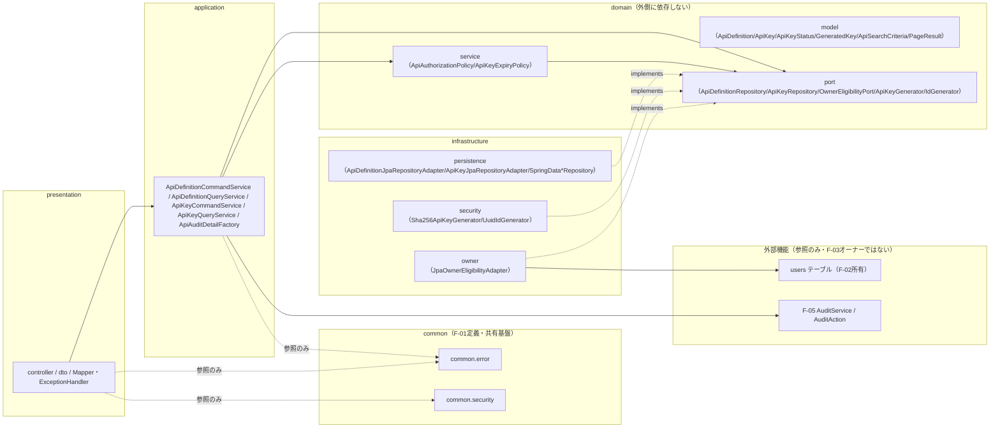
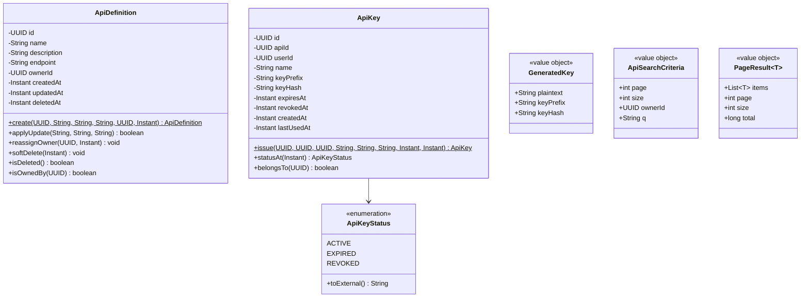
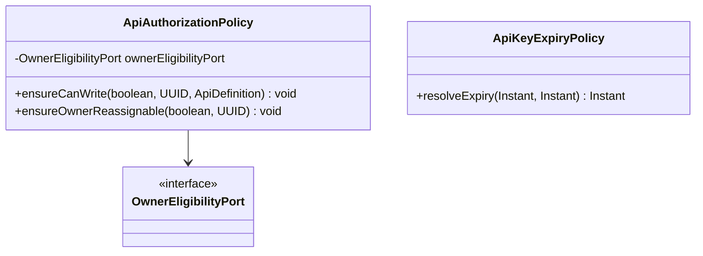
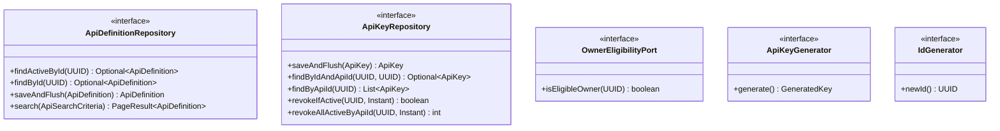
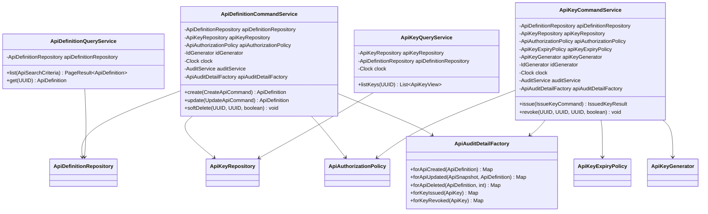
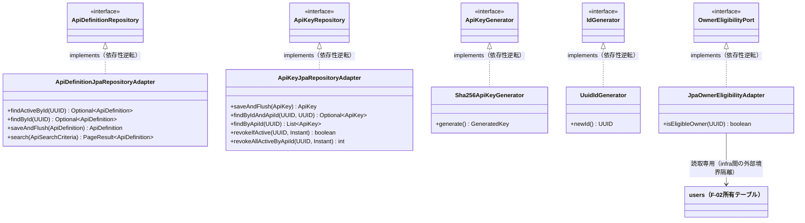
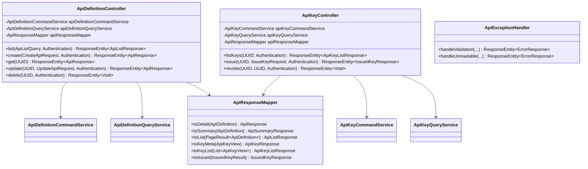
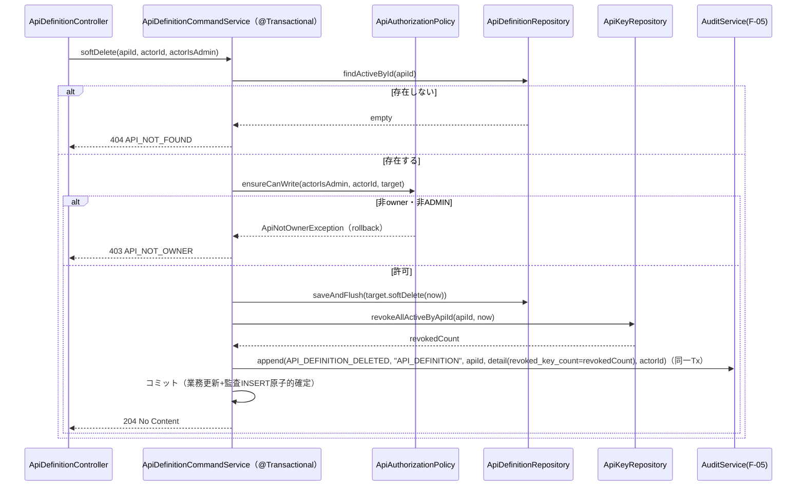

# F-03 API管理 バックエンドクラス設計書（Phase1 MVP）

## 改訂履歴

| 版   | 日付       | 変更内容                     |
| ---- | ---------- | ---------------------------- |
| v0.1 | 2026-07-06 | 初版（backend-class-design-planner のプランを正式クラス設計書に展開） |

## 0. 位置付け・参照

本書は `docs/design/basic/f-03-api-management.md`（詳細設計書）を実装可能な粒度のJava/Spring Bootクラス設計へ展開したものである。業務要件・API仕様・シーケンス・エラーコードの根拠は詳細設計書側にあり、本書はそれをクラス・パッケージ・依存関係・メソッドシグネチャへ変換することに専念する。詳細設計書およびプラン（backend-class-design-planner出力）に対して、本書が新たな業務決定を追加することはない。

参照: `docs/requirements.md`、`docs/design/basic/f-03-api-management.md`、`docs/design/class/f-01-jwt-auth-backend-class.md`、`docs/design/basic/f-01-jwt-auth.md`、`docs/design/class/f-02-user-role-management-backend-class.md`、`docs/design/basic/f-05-audit-log.md`。

**絶対制約（再掲・全章共通）**: 以下はプラン段階での絶対制約であり、本書のいずれの章の実装判断もこれに反してはならない。詳細は各該当章および末尾「13. 共有クラス突合・未決事項」を参照。

1. 平文APIキー・`key_hash`は監査`detail`・アプリケーションログ・例外メッセージ・EP6一覧・EP3詳細のいずれにも一切出力しない。平文はEP7の201レスポンスで一度だけ返却する（`ApiAuditDetailFactory`・`ApiResponseMapper`・`Sha256ApiKeyGenerator`の三点で防御する）。
2. 監査INSERTは各`@Transactional`メソッド内で業務DB更新と**同一トランザクション**で行う（F-05確定事項D準拠。best-effort化しない）。
3. Operatorは`/api/v1/apis`系にアクセス不可（両Controllerクラスへの`@PreAuthorize("hasAnyRole('ADMIN','DEVELOPER')")`により実現。Phase2でも不変）。
4. 書込系（EP4/5/7/8）のowner-or-admin認可は`ApiAuthorizationPolicy`に集約し、Controllerへ業務ルールを漏出させない。
5. owner再割当はADMIN限定ホワイトリスト（owner本人も不可）とし、`OwnerEligibilityPort`でrole/enabled適格性を検証する。
6. APIキー実行時認証（key_hash照合による外部呼出検証・レート制限・`last_used_at`更新）はMVP対象外（Phase2）。

## 1. パッケージ構成と依存方向

### 1.1 パッケージ一覧

| パッケージ | 役割 |
| ---------- | ---- |
| `com.forgehub.api.domain.model` | エンティティ・値オブジェクト・enum |
| `com.forgehub.api.domain.port` | domainが要求する抽象（インターフェース） |
| `com.forgehub.api.domain.service` | 業務ルール本体（ドメインサービス） |
| `com.forgehub.api.application` | ユースケース調整（アプリケーションサービス、Tx境界） |
| `com.forgehub.api.infrastructure.persistence` | JPAによるAPI定義/APIキー永続の具象実装 |
| `com.forgehub.api.infrastructure.security` | キー生成・ハッシュ化・ID生成の具象実装 |
| `com.forgehub.api.infrastructure.owner` | usersテーブル読取によるowner適格性判定の具象実装（F-02境界隔離） |
| `com.forgehub.api.presentation.controller` | API管理エンドポイントの公開 |
| `com.forgehub.api.presentation.dto` | HTTP入出力DTO |
| `com.forgehub.api.presentation`（Mapper/ExceptionHandler） | domain⇔DTO変換、F-03固有例外のHTTP変換 |
| `com.forgehub.common.error`（共有・再利用） | `ErrorResponse`・共有基底例外・共通`@RestControllerAdvice`（F-01定義） |
| `com.forgehub.common.security`（共有・再利用） | `SecurityConfig`・`EntryPoint`・`AccessDeniedHandler`（F-01定義、F-03は再利用のみ） |
| F-05 `AuditService`/`AuditAction`（参照・F-05オーナー） | 監査記録の抽象・語彙 |
| users（参照・F-02所有テーブル） | owner適格性判定の読取専用対象。`infrastructure.owner`に隔離しdomain/applicationは非依存 |

### 1.2 依存方向の規約

依存方向は `presentation → application → domain ← infrastructure` を厳守する。

- `domain`（model/port/service）はいかなる外側レイヤ（application/infrastructure/presentation）にも依存しない。domainが必要とする外部機能（DB永続、キー生成・ハッシュ化、ID生成、owner適格性判定）はすべて`domain.port`のインターフェースとして宣言し、実装は`infrastructure`側に置く（依存性逆転）。domainはF-02（`users`テーブル・`UserRepository`）・F-05（`AuditService`の具象）・infrastructureのいずれも一切参照しない。
- `infrastructure`は`domain.port`のインターフェースを実装する（`implements`）ことでのみdomainと接続する。`infrastructure.owner`は`users`テーブル（F-02所有）を直接読取るが、これはinfrastructure層内での外部境界隔離であり、domain自体はF-02/usersを一切知らない。
- `application`は`domain.port`と`domain.service`にのみ依存し、`infrastructure`の具象クラス（`SpringDataApiDefinitionRepository`等）を直接注入・参照しない。加えて`application`はF-05の`AuditService`（抽象のみ）に依存する。
- `presentation`は`application`のユースケースクラス（`ApiDefinitionCommandService`/`ApiDefinitionQueryService`/`ApiKeyCommandService`/`ApiKeyQueryService`）にのみ依存し、`domain`や`infrastructure`を直接参照しない。`common.error`/`common.security`は参照のみ許容する。
- DIはコンストラクタ注入のみを用いる。フィールド注入・セッター注入は用いない。
- `com.forgehub.common.*`はF-01が定義した全機能共有の基盤パッケージであり、F-03はこれを再利用するのみで独自に重複定義しない。



図中の破線（`-. implements .->`）は依存性逆転（infrastructureがdomainのportを実装する側であり、domainからinfrastructureへ向かう矢印は存在しない）を示す。`IOwn --> Users`はinfrastructure層内での外部境界隔離であり、domain/applicationはF-02/usersを直接参照しない。実線はレイヤ間の通常の呼び出し依存を示す。

## 2. ドメインモデル（ApiDefinition/ApiKey/ApiKeyStatus/VO）

`com.forgehub.api.domain.model`配下。

| クラス | 種別 | 責務 |
| ------ | ---- | ---- |
| `ApiDefinition` | JPAエンティティ | API定義の識別とソフト削除/更新/owner再割当の不変条件保持 |
| `ApiKey` | JPAエンティティ | APIキーの識別・失効・ステータス導出の不変条件保持（平文非保持） |
| `ApiKeyStatus` | enum | キー状態3値（active/expired/revoked）と外部表現変換 |
| `GeneratedKey` | 値オブジェクト（record） | キー生成器出力（平文+prefix+hash）の束 |
| `ApiSearchCriteria` | 値オブジェクト | 一覧検索条件保持 |
| `PageResult<T>` | 値オブジェクト | Spring Data `Page<T>`をdomain/applicationへ漏らさない変換専用VO |

### 2.1 ApiDefinition

```java
@Entity
@Table(name = "api_definition")
public class ApiDefinition {

    @Id
    private UUID id;

    @Column(nullable = false)
    private String name; // citext

    private String description;

    @Column(nullable = false)
    private String endpoint;

    @Column(name = "owner_id", nullable = false)
    private UUID ownerId;

    @Column(name = "created_at", nullable = false)
    private Instant createdAt;

    @Column(name = "updated_at", nullable = false)
    private Instant updatedAt;

    @Column(name = "deleted_at")
    private Instant deletedAt; // nullable。非NULLの場合ソフト削除済み

    protected ApiDefinition() { } // JPA用

    public static ApiDefinition create(UUID id, String name, String description, String endpoint,
                                        UUID ownerId, Instant now) {
        // name/endpoint非null検証、ownerId=作成時actorId、createdAt=updatedAt=now、deletedAt=null
    }

    public boolean applyUpdate(String name, String description, String endpoint) {
        // 各フィールドについてnull以外かつ変化がある場合のみ更新。全フィールド変化なしはfalseを返す（no-op検出用）
    }

    public void reassignOwner(UUID newOwnerId, Instant now) {
        // ownerId差替、updatedAt=now。呼出前提としてApiAuthorizationPolicy.ensureOwnerReassignableの検査済みであること
    }

    public void softDelete(Instant now) {
        // deletedAt=now、updatedAt=now
    }

    public boolean isDeleted() {
        return deletedAt != null;
    }

    public boolean isOwnedBy(UUID actorId) {
        return ownerId.equals(actorId);
    }

    // 全フィールドgetter
}
```

不変条件: `name`/`endpoint`は非null。`deletedAt`は非NULLでソフト削除済みを表す。`softDelete`は冪等ではなく（呼出元でdeletedフィルタ済み前提）、`applyUpdate`は変化の有無を`boolean`で返し、呼出側（`ApiDefinitionCommandService`）でno-op判定（監査発火の要否判断）に用いる。setterは非公開とし、永続化ロジック自体はエンティティに書かない。JPAアノテーションは`@Entity`/`@Id`/`@Column`等の宣言的アノテーションのみを許容する。

SOLID: S（状態遷移の不変条件のみを責務とし、CRUD調整・監査・HTTPの関心事は一切持たない）。

### 2.2 ApiKey

```java
@Entity
@Table(name = "api_key")
public class ApiKey {

    @Id
    private UUID id;

    @Column(name = "api_id", nullable = false)
    private UUID apiId;

    @Column(name = "user_id", nullable = false)
    private UUID userId;

    private String name; // nullable

    @Column(name = "key_prefix", nullable = false)
    private String keyPrefix;

    @Column(name = "key_hash", nullable = false, unique = true)
    private String keyHash;

    @Column(name = "expires_at", nullable = false)
    private Instant expiresAt;

    @Column(name = "revoked_at")
    private Instant revokedAt; // nullable

    @Column(name = "created_at", nullable = false)
    private Instant createdAt;

    @Column(name = "last_used_at")
    private Instant lastUsedAt; // nullable。Phase2（実行時認証）用の予約カラム、MVPでは非更新

    protected ApiKey() { } // JPA用

    public static ApiKey issue(UUID id, UUID apiId, UUID userId, String name,
                                String keyPrefix, String keyHash, Instant expiresAt, Instant now) {
        // revokedAt=null、createdAt=now
    }

    public ApiKeyStatus statusAt(Instant now) {
        // revokedAt != null → REVOKED
        // else expiresAt.isBefore(now) または !expiresAt.isAfter(now) → EXPIRED
        // else → ACTIVE
        // ※status自体はDBカラムとして保持せず都度算出する
    }

    public boolean belongsTo(UUID apiId) {
        return this.apiId.equals(apiId);
    }

    // 全フィールドgetter（keyHashのgetterは存在してもよいが呼出側で外部レスポンス/監査へ非使用）
}
```

不変条件: `keyHash`のみを保持し、平文APIキーはいかなるフィールドとしても保持しない（絶対制約1参照）。`status`はカラム非保持で`statusAt(Instant now)`により都度算出する。`last_used_at`はPhase2実行時認証向けの予約カラムであり、MVPでは更新経路を持たない（※本項目は未決。詳細は末尾「13. 共有クラス突合・未決事項」参照）。

SOLID: S（識別・失効・ステータス算出の不変条件のみを責務とする）。

### 2.3 ApiKeyStatus

```java
public enum ApiKeyStatus {
    ACTIVE, EXPIRED, REVOKED;

    public String toExternal() {
        return name().toLowerCase(); // "active" / "expired" / "revoked"
    }
}
```

SOLID: O（状態判定は`ApiKey.statusAt`に単一集約し、呼出側（Controller/Mapper）でのswitch分岐の散在を防ぐ。状態種別の追加はenumと`statusAt`の変更のみで完結する）。

### 2.4 GeneratedKey

```java
public record GeneratedKey(String plaintext, String keyPrefix, String keyHash) { }
```

SOLID: S（キー生成器出力の束のみを責務とする）。平文（`plaintext`）は`IssuedKeyResult`（5章）を経由してControllerのレスポンス組立に一度だけ使用され、永続化・監査へは一切流入しない（絶対制約1参照）。

### 2.5 ApiSearchCriteria

```java
public final class ApiSearchCriteria {
    private final int page;
    private final int size;
    private final UUID ownerId; // nullable
    private final String q;     // nullable（nameの部分一致検索）

    public ApiSearchCriteria(int page, int size, UUID ownerId, String q) {
        // page>=0
        // size<=100へのclampはpresentation側（ApiListQuery）で実施済みであることを前提とする
    }

    // 全フィールドgetterのみ（不変）
}
```

不変条件: `page>=0`、`size<=100`へのclampはpresentation層で実施済みの値を受け取る前提とする。

### 2.6 PageResult\<T\>

```java
public final class PageResult<T> {
    private final List<T> items;
    private final int page;
    private final int size;
    private final long total;

    public PageResult(List<T> items, int page, int size, long total) {
        this.items = List.copyOf(items);
        this.page = page;
        this.size = size;
        this.total = total;
    }

    // 全フィールドgetterのみ（不変）
}
```

Spring Data JPAの`Page<T>`をdomain/applicationへ漏らさないための変換専用値オブジェクトである。`ApiDefinitionJpaRepositoryAdapter`（6章）が`Page<ApiDefinition>`から本クラスへ変換する。F-02が同名VOを`user.domain.model`に保持しており、共通化（`com.forgehub.common`への昇格）の要否は突合が必要である（※本項目は未決。詳細は「13. 共有クラス突合・未決事項」参照）。



## 3. ドメインサービス（業務ルール本体）

`com.forgehub.api.domain.service`配下。owner-or-admin認可・owner再割当先の適格性検証・有効期限の既定補完/境界検証という業務ルールは本層に集約し、application層やcontrollerへ漏出させない。

### 3.1 ApiAuthorizationPolicy

```java
public class ApiAuthorizationPolicy {

    private final OwnerEligibilityPort ownerEligibilityPort;

    public ApiAuthorizationPolicy(OwnerEligibilityPort ownerEligibilityPort) {
        this.ownerEligibilityPort = ownerEligibilityPort;
    }

    public void ensureCanWrite(boolean actorIsAdmin, UUID actorId, ApiDefinition target)
            throws ApiNotOwnerException {
        // actorIsAdmin==true または target.isOwnedBy(actorId)==true 以外は403 ApiNotOwnerException
    }

    public void ensureOwnerReassignable(boolean actorIsAdmin, UUID newOwnerId)
            throws ApiNotOwnerException, ApiInvalidOwnerException {
        // newOwnerId!=null かつ actorIsAdmin==false → ApiNotOwnerException（owner本人によるowner_id変更試行を含む）
        // newOwnerId!=null かつ ownerEligibilityPort.isEligibleOwner(newOwnerId)==false → ApiInvalidOwnerException
    }
}
```

- 依存: `OwnerEligibilityPort`（コンストラクタ注入）。
- Tx: なし。呼出時に呼出元（`ApiDefinitionCommandService`/`ApiKeyCommandService`）のTxが既にアクティブであることを前提とする。
- `actorIsAdmin`は`boolean`として受領し、`Role` enumをimportしない（F-01/F-02の`Role`型への依存を回避し、認可判定ロジックをF-02の型定義から独立させる）。
- SOLID: S（書込系（EP4/5/7/8）のowner-or-admin認可安全ルールとowner再割当先ADMIN限定判定のみを責務とし、DB更新・監査発火・HTTP変換の関心事は一切持たない）。

### 3.2 ApiKeyExpiryPolicy

```java
public class ApiKeyExpiryPolicy {

    public Instant resolveExpiry(Instant requested, Instant now) throws ApiKeyInvalidExpiryException {
        // requested==null → now.plus(Duration.ofDays(90))
        // requested.isBefore(now) または requested.isAfter(now.plus(Duration.ofDays(365))) → 400 ApiKeyInvalidExpiryException
        // それ以外はrequestedをそのまま採用
    }
}
```

- 依存: なし。
- Tx: なし。
- SOLID: S（有効期限の既定補完・境界検証のみを責務とする）。



## 4. ポート（domainインターフェース）

`com.forgehub.api.domain.port`配下。すべてinterfaceであり、domain/applicationはこれらの抽象にのみ依存する。実装は「6. インフラ実装」参照。

| インターフェース | 責務 | 主メソッド |
| ---------------- | ---- | ---------- |
| `ApiDefinitionRepository` | API定義永続の抽象 | 下記参照 |
| `ApiKeyRepository` | APIキー永続/条件付き失効の抽象 | 下記参照 |
| `OwnerEligibilityPort` | owner再割当先の適格性判定の狭小抽象 | `isEligibleOwner` |
| `ApiKeyGenerator` | CSPRNGキー生成とSHA-256ハッシュ化の抽象 | `generate` |
| `IdGenerator` | `api_definition`/`api_key`のUUID生成抽象 | `newId` |

### 4.1 ApiDefinitionRepository

```java
public interface ApiDefinitionRepository {
    Optional<ApiDefinition> findActiveById(UUID id);  // deleted_at IS NULL
    Optional<ApiDefinition> findById(UUID id);         // 削除含む（EP8のowner解決用）
    ApiDefinition saveAndFlush(ApiDefinition d) throws ApiNameConflictException;
    PageResult<ApiDefinition> search(ApiSearchCriteria c); // deleted_at IS NULL
}
```

SOLID: I（`ApiKeyRepository`と用途別に分離する）。D（applicationは本抽象のみに依存する）。

### 4.2 ApiKeyRepository

```java
public interface ApiKeyRepository {
    ApiKey saveAndFlush(ApiKey k);
    Optional<ApiKey> findByIdAndApiId(UUID keyId, UUID apiId); // IDORをクエリ境界で担保
    List<ApiKey> findByApiId(UUID apiId);                       // EP6・api_idインデックス単発
    boolean revokeIfActive(UUID keyId, Instant now);            // WHERE revoked_at IS NULLの条件付きUPDATE。変更有無をbool返却で冪等判定
    int revokeAllActiveByApiId(UUID apiId, Instant now);        // EP5カスケード。失効件数返却
}
```

SOLID: I（用途別メソッド粒度に絞り、`ApiDefinitionRepository`とは別インターフェースとする）。

### 4.3 OwnerEligibilityPort

```java
public interface OwnerEligibilityPort {
    boolean isEligibleOwner(UUID userId); // role IN(Admin,Developer) かつ enabled=true
}
```

SOLID: I（F-02 `UserRepository`のCRUD/検索/計数を丸ごと晒さず、必要な1操作のみに絞ったポートとする）。D（domainはF-02/usersを一切知らず、本抽象のみに依存する）。

### 4.4 ApiKeyGenerator

```java
public interface ApiKeyGenerator {
    GeneratedKey generate();
}
```

SOLID: D（`SecureRandom`/`MessageDigest`（SHA-256）の静的呼出をdomain/applicationから排除し、テスト時に決定的な値へ差替可能にする）。

### 4.5 IdGenerator

```java
public interface IdGenerator {
    UUID newId();
}
```

SOLID: D（`UUID.randomUUID()`の静的呼出を排除する）。



## 5. アプリケーション層とTx境界

`com.forgehub.api.application`配下。F-03は後続コミット後副作用（RTセッション失効等）を持たないため、F-02の`UserMutationTx`/`UserCommandService`のような2Bean分離は不要であり、単一Txのapplicationサービスで足りる（controller→service間のBean境界がself-invocationに該当しないことも自明であり、self-invocationによる`@Transactional`無効化は生じない）。

| クラス | 種別 | 責務 |
| ------ | ---- | ---- |
| `ApiDefinitionCommandService` | サービス（Tx境界あり） | API定義の作成/更新/ソフト削除ユースケース調整＋監査同一Tx発火 |
| `ApiDefinitionQueryService` | サービス（Tx境界=readOnly） | 一覧(EP1)/詳細(EP3)参照調整 |
| `ApiKeyCommandService` | サービス（Tx境界あり） | APIキー発行(EP7)/失効(EP8)ユースケース調整＋監査同一Tx発火 |
| `ApiKeyQueryService` | サービス（Tx境界=readOnly） | キーメタ一覧(EP6)参照調整とステータス算出 |
| `ApiAuditDetailFactory` | ファクトリ | 監査detailの非機密組立（平文/keyHash除外の単一防御箇所） |
| `CreateApiCommand` | record | API定義作成入力 |
| `UpdateApiCommand` | record | API定義更新入力 |
| `IssueKeyCommand` | record | APIキー発行入力 |
| `IssuedKeyResult` | record | APIキー発行結果（平文を一度だけ運ぶ） |
| `ApiKeyView` | record | キー一覧表示用（平文/keyHash非含） |
| `ApiSnapshot` | record | 監査before用の非機密スナップショット |

### 5.1 ApiDefinitionCommandService

```java
public class ApiDefinitionCommandService {

    private final ApiDefinitionRepository apiDefinitionRepository;
    private final ApiKeyRepository apiKeyRepository;
    private final ApiAuthorizationPolicy apiAuthorizationPolicy;
    private final IdGenerator idGenerator;
    private final Clock clock;
    private final AuditService auditService; // F-05
    private final ApiAuditDetailFactory apiAuditDetailFactory;

    public ApiDefinitionCommandService(ApiDefinitionRepository apiDefinitionRepository,
                                        ApiKeyRepository apiKeyRepository,
                                        ApiAuthorizationPolicy apiAuthorizationPolicy,
                                        IdGenerator idGenerator,
                                        Clock clock,
                                        AuditService auditService,
                                        ApiAuditDetailFactory apiAuditDetailFactory) {
        // 全依存はコンストラクタ注入
    }

    @Transactional
    public ApiDefinition create(CreateApiCommand cmd) throws ApiNameConflictException {
        // id = idGenerator.newId() → ApiDefinition.create(id, name, description, endpoint, cmd.actorId(), clock.instant())
        // → apiDefinitionRepository.saveAndFlush(d)
        // → auditService.append(API_DEFINITION_CREATED, "API_DEFINITION", d.getId(),
        //     apiAuditDetailFactory.forApiCreated(d), cmd.actorId())（同一Tx）
    }

    @Transactional
    public ApiDefinition update(UpdateApiCommand cmd)
            throws ApiNotFoundException, ApiNameConflictException, ApiNotOwnerException, ApiInvalidOwnerException {
        // apiDefinitionRepository.findActiveById(cmd.apiId()) 不在 → ApiNotFoundException
        // apiAuthorizationPolicy.ensureCanWrite(cmd.actorIsAdmin(), cmd.actorId(), target)
        // apiAuthorizationPolicy.ensureOwnerReassignable(cmd.actorIsAdmin(), cmd.newOwnerId())
        // before = ApiSnapshot(target) を変更前に取得
        // changed = target.applyUpdate(cmd.name(), cmd.description(), cmd.endpoint())
        // cmd.newOwnerId()!=null時: target.reassignOwner(cmd.newOwnerId(), clock.instant())
        // apiDefinitionRepository.saveAndFlush(target)
        // auditService.append(API_DEFINITION_UPDATED, "API_DEFINITION", target.getId(),
        //     apiAuditDetailFactory.forApiUpdated(before, target), cmd.actorId())（同一Tx）
    }

    @Transactional
    public void softDelete(UUID apiId, UUID actorId, boolean actorIsAdmin)
            throws ApiNotFoundException, ApiNotOwnerException {
        // apiDefinitionRepository.findActiveById(apiId) 不在 → ApiNotFoundException
        // apiAuthorizationPolicy.ensureCanWrite(actorIsAdmin, actorId, target)
        // target.softDelete(clock.instant()) → apiDefinitionRepository.saveAndFlush(target)
        // revokedCount = apiKeyRepository.revokeAllActiveByApiId(apiId, clock.instant())
        // auditService.append(API_DEFINITION_DELETED, "API_DEFINITION", apiId,
        //     apiAuditDetailFactory.forApiDeleted(target, revokedCount), actorId)（同一Tx）
    }
}
```

- Tx: `create`/`update`/`softDelete`いずれも`@Transactional(REQUIRED)`。監査INSERTは各メソッド内で業務DB更新と同一Tx（F-05確定事項D準拠。※本制約は絶対制約であり、末尾「13. 共有クラス突合・未決事項」にも重複して明記する）。
- SOLID: S（ユースケース調整のみを責務とし、業務ルール自体は`ApiAuthorizationPolicy`/`ApiDefinition`エンティティに存在する）。D（`ApiDefinitionRepository`/`ApiKeyRepository`/`ApiAuthorizationPolicy`/`IdGenerator`/`Clock`/`AuditService`の抽象にのみ依存する）。

### 5.2 ApiDefinitionQueryService

```java
public class ApiDefinitionQueryService {

    private final ApiDefinitionRepository apiDefinitionRepository;

    public ApiDefinitionQueryService(ApiDefinitionRepository apiDefinitionRepository) {
        this.apiDefinitionRepository = apiDefinitionRepository;
    }

    @Transactional(readOnly = true)
    public PageResult<ApiDefinition> list(ApiSearchCriteria c) {
        return apiDefinitionRepository.search(c);
    }

    @Transactional(readOnly = true)
    public ApiDefinition get(UUID id) throws ApiNotFoundException {
        return apiDefinitionRepository.findActiveById(id).orElseThrow(ApiNotFoundException::new);
    }
}
```

- Tx: 全メソッド`@Transactional(readOnly = true)`。
- SOLID: S（参照系ユースケースの調整のみを責務とする）。

### 5.3 ApiKeyCommandService

```java
public class ApiKeyCommandService {

    private final ApiDefinitionRepository apiDefinitionRepository;
    private final ApiKeyRepository apiKeyRepository;
    private final ApiAuthorizationPolicy apiAuthorizationPolicy;
    private final ApiKeyExpiryPolicy apiKeyExpiryPolicy;
    private final ApiKeyGenerator apiKeyGenerator;
    private final IdGenerator idGenerator;
    private final Clock clock;
    private final AuditService auditService; // F-05
    private final ApiAuditDetailFactory apiAuditDetailFactory;

    public ApiKeyCommandService(ApiDefinitionRepository apiDefinitionRepository,
                                 ApiKeyRepository apiKeyRepository,
                                 ApiAuthorizationPolicy apiAuthorizationPolicy,
                                 ApiKeyExpiryPolicy apiKeyExpiryPolicy,
                                 ApiKeyGenerator apiKeyGenerator,
                                 IdGenerator idGenerator,
                                 Clock clock,
                                 AuditService auditService,
                                 ApiAuditDetailFactory apiAuditDetailFactory) {
        // 全依存はコンストラクタ注入
    }

    @Transactional
    public IssuedKeyResult issue(IssueKeyCommand cmd)
            throws ApiNotFoundException, ApiNotOwnerException, ApiKeyInvalidExpiryException {
        // api = apiDefinitionRepository.findActiveById(cmd.apiId()) 不在 → ApiNotFoundException
        // apiAuthorizationPolicy.ensureCanWrite(cmd.actorIsAdmin(), cmd.actorId(), api)
        // expiresAt = apiKeyExpiryPolicy.resolveExpiry(cmd.expiresAt(), clock.instant())
        // generated = apiKeyGenerator.generate()
        // key = ApiKey.issue(idGenerator.newId(), cmd.apiId(), cmd.actorId(), cmd.name(),
        //     generated.keyPrefix(), generated.keyHash(), expiresAt, clock.instant())
        // apiKeyRepository.saveAndFlush(key)
        // auditService.append(API_KEY_ISSUED, "API_KEY", key.getId(),
        //     apiAuditDetailFactory.forKeyIssued(key), cmd.actorId())（同一Tx）
        // 平文（generated.plaintext()）はIssuedKeyResultのみへ載せ、それ以外へは一切流入させない
    }

    @Transactional
    public void revoke(UUID apiId, UUID keyId, UUID actorId, boolean actorIsAdmin)
            throws ApiNotFoundException, ApiKeyNotFoundException, ApiNotOwnerException {
        // api = apiDefinitionRepository.findById(apiId)（owner解決用。削除済みも含む）不在 → ApiNotFoundException
        // apiAuthorizationPolicy.ensureCanWrite(actorIsAdmin, actorId, api)
        // apiKeyRepository.findByIdAndApiId(keyId, apiId) 不在 → ApiKeyNotFoundException（IDOR遮断）
        // changed = apiKeyRepository.revokeIfActive(keyId, clock.instant())
        // changed==trueの場合のみ auditService.append(API_KEY_REVOKED, "API_KEY", keyId,
        //     apiAuditDetailFactory.forKeyRevoked(key), actorId)（同一Tx）
        // changed==false（既失効）の場合はno-op・監査非発火・呼出元へは204として応答（冪等）
    }
}
```

- Tx: `issue`/`revoke`いずれも`@Transactional(REQUIRED)`。監査INSERTは同一Tx。
- セキュリティ: 平文/`keyHash`を監査detail・例外・ログへ一切出力しない（絶対制約1参照。※本制約は絶対制約であり、末尾「13. 共有クラス突合・未決事項」にも重複して明記する）。
- SOLID: S（発行/失効の調整のみを責務とし、期限ルール・認可判定・ステータス算出は各ポリシー/エンティティへ委譲する）。

### 5.4 ApiKeyQueryService

```java
public class ApiKeyQueryService {

    private final ApiKeyRepository apiKeyRepository;
    private final ApiDefinitionRepository apiDefinitionRepository;
    private final Clock clock;

    public ApiKeyQueryService(ApiKeyRepository apiKeyRepository,
                               ApiDefinitionRepository apiDefinitionRepository,
                               Clock clock) {
        this.apiKeyRepository = apiKeyRepository;
        this.apiDefinitionRepository = apiDefinitionRepository;
        this.clock = clock;
    }

    @Transactional(readOnly = true)
    public List<ApiKeyView> listKeys(UUID apiId) throws ApiNotFoundException {
        // apiDefinitionRepository.findActiveById(apiId) 存在確認（不在 → ApiNotFoundException）
        // apiKeyRepository.findByApiId(apiId) → 各keyについて ApiKeyView(id, keyPrefix, name, expiresAt,
        //     revokedAt, key.statusAt(clock.instant())) を組み立てる（平文/keyHash非含）
    }
}
```

- Tx: `@Transactional(readOnly = true)`。
- SOLID: S（キーメタ一覧参照の調整のみを責務とする）。

### 5.5 ApiAuditDetailFactory

```java
public class ApiAuditDetailFactory {

    public Map<String, Object> forApiCreated(ApiDefinition a) {
        // {name, endpoint, owner_id}
    }

    public Map<String, Object> forApiUpdated(ApiSnapshot before, ApiDefinition after) {
        // {before: {name, endpoint, owner_id}, after: {name, endpoint, owner_id}}
    }

    public Map<String, Object> forApiDeleted(ApiDefinition a, int revokedKeyCount) {
        // {name, endpoint, owner_id, revoked_key_count: revokedKeyCount}
    }

    public Map<String, Object> forKeyIssued(ApiKey k) {
        // {key_prefix, expires_at, api_id}
    }

    public Map<String, Object> forKeyRevoked(ApiKey k) {
        // {key_prefix, api_id}
    }
}
```

SOLID: S（`name`/`endpoint`/`owner_id`/`expires_at`/`key_prefix`/`revoked_key_count`のみを責務とし、平文APIキー・`keyHash`をいかなるキーとしても一切参照・出力しない単一防御箇所とする）。F-05側denylistストリップとの二重防御を構成する（絶対制約1参照。10章参照）。

### 5.6 コマンド/結果 record

```java
public record CreateApiCommand(String name, String description, String endpoint, UUID actorId) {
    // owner_idは非受領。常にactorIdが初期owner（mass-assignment防止）
}

public record UpdateApiCommand(UUID apiId, String name, String description, String endpoint,
                                UUID newOwnerId, boolean actorIsAdmin, UUID actorId) {
    // name/description/endpoint/newOwnerIdはnullable（nullは「変更なし」を意味する）
    // newOwnerIdの適用はADMIN限定
}

public record IssueKeyCommand(UUID apiId, String name, Instant expiresAt, boolean actorIsAdmin, UUID actorId) {
    // name/expiresAtはnullable
}

public record IssuedKeyResult(UUID id, String keyPrefix, String plaintextKey, Instant expiresAt) {
    // plaintextKeyは非永続・非監査。Controllerのレスポンス組立に一度のみ使用される
}

public record ApiKeyView(UUID id, String keyPrefix, String name, Instant expiresAt,
                          Instant revokedAt, ApiKeyStatus status) {
    // keyHash/平文を一切含まない
}

public record ApiSnapshot(String name, String endpoint, UUID ownerId) {
    // 監査before用の非機密スナップショット
}
```



## 6. インフラ実装

`com.forgehub.api.infrastructure`配下。いずれも「4. ポート」で定義したインターフェースを実装し、domain/applicationからは抽象経由でのみ利用される（依存性逆転）。

| クラス | パッケージ | 実装インターフェース | 責務 |
| ------ | ---------- | -------------------- | ---- |
| `ApiDefinitionJpaRepositoryAdapter` | `.infrastructure.persistence` | `ApiDefinitionRepository` | Spring Data JPA委譲・name重複の同期例外化・削除フィルタ |
| `SpringDataApiDefinitionRepository` | `.infrastructure.persistence` | （Spring Data JPA） | `JpaRepository<ApiDefinition,UUID>` + `JpaSpecificationExecutor` |
| `ApiKeyJpaRepositoryAdapter` | `.infrastructure.persistence` | `ApiKeyRepository` | キー永続・条件付き失効・カスケード失効の実装 |
| `SpringDataApiKeyRepository` | `.infrastructure.persistence` | （Spring Data JPA） | `JpaRepository<ApiKey,UUID>` + `@Modifying`失効クエリ + api_idインデックス派生クエリ |
| `Sha256ApiKeyGenerator` | `.infrastructure.security` | `ApiKeyGenerator` | 32byte CSPRNG→base64url→`fgh_`付与→SHA-256 hex化 |
| `UuidIdGenerator` | `.infrastructure.security` | `IdGenerator` | UUID生成 |
| `JpaOwnerEligibilityAdapter` | `.infrastructure.owner` | `OwnerEligibilityPort` | `users`テーブル読取によるowner適格性判定・F-02境界隔離 |

### 6.1 ApiDefinitionJpaRepositoryAdapter

```java
@Repository
public class ApiDefinitionJpaRepositoryAdapter implements ApiDefinitionRepository {

    private final SpringDataApiDefinitionRepository springDataApiDefinitionRepository;

    public ApiDefinitionJpaRepositoryAdapter(SpringDataApiDefinitionRepository springDataApiDefinitionRepository) {
        this.springDataApiDefinitionRepository = springDataApiDefinitionRepository;
    }

    @Override
    public Optional<ApiDefinition> findActiveById(UUID id) {
        // deleted_at IS NULL条件を付与して検索
    }

    @Override
    public Optional<ApiDefinition> findById(UUID id) {
        // 削除含む（EP8のowner解決用）
        return springDataApiDefinitionRepository.findById(id);
    }

    @Override
    public ApiDefinition saveAndFlush(ApiDefinition d) throws ApiNameConflictException {
        try {
            return springDataApiDefinitionRepository.saveAndFlush(d);
        } catch (DataIntegrityViolationException e) {
            // name部分UNIQUE(deleted_at IS NULL)違反を捕捉し、業務例外へ同期変換
            // （Tx内でrollbackさせ監査コミットを防止）
            throw new ApiNameConflictException(e);
        }
    }

    @Override
    public PageResult<ApiDefinition> search(ApiSearchCriteria c) {
        // owner_id/qの部分一致/deleted_at IS NULLフィルタ + ページングをSpecificationで適用し、
        // Page<ApiDefinition> を PageResult<ApiDefinition> へ変換して返却
    }
}
```

実装: `saveAndFlush`で`DataIntegrityViolationException`を同期捕捉し`ApiNameConflictException`へ変換する（呼出元のTxをrollbackさせ、監査INSERTがコミットされる事態を防ぐ）。`findActiveById`/`search`は`deleted_at IS NULL`条件を付与し、`findById`は削除済みも含めて取得する（EP8で失効対象キーのowner解決を行う際、対象APIがソフト削除済みであってもowner判定自体は可能にするため）。

SOLID: D（domainの`ApiDefinitionRepository`ポートを実装し、application側はこの具象を一切知らない）。L（`ApiDefinitionRepository`契約を満たす形で置換可能な実装である）。

### 6.2 SpringDataApiDefinitionRepository

```java
public interface SpringDataApiDefinitionRepository
        extends JpaRepository<ApiDefinition, UUID>, JpaSpecificationExecutor<ApiDefinition> {
    // owner_id/qの部分一致/deleted_atフィルタ + ページングをSpecificationで実現
}
```

### 6.3 ApiKeyJpaRepositoryAdapter

```java
@Repository
public class ApiKeyJpaRepositoryAdapter implements ApiKeyRepository {

    private final SpringDataApiKeyRepository springDataApiKeyRepository;

    public ApiKeyJpaRepositoryAdapter(SpringDataApiKeyRepository springDataApiKeyRepository) {
        this.springDataApiKeyRepository = springDataApiKeyRepository;
    }

    @Override
    public ApiKey saveAndFlush(ApiKey k) {
        return springDataApiKeyRepository.saveAndFlush(k);
    }

    @Override
    public Optional<ApiKey> findByIdAndApiId(UUID keyId, UUID apiId) {
        return springDataApiKeyRepository.findByIdAndApiId(keyId, apiId);
    }

    @Override
    public List<ApiKey> findByApiId(UUID apiId) {
        return springDataApiKeyRepository.findByApiId(apiId);
    }

    @Override
    public boolean revokeIfActive(UUID keyId, Instant now) {
        // @Modifying "UPDATE ApiKey SET revokedAt=:now WHERE id=:id AND revokedAt IS NULL"
        // 更新行数>0をbooleanとして返却（既失効時はfalse=no-op）
        return springDataApiKeyRepository.revokeIfActive(keyId, now) > 0;
    }

    @Override
    public int revokeAllActiveByApiId(UUID apiId, Instant now) {
        // @Modifying一括UPDATE（revoked_at IS NULL AND expires_at>now対象）。更新件数を返却
        return springDataApiKeyRepository.revokeAllActiveByApiId(apiId, now);
    }
}
```

SOLID: S（キー永続・条件付き失効・カスケード失効の実装のみを責務とする）。

### 6.4 SpringDataApiKeyRepository

```java
public interface SpringDataApiKeyRepository extends JpaRepository<ApiKey, UUID> {

    Optional<ApiKey> findByIdAndApiId(UUID id, UUID apiId);

    List<ApiKey> findByApiId(UUID apiId); // api_idインデックス単発

    @Modifying
    @Query("UPDATE ApiKey k SET k.revokedAt = :now WHERE k.id = :id AND k.revokedAt IS NULL")
    int revokeIfActive(UUID id, Instant now);

    @Modifying
    @Query("UPDATE ApiKey k SET k.revokedAt = :now " +
           "WHERE k.apiId = :apiId AND k.revokedAt IS NULL AND k.expiresAt > :now")
    int revokeAllActiveByApiId(UUID apiId, Instant now);
}
```

### 6.5 Sha256ApiKeyGenerator

```java
@Component
public class Sha256ApiKeyGenerator implements ApiKeyGenerator {

    @Override
    public GeneratedKey generate() {
        // SecureRandomで32byte生成 → base64urlエンコード（43文字）→ 先頭に"fgh_"付与し平文APIキー全体を得る
        // 平文全体をSHA-256でハッシュ化しhex(64文字)化してkeyHashとする
        // keyPrefix = 先頭12文字（例: fgh_ab12cd）
        // 平文はログへ一切出力しない
    }
}
```

セキュリティ: 平文/`keyHash`を例外・ログへ一切出力しない（絶対制約1参照）。SOLID: S。

### 6.6 UuidIdGenerator

```java
@Component
public class UuidIdGenerator implements IdGenerator {

    @Override
    public UUID newId() {
        return UUID.randomUUID();
    }
}
```

### 6.7 JpaOwnerEligibilityAdapter

```java
@Component
public class JpaOwnerEligibilityAdapter implements OwnerEligibilityPort {

    private final JdbcTemplate jdbcTemplate; // またはSpring Data射影クエリ

    public JpaOwnerEligibilityAdapter(JdbcTemplate jdbcTemplate) {
        this.jdbcTemplate = jdbcTemplate;
    }

    @Override
    public boolean isEligibleOwner(UUID userId) {
        // usersテーブルへの射影クエリ: role IN ('Admin','Developer') AND enabled=true
        // title-case格納値はF-02 RoleConverterの永続表現前提（突合は未決。13章参照）
    }
}
```

- Tx: なし。呼出元（`ApiDefinitionCommandService`/`ApiKeyCommandService`の`@Transactional`メソッド）内で実行される。
- SOLID: D（domain/applicationは`users`/F-02を一切知らず、`OwnerEligibilityPort`のみに依存する）。
- 備考: `users`はF-02所有・読取専用アクセスとし、title-case格納値への依存はF-02 `RoleConverter`との整合を前提とする（※本項目は未決。詳細は「13. 共有クラス突合・未決事項」参照）。



## 7. プレゼンテーション/DTO/Mapper

`com.forgehub.api.presentation`配下。

| クラス | パッケージ | 責務 |
| ------ | ---------- | ---- |
| `ApiDefinitionController` | `.presentation.controller` | `/api/v1/apis`公開・DTO⇄command変換・actor解決 |
| `ApiKeyController` | `.presentation.controller` | `/api/v1/apis/{id}/keys`公開・DTO変換・actor解決 |
| `ApiResponseMapper` | `.presentation` | domain→レスポンスDTO変換（keyHash/平文の非露出単一防御） |
| `ApiExceptionHandler` | `.presentation` | F-03固有バリデーション例外のHTTP変換 |
| `CreateApiRequest` | `.presentation.dto` | API定義作成入力（record） |
| `UpdateApiRequest` | `.presentation.dto` | API定義更新入力（record） |
| `ApiListQuery` | `.presentation.dto` | API定義一覧クエリ（record） |
| `IssueKeyRequest` | `.presentation.dto` | APIキー発行入力（record） |
| `ApiResponse` | `.presentation.dto` | API定義詳細レスポンス（record） |
| `ApiSummaryResponse` | `.presentation.dto` | API定義一覧行レスポンス（record） |
| `ApiListResponse` | `.presentation.dto` | API定義一覧レスポンス（record） |
| `ApiKeyResponse` | `.presentation.dto` | キーメタレスポンス（record） |
| `ApiKeyListResponse` | `.presentation.dto` | キー一覧レスポンス（record） |
| `IssuedKeyResponse` | `.presentation.dto` | キー発行レスポンス（record） |

### 7.1 ApiDefinitionController

```java
@RestController
@RequestMapping("/api/v1/apis")
@PreAuthorize("hasAnyRole('ADMIN','DEVELOPER')")
public class ApiDefinitionController {

    private final ApiDefinitionCommandService apiDefinitionCommandService;
    private final ApiDefinitionQueryService apiDefinitionQueryService;
    private final ApiResponseMapper apiResponseMapper;

    public ApiDefinitionController(ApiDefinitionCommandService apiDefinitionCommandService,
                                    ApiDefinitionQueryService apiDefinitionQueryService,
                                    ApiResponseMapper apiResponseMapper) {
        // コンストラクタ注入
    }

    @GetMapping
    public ResponseEntity<ApiListResponse> list(@Valid ApiListQuery q, Authentication auth) {
        // ApiSearchCriteria組立（size clamp込み） → apiDefinitionQueryService.list(...) → apiResponseMapper.toList(...)
    }

    @PostMapping
    @ResponseStatus(HttpStatus.CREATED)
    public ResponseEntity<ApiResponse> create(@Valid @RequestBody CreateApiRequest req, Authentication auth) {
        // actorId = auth由来のsubから解決 → CreateApiCommand組立（owner_idはbody非受領、actorIdが初期owner）
        // → apiDefinitionCommandService.create(...) → apiResponseMapper.toDetail(...)
    }

    @GetMapping("/{id}")
    public ResponseEntity<ApiResponse> get(@PathVariable UUID id) {
        // apiDefinitionQueryService.get(id) → apiResponseMapper.toDetail(...)
    }

    @PatchMapping("/{id}")
    public ResponseEntity<ApiResponse> update(@PathVariable UUID id,
                                               @Valid @RequestBody UpdateApiRequest req,
                                               Authentication auth) {
        // actorId/actorIsAdmin解決 → UpdateApiCommand(id, req.name(), req.description(), req.endpoint(),
        //     req.ownerId(), actorIsAdmin, actorId)
        // → apiDefinitionCommandService.update(...) → apiResponseMapper.toDetail(...)
    }

    @DeleteMapping("/{id}")
    @ResponseStatus(HttpStatus.NO_CONTENT)
    public ResponseEntity<Void> delete(@PathVariable UUID id, Authentication auth) {
        // actorId/actorIsAdmin解決 → apiDefinitionCommandService.softDelete(id, actorId, actorIsAdmin)
    }
}
```

- 依存: `ApiDefinitionCommandService`、`ApiDefinitionQueryService`、`ApiResponseMapper`。コンストラクタ注入。
- 認可: クラスに`@PreAuthorize("hasAnyRole('ADMIN','DEVELOPER')")`を付与し、Operatorのアクセスを排除する（絶対制約3。8章参照）。
- Tx: なし（HTTP境界変換のみを担う）。
- 制約: `actorId`/`actorIsAdmin`は`Authentication`（`sub`/`authorities`）のみから解決し、リクエスト由来のIDは一切採用しない。`owner_id`は`CreateApiRequest`で非受領（mass-assignment防止）。`ApiDefinition`エンティティ・`keyHash`を直接シリアライズすることは一切行わない。
- SOLID: S（HTTP境界変換のみを責務とする）。

### 7.2 ApiKeyController

```java
@RestController
@RequestMapping("/api/v1/apis/{id}/keys")
@PreAuthorize("hasAnyRole('ADMIN','DEVELOPER')")
public class ApiKeyController {

    private final ApiKeyCommandService apiKeyCommandService;
    private final ApiKeyQueryService apiKeyQueryService;
    private final ApiResponseMapper apiResponseMapper;

    public ApiKeyController(ApiKeyCommandService apiKeyCommandService,
                             ApiKeyQueryService apiKeyQueryService,
                             ApiResponseMapper apiResponseMapper) {
        // コンストラクタ注入
    }

    @GetMapping
    public ResponseEntity<ApiKeyListResponse> listKeys(@PathVariable UUID id, Authentication auth) {
        // apiKeyQueryService.listKeys(id) → apiResponseMapper.toKeyList(...)
    }

    @PostMapping
    @ResponseStatus(HttpStatus.CREATED)
    public ResponseEntity<IssuedKeyResponse> issue(@PathVariable UUID id,
                                                    @Valid @RequestBody IssueKeyRequest req,
                                                    Authentication auth) {
        // actorId/actorIsAdmin解決 → IssueKeyCommand(id, req.name(), req.expiresAt(), actorIsAdmin, actorId)
        // → apiKeyCommandService.issue(...) → apiResponseMapper.toIssued(...)
    }

    @DeleteMapping("/{keyId}")
    @ResponseStatus(HttpStatus.NO_CONTENT)
    public ResponseEntity<Void> revoke(@PathVariable UUID id, @PathVariable UUID keyId, Authentication auth) {
        // actorId/actorIsAdmin解決 → apiKeyCommandService.revoke(id, keyId, actorId, actorIsAdmin)
    }
}
```

- 依存: `ApiKeyCommandService`、`ApiKeyQueryService`、`ApiResponseMapper`。コンストラクタ注入。
- 認可: クラスに`@PreAuthorize("hasAnyRole('ADMIN','DEVELOPER')")`を付与する。
- Tx: なし。
- 制約: `IssuedKeyResponse.api_key`（平文）は201で一度のみ返却する。EP6一覧・例外・ログに`keyHash`/平文を一切出力しない（絶対制約1参照）。
- SOLID: S（HTTP境界変換のみを責務とする）。

### 7.3 ApiResponseMapper

```java
@Component
public class ApiResponseMapper {

    public ApiResponse toDetail(ApiDefinition d) {
        // id/name/description/endpoint/owner_id/created_at/updated_at のみ（deleted_at非返却）
    }

    public ApiSummaryResponse toSummary(ApiDefinition d) {
        // id/name/endpoint/owner_id/created_at のみ
    }

    public ApiListResponse toList(PageResult<ApiDefinition> p) {
        // items(toSummaryの配列)/page/size/total
    }

    public ApiKeyResponse toKeyMeta(ApiKeyView v) {
        // id/key_prefix/name/expires_at/revoked_at/status(v.status().toExternal())
    }

    public ApiKeyListResponse toKeyList(List<ApiKeyView> v) {
        // items(toKeyMetaの配列)
    }

    public IssuedKeyResponse toIssued(IssuedKeyResult r) {
        // id/key_prefix/api_key(平文、一度のみ)/expires_at
    }
}
```

SOLID: S（domainからレスポンスDTOへの変換のみを責務とし、`keyHash`/平文をいかなる変換先にも一切含めない単一防御箇所とする。絶対制約1参照）。

### 7.4 ApiExceptionHandler

```java
@RestControllerAdvice(assignableTypes = {ApiDefinitionController.class, ApiKeyController.class})
public class ApiExceptionHandler {

    @ExceptionHandler(MethodArgumentNotValidException.class)
    public ResponseEntity<ErrorResponse> handleValidation(MethodArgumentNotValidException e) {
        // 400 API_VALIDATION_ERROR
    }

    @ExceptionHandler(HttpMessageNotReadableException.class)
    public ResponseEntity<ErrorResponse> handleUnreadable(HttpMessageNotReadableException e) {
        // 400 API_VALIDATION_ERROR
    }
}
```

`@RestControllerAdvice(assignableTypes = {ApiDefinitionController.class, ApiKeyController.class})`により両Controllerにのみ適用範囲を限定し、共通（グローバル）`@RestControllerAdvice`との二重登録衝突を回避する。F-03固有の業務例外（`ApiNotFoundException`等6種）はいずれも共有基底例外（`AuthException`）派生とし、共通`@RestControllerAdvice`が一律変換する（9章参照）。

### 7.5 DTO

```java
public record CreateApiRequest(
        @NotBlank String name,
        String description,
        @NotBlank String endpoint
) { }
// owner_id非定義（mass-assignment防止）

public record UpdateApiRequest(
        String name, String description, String endpoint, UUID ownerId
) { }
// ホワイトリスト。ownerIdはADMIN時のみ適用（controllerがactorIsAdminを判定しcommandへ渡す）

public record ApiListQuery(
        Integer page,  // 既定0
        Integer size,  // 既定20、上限100にclamp
        UUID ownerId,
        String q
) { }

public record IssueKeyRequest(String name, Instant expiresAt) { } // いずれもnullable

public record ApiResponse(
        UUID id, String name, String description, String endpoint,
        UUID owner_id, Instant created_at, Instant updated_at
) { } // deleted_at非返却

public record ApiSummaryResponse(UUID id, String name, String endpoint, UUID owner_id, Instant created_at) { }

public record ApiListResponse(List<ApiSummaryResponse> items, int page, int size, long total) { }

public record ApiKeyResponse(
        UUID id, String key_prefix, String name, Instant expires_at, Instant revoked_at, String status
) { } // 平文/key_hash非含

public record ApiKeyListResponse(List<ApiKeyResponse> items) { }

public record IssuedKeyResponse(UUID id, String key_prefix, String api_key, Instant expires_at) { }
// api_key(平文)は201で一度のみ、再表示手段なし
```



## 8. 認可（RBAC実装位置）

- 認可基盤（`@EnableMethodSecurity`、`SecurityFilterChain`のSTATELESS設定、`RestAuthenticationEntryPoint`/`RestAccessDeniedHandler`、デフォルトdeny）は`com.forgehub.common.security`配下にF-01が定義したものをそのまま再利用する。F-03は独自に`SecurityConfig`を重複定義しない。
- リソース単位の認可（`@PreAuthorize`）は各Controllerが個別に付与する規約（`docs/design/class/f-01-jwt-auth-backend-class.md` 8章）に従い、`ApiDefinitionController`・`ApiKeyController`のいずれもクラスレベルで`@PreAuthorize("hasAnyRole('ADMIN','DEVELOPER')")`を付与し、Operatorのアクセスを排除する（絶対制約3。Phase2以降でも変更予定はない）。
- 書込系（EP4/5/7/8）のowner-or-admin認可は`@PreAuthorize`では表現せず（対象APIのownerはリクエスト時点でDBから解決する必要があるため）、`ApiAuthorizationPolicy`（domain.service、3章）が各`ApiDefinitionCommandService`/`ApiKeyCommandService`メソッド内で検証する。これによりControllerへ業務ルールを漏出させない（絶対制約4。※本制約は絶対制約であり、末尾「13. 共有クラス突合・未決事項」にも重複して明記する）。
- owner再割当（`owner_id`変更）はADMIN限定のホワイトリストとし、owner本人であっても変更不可とする。`ApiAuthorizationPolicy.ensureOwnerReassignable`と`OwnerEligibilityPort`により、割当先の`role`/`enabled`適格性を検証する（絶対制約5）。
- 操作実行者（actor）の特定は、検証済みAT `SecurityContext`上の`sub`クレームのみを用い、DBへの再照会は行わない。`actorId`/`actorIsAdmin`はクライアント指定の値を一切採らない（IDOR防止。7.1節・7.2節にも重複して明記済み）。
- `AUTH_FORBIDDEN`（403）/`AUTH_UNAUTHENTICATED`（401）は`RestAccessDeniedHandler`/`RestAuthenticationEntryPoint`（F-01定義）がそのまま送出する。F-03では再定義しない。Operatorのアクセス試行は`@PreAuthorize`不一致により`RestAccessDeniedHandler`が403 `AUTH_FORBIDDEN`を送出する。

## 9. 例外階層とエラーコード対応

`com.forgehub.common.error`配下（全機能共有、F-01定義）に、F-03固有の6例外を追加する。

### 9.1 例外階層

```java
// 共有抽象基底（現状のクラス名はcom.forgehub.common.error.AuthException。
// F-01由来のauth特有命名であり、ドメイン中立名への改称は未決事項。13章参照）
public abstract class AuthException extends RuntimeException {
    public abstract String getCode();
    public abstract HttpStatus getStatus();
}

public class ApiNotFoundException extends AuthException {
    /* code=API_NOT_FOUND, status=404 */
}

public class ApiKeyNotFoundException extends AuthException {
    /* code=API_KEY_NOT_FOUND, status=404（キー不在またはapi_id不一致=IDOR） */
}

public class ApiNameConflictException extends AuthException {
    /* code=API_NAME_CONFLICT, status=409（deleted_at IS NULL部分UNIQUE違反のDataIntegrityViolationExceptionから変換） */
}

public class ApiNotOwnerException extends AuthException {
    /* code=API_NOT_OWNER, status=403（非owner・非ADMINの書込EP4/5/7/8、およびowner本人によるowner_id変更試行） */
}

public class ApiInvalidOwnerException extends AuthException {
    /* code=API_INVALID_OWNER, status=400（owner再割当先がAdmin/Developerかつenabled=trueを満たさない） */
}

public class ApiKeyInvalidExpiryException extends AuthException {
    /* code=API_KEY_INVALID_EXPIRY, status=400（過去日/365日超） */
}
```

SOLID: L（F-03の全サブ型が`getCode()`/`getStatus()`という同一契約のみを実装し、独自のHTTPステータス解決ロジックを個別に持たない。これにより共通`@RestControllerAdvice`は`AuthException`型として一律にキャッチ・変換でき、F-01/F-02 `AuthException`階層と同一契約でリスコフ置換に反しない）。

### 9.2 例外ハンドラの分担

共通（グローバル）`@RestControllerAdvice`が`AuthException`型を一律に`ErrorResponse`へ変換する（`docs/design/class/f-01-jwt-auth-backend-class.md` 9.2節と同一実装を再利用）。`ApiExceptionHandler`（`@RestControllerAdvice(assignableTypes = {ApiDefinitionController.class, ApiKeyController.class})`）は両Controllerにのみ適用範囲を限定し、`MethodArgumentNotValidException`・`HttpMessageNotReadableException`のバリデーション系のみを固有処理する（7.4節参照）。

### 9.3 エラーコード対応表

| コード | HTTPステータス | 例外クラス／発生元 | 発生条件 |
| ------ | --------------- | ------------------- | -------- |
| `API_NOT_FOUND` | 404 | `ApiNotFoundException` | 指定されたAPI定義IDが存在しない、または`deleted_at`が設定済み |
| `API_KEY_NOT_FOUND` | 404 | `ApiKeyNotFoundException` | 指定されたキーIDが存在しない、または`api_id`がパスの`{id}`と一致しない（IDOR） |
| `API_NAME_CONFLICT` | 409 | `ApiNameConflictException` | `name`が既存の有効なAPI定義と重複（`deleted_at IS NULL`の部分UNIQUE制約違反） |
| `API_NOT_OWNER` | 403 | `ApiNotOwnerException` | 所有者本人でもADMINでもない実行者による書込（EP4/5/7/8）の試行、owner本人による`owner_id`変更試行 |
| `API_INVALID_OWNER` | 400 | `ApiInvalidOwnerException` | EP4の`owner_id`再割当で割当先が`role IN('Admin','Developer')`かつ`enabled=true`を満たさない |
| `API_KEY_INVALID_EXPIRY` | 400 | `ApiKeyInvalidExpiryException` | `expires_at`が過去日、または365日を超える指定 |
| `API_VALIDATION_ERROR` | 400 | `MethodArgumentNotValidException`/`HttpMessageNotReadableException`（`ApiExceptionHandler`） | 必須フィールドの欠落、または形式不正 |
| `AUTH_UNAUTHENTICATED` | 401 | （`RestAuthenticationEntryPoint`、F-01再利用） | 未認証 |
| `AUTH_FORBIDDEN` | 403 | （`RestAccessDeniedHandler`、F-01再利用） | ロール不足による認可失敗（Operatorのアクセス試行を含む） |

二重失効（既に失効済みのAPIキーへの失効リクエスト）はエラーではなく204（冪等）として扱う（`ApiKeyRepository.revokeIfActive`のbool判定、5.3節参照）。エラーコード9種は詳細設計書「9. エラー設計」と1対1で対応しており、本書での追加・削除はない。

## 10. F-05監査連携（同一Tx）

**絶対制約（再掲）**: 監査INSERTは各`@Transactional`メソッド内で業務DB更新と同一Tx（F-05確定事項D準拠、best-effort化しない）。平文APIキー・`key_hash`は監査`detail`へ一切出力しない。この2点は本書全体を通した致命的制約であり、5章・11章にも重複して明記済みである。

### 10.1 Tx境界の仕組み

- `ApiDefinitionCommandService`・`ApiKeyCommandService`の全メソッドは`@Transactional(REQUIRED)`である。`saveAndFlush`（または`revokeIfActive`/`revokeAllActiveByApiId`）と`auditService.append(...)`は同一メソッド内・同一Tx内で実行され、両者の原子性（業務コミットと監査挿入の一致）が保証される。
- F-03は後続コミット後副作用（F-02のRTセッション失効のような外部I/O）を持たないため、F-02のような「Tx境界クラス」と「調整役クラス」の2Bean分離は不要である。単一クラス内の`@Transactional`メソッドで完結する。
- Controller→ApplicationサービスはBean境界を越える呼出しであるため、self-invocationによる`@Transactional`無効化には該当しない。

### 10.2 対応するAuditAction語彙

| action | target_type | 発生タイミング | 発生元メソッド |
| ------ | ----------- | -------------- | -------------- |
| `API_DEFINITION_CREATED` | `API_DEFINITION` | EP2実行時 | `ApiDefinitionCommandService.create` |
| `API_DEFINITION_UPDATED` | `API_DEFINITION` | EP4実行時 | `ApiDefinitionCommandService.update` |
| `API_DEFINITION_DELETED` | `API_DEFINITION` | EP5実行時 | `ApiDefinitionCommandService.softDelete` |
| `API_KEY_ISSUED` | `API_KEY` | EP7実行時 | `ApiKeyCommandService.issue` |
| `API_KEY_REVOKED` | `API_KEY` | EP8実行時（既失効no-op時は非発火） | `ApiKeyCommandService.revoke` |

上記5アクションは`docs/design/basic/f-05-audit-log.md` 4章のaction語彙レジストリにcanonical（正典）として採録されている。F-03側で語彙を重複定義せず、F-05の`AuditAction` enumを参照する。

### 10.3 シーケンス（EP5ソフト削除フロー）



### 10.4 F-05との境界

`ApiDefinitionCommandService`・`ApiKeyCommandService`は`AuditService`（F-05オーナー）の抽象にのみ依存し、`AuditAction`語彙（`API_DEFINITION_CREATED`/`API_DEFINITION_UPDATED`/`API_DEFINITION_DELETED`/`API_KEY_ISSUED`/`API_KEY_REVOKED`の5値）はF-05側のcanonical enumを参照する（F-03側で重複定義しない）。`detail`の組立は`ApiAuditDetailFactory`が非機密フィールドのみで行い、F-05側`AuditService.append`実行時のdenylistストリップと二重防御を構成する。`AuditService`のシグネチャ・`AuditAction`単一canonical enumの最終オーナーはF-05であり、backend-class確定時にシグネチャ・語彙突合が必要である（※本項目は未決。詳細は「13. 共有クラス突合・未決事項」参照）。

## 11. テスト方針

| レイヤ | 方針 |
| ------ | ---- |
| `domain.model`（`ApiDefinition`） | Spring非依存の純粋単体テスト。`create`/`applyUpdate`のno-op検出（`boolean`戻り値）、`softDelete`/`isDeleted`/`reassignOwner`/`isOwnedBy`の整合を検証する。 |
| `domain.model`（`ApiKey`） | `issue`後に平文が一切保持されないこと、`statusAt`の3分岐（active/expired/revoked）境界値、`belongsTo`によるIDOR判定を検証する。 |
| `domain.model`（`ApiKeyStatus`） | `toExternal()`が`"active"/"expired"/"revoked"`（小文字）を返すことを検証する。 |
| `domain.service`（`ApiAuthorizationPolicy`） | `OwnerEligibilityPort`をモック化し、owner-or-admin判定・owner再割当のADMIN限定判定・`isEligibleOwner==false`時の`ApiInvalidOwnerException`を検証する。 |
| `domain.service`（`ApiKeyExpiryPolicy`） | 既定90日補完、過去日・365日超過の400、境界値（ちょうど365日）を検証する。 |
| `application`（`ApiDefinitionCommandService`） | 全依存をモック化し、`create`/`update`/`softDelete`各メソッドで`saveAndFlush`→`auditService.append`が同一呼出し内で発生すること、`softDelete`が`revokeAllActiveByApiId`の件数を`detail.revoked_key_count`へ反映することを検証する。 |
| `application`（`ApiKeyCommandService`） | 全依存をモック化し、`issue`で平文（`generated.plaintext()`）が監査detail・例外へ一切渡されないこと、`revoke`が`findByIdAndApiId`で不在時404を返すこと、`revokeIfActive`がfalse（既失効）の場合に監査が発火しないことを検証する。 |
| `application`（`ApiDefinitionQueryService`/`ApiKeyQueryService`） | `ApiDefinitionRepository`/`ApiKeyRepository`をモック化し、`get`/`listKeys`の`ApiNotFoundException`送出、`statusAt`算出結果の`ApiKeyView`への反映を検証する。 |
| `application`（`ApiAuditDetailFactory`） | 各`forXxx`メソッドの返却Mapに`key_hash`・平文APIキー等の機密キーが一切含まれないことをアサーションで検証する。 |
| `infrastructure.persistence`（`ApiDefinitionJpaRepositoryAdapter`） | `@DataJpaTest`でname重複時の`DataIntegrityViolationException`→`ApiNameConflictException`変換、`deleted_at`フィルタの`findActiveById`/`search`、ソフト削除済みと同名の再作成成功を検証する。 |
| `infrastructure.persistence`（`ApiKeyJpaRepositoryAdapter`） | `revokeIfActive`の冪等性（2回目はfalse）、`revokeAllActiveByApiId`の一括失効件数、`findByIdAndApiId`のapi_id不一致時empty（IDOR防止）を検証する。 |
| `infrastructure.security`（`Sha256ApiKeyGenerator`/`UuidIdGenerator`） | 生成キーの形式（`fgh_`プレフィックス、hash長64hex）、平文がログへ出力されないこと、`newId`のUUID形式を検証する。 |
| `infrastructure.owner`（`JpaOwnerEligibilityAdapter`） | `role`/`enabled`条件の組合せ（Admin+enabled、Developer+enabled、Operator、disabled）ごとの真偽判定を検証する。 |
| `presentation`（`ApiDefinitionController`/`ApiKeyController`） | `MockMvc`（`@WebMvcTest`＋各Serviceモック）で全エンドポイントのHTTPステータス、`actorId`/`actorIsAdmin`が常に`Authentication`から解決されること（IDOR回帰防止）、`CreateApiRequest`に`owner_id`フィールドが存在しないことを検証する。 |
| `presentation`（`ApiResponseMapper`） | 全変換メソッドの返却DTOに`key_hash`・平文APIキーフィールドが（`IssuedKeyResponse.api_key`を除き）存在しないことを構造的に検証する。 |
| `presentation`（`ApiExceptionHandler`） | バリデーションエラーのコード・ステータスを検証する。 |
| 例外階層 | 共通`AuthException`ハンドラの単体テストで、F-03の6サブ型それぞれについて`ErrorResponse`変換とHTTPステータスを検証する。 |

## 12. 設計上の検討事項（敵対評価）

backend-class-design-plannerによるクラス設計レビュー段階で行われた攻撃的な観点からの指摘（ATTACK）と、それに対する対処（RESOLVED、最終的にCLASS/DECISIONSへどう反映されたか）を残す。実装者はこの章のみを読めば、本クラス設計が何を懸念しどう対処したかを把握できる。

### 12.1 SOLID原則ごとの検査結果

| 原則 | 指摘（シナリオ） | 対処（RESOLVED） |
| ---- | ---------------- | ----------------- |
| S（単一責任） | `ApiKeyCommandService`にステータス導出・期限検証・認可判定を詰め込むと、変更理由が複数化する。 | ステータス導出を`ApiKey.statusAt`、期限ルールを`ApiKeyExpiryPolicy`、認可を`ApiAuthorizationPolicy`へ分離し、`ApiKeyCommandService`は調整のみに縮退させた（2.2節・3.1節・3.2節・5.3節参照）。 |
| O（開放閉鎖） | `active`/`expired`/`revoked`の判定をcontroller/mapper内でswitch分岐させると、カラム化圧力と分岐の重複が生じる。 | `ApiKey.statusAt`に単一集約し、`ApiKeyStatus.toExternal()`で外部表現へ変換する構成とした（2.2節・2.3節参照）。 |
| L（リスコフ置換） | F-03の例外が独自のステータス解決ロジックを持つと、共通ハンドラが型ごとの分岐を必要とする。 | 全例外を`AuthException`派生とし`getCode()`/`getStatus()`のみを実装する構成とし、F-01/F-02と同一契約を維持した（9.1節参照）。 |
| I（インターフェース分離） | owner適格性判定でF-02 `UserRepository`（CRUD/検索/計数）を丸ごと依存すると、不要なメソッドが流入する。 | `OwnerEligibilityPort`（`isEligibleOwner`のみ）へ絞り、`ApiDefinitionRepository`と`ApiKeyRepository`も用途別に分離した（4.1節・4.2節・4.3節参照）。 |
| D（依存性逆転） | applicationが`SecureRandom`/`MessageDigest`/`UUID`/`users`クエリを直接参照すると、具象へ依存してしまう。 | `ApiKeyGenerator`/`IdGenerator`/`OwnerEligibilityPort`/`Clock`という抽象へ反転し、具象実装（`Sha256ApiKeyGenerator`等）はinfrastructureに配置してDIで解決する構成とした（4章・6章参照）。 |

### 12.2 その他の観点

| # | 観点 | シナリオ | 対処（RESOLVED） |
| - | ---- | -------- | ----------------- |
| 1 | ドメインロジック漏出 | status算出やowner-or-admin判定をController/Mapperに書いてしまうと、ドメインが貧血化（Anemic Domain）し業務ルールが分散する。 | `ApiKey.statusAt`・`ApiAuthorizationPolicy`・`ApiKeyExpiryPolicy`へルールを封入した（2.2節・3章参照）。 |
| 2 | 依存循環・逆流 | domainがF-02 `users`/F-05 `AuditService`の具象を直接参照する、あるいはControllerがRepositoryを直接呼び出す。 | domainは`domain.port`のみに依存し、`users`は`infrastructure.owner`へ隔離した。Controllerは各Applicationサービス経由に限定し、`domain.port`を直接参照しない（1章・6.7節・7章参照）。 |
| 3 | トランザクション | EP5のカスケード失効中に外部I/Oを挟むと原子性が崩れる。 | F-03は外部I/Oを持たず全処理を同一Txで完結させ、監査INSERTもsame-Tx（F-05確定事項D準拠）とした。Controller→Serviceは別Bean呼出しでありself-invocationにも該当しない（5章・10章参照）。 |
| 4 | 例外・異常系 | EP8の二重失効を握りつぶす、または監査INSERTが無言で失敗する。 | `revokeIfActive`のbool判定でno-op冪等204（監査非発火）とし、`DataIntegrityViolationException`は`ApiNameConflictException`へ同期変換、期限不正は`ApiKeyInvalidExpiryException`（400）として明示送出した（5.3節・6.1節参照）。 |
| 5 | セキュリティ（機密露出） | 平文/`key_hash`が監査detail・ログ・一覧/詳細レスポンスへ混入する。 | `ApiAuditDetailFactory`が非機密フィールドのみを組立て、`ApiResponseMapper`が変換全経路から除外し、`GeneratedKey`経由の`IssuedKeyResult`のみへ平文を限定した。F-05側denylistとの二重防御も構成する（5.5節・7.3節参照）。 |
| 6 | セキュリティ（IDOR） | `/apis/{A}/keys/{Bのkey}`のように、他API配下のキーIDを指定して失効を試みる。 | `findByIdAndApiId`で`key.api_id == path{id}`の一致を必須検証し、不一致は`ApiKeyNotFoundException`（404）とした（4.2節・5.3節参照）。 |
| 7 | セキュリティ（mass-assignment） | EP2/EP4で`owner_id`をリクエストボディから設定し権限昇格を狙う。 | `CreateApiRequest`に`owner_id`フィールドを定義せず、EP4は`UpdateApiRequest.ownerId`をADMIN限定ホワイトリストとした（7.5節参照）。 |
| 8 | セキュリティ（権限昇格の逆パターン） | ADMINがEP4でOperator/無効化済みユーザーへowner再割当し、当該APIを管理不能にする。 | `ApiAuthorizationPolicy.ensureOwnerReassignable`と`OwnerEligibilityPort`により400 `API_INVALID_OWNER`で拒否する構成とした（3.1節参照）。 |
| 9 | セキュリティ（Operator越境） | Operatorが`/apis`系を直接叩く。 | 両Controllerクラスへ`@PreAuthorize("hasAnyRole('ADMIN','DEVELOPER')")`を付与し403で拒否する構成とした（7.1節・7.2節・8章参照）。 |
| 10 | テスト容易性 | `SecureRandom`/`MessageDigest`/`UUID.randomUUID()`/`Instant.now()`の直接呼出しにより単体テストで決定的値を注入できない。 | `ApiKeyGenerator`/`IdGenerator`/`Clock`をポート化し、全依存をコンストラクタ注入とした（4章・11章参照）。 |
| 11 | 設計書整合 | EP1-8・エラー6コード・監査5アクション・status導出・`revoked_key_count`がクラス設計から欠落する。 | 両Controllerの計8メソッド、`ApiDefinitionCommandService`/`ApiDefinitionQueryService`/`ApiKeyCommandService`/`ApiKeyQueryService`、例外6クラス、`ApiAuditDetailFactory`の5メソッドをそれぞれ1対1で対応付けた（5章〜10章参照）。 |

## 13. 共有クラス突合・未決事項

以下は本設計において解決に至らず`OPEN`として残された事項である。実装・レビュー時には特に注意すること（関連する各章の本文中にも同様の注記を配置済み）。

**絶対制約（再掲・全章共通）**: 平文APIキー/`key_hash`は監査detail・ログ・例外・EP6一覧・EP3詳細へ一切非出力とし、EP7の201で一度だけ返却する。監査は業務と同一Tx。Operatorは`/api/v1/apis`系にアクセス不可。APIキー実行時認証（key_hash照合）はMVP対象外。

1. **APIキーの実行時認証（外部呼出検証経路・レート制限・`last_used_at`更新）はPhase2**: 格納設計（`key_hash` UNIQUE・`last_used_at`カラム）のみを先行して用意する。検証経路自体は本書のスコープ外（`docs/design/basic/f-03-api-management.md` §14・§15-1、2.2節参照）。
2. **owner無効化（F-02 disable）連動の自動失効**: 現案では自動失効を行わず、Adminによる`owner_id`再割当（EP4）に委ねる。自動失効ポリシーの要否は未決である（`docs/design/basic/f-03-api-management.md` §15-2、8章参照）。
3. **`endpoint`の重複許容・URL形式厳密バリデーション**: 複数API定義が同一`endpoint`を指すことを許容するか、`endpoint`のURL形式バリデーションの厳密度は未確定である（`docs/design/basic/f-03-api-management.md` §15-3参照）。
4. **F-05 `AuditService`/`AuditAction`単一canonical enumの最終確定**: `API_DEFINITION_*`/`API_KEY_*`の採録自体は`docs/design/basic/f-05-audit-log.md` 4章で確定済みだが、`AuditService.append`シグネチャ・`AuditAction`単一enumの最終オーナーはF-05のbackend-class設計であり、本書確定時にシグネチャ・語彙突合が必要である（10.4節参照）。
5. **共有基底例外の命名**: 共有基底例外が`AuthException`というF-01由来のauth特有命名であるため、ドメイン中立名（`ApiException`/`DomainException`等）への改称はF-01/F-02側のOPENと共同で合意が必要である（9.1節参照）。
6. **`PageResult<T>`の重複**: F-02が`user.domain.model`に同名VOを保持しており、`com.forgehub.common`への共通化昇格の要否は突合が必要である（2.6節参照）。
7. **`OwnerEligibilityPort`実装とF-02 backend-classとの整合**: `JpaOwnerEligibilityAdapter`は`users`（F-02所有）をrole title-case（`RoleConverter`前提）/`enabled`で直接読取っており、F-02 backend-class確定時に読取経路（F-02 `UserRepository`の再利用可否）とtitle-case格納値の突合が必要である（6.7節参照）。
8. **発行済みAT無効化不可によるロール/無効化反映遅延（最大15分）**: F-01のステートレス性に起因するものであり、F-03クラス設計のスコープ外である（`docs/design/basic/f-01-jwt-auth.md`未決事項1参照）。

（上記のうち#1〜#3はプラン段階の`OPEN`をそのまま引き継いだものであり、本書（クラス設計）のスコープでは解決しない。#4〜#7はF-05/F-02側backend-class設計の確定と歩調を合わせて解消される突合事項である。#8はF-01側の設計課題であり本書スコープ外である。）
</content>
