# F-04 ジョブ管理 バックエンドクラス設計書（Phase1 MVP）

## 改訂履歴

| 版   | 日付       | 変更内容                     |
| ---- | ---------- | ---------------------------- |
| v0.1 | 2026-07-06 | 初版（backend-class-design-planner のプランを正式クラス設計書に展開） |

## 1. 位置付け・参照/絶対制約

本書は `docs/design/basic/f-04-job-management.md`（詳細設計書）を実装可能な粒度のJava/Spring Bootクラス設計へ展開したものである。業務要件・API仕様・実行ライフサイクル・エラーコードの根拠は詳細設計書側にあり、本書はそれをクラス・パッケージ・依存関係・メソッドシグネチャへ変換することに専念する。詳細設計書およびプラン（backend-class-design-planner出力）に対して、本書が新たな業務決定を追加することはない。

`AuditService.append(AuditAction action, String targetType, UUID targetId, Map<String,Object> detail, UUID actorId)` のシグネチャ・`@Transactional(propagation = Propagation.REQUIRED)`・単一20値`AuditAction` enum（`JOB_CREATED`/`JOB_UPDATED`/`JOB_DELETED`/`JOB_EXECUTION_TRIGGERED`の4値を含む）は `docs/design/class/f-05-audit-log-backend-class.md`（10章）で既に確定済みのcanonical契約である。本書はこれを参照するのみであり、独自に重複定義しない（詳細は「13. F-05監査連携（同一Tx）」参照）。

参照: `docs/requirements.md`、`docs/design/basic/f-04-job-management.md`、`docs/design/class/f-05-audit-log-backend-class.md`、`docs/design/class/f-01-jwt-auth-backend-class.md`、`docs/design/class/f-03-api-management-backend-class.md`、`docs/design/class/f-02-user-role-management-backend-class.md`。

**絶対制約（再掲・全章共通）**: 以下はプラン段階での絶対制約であり、本書のいずれの章の実装判断もこれに反してはならない。詳細は各該当章および末尾「16. 共有クラス突合・未決事項」を参照。

1. `JOB_EXECUTION_TRIGGERED`監査は`JobExecutionCommandService.trigger`内で業務INSERTと**同一トランザクション**（`@Transactional(REQUIRED)`、F-05確定事項D準拠）で行う。best-effort化しない（6章・13章参照）。
2. 実行完了（`SUCCEEDED`/`FAILED`/`TIMED_OUT`への遷移）はシステムイベントであり監査対象外とする（F-05確定事項B）。worker側（`infrastructure.worker`）は`AuditService`を一切呼び出さない（8章・13章参照）。
3. Operatorは`/api/v1/jobs`系にアクセス可能とする（`@PreAuthorize`に`OPERATOR`を含める。F-03（`/api/v1/apis`系はOperator不可）とは逆の扱いである点に注意すること。10章・11章参照）。
4. `type`は`HandlerRegistry`登録値＋DB CHECK制約に限定し、任意コード・シェル・URLの実行を一切許容しない（RCE/SSRF防止。5章・9章参照）。
5. `created_by`は`actor.sub`固定とし、リクエストボディでは受け付けない（mass-assignment防止。6章・10章参照）。
6. EP8は`findByIdAndJobId`で`execution.job_id == path{id}`を検証し、不一致は404 `JOB_EXECUTION_NOT_FOUND`とする（IDOR防止。4章・6章参照）。
7. single-flight（1ジョブにつきアクティブ実行1件）は`job_executions`の部分UNIQUE（`job_id WHERE status IN ('PENDING','RUNNING')`）でDB強制し、違反は409 `JOB_EXECUTION_IN_PROGRESS`へ変換する（6章・7章参照）。
8. reconcilerは条件1（`heartbeat_at < now-60秒` → `LEASE_EXPIRED`）と条件2（`started_at < now-10分` → `EXECUTION_TIMEOUT`）の2条件を独立に実装し、いずれも回収する（8章参照）。

## 2. パッケージ構成と依存方向

### 2.1 パッケージ一覧

| パッケージ | 役割 |
| ---------- | ---- |
| `com.forgehub.job.domain.model` | エンティティ・値オブジェクト・enum |
| `com.forgehub.job.domain.port` | domainが要求する抽象（インターフェース） |
| `com.forgehub.job.domain.service` | 業務ルール本体（`JobAuthorizationPolicy`） |
| `com.forgehub.job.application` | ユースケース調整（アプリケーションサービス、Tx境界） |
| `com.forgehub.job.infrastructure.persistence` | JPAによるジョブ定義/実行永続の具象実装 |
| `com.forgehub.job.infrastructure.worker` | poller/lease/heartbeat/runner/reconcilerからなる在プロセス実行基盤 |
| `com.forgehub.job.infrastructure.handler` | type別`JobHandler`実装・`HandlerRegistry`実装・ログredact |
| `com.forgehub.job.infrastructure.support` | UUID生成・ワーカーID供給の具象実装 |
| `com.forgehub.job.presentation.controller` | ジョブ管理エンドポイントの公開 |
| `com.forgehub.job.presentation.dto` | HTTP入出力DTO |
| `com.forgehub.job.presentation`（Mapper/ExceptionHandler） | domain⇔DTO変換、F-04固有例外のHTTP変換 |
| `com.forgehub.common.error`（共有・再利用） | `ErrorResponse`・共有基底例外・共通`@RestControllerAdvice`（F-01定義） |
| `com.forgehub.common.security`（共有・再利用） | `SecurityConfig`・`EntryPoint`・`AccessDeniedHandler`（F-01定義、F-04は再利用のみ） |
| `com.forgehub.common`（共有・再利用） | `PageResult<T>`（F-02/F-03と同型のVOを再利用する前提。共通化昇格の要否は突合事項。16章参照） |
| F-05 `AuditService`/`AuditAction`（参照・F-05オーナー） | 監査記録の抽象・語彙。`JOB_CREATED`/`JOB_UPDATED`/`JOB_DELETED`/`JOB_EXECUTION_TRIGGERED`の4値を含むcanonical enum |
| users（参照・F-02所有テーブル） | `created_by`/`triggered_by`のFK格納先。domain/applicationは非参照（JOINしない） |

### 2.2 依存方向の規約

依存方向は `presentation → application → domain（model/port/service） ← infrastructure` を厳守する。

- `domain`（model/port/service）はいかなる外側レイヤ（application/infrastructure/presentation）にも依存しない。domainが必要とする外部機能（DB永続、type検証・ハンドラ解決、UUID生成、ワーカーID供給）はすべて`domain.port`のインターフェースとして宣言し、実装は`infrastructure`側に置く（依存性逆転）。domainはF-02（`users`テーブル）・F-05（`AuditService`の具象）・infrastructureのいずれも一切参照しない。
- `infrastructure`は`domain.port`のインターフェースを実装する（`implements`）ことでのみdomainと接続する。`infrastructure.worker`（`JobPoller`/`JobExecutionLeaseManager`/`JobExecutionRunner`/`HeartbeatScheduler`/`JobReconciler`）は`domain.port`＋`domain.model`のみを参照するdomain非依存の実行基盤であり、`application`のユースケースクラス（`JobExecutionCommandService`等）を呼び出さない（トリガーとexecuteの分離、依存逆流の防止。8章参照）。ただし`infrastructure.worker`は同じinfrastructure層内の`infrastructure.handler`（`LogRedactor`）を横方向に参照してよい（domainを経由しないinfra間依存であり、依存方向規約には抵触しない）。
- `infrastructure.persistence`は`created_by`/`triggered_by`カラムを`users.id`へのFK値としてそのまま格納・保持するのみであり、`users`テーブルへのJOIN・参照は行わない（F-03の`OwnerEligibilityPort`のような越境参照は本機能には存在しない。owner境界=usersはFK格納のみでdomain/applicationは非参照）。
- `application`は`domain.port`と`domain.service`にのみ依存し、`infrastructure`の具象クラス（`SpringDataJobRepository`等）を直接注入・参照しない。加えて`application`はF-05の`AuditService`（抽象のみ）に依存する。
- `presentation`は`application`のユースケースクラス（`JobCommandService`/`JobQueryService`/`JobExecutionCommandService`/`JobExecutionQueryService`）にのみ依存し、`domain`や`infrastructure`を直接参照しない。`common.error`/`common.security`は参照のみ許容する。
- DIはコンストラクタ注入のみを用いる。フィールド注入・セッター注入は用いない。
- `com.forgehub.common.*`はF-01が定義した全機能共有の基盤パッケージであり、F-04はこれを再利用するのみで独自に重複定義しない。

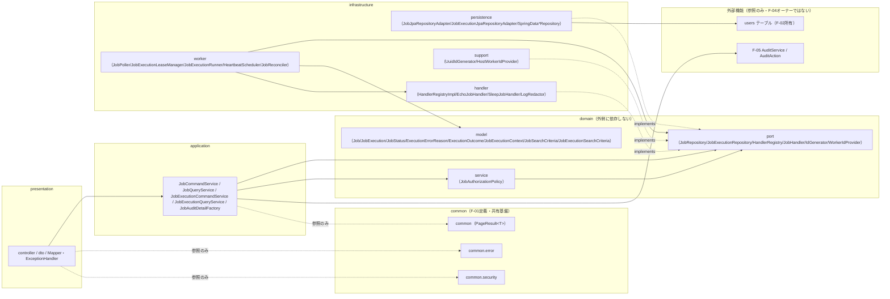

図中の破線（`-. implements .->`）は依存性逆転（infrastructureがdomainのportを実装する側であり、domainからinfrastructureへ向かう矢印は存在しない）を示す。`IW --> IH`はinfrastructure層内での横方向依存（`JobExecutionRunner`が`LogRedactor`を参照）であり、domainを経由しない。`IP --> Users`は`created_by`/`triggered_by`カラムのFK格納であり、domain/applicationはF-02/usersを一切参照しない。実線はレイヤ間の通常の呼び出し依存を示す。

## 3. ドメインモデル（Job/JobExecution/enum/VO）

`com.forgehub.job.domain.model`配下。

| クラス | 種別 | 責務 |
| ------ | ---- | ---- |
| `Job` | JPAエンティティ | ジョブ定義の識別とname/type/parameters/ソフト削除/更新の不変条件保持 |
| `JobExecution` | JPAエンティティ | 1回の実行インスタンスの状態遷移・parameters_snapshot凍結・lease/heartbeatの不変条件保持 |
| `JobStatus` | enum | ジョブ実行状態語彙（5値） |
| `ExecutionErrorReason` | enum | `error_reason`語彙（3値） |
| `ExecutionOutcome` | 値オブジェクト（record） | ハンドラ/runner出力の束 |
| `JobExecutionContext` | 値オブジェクト（record） | ハンドラへ渡す実行入力（凍結） |
| `JobSearchCriteria` | 値オブジェクト | EP1一覧検索条件保持 |
| `JobExecutionSearchCriteria` | 値オブジェクト | EP7実行履歴検索条件保持 |

### 3.1 Job

```java
@Entity
@Table(name = "jobs")
public class Job {

    @Id
    private UUID id;

    @Column(nullable = false)
    private String name; // citext

    @Column(nullable = false, updatable = false)
    private String type; // CHECK制約でHandlerRegistry登録値に限定。生成後不変

    @JdbcTypeCode(SqlTypes.JSON)
    @Column(nullable = false, columnDefinition = "jsonb")
    private Map<String, Object> parameters;

    @Column(name = "created_by", nullable = false, updatable = false)
    private UUID createdBy;

    @Column(name = "created_at", nullable = false)
    private Instant createdAt;

    @Column(name = "updated_at", nullable = false)
    private Instant updatedAt;

    @Column(name = "deleted_at")
    private Instant deletedAt; // nullable。非NULLの場合ソフト削除済み

    protected Job() { } // JPA用

    public static Job create(UUID id, String name, String type, Map<String, Object> parameters,
                              UUID createdBy, Instant now) {
        // name/type非null検証、createdBy=actor.sub固定、createdAt=updatedAt=now、deletedAt=null
    }

    public boolean applyUpdate(String name, Map<String, Object> parameters) {
        // name/parameters白名单のみ。typeは引数に取らずimmutable（typeを変更する経路自体を提供しない）
        // 各フィールドについてnull以外かつ変化がある場合のみ更新。全フィールド変化なしはfalseを返す（no-op検出用）
    }

    public void softDelete(Instant now) {
        // deletedAt=now、updatedAt=now
    }

    public boolean isDeleted() {
        return deletedAt != null;
    }

    public boolean isCreatedBy(UUID actorId) {
        return createdBy.equals(actorId);
    }

    public Map<String, Object> parametersSnapshot() {
        // 呼出時点のparametersの防御的コピーを返す（JobExecutionCommandService.triggerでの凍結用）
    }

    // 全フィールドgetter
}
```

不変条件: `name`/`type`は非null。`type`は生成後不変であり、`applyUpdate`の引数には含まれず変更経路を一切持たない（詳細設計書3章の`type` immutable方針と一致）。`deletedAt`は非NULLの場合ソフト削除済みを表す。`createdBy`は生成時（`actor.sub`）に固定し、setterは非公開のためエンティティ生成後に変更する手段を持たない。JPAアノテーションは`@Entity`/`@Id`/`@Column`/`@JdbcTypeCode`等の宣言的アノテーションのみを許容する。

SOLID: S（状態遷移の不変条件のみを責務とし、CRUD調整・監査・HTTPの関心事は一切持たない）。

### 3.2 JobExecution

```java
@Entity
@Table(name = "job_executions")
public class JobExecution {

    @Id
    private UUID id;

    @Column(name = "job_id", nullable = false, updatable = false)
    private UUID jobId;

    @Column(name = "triggered_by", nullable = false, updatable = false)
    private UUID triggeredBy;

    @Column(nullable = false)
    @Enumerated(EnumType.STRING)
    private JobStatus status;

    @JdbcTypeCode(SqlTypes.JSON)
    @Column(name = "parameters_snapshot", nullable = false, columnDefinition = "jsonb", updatable = false)
    private Map<String, Object> parametersSnapshot;

    @Column(name = "heartbeat_at")
    private Instant heartbeatAt; // nullable

    @Column(name = "worker_id")
    private String workerId; // nullable

    @Column(name = "started_at")
    private Instant startedAt; // nullable

    @Column(name = "finished_at")
    private Instant finishedAt; // nullable

    @Column(name = "log_excerpt")
    private String logExcerpt; // nullable。redact/8KB切詰済みの値のみ格納

    @Column(name = "error_reason")
    @Enumerated(EnumType.STRING)
    private ExecutionErrorReason errorReason; // nullable

    @Column(name = "created_at", nullable = false)
    private Instant createdAt;

    protected JobExecution() { } // JPA用

    public static JobExecution enqueue(UUID id, UUID jobId, UUID triggeredBy,
                                        Map<String, Object> parametersSnapshot, Instant now) {
        // status=PENDING、createdAt=now、parametersSnapshotは凍結値をそのまま保持（生成後不変）
    }

    public void lease(String workerId, Instant now) {
        // PENDING→RUNNING。worker_id/heartbeat_at/started_atを設定する。
        // status!=PENDINGの場合はIllegalStateExceptionで不正遷移を拒否する
    }

    public void heartbeat(Instant now) {
        // RUNNING時のみheartbeat_atを更新する。RUNNING以外はIllegalStateException
    }

    public void complete(ExecutionOutcome outcome, Instant now) {
        // RUNNING→終端（SUCCEEDED/FAILED/TIMED_OUT）。finished_at/log_excerpt/error_reasonを設定する。
        // RUNNING以外からの呼出しはIllegalStateException
    }

    public void timeOut(String errorReason, Instant now) {
        // RUNNING→TIMED_OUT。reconciler専用の終端化（finished_at=now、error_reason設定）
    }

    public boolean belongsTo(UUID jobId) {
        return this.jobId.equals(jobId); // IDOR判定（findByIdAndJobIdの二重防御）
    }

    public JobStatus status() {
        return status;
    }

    // 全フィールドgetter
}
```

不変条件: `status`はカラムとして格納し、遷移前状態をエンティティ自身がassertして不正遷移を拒否する（`IllegalStateException`）。`parametersSnapshot`は`enqueue`生成後不変（トリガー時点の`Job.parameters`凍結値をそのまま保持し、ジョブ定義の事後変更の影響を受けない）。`logExcerpt`は終端到達時のみ確定させ、`LogRedactor`によるredact/8KB切詰済みの値のみを受領する前提とする（本エンティティ自身はredact処理を行わない）。

SOLID: S（実行状態遷移ルールのみを責務とする）。

### 3.3 JobStatus / ExecutionErrorReason

```java
public enum JobStatus {
    PENDING, RUNNING, SUCCEEDED, FAILED, TIMED_OUT;

    public boolean isTerminal() {
        return this == SUCCEEDED || this == FAILED || this == TIMED_OUT;
    }

    public boolean isActive() {
        return this == PENDING || this == RUNNING;
    }
}
```

SOLID: O（状態種別の追加はenum追記のみで拡張可能とし、呼出側でのswitch分岐の散在を許容しない）。

```java
public enum ExecutionErrorReason {
    LEASE_EXPIRED, EXECUTION_TIMEOUT, HANDLER_ERROR;

    public String toExternal() {
        return name();
    }
}
```

SOLID: O（理由追加はenum追記のみで拡張可能）。

### 3.4 ExecutionOutcome / JobExecutionContext

```java
public record ExecutionOutcome(JobStatus status, String logExcerpt, String errorReason) {
    // status は SUCCEEDED | FAILED | TIMED_OUT のいずれか（終端値のみ）
    // logExcerpt は LogRedactor によるredact/8KB切詰済みの値
    // errorReason は nullable（SUCCEEDED時はnull）
}
```

SOLID: S（ハンドラ/runnerの実行結果保持のみを責務とする）。

```java
public record JobExecutionContext(UUID executionId, UUID jobId, String type,
                                   Map<String, Object> parametersSnapshot) {
    // JobExecutionRunner から JobHandler.execute へ渡す実行入力。生成後不変（凍結）
}
```

SOLID: S（実行入力の保持のみを責務とし、可変状態を持たない）。

### 3.5 JobSearchCriteria / JobExecutionSearchCriteria

```java
public final class JobSearchCriteria {
    private final int page;
    private final int size;
    private final String type; // nullable
    private final String q;    // nullable（nameの部分一致検索）

    public JobSearchCriteria(int page, int size, String type, String q) {
        // page>=0。size<=100へのclampはpresentation層（JobListQuery）で実施済みの値を受け取る前提とする
    }

    // 全フィールドgetterのみ（不変）
}
```

```java
public final class JobExecutionSearchCriteria {
    private final UUID jobId;
    private final JobStatus status; // nullable
    private final int page;
    private final int size;

    public JobExecutionSearchCriteria(UUID jobId, JobStatus status, int page, int size) {
        // ソートはcreated_at DESC固定（started_atはPENDING実行でNULLとなるためソートキーに使用しない）
    }

    // 全フィールドgetterのみ（不変）
}
```

不変条件: `JobExecutionSearchCriteria`のソートは`created_at DESC`固定であり、`started_at`は使用しない（詳細設計書EP7の理由と一致。※本項目は詳細設計上の固定制約であり、末尾「16. 共有クラス突合・未決事項」にも要点を重複配置する）。

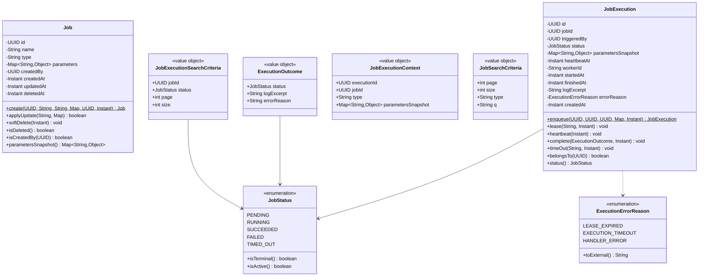

## 4. ポート（domainインターフェース）

`com.forgehub.job.domain.port`配下。すべてinterfaceであり、domain/applicationはこれらの抽象にのみ依存する。実装は「7. インフラ実装」「9. ハンドラ/typeレジストリ」参照。

| インターフェース | 責務 | 主メソッド |
| ---------------- | ---- | ---------- |
| `JobRepository` | ジョブ永続の抽象 | `findActiveById`/`saveAndFlush`/`search` |
| `JobExecutionRepository` | 実行永続/lease/reconcile/heartbeatの抽象 | 下記参照 |
| `HandlerRegistry` | typeレジストリ検証とハンドラ解決のOCP拡張点抽象 | `ensureRegistered`/`validateParameters`/`resolve`/`registeredTypes` |
| `JobHandler` | type別実行実装の契約（OCP拡張点） | `type`/`execute` |
| `IdGenerator` | UUID生成抽象（テスト差替） | `newId` |
| `WorkerIdProvider` | ワーカー識別子供給抽象 | `workerId` |

### 4.1 JobRepository

```java
public interface JobRepository {
    Optional<Job> findActiveById(UUID id); // deleted_at IS NULL
    Job saveAndFlush(Job j) throws JobNameConflictException;
    PageResult<Job> search(JobSearchCriteria c); // deleted_at IS NULL
}
```

SOLID: I（`JobExecutionRepository`と用途別に分離する）。D（applicationは本抽象のみに依存する）。

### 4.2 JobExecutionRepository

```java
public interface JobExecutionRepository {
    JobExecution saveAndFlush(JobExecution e) throws JobExecutionInProgressException; // 部分UNIQUE違反
    Optional<JobExecution> lockNextPending(); // SELECT ... FOR UPDATE SKIP LOCKED LIMIT 1
    Optional<JobExecution> findByIdAndJobId(UUID execId, UUID jobId); // IDOR境界
    PageResult<JobExecution> search(JobExecutionSearchCriteria c); // job_id + status + created_at DESC
    int heartbeat(UUID execId, Instant now); // UPDATE heartbeat_at WHERE id AND status=RUNNING
    int reclaimExpiredLeases(Instant heartbeatBefore, Instant now); // 条件1: RUNNING AND heartbeat_at<:heartbeatBefore → TIMED_OUT/LEASE_EXPIRED
    int reclaimTimedOut(Instant startedBefore, Instant now); // 条件2: RUNNING AND started_at<:startedBefore → TIMED_OUT/EXECUTION_TIMEOUT
    JobExecution saveTerminal(JobExecution e);
}
```

SOLID: I（用途別メソッド粒度に絞る）。D（worker/applicationは抽象のみに依存する）。

### 4.3 HandlerRegistry / JobHandler

```java
public interface HandlerRegistry {
    void ensureRegistered(String type) throws JobInvalidTypeException;
    void validateParameters(String type, Map<String, Object> parameters)
            throws JobInvalidTypeException, JobParamsInvalidException; // JSON Schema + 8KB上限
    JobHandler resolve(String type) throws JobInvalidTypeException;
    Set<String> registeredTypes();
}
```

SOLID: O（type追加は登録のみで拡張可能とし、呼出側でのswitch分岐の散在を許容しない）。I（検証/解決の最小契約）。D（application/domainは具象実装（`HandlerRegistryImpl`）を一切知らない）。

```java
public interface JobHandler {
    String type();
    ExecutionOutcome execute(JobExecutionContext context);
    // 具象実装はinfrastructure.handlerに限定する。任意コード/シェル/URL実行は一切禁止（allowlistのみ許容）
}
```

SOLID: O（type追加は`JobHandler`実装の追加のみで拡張し、既存実装の改変を要しない）。L（全実装が`ExecutionOutcome`契約で置換可能である）。I（`type()`＋`execute()`の最小契約のみ）。

### 4.4 IdGenerator / WorkerIdProvider

```java
public interface IdGenerator {
    UUID newId();
}
```

SOLID: D（`UUID.randomUUID()`の静的呼出しを排除する）。

```java
public interface WorkerIdProvider {
    String workerId();
}
```

SOLID: D（host名/PIDの直接参照を排除し、テスト時に決定的な値へ差替可能にする）。

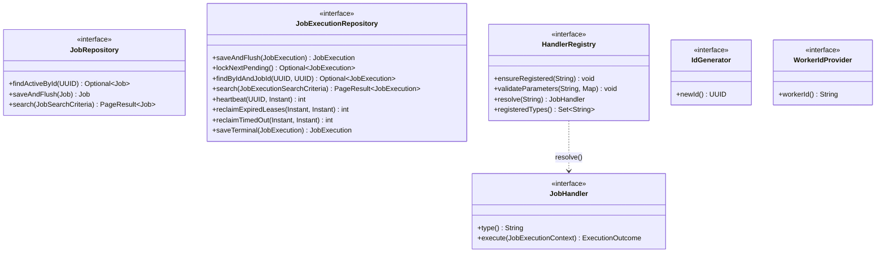

## 5. ドメインサービス（認可/状態）

`com.forgehub.job.domain.service`配下。破壊系（EP4/EP5）のcreator-or-admin認可ルールは本層に単一集約し、application層・Controllerへ漏出させない。ジョブ/実行の状態遷移不変条件自体は`Job`/`JobExecution`エンティティ（3章）に封入済みであるため、本層は認可ルールのみを扱う。

### 5.1 JobAuthorizationPolicy

```java
public class JobAuthorizationPolicy {

    public void ensureCanMutate(boolean actorIsAdmin, UUID actorId, Job target)
            throws JobNotOwnerException {
        // actorIsAdmin==true または target.isCreatedBy(actorId)==true 以外は403 JobNotOwnerException
    }
}
```

- 依存: なし。`actorIsAdmin`は`boolean`として受領し、`Role` enumをimportしない（F-01/F-02の`Role`型への依存を回避する）。
- Tx: なし。呼出時に呼出元（`JobCommandService`）のTxが既にアクティブであることを前提とする。
- SOLID: S（EP4/EP5のcreator-or-admin認可安全ルールのみを責務とし、DB更新・監査発火・HTTP変換の関心事は一切持たない）。

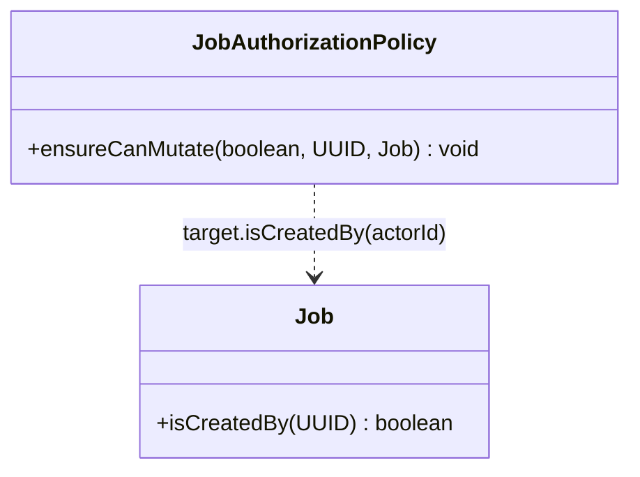

## 6. アプリケーション層とTx境界

`com.forgehub.job.application`配下。

| クラス | 種別 | 責務 |
| ------ | ---- | ---- |
| `JobCommandService` | `@Service`（Tx境界あり） | ジョブCRUD（EP2/EP4/EP5）ユースケース調整＋監査同一Tx発火 |
| `JobQueryService` | `@Service`（Tx境界=readOnly） | ジョブ参照（EP1/EP3）調整 |
| `JobExecutionCommandService` | `@Service`（Tx境界あり） | EP6手動実行トリガー（enqueue）調整＋監査同一Tx発火 |
| `JobExecutionQueryService` | `@Service`（Tx境界=readOnly） | 実行履歴参照（EP7/EP8）調整＋IDOR検証 |
| `JobAuditDetailFactory` | `@Component` | 監査detailの非機密組立（単一防御箇所） |
| `CreateJobCommand` | record | EP2入力 |
| `UpdateJobCommand` | record | EP4入力 |
| `TriggerResult` | record | EP6結果 |

### 6.1 JobCommandService

```java
@Service
public class JobCommandService {

    private final JobRepository jobRepository;
    private final HandlerRegistry handlerRegistry;
    private final JobAuthorizationPolicy jobAuthorizationPolicy;
    private final IdGenerator idGenerator;
    private final Clock clock;
    private final AuditService auditService; // F-05
    private final JobAuditDetailFactory jobAuditDetailFactory;

    public JobCommandService(JobRepository jobRepository,
                              HandlerRegistry handlerRegistry,
                              JobAuthorizationPolicy jobAuthorizationPolicy,
                              IdGenerator idGenerator,
                              Clock clock,
                              AuditService auditService,
                              JobAuditDetailFactory jobAuditDetailFactory) {
        // 全依存はコンストラクタ注入
    }

    @Transactional
    public Job create(CreateJobCommand cmd)
            throws JobInvalidTypeException, JobParamsInvalidException, JobNameConflictException {
        // handlerRegistry.ensureRegistered(cmd.type())
        // handlerRegistry.validateParameters(cmd.type(), cmd.parameters())
        // id = idGenerator.newId() → Job.create(id, cmd.name(), cmd.type(), cmd.parameters(), cmd.actorId(), clock.instant())
        // jobRepository.saveAndFlush(job)
        // auditService.append(JOB_CREATED, "JOB", job.getId(), jobAuditDetailFactory.forJobCreated(job), cmd.actorId())（同一Tx）
    }

    @Transactional
    public Job update(UpdateJobCommand cmd)
            throws JobNotFoundException, JobNotOwnerException, JobParamsInvalidException, JobNameConflictException {
        // target = jobRepository.findActiveById(cmd.jobId()) 不在 → JobNotFoundException
        // jobAuthorizationPolicy.ensureCanMutate(cmd.actorIsAdmin(), cmd.actorId(), target)
        // cmd.parameters()指定時のみ handlerRegistry.validateParameters(target.getType(), cmd.parameters())
        // target.applyUpdate(cmd.name(), cmd.parameters())
        // jobRepository.saveAndFlush(target)
        // auditService.append(JOB_UPDATED, "JOB", target.getId(), jobAuditDetailFactory.forJobUpdated(target), cmd.actorId())（同一Tx）
    }

    @Transactional
    public void softDelete(UUID jobId, UUID actorId, boolean actorIsAdmin)
            throws JobNotFoundException, JobNotOwnerException {
        // target = jobRepository.findActiveById(jobId) 不在 → JobNotFoundException
        // jobAuthorizationPolicy.ensureCanMutate(actorIsAdmin, actorId, target)
        // target.softDelete(clock.instant()) → jobRepository.saveAndFlush(target)
        // auditService.append(JOB_DELETED, "JOB", jobId, jobAuditDetailFactory.forJobDeleted(target), actorId)（同一Tx）
    }
}
```

- Tx: `create`/`update`/`softDelete`いずれも`@Transactional(REQUIRED)`。監査INSERTは各メソッド内で業務DB更新と同一Tx（F-05確定事項D準拠。※本制約は絶対制約であり、末尾「16. 共有クラス突合・未決事項」にも重複して明記する）。
- SOLID: S（ユースケース調整のみを責務とし、業務ルール自体は`Job`エンティティ/`JobAuthorizationPolicy`/`HandlerRegistry`に存在する）。D（`JobRepository`/`HandlerRegistry`/`JobAuthorizationPolicy`/`IdGenerator`/`Clock`/`AuditService`の抽象にのみ依存する）。

### 6.2 JobQueryService

```java
@Service
public class JobQueryService {

    private final JobRepository jobRepository;

    public JobQueryService(JobRepository jobRepository) {
        this.jobRepository = jobRepository;
    }

    @Transactional(readOnly = true)
    public PageResult<Job> list(JobSearchCriteria c) {
        return jobRepository.search(c);
    }

    @Transactional(readOnly = true)
    public Job get(UUID id) throws JobNotFoundException {
        return jobRepository.findActiveById(id).orElseThrow(JobNotFoundException::new);
    }
}
```

- Tx: 全メソッド`@Transactional(readOnly = true)`。
- SOLID: S（参照系ユースケースの調整のみを責務とする）。

### 6.3 JobExecutionCommandService

```java
@Service
public class JobExecutionCommandService {

    private final JobRepository jobRepository;
    private final JobExecutionRepository jobExecutionRepository;
    private final IdGenerator idGenerator;
    private final Clock clock;
    private final AuditService auditService; // F-05
    private final JobAuditDetailFactory jobAuditDetailFactory;

    public JobExecutionCommandService(JobRepository jobRepository,
                                       JobExecutionRepository jobExecutionRepository,
                                       IdGenerator idGenerator,
                                       Clock clock,
                                       AuditService auditService,
                                       JobAuditDetailFactory jobAuditDetailFactory) {
        // 全依存はコンストラクタ注入
    }

    @Transactional
    public TriggerResult trigger(UUID jobId, UUID actorId)
            throws JobNotFoundException, JobExecutionInProgressException {
        // job = jobRepository.findActiveById(jobId) 不在/削除済み → 404 JobNotFoundException
        // parametersSnapshot = job.parametersSnapshot()（凍結）
        // execution = JobExecution.enqueue(idGenerator.newId(), jobId, actorId, parametersSnapshot, clock.instant())
        // jobExecutionRepository.saveAndFlush(execution)（部分UNIQUE違反 → JobExecutionInProgressException 409）
        // auditService.append(JOB_EXECUTION_TRIGGERED, "JOB_EXECUTION", execution.getId(),
        //     jobAuditDetailFactory.forExecutionTriggered(execution), actorId)（同一Tx）
        // return new TriggerResult(execution.getId(), JobStatus.PENDING)
        // ※実際のハンドラ実行はTx外（202即時応答、8章参照）
    }
}
```

- Tx: `@Transactional(REQUIRED)`。業務INSERT＋監査INSERTが同一コミット（絶対制約1。※本制約は絶対制約であり、末尾「16. 共有クラス突合・未決事項」にも重複して明記する）。
- SOLID: S（トリガー調整のみを責務とし、実行状態遷移は`JobExecution`エンティティへ、実際のハンドラ実行は`infrastructure.worker`へ完全に分離する）。
- 実行そのもの（poller/lease/heartbeat/runner）はTx外・別クラス（8章）であり、本サービスは`job_executions`への`PENDING`挿入と監査記録のみを行う。

### 6.4 JobExecutionQueryService

```java
@Service
public class JobExecutionQueryService {

    private final JobExecutionRepository jobExecutionRepository;
    private final JobRepository jobRepository;

    public JobExecutionQueryService(JobExecutionRepository jobExecutionRepository,
                                     JobRepository jobRepository) {
        this.jobExecutionRepository = jobExecutionRepository;
        this.jobRepository = jobRepository;
    }

    @Transactional(readOnly = true)
    public PageResult<JobExecution> list(JobExecutionSearchCriteria c) throws JobNotFoundException {
        // jobRepository.findActiveById(c.jobId()) で親job存在確認（不在 → JobNotFoundException）
        // jobExecutionRepository.search(c) を返却（created_at DESC固定）
    }

    @Transactional(readOnly = true)
    public JobExecution getExecution(UUID jobId, UUID execId) throws JobExecutionNotFoundException {
        // jobExecutionRepository.findByIdAndJobId(execId, jobId) 不在（execution.job_id != path{id} を含む）
        //     → 404 JobExecutionNotFoundException（IDOR防止）
    }
}
```

- Tx: 全メソッド`@Transactional(readOnly = true)`。
- SOLID: S（実行履歴参照の調整とIDOR検証のみを責務とする）。※EP8のIDOR検証（`findByIdAndJobId`）は絶対制約であり、末尾「16. 共有クラス突合・未決事項」にも重複して明記する。

### 6.5 JobAuditDetailFactory

```java
@Component
public class JobAuditDetailFactory {

    public Map<String, Object> forJobCreated(Job j) {
        // {name, type}
    }

    public Map<String, Object> forJobUpdated(Job j) {
        // {name, type}
    }

    public Map<String, Object> forJobDeleted(Job j) {
        // {name, type}
    }

    public Map<String, Object> forExecutionTriggered(JobExecution e) {
        // {execution_id, parameters（非機密のみ）}
    }
}
```

SOLID: S（`name`/`type`/`execution_id`/`parameters`（非機密のみ）の非機密フィールドのみを責務とし、シークレット・トークン等の直値を一切参照しない単一防御箇所とする。F-05側`DetailSanitizer`のdenylist stripと二重防御を構成する。13章参照）。

### 6.6 コマンド/結果 record

```java
public record CreateJobCommand(String name, String type, Map<String, Object> parameters, UUID actorId) {
    // createdByはbody非受領。actorIdが常にcreated_byとなる（mass-assignment防止）
}

public record UpdateJobCommand(UUID jobId, String name, Map<String, Object> parameters,
                                boolean actorIsAdmin, UUID actorId) {
    // type/created_by/idは非受領（typeのimmutable方針、mass-assignment防止）
    // name/parametersはnullable（nullは「変更なし」を意味する）
}

public record TriggerResult(UUID executionId, JobStatus status) {
    // statusは常にPENDING
}
```

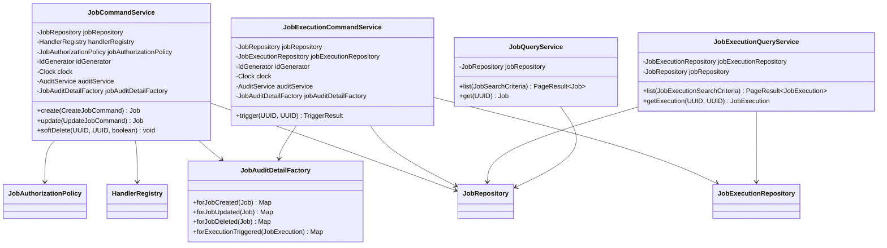

## 7. インフラ実装（persistence/support）

`com.forgehub.job.infrastructure.persistence`・`com.forgehub.job.infrastructure.support`配下。いずれも「4. ポート」で定義したインターフェースを実装し、domain/applicationからは抽象経由でのみ利用される（依存性逆転）。

| クラス | パッケージ | 実装インターフェース | 責務 |
| ------ | ---------- | -------------------- | ---- |
| `JobJpaRepositoryAdapter` | `.infrastructure.persistence` | `JobRepository` | Spring Data JPA委譲・name部分UNIQUE違反の同期例外化・削除フィルタ |
| `SpringDataJobRepository` | `.infrastructure.persistence` | （Spring Data JPA） | `JpaRepository<Job,UUID>` + `JpaSpecificationExecutor<Job>` |
| `JobExecutionJpaRepositoryAdapter` | `.infrastructure.persistence` | `JobExecutionRepository` | 実行永続・lease取得・reconcile一括UPDATE・heartbeat・部分UNIQUE違反の同期例外化 |
| `SpringDataJobExecutionRepository` | `.infrastructure.persistence` | （Spring Data JPA） | `JpaRepository<JobExecution,UUID>` + `@Modifying`reclaim/heartbeatクエリ + native `FOR UPDATE SKIP LOCKED` |
| `UuidIdGenerator` | `.infrastructure.support` | `IdGenerator` | `UUID.randomUUID()`生成 |
| `HostWorkerIdProvider` | `.infrastructure.support` | `WorkerIdProvider` | hostname+起動UUIDによる`worker_id`供給 |

### 7.1 JobJpaRepositoryAdapter

```java
@Repository
public class JobJpaRepositoryAdapter implements JobRepository {

    private final SpringDataJobRepository springDataJobRepository;

    public JobJpaRepositoryAdapter(SpringDataJobRepository springDataJobRepository) {
        this.springDataJobRepository = springDataJobRepository;
    }

    @Override
    public Optional<Job> findActiveById(UUID id) {
        // deleted_at IS NULL条件を付与して検索
    }

    @Override
    public Job saveAndFlush(Job j) throws JobNameConflictException {
        try {
            return springDataJobRepository.saveAndFlush(j);
        } catch (DataIntegrityViolationException e) {
            // name部分UNIQUE(deleted_at IS NULL)違反を捕捉し、業務例外へ同期変換
            // （Tx内でrollbackさせ監査INSERTのコミットを防止）
            throw new JobNameConflictException(e);
        }
    }

    @Override
    public PageResult<Job> search(JobSearchCriteria c) {
        // type一致 / q（name部分一致）/ deleted_at IS NULL をSpecification + ページングで適用し、
        // Page<Job> を PageResult<Job> へ変換して返却
    }
}
```

SOLID: D（domainの`JobRepository`ポートを実装し、application側は具象を一切知らない）。L（`JobRepository`契約を満たす形で置換可能な実装である）。

### 7.2 SpringDataJobRepository

```java
public interface SpringDataJobRepository
        extends JpaRepository<Job, UUID>, JpaSpecificationExecutor<Job> {
    // type一致/q部分一致/deleted_atフィルタ + ページングをSpecificationで実現
}
```

### 7.3 JobExecutionJpaRepositoryAdapter

```java
@Repository
public class JobExecutionJpaRepositoryAdapter implements JobExecutionRepository {

    private final SpringDataJobExecutionRepository springDataJobExecutionRepository;

    public JobExecutionJpaRepositoryAdapter(SpringDataJobExecutionRepository springDataJobExecutionRepository) {
        this.springDataJobExecutionRepository = springDataJobExecutionRepository;
    }

    @Override
    public JobExecution saveAndFlush(JobExecution e) throws JobExecutionInProgressException {
        try {
            return springDataJobExecutionRepository.saveAndFlush(e);
        } catch (DataIntegrityViolationException ex) {
            // 部分UNIQUE(job_id WHERE status IN(PENDING,RUNNING))違反を捕捉し、業務例外へ同期変換
            // （Tx内でrollbackさせ監査INSERTのコミットを防止。絶対制約7参照）
            throw new JobExecutionInProgressException(ex);
        }
    }

    @Override
    public Optional<JobExecution> lockNextPending() {
        return springDataJobExecutionRepository.lockNextPending(); // native SELECT ... FOR UPDATE SKIP LOCKED LIMIT 1
    }

    @Override
    public Optional<JobExecution> findByIdAndJobId(UUID execId, UUID jobId) {
        return springDataJobExecutionRepository.findByIdAndJobId(execId, jobId);
    }

    @Override
    public PageResult<JobExecution> search(JobExecutionSearchCriteria c) {
        // job_idインデックス + status絞込 + created_at DESC固定でページング
    }

    @Override
    public int heartbeat(UUID execId, Instant now) {
        return springDataJobExecutionRepository.heartbeat(execId, now); // WHERE id AND status=RUNNING
    }

    @Override
    public int reclaimExpiredLeases(Instant heartbeatBefore, Instant now) {
        return springDataJobExecutionRepository.reclaimExpiredLeases(heartbeatBefore, now); // 条件1
    }

    @Override
    public int reclaimTimedOut(Instant startedBefore, Instant now) {
        return springDataJobExecutionRepository.reclaimTimedOut(startedBefore, now); // 条件2
    }

    @Override
    public JobExecution saveTerminal(JobExecution e) {
        return springDataJobExecutionRepository.save(e);
    }
}
```

SOLID: D（domainの`JobExecutionRepository`ポートを実装し、worker/applicationは具象を一切知らない）。L（契約を満たす形で置換可能）。

### 7.4 SpringDataJobExecutionRepository

```java
public interface SpringDataJobExecutionRepository extends JpaRepository<JobExecution, UUID> {

    Optional<JobExecution> findByIdAndJobId(UUID id, UUID jobId);

    @Query(value = "SELECT * FROM job_executions WHERE status = 'PENDING' " +
                    "ORDER BY created_at ASC LIMIT 1 FOR UPDATE SKIP LOCKED", nativeQuery = true)
    Optional<JobExecution> lockNextPending();

    @Modifying
    @Query("UPDATE JobExecution e SET e.heartbeatAt = :now WHERE e.id = :id AND e.status = 'RUNNING'")
    int heartbeat(UUID id, Instant now);

    @Modifying
    @Query("UPDATE JobExecution e SET e.status = 'TIMED_OUT', e.finishedAt = :now, e.errorReason = 'LEASE_EXPIRED' " +
           "WHERE e.status = 'RUNNING' AND e.heartbeatAt < :heartbeatBefore")
    int reclaimExpiredLeases(Instant heartbeatBefore, Instant now);

    @Modifying
    @Query("UPDATE JobExecution e SET e.status = 'TIMED_OUT', e.finishedAt = :now, e.errorReason = 'EXECUTION_TIMEOUT' " +
           "WHERE e.status = 'RUNNING' AND e.startedAt < :startedBefore")
    int reclaimTimedOut(Instant startedBefore, Instant now);
}
```

### 7.5 UuidIdGenerator / HostWorkerIdProvider

```java
@Component
public class UuidIdGenerator implements IdGenerator {

    @Override
    public UUID newId() {
        return UUID.randomUUID();
    }
}
```

```java
@Component
public class HostWorkerIdProvider implements WorkerIdProvider {

    private final String workerId; // 起動時にhostname + 起動UUIDから一度だけ組立てて保持

    public HostWorkerIdProvider() {
        // 例: hostname + "-" + UUID.randomUUID()
    }

    @Override
    public String workerId() {
        return workerId;
    }
}
```

SOLID: D（`UUID.randomUUID()`/host名の静的呼出しをdomain/application/workerから排除し、テスト時に決定的な値へ差替可能にする）。

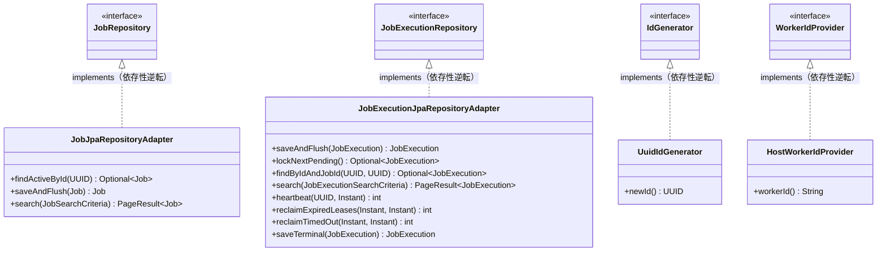

## 8. 実行基盤（worker: poller/reconciler/heartbeat/runner）とTx境界

`com.forgehub.job.infrastructure.worker`配下。domain.port＋domain.modelのみに依存するdomain非依存の実行基盤であり、`application`（`JobExecutionCommandService`等）を呼び出さない（トリガーと実行の分離。1章・2章参照）。

| クラス | 責務 |
| ------ | ---- |
| `JobPoller` | `@Scheduled`固定遅延2秒でPENDINGをlease→runner委譲（自Txを持たない） |
| `JobExecutionLeaseManager` | lease/heartbeat/terminal各操作の短命Tx境界（1操作=1Tx） |
| `JobExecutionRunner` | lease済実行の非同期実行（ハンドラ解決→execute→heartbeat駆動→terminal書込） |
| `HeartbeatScheduler` | RUNNING中15秒間隔でのheartbeat呼出task登録/解除 |
| `JobReconciler` | 孤児/暴走実行の回収（`@Scheduled`30秒＋起動時） |

### 8.1 JobPoller

```java
@Component
public class JobPoller {

    private final JobExecutionLeaseManager jobExecutionLeaseManager;
    private final JobExecutionRunner jobExecutionRunner;

    public JobPoller(JobExecutionLeaseManager jobExecutionLeaseManager,
                      JobExecutionRunner jobExecutionRunner) {
        this.jobExecutionLeaseManager = jobExecutionLeaseManager;
        this.jobExecutionRunner = jobExecutionRunner;
    }

    @Scheduled(fixedDelay = 2000)
    public void poll() {
        // 実行スロットの空き確認 → jobExecutionLeaseManager.leaseNext()
        // → 空でなければ jobExecutionRunner.submit(leased)
    }
}
```

- Tx: なし（Txはすべて`JobExecutionLeaseManager`側の短命Txに委ねる）。
- SOLID: S（スケジューリングと委譲のみを責務とする）。
- 重要: `JobPoller`（`@Scheduled`）と`JobExecutionLeaseManager`（`@Transactional`）は別Beanに分離する。同一Beanで自己呼出し（self-invocation）すると`@Transactional`のAOPプロキシが作動せずTxが無効化するため、cross-bean呼出しにより必ずプロキシを経由させる（15章 ATTACK参照）。

### 8.2 JobExecutionLeaseManager

```java
@Component
public class JobExecutionLeaseManager {

    private final JobExecutionRepository jobExecutionRepository;
    private final WorkerIdProvider workerIdProvider;
    private final Clock clock;

    public JobExecutionLeaseManager(JobExecutionRepository jobExecutionRepository,
                                     WorkerIdProvider workerIdProvider,
                                     Clock clock) {
        this.jobExecutionRepository = jobExecutionRepository;
        this.workerIdProvider = workerIdProvider;
        this.clock = clock;
    }

    @Transactional
    public Optional<JobExecution> leaseNext() {
        // jobExecutionRepository.lockNextPending() → 存在すれば entity.lease(workerIdProvider.workerId(), clock.instant())
        // → jobExecutionRepository.saveTerminal(entity)相当の保存 → コミットしてRUNNING確定・行ロック解放
    }

    @Transactional
    public void heartbeat(UUID execId) {
        jobExecutionRepository.heartbeat(execId, clock.instant());
    }

    @Transactional
    public void markTerminal(UUID execId, ExecutionOutcome outcome) {
        // findById相当で取得 → entity.complete(outcome, clock.instant()) → jobExecutionRepository.saveTerminal(entity)
    }
}
```

- Tx: 各メソッド`@Transactional(REQUIRED)`かつ短命Tx（1操作=1Tx）。`leaseNext`でRUNNING確定・コミットし行ロックを速やかに解放することで、後続のハンドラ実行（最大10分）中にDBコネクション/行ロックを長時間占有しない（15章 ATTACK参照）。
- SOLID: S（Tx境界のみを責務とし、状態遷移ルール自体は`JobExecution`エンティティへ委譲する）。
- 注記: `JobPoller`/`JobExecutionRunner`からのcross-bean呼出しによりAOPプロキシが常に作動する（別Bean設計、8.1節参照）。

### 8.3 JobExecutionRunner

```java
@Component
public class JobExecutionRunner {

    private final HandlerRegistry handlerRegistry;
    private final HeartbeatScheduler heartbeatScheduler;
    private final LogRedactor logRedactor;
    private final JobExecutionLeaseManager jobExecutionLeaseManager;
    private final ThreadPoolTaskExecutor threadPoolTaskExecutor;
    private final Clock clock;

    public JobExecutionRunner(HandlerRegistry handlerRegistry,
                               HeartbeatScheduler heartbeatScheduler,
                               LogRedactor logRedactor,
                               JobExecutionLeaseManager jobExecutionLeaseManager,
                               ThreadPoolTaskExecutor threadPoolTaskExecutor,
                               Clock clock) {
        // 全依存はコンストラクタ注入
    }

    public void submit(JobExecution leased) {
        // bounded ThreadPoolTaskExecutor へ run(...) を投入する
    }

    public void run(JobExecutionContext ctx) {
        // handler = handlerRegistry.resolve(ctx.type())
        // heartbeatScheduler.start(ctx.executionId())（15秒間隔開始）
        // Future<ExecutionOutcome> future = threadPoolTaskExecutor経由でhandler.execute(ctx)を実行
        // try { outcome = future.get(10, TimeUnit.MINUTES) }
        //   catch TimeoutException → outcome = ExecutionOutcome(TIMED_OUT, ..., "EXECUTION_TIMEOUT")
        //   catch Exception → outcome = ExecutionOutcome(FAILED, ..., "HANDLER_ERROR")
        // sanitizedOutcome = logRedactor.redactAndTruncate(outcome.logExcerpt()) を適用したoutcomeで
        // jobExecutionLeaseManager.markTerminal(ctx.executionId(), sanitizedOutcome)
        // heartbeatScheduler.stop(ctx.executionId())
    }
}
```

- Tx: なし。ハンドラ実行自体はTx外で行い、DB更新は`JobExecutionLeaseManager`の短命Txに委ねる（10分の実行中にTxを保持しない。15章 ATTACK参照）。
- SOLID: S（実行オーケストレーションのみを責務とし、ハンドラ解決は`HandlerRegistry`、heartbeat制御は`HeartbeatScheduler`、redactは`LogRedactor`、Tx境界は`JobExecutionLeaseManager`へそれぞれ委譲する）。

### 8.4 HeartbeatScheduler

```java
@Component
public class HeartbeatScheduler {

    private final TaskScheduler taskScheduler;
    private final JobExecutionLeaseManager jobExecutionLeaseManager;

    public HeartbeatScheduler(TaskScheduler taskScheduler,
                               JobExecutionLeaseManager jobExecutionLeaseManager) {
        this.taskScheduler = taskScheduler;
        this.jobExecutionLeaseManager = jobExecutionLeaseManager;
    }

    public void start(UUID execId) {
        // taskScheduler.scheduleAtFixedRate(() -> jobExecutionLeaseManager.heartbeat(execId), Duration.ofSeconds(15))
        // 登録したScheduledFutureをexecId単位で保持する
    }

    public void stop(UUID execId) {
        // start時に保持したScheduledFutureをcancelしマップから除去する
    }
}
```

- SOLID: S（heartbeat task登録/解除のみを責務とする）。

### 8.5 JobReconciler

```java
@Component
public class JobReconciler {

    private final JobExecutionRepository jobExecutionRepository;
    private final Clock clock;

    public JobReconciler(JobExecutionRepository jobExecutionRepository, Clock clock) {
        this.jobExecutionRepository = jobExecutionRepository;
        this.clock = clock;
    }

    @Scheduled(fixedDelay = 30000)
    public void reconcile() {
        doReconcile();
    }

    @EventListener(ApplicationReadyEvent.class)
    public void onStartup() {
        doReconcile();
    }

    private void doReconcile() {
        // jobExecutionRepository.reclaimExpiredLeases(clock.instant().minusSeconds(60), clock.instant())（条件1: LEASE_EXPIRED）
        // jobExecutionRepository.reclaimTimedOut(clock.instant().minus(Duration.ofMinutes(10)), clock.instant())（条件2: EXECUTION_TIMEOUT）
    }
}
```

- Tx: `reclaimExpiredLeases`/`reclaimTimedOut`は各`@Modifying`クエリ側で自Tx完結する。
- SOLID: S（孤児/暴走実行の回収のみを責務とする）。
- 絶対制約8（再掲）: 条件1（`heartbeat_at`基準）と条件2（`started_at`基準）を独立に実装し、いずれか一方のみでは検出できないケース（heartbeat生存だが暴走している実行）を必ず回収する（末尾「16. 共有クラス突合・未決事項」にも要点を重複配置する）。

### 8.6 実行フロー・シーケンス

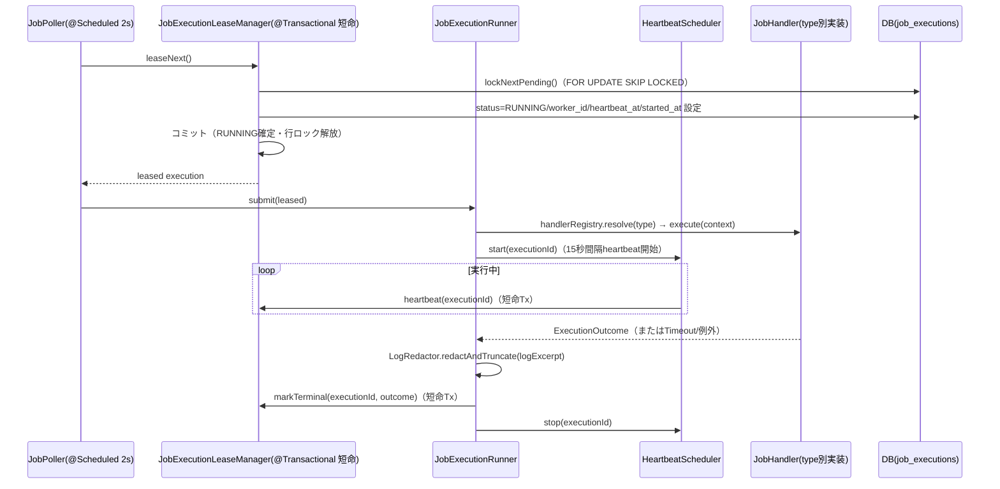

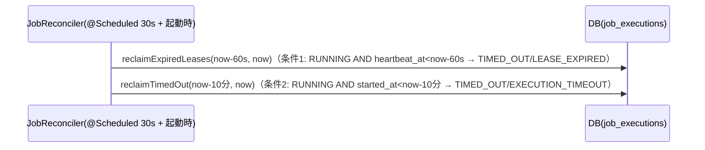

## 9. ハンドラ/typeレジストリ（OCP拡張点）

`com.forgehub.job.infrastructure.handler`配下。`HandlerRegistry`/`JobHandler`（4章）のOCP拡張点実装を提供する。

| クラス | 実装インターフェース | 責務 |
| ------ | -------------------- | ---- |
| `HandlerRegistryImpl` | `HandlerRegistry` | `List<JobHandler>`注入によるtype→handlerマップ構築・typeごとJSON Schema検証・8KB上限検証 |
| `EchoJobHandler` | `JobHandler` | `sample.echo`実装（外部依存なし・安全） |
| `SleepJobHandler` | `JobHandler` | `sample.sleep`実装（外部依存なし） |
| `LogRedactor` | （非port） | `log_excerpt`のredact（機密マスキング）＋8KB切詰 |

### 9.1 HandlerRegistryImpl

```java
@Component
public class HandlerRegistryImpl implements HandlerRegistry {

    private final Map<String, JobHandler> handlersByType;
    private final ObjectMapper objectMapper;

    public HandlerRegistryImpl(List<JobHandler> jobHandlers, ObjectMapper objectMapper) {
        // jobHandlers を type() でMap化する（Bean追加のみでtypeが自動登録される）
        this.objectMapper = objectMapper;
    }

    @Override
    public void ensureRegistered(String type) throws JobInvalidTypeException {
        // handlersByType.containsKey(type)==false → JobInvalidTypeException（400）
    }

    @Override
    public void validateParameters(String type, Map<String, Object> parameters)
            throws JobInvalidTypeException, JobParamsInvalidException {
        // ensureRegistered(type)
        // typeごとのJSON Schema（classpathリソース）でparametersを検証
        // シリアライズ後byte長が8KB超 → JobParamsInvalidException（400）
    }

    @Override
    public JobHandler resolve(String type) throws JobInvalidTypeException {
        // handlersByType.get(type) 不在 → JobInvalidTypeException
    }

    @Override
    public Set<String> registeredTypes() {
        return handlersByType.keySet();
    }
}
```

- 依存: `List<JobHandler>`（Spring DIによる自動収集）、`ObjectMapper`、type別JSON Schema（classpathリソース）。
- SOLID: O（handler追加はBean追加（`JobHandler`実装の新規`@Component`）のみでregistry自体は無改変。switch散在を排除する）。D（JSON Schema実装の具象をdomain/applicationから隔離する）。

### 9.2 EchoJobHandler / SleepJobHandler

```java
@Component
public class EchoJobHandler implements JobHandler {

    @Override
    public String type() {
        return "sample.echo";
    }

    @Override
    public ExecutionOutcome execute(JobExecutionContext context) {
        // parametersSnapshotの内容をそのままログ出力し、SUCCEEDEDを返す（外部依存なし）
    }
}
```

```java
@Component
public class SleepJobHandler implements JobHandler {

    @Override
    public String type() {
        return "sample.sleep";
    }

    @Override
    public ExecutionOutcome execute(JobExecutionContext context) {
        // parametersSnapshotで指定された秒数だけ待機し、SUCCEEDEDを返す（外部依存なし）
    }
}
```

- セキュリティ: いずれも任意コード・URL・シェルの実行を行わない（絶対制約4。9.3節・15章参照）。MVP同梱ハンドラの具体セットは実装時確定（※本項目は未決。詳細は末尾「16. 共有クラス突合・未決事項」参照）。
- SOLID: O（拡張点の1実装であり、新規typeの追加時にこれらの実装や`HandlerRegistryImpl`を改変する必要はない）。

### 9.3 LogRedactor

```java
@Component
public class LogRedactor {

    public String redactAndTruncate(String raw) {
        // 機密マスキング（denylistパターンによるマスク処理）を適用したのち、8KBへ切詰める
    }
}
```

- 依存: なし。
- SOLID: S（機密非露出の単一実装。具体のredactルール（キー名パターン等）は未確定である。※本項目は未決。詳細は末尾「16. 共有クラス突合・未決事項」参照）。

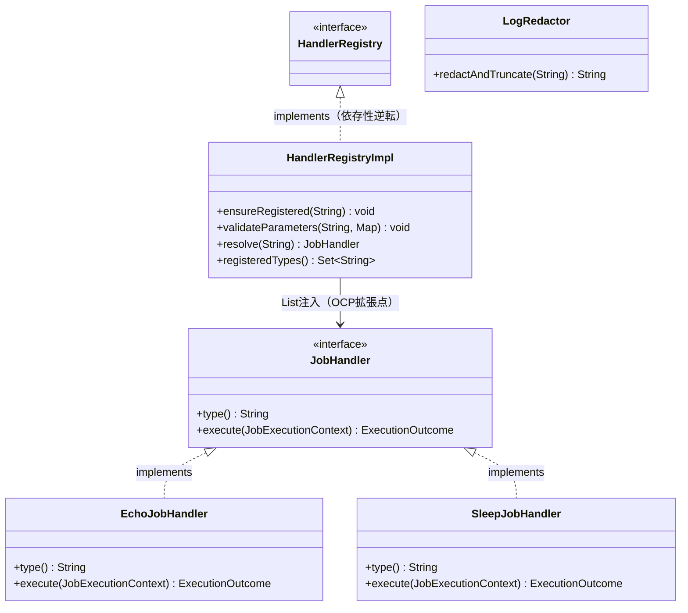

## 10. プレゼンテーション/DTO/Mapper

`com.forgehub.job.presentation`配下。

| クラス | パッケージ | 責務 |
| ------ | ---------- | ---- |
| `JobController` | `.presentation.controller` | `/api/v1/jobs`公開・DTO⇄command変換・actor解決 |
| `JobExecutionController` | `.presentation.controller` | `/api/v1/jobs/{id}/executions`公開・トリガー/履歴/ポーリング・IDOR境界の受け渡し |
| `JobResponseMapper` | `.presentation.mapper` | domain→レスポンスDTO変換 |
| `JobExceptionHandler` | `.presentation` | F-04固有バリデーション例外のHTTP変換 |
| `CreateJobRequest` | `.presentation.dto` | EP2入力（record） |
| `UpdateJobRequest` | `.presentation.dto` | EP4入力（白名单、record） |
| `JobListQuery` | `.presentation.dto` | EP1クエリ（record） |
| `ExecutionListQuery` | `.presentation.dto` | EP7クエリ（record） |
| `JobResponse` | `.presentation.dto` | ジョブ詳細レスポンス（record） |
| `JobSummaryResponse` | `.presentation.dto` | ジョブ一覧行レスポンス（record） |
| `JobListResponse` | `.presentation.dto` | ジョブ一覧応答（record） |
| `TriggerExecutionResponse` | `.presentation.dto` | EP6 202応答（record） |
| `ExecutionResponse` | `.presentation.dto` | EP8詳細レスポンス（record） |
| `ExecutionSummaryResponse` | `.presentation.dto` | EP7行レスポンス（record） |
| `ExecutionListResponse` | `.presentation.dto` | EP7応答（record） |

### 10.1 JobController

```java
@RestController
@RequestMapping("/api/v1/jobs")
@PreAuthorize("hasAnyRole('ADMIN','DEVELOPER','OPERATOR')")
public class JobController {

    private final JobCommandService jobCommandService;
    private final JobQueryService jobQueryService;
    private final JobResponseMapper jobResponseMapper;

    public JobController(JobCommandService jobCommandService,
                          JobQueryService jobQueryService,
                          JobResponseMapper jobResponseMapper) {
        // コンストラクタ注入
    }

    @GetMapping
    public ResponseEntity<JobListResponse> list(@Valid JobListQuery q) {
        // JobSearchCriteria組立（size clamp込み） → jobQueryService.list(...) → jobResponseMapper.toList(...)
    }

    @PostMapping
    @ResponseStatus(HttpStatus.CREATED)
    public ResponseEntity<JobResponse> create(@Valid @RequestBody CreateJobRequest req, Authentication auth) {
        // actorId = auth由来のsubから解決 → CreateJobCommand組立（created_byはbody非受領、actorIdが固定値）
        // → jobCommandService.create(...) → jobResponseMapper.toDetail(...)
    }

    @GetMapping("/{id}")
    public ResponseEntity<JobResponse> get(@PathVariable UUID id) {
        // jobQueryService.get(id) → jobResponseMapper.toDetail(...)
    }

    @PatchMapping("/{id}")
    public ResponseEntity<JobResponse> update(@PathVariable UUID id,
                                               @Valid @RequestBody UpdateJobRequest req,
                                               Authentication auth) {
        // actorId/actorIsAdmin解決 → UpdateJobCommand(id, req.name(), req.parameters(), actorIsAdmin, actorId)
        // → jobCommandService.update(...) → jobResponseMapper.toDetail(...)
    }

    @DeleteMapping("/{id}")
    @ResponseStatus(HttpStatus.NO_CONTENT)
    public ResponseEntity<Void> delete(@PathVariable UUID id, Authentication auth) {
        // actorId/actorIsAdmin解決 → jobCommandService.softDelete(id, actorId, actorIsAdmin)
    }
}
```

- 依存: `JobCommandService`、`JobQueryService`、`JobResponseMapper`。コンストラクタ注入。
- 認可: クラスに`@PreAuthorize("hasAnyRole('ADMIN','DEVELOPER','OPERATOR')")`を付与し、Operatorのアクセスを許可する（絶対制約3。F-03とは逆の扱いである点に注意。11章参照）。
- Tx: なし（HTTP境界変換のみを担う）。
- 制約: `actorId`/`actorIsAdmin`は`Authentication`（`sub`/`authorities`）のみから解決し、リクエスト由来のIDは一切採用しない。`created_by`/`type`/`id`/`deleted_at`は`CreateJobRequest`/`UpdateJobRequest`で非受領（mass-assignment防止、絶対制約5。※本制約は絶対制約であり、末尾「16. 共有クラス突合・未決事項」にも重複して明記する）。`Job`エンティティの直接シリアライズは一切行わない。
- SOLID: S（HTTP境界変換のみを責務とする）。

### 10.2 JobExecutionController

```java
@RestController
@RequestMapping("/api/v1/jobs/{id}/executions")
@PreAuthorize("hasAnyRole('ADMIN','DEVELOPER','OPERATOR')")
public class JobExecutionController {

    private final JobExecutionCommandService jobExecutionCommandService;
    private final JobExecutionQueryService jobExecutionQueryService;
    private final JobResponseMapper jobResponseMapper;

    public JobExecutionController(JobExecutionCommandService jobExecutionCommandService,
                                   JobExecutionQueryService jobExecutionQueryService,
                                   JobResponseMapper jobResponseMapper) {
        // コンストラクタ注入
    }

    @PostMapping
    @ResponseStatus(HttpStatus.ACCEPTED)
    public ResponseEntity<TriggerExecutionResponse> trigger(@PathVariable UUID id, Authentication auth) {
        // actorId解決（creator不問、ADMIN/DEVELOPER/OPERATORいずれも可）
        // → jobExecutionCommandService.trigger(id, actorId)
        // → location = EP8のURL組立 → jobResponseMapper.toAccepted(result, location)
    }

    @GetMapping
    public ResponseEntity<ExecutionListResponse> listExecutions(@PathVariable UUID id, @Valid ExecutionListQuery q) {
        // JobExecutionSearchCriteria組立 → jobExecutionQueryService.list(...) → jobResponseMapper.toExecutionList(...)
    }

    @GetMapping("/{execId}")
    public ResponseEntity<ExecutionResponse> getExecution(@PathVariable UUID id, @PathVariable UUID execId) {
        // jobExecutionQueryService.getExecution(id, execId) → jobResponseMapper.toExecutionDetail(...)
    }
}
```

- 依存: `JobExecutionCommandService`、`JobExecutionQueryService`、`JobResponseMapper`。コンストラクタ注入。
- 認可: クラスに`@PreAuthorize("hasAnyRole('ADMIN','DEVELOPER','OPERATOR')")`を付与する。
- Tx: なし。
- 制約: `triggeredBy`は`actor.sub`のみから解決する。EP8は`jobId`＋`execId`の両方を`jobExecutionQueryService.getExecution`へ渡し、`job_id`一致を検証する（絶対制約6・IDOR防止。※本制約は絶対制約であり、末尾「16. 共有クラス突合・未決事項」にも重複して明記する）。
- SOLID: S（HTTP境界変換のみを責務とする）。

### 10.3 JobResponseMapper

```java
@Component
public class JobResponseMapper {

    public JobResponse toDetail(Job j) {
        // id/name/type/parameters/created_by/created_at/updated_at（deleted_at非返却）
    }

    public JobSummaryResponse toSummary(Job j) {
        // id/name/type/created_by/created_at
    }

    public JobListResponse toList(PageResult<Job> p) {
        // items(toSummaryの配列)/page/size/total
    }

    public TriggerExecutionResponse toAccepted(TriggerResult r, URI location) {
        // execution_id/status("PENDING")/location
    }

    public ExecutionResponse toExecutionDetail(JobExecution e) {
        // id/status/started_at/finished_at/log_excerpt（redact済み値のみ）/error_reason/triggered_by
    }

    public ExecutionSummaryResponse toExecutionSummary(JobExecution e) {
        // id/status/created_at/started_at/finished_at/triggered_by
    }

    public ExecutionListResponse toExecutionList(PageResult<JobExecution> p) {
        // items(toExecutionSummaryの配列)/page/size/total
    }
}
```

- 制約: `deleted_at`は非返却。`log_excerpt`は`LogRedactor`によるredact済み値のみを返却する（本Mapper自体はredact処理を行わない）。
- SOLID: S（domainからレスポンスDTOへの変換のみを責務とする）。

### 10.4 JobExceptionHandler

```java
@RestControllerAdvice(assignableTypes = {JobController.class, JobExecutionController.class})
public class JobExceptionHandler {

    @ExceptionHandler(MethodArgumentNotValidException.class)
    public ResponseEntity<ErrorResponse> handleValidation(MethodArgumentNotValidException e) {
        // 400 JOB_VALIDATION_ERROR
    }

    @ExceptionHandler(HttpMessageNotReadableException.class)
    public ResponseEntity<ErrorResponse> handleUnreadable(HttpMessageNotReadableException e) {
        // 400 JOB_VALIDATION_ERROR
    }
}
```

`@RestControllerAdvice(assignableTypes = {JobController.class, JobExecutionController.class})`により両Controllerにのみ適用範囲を限定し、共通（グローバル）`@RestControllerAdvice`（F-01定義）との二重登録衝突を回避する。F-04固有の業務例外（`JobNotFoundException`等7種）はいずれも共有基底例外（`AuthException`）派生とし、共通`@RestControllerAdvice`が一律変換する（12章参照）。

### 10.5 DTO

```java
public record CreateJobRequest(
        @NotBlank String name,
        @NotBlank String type,
        Map<String, Object> parameters
) { }
// created_by/id非定義（mass-assignment防止）

public record UpdateJobRequest(String name, Map<String, Object> parameters) { }
// type/created_by/id非定義（typeのimmutable方針、mass-assignment防止）。ホワイトリスト

public record JobListQuery(
        Integer page, // 既定0
        Integer size, // 既定20、上限100にclamp
        String type,
        String q
) { }

public record ExecutionListQuery(
        Integer page,
        Integer size,
        String status
) { }

public record JobResponse(
        UUID id, String name, String type, Map<String, Object> parameters,
        UUID created_by, Instant created_at, Instant updated_at
) { } // deleted_at非返却

public record JobSummaryResponse(UUID id, String name, String type, UUID created_by, Instant created_at) { }

public record JobListResponse(List<JobSummaryResponse> items, int page, int size, long total) { }

public record TriggerExecutionResponse(UUID execution_id, String status, String location) { }
// statusは常に"PENDING"、locationはEP8のURL

public record ExecutionResponse(
        UUID id, String status, Instant started_at, Instant finished_at,
        String log_excerpt, String error_reason, UUID triggered_by
) { }

public record ExecutionSummaryResponse(
        UUID id, String status, Instant created_at, Instant started_at, Instant finished_at, UUID triggered_by
) { }

public record ExecutionListResponse(List<ExecutionSummaryResponse> items, int page, int size, long total) { }
```

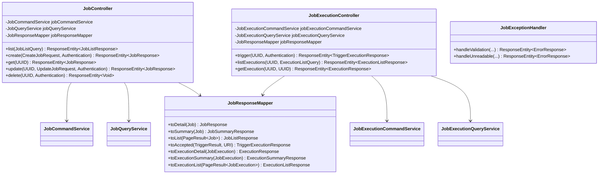

## 11. 認可（RBAC実装位置）

- 認可基盤（`@EnableMethodSecurity`、`SecurityFilterChain`のSTATELESS設定、`RestAuthenticationEntryPoint`/`RestAccessDeniedHandler`、デフォルトdeny）は`com.forgehub.common.security`配下にF-01が定義したものをそのまま再利用する。F-04は独自に`SecurityConfig`を重複定義しない。
- リソース単位の認可（`@PreAuthorize`）は各Controllerが個別に付与する規約（`docs/design/class/f-01-jwt-auth-backend-class.md` 8章）に従い、`JobController`・`JobExecutionController`のいずれもクラスレベルで`@PreAuthorize("hasAnyRole('ADMIN','DEVELOPER','OPERATOR')")`を付与する。**Operatorを許可する点がF-03（`/api/v1/apis`系はADMIN/DEVELOPERのみ）とは逆であり、実装時に取り違えないよう注意すること**（絶対制約3。※本制約は絶対制約であり、末尾「16. 共有クラス突合・未決事項」にも重複して明記する）。
- 書込系（EP4更新・EP5削除）のcreator-or-admin認可は`@PreAuthorize`では表現せず（対象ジョブのcreatorはリクエスト時点でDBから解決する必要があるため）、`JobAuthorizationPolicy`（domain.service、5章）が各`JobCommandService`メソッド内で検証する。これによりControllerへ業務ルールを漏出させない。
- EP1/EP3/EP6/EP7/EP8はcreator限定ではなく、ADMIN/DEVELOPER/OPERATORいずれの実行者もアクセス可能（`jobs`テーブルに`owner_id`相当のカラムは存在せず、ジョブは組織横断の資産として扱うため。手動実行トリガー（EP6）もcreator不問）。
- 操作実行者（actor）の特定は、検証済みAT `SecurityContext`上の`sub`クレームのみを用い、DBへの再照会は行わない。`actorId`/`actorIsAdmin`はクライアント指定の値を一切採らない（IDOR/権限昇格防止。10章にも重複して明記済み）。
- `AUTH_FORBIDDEN`（403）/`AUTH_UNAUTHENTICATED`（401）は`RestAccessDeniedHandler`/`RestAuthenticationEntryPoint`（F-01定義）がそのまま送出する。F-04では再定義しない。

## 12. 例外階層とエラーコード対応

`com.forgehub.common.error`配下（全機能共有、F-01定義）に、F-04固有の7例外を追加する。

### 12.1 例外階層

```java
// 共有抽象基底（現状のクラス名はcom.forgehub.common.error.AuthException。
// F-01由来のauth特有命名であり、ドメイン中立名への改称は未決事項。16章参照）
public abstract class AuthException extends RuntimeException {
    public abstract String getCode();
    public abstract HttpStatus getStatus();
}

public class JobNotFoundException extends AuthException {
    /* code=JOB_NOT_FOUND, status=404（ID不在/ソフト削除済み） */
}

public class JobNameConflictException extends AuthException {
    /* code=JOB_NAME_CONFLICT, status=409（name部分UNIQUE(deleted_at IS NULL)違反のDataIntegrityViolationExceptionから変換） */
}

public class JobInvalidTypeException extends AuthException {
    /* code=JOB_INVALID_TYPE, status=400（レジストリ外type） */
}

public class JobParamsInvalidException extends AuthException {
    /* code=JOB_PARAMS_INVALID, status=400（JSON Schema不適合/8KB超） */
}

public class JobNotOwnerException extends AuthException {
    /* code=JOB_NOT_OWNER, status=403（非creator・非ADMINのEP4/EP5試行） */
}

public class JobExecutionNotFoundException extends AuthException {
    /* code=JOB_EXECUTION_NOT_FOUND, status=404（execId不在/job_id不一致=IDOR） */
}

public class JobExecutionInProgressException extends AuthException {
    /* code=JOB_EXECUTION_IN_PROGRESS, status=409（部分UNIQUE(job_id WHERE status IN(PENDING,RUNNING))違反ハンドリング） */
}
```

SOLID: L（F-04の全サブ型が`getCode()`/`getStatus()`という同一契約のみを実装し、独自のHTTPステータス解決ロジックを個別に持たない。これにより共通`@RestControllerAdvice`は`AuthException`型として一律にキャッチ・変換でき、F-01/F-02/F-03 `AuthException`階層と同一契約でリスコフ置換に反しない）。

`JOB_VALIDATION_ERROR`（400）は`JobExceptionHandler`が`MethodArgumentNotValidException`/`HttpMessageNotReadableException`から直接生成し、専用の例外クラスは持たない（10.4節参照）。`AUTH_UNAUTHENTICATED`/`AUTH_FORBIDDEN`はF-01 `RestAuthenticationEntryPoint`/`RestAccessDeniedHandler`をそのまま再利用し、F-04では再定義しない。

### 12.2 例外ハンドラの分担

共通（グローバル）`@RestControllerAdvice`（F-01定義、`docs/design/class/f-01-jwt-auth-backend-class.md` 9.2節と同一実装）が`AuthException`型を一律に`ErrorResponse`へ変換する。`JobExceptionHandler`（`@RestControllerAdvice(assignableTypes = {JobController.class, JobExecutionController.class})`）は両Controllerにのみ適用範囲を限定し、`MethodArgumentNotValidException`・`HttpMessageNotReadableException`のバリデーション系のみを固有処理する。

### 12.3 エラーコード対応表

| コード | HTTPステータス | 例外クラス／発生元 | 発生条件 |
| ------ | --------------- | ------------------- | -------- |
| `JOB_NOT_FOUND` | 404 | `JobNotFoundException` | 指定されたジョブIDが存在しない、または`deleted_at`が設定済み（ソフト削除済み） |
| `JOB_NAME_CONFLICT` | 409 | `JobNameConflictException` | `name`が既存の有効なジョブと重複（`deleted_at IS NULL`の部分UNIQUE制約違反） |
| `JOB_INVALID_TYPE` | 400 | `JobInvalidTypeException` | `type`がレジストリ外の値 |
| `JOB_PARAMS_INVALID` | 400 | `JobParamsInvalidException` | `parameters`がJSON Schemaに不適合、または8KBを超過 |
| `JOB_VALIDATION_ERROR` | 400 | `MethodArgumentNotValidException`/`HttpMessageNotReadableException`（`JobExceptionHandler`） | 必須フィールドの欠落、または形式不正 |
| `JOB_NOT_OWNER` | 403 | `JobNotOwnerException` | creator本人でもADMINでもない実行者によるEP4（更新）・EP5（削除）の試行 |
| `JOB_EXECUTION_NOT_FOUND` | 404 | `JobExecutionNotFoundException` | 指定された実行IDが存在しない、または`job_id`がパスの`{id}`と一致しない（IDOR） |
| `JOB_EXECUTION_IN_PROGRESS` | 409 | `JobExecutionInProgressException` | 対象ジョブに既にアクティブな実行（`PENDING`/`RUNNING`）が存在する状態でのEP6呼出し（部分UNIQUE違反ハンドリング） |
| `AUTH_UNAUTHENTICATED` | 401 | （`RestAuthenticationEntryPoint`、F-01再利用） | 未認証 |
| `AUTH_FORBIDDEN` | 403 | （`RestAccessDeniedHandler`、F-01再利用） | ロール不足による認可失敗。Operatorは本機能で許可ロールに含まれるためこの経路には該当しない |

エラーコード8種（`JOB_VALIDATION_ERROR`を含む）は詳細設計書「10. エラー設計」と1対1で対応しており、本書での追加・削除はない。

## 13. F-05監査連携（同一Tx）

**絶対制約（再掲）**: `JOB_EXECUTION_TRIGGERED`監査はEP6実行時に業務INSERTと同一Tx（F-05確定事項D準拠、best-effort化しない）。実行完了（`SUCCEEDED`/`FAILED`/`TIMED_OUT`）は監査対象外（F-05確定事項B）。この2点は本書全体を通した致命的制約であり、1章・6章・8章にも重複して明記済みである。

### 13.1 F-05 canonical契約の参照（重複定義なし）

`docs/design/class/f-05-audit-log-backend-class.md`（10章）が確定した以下のcanonical契約を、本書はそのまま参照する。F-04側で`AuditService`・`AuditAction`を独自に再定義することはない。

```java
public interface AuditService {
    void append(AuditAction action, String targetType, UUID targetId,
                Map<String, Object> detail, UUID actorId);
}
```

- `append`は`@Transactional(propagation = Propagation.REQUIRED)`。F-04（`JobCommandService`/`JobExecutionCommandService`）の既存Txに参加し、業務更新と原子化される（F-05確定事項D）。
- `AuditAction`は20値の単一canonical enum（`com.forgehub.audit.domain.model`）であり、`JOB_CREATED`/`JOB_UPDATED`/`JOB_DELETED`/`JOB_EXECUTION_TRIGGERED`の4値はF-05 backend-class 3.1節（`f-05-audit-log-backend-class.md`）で既にJOB由来語彙として採録・確定済みである。

### 13.2 Tx境界の仕組み

- `JobCommandService`・`JobExecutionCommandService`の全メソッドは`@Transactional(REQUIRED)`である。`saveAndFlush`と`auditService.append(...)`は同一メソッド内・同一Tx内で実行され、両者の原子性（業務コミットと監査挿入の一致）が保証される。
- F-04は後続コミット後副作用（外部I/O）を持たないため、F-02のような「Tx境界クラス」と「調整役クラス」の2Bean分離は不要である。単一クラス内の`@Transactional`メソッドで完結する。
- Controller→ApplicationサービスはBean境界を越える呼出しであるため、self-invocationによる`@Transactional`無効化には該当しない（8章の`JobPoller`/`JobExecutionLeaseManager`の別Bean分離とは別の理由で自明に安全である）。
- worker（`infrastructure.worker`）は`AuditService`を一切呼び出さない。実行完了（終端状態遷移）はシステムイベントとして扱い、監査対象外とする（F-05確定事項B）。

### 13.3 対応するAuditAction語彙

| action | target_type | 発生タイミング | 発生元メソッド |
| ------ | ----------- | -------------- | -------------- |
| `JOB_CREATED` | `JOB` | EP2実行時 | `JobCommandService.create` |
| `JOB_UPDATED` | `JOB` | EP4実行時 | `JobCommandService.update` |
| `JOB_DELETED` | `JOB` | EP5実行時 | `JobCommandService.softDelete` |
| `JOB_EXECUTION_TRIGGERED` | `JOB_EXECUTION` | EP6実行時（トリガー成功時） | `JobExecutionCommandService.trigger` |

上記4アクションは`docs/design/basic/f-05-audit-log.md` 4章のaction語彙レジストリ、および`docs/design/class/f-05-audit-log-backend-class.md` 3.1節・10.2節にcanonicalとして採録されている。F-04側で語彙を重複定義せず、F-05の`AuditAction` enumを参照する。

### 13.4 シーケンス（EP6トリガーフロー）

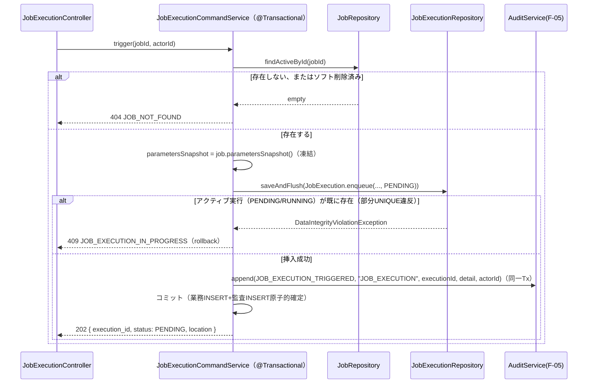

## 14. テスト方針

| レイヤ | 方針 |
| ------ | ---- |
| `domain.model`（`Job`） | Spring非依存の純粋単体テスト。`create`/`applyUpdate`のno-op検出（`boolean`戻り値）、`type`の変更経路が存在しないこと、`softDelete`/`isDeleted`/`isCreatedBy`の整合を検証する。 |
| `domain.model`（`JobExecution`） | `enqueue`後に`parametersSnapshot`が不変であること、`lease`/`heartbeat`/`complete`/`timeOut`の状態遷移ガード（不正遷移時の`IllegalStateException`）、`belongsTo`によるIDOR判定を検証する。 |
| `domain.model`（`JobStatus`/`ExecutionErrorReason`） | `isTerminal`/`isActive`の分岐、`toExternal()`の値を検証する。 |
| `domain.service`（`JobAuthorizationPolicy`） | ADMIN/creator/非creator各パターンでの`ensureCanMutate`の許可・`JobNotOwnerException`送出を検証する。 |
| `application`（`JobCommandService`） | 全依存をモック化し、`create`/`update`/`softDelete`各メソッドで`saveAndFlush`→`auditService.append`が同一呼出し内で発生すること、`update`で`parameters`変更時のみ`handlerRegistry.validateParameters`が呼ばれることを検証する。 |
| `application`（`JobExecutionCommandService`） | `saveAndFlush`が`DataIntegrityViolationException`相当（モック）をスローした場合に`JobExecutionInProgressException`へ変換されること、監査`append`が挿入と同一Tx（モック呼出し順）で発生することを検証する。 |
| `application`（`JobQueryService`/`JobExecutionQueryService`） | `get`/`getExecution`の`JobNotFoundException`/`JobExecutionNotFoundException`送出、`findByIdAndJobId`が`job_id`不一致時にemptyを返すモック挙動でのIDOR回帰防止を検証する。 |
| `application`（`JobAuditDetailFactory`） | 各`forXxx`メソッドの返却Mapにシークレット等の機密キーが一切含まれないことをアサーションで検証する。 |
| `infrastructure.persistence`（`JobJpaRepositoryAdapter`） | `@DataJpaTest`でname重複時の`DataIntegrityViolationException`→`JobNameConflictException`変換、`deleted_at`フィルタの`findActiveById`/`search`を検証する。 |
| `infrastructure.persistence`（`JobExecutionJpaRepositoryAdapter`） | 部分UNIQUE違反時の`JobExecutionInProgressException`変換、`lockNextPending`の`SKIP LOCKED`による多重ピックアップ防止（並行スレッドでの単体テスト）、`reclaimExpiredLeases`/`reclaimTimedOut`各条件の独立動作を検証する。 |
| `infrastructure.support`（`UuidIdGenerator`/`HostWorkerIdProvider`） | `newId`のUUID形式、`workerId()`が起動後不変であることを検証する。 |
| `infrastructure.worker`（`JobExecutionLeaseManager`） | `leaseNext`/`heartbeat`/`markTerminal`各メソッドの短命Tx完結、`JobExecution`の状態遷移メソッド呼出し委譲を検証する。 |
| `infrastructure.worker`（`JobExecutionRunner`） | ハンドラ正常終了時のSUCCEEDED、ハンドラ例外時のFAILED/HANDLER_ERROR、`Future.get`タイムアウト時のTIMED_OUT/EXECUTION_TIMEOUTへの分岐を、`HandlerRegistry`/`JobExecutionLeaseManager`をモック化して検証する。 |
| `infrastructure.worker`（`JobReconciler`） | 条件1（`heartbeat_at`基準）と条件2（`started_at`基準）がそれぞれ独立に動作すること、`@EventListener(ApplicationReadyEvent)`起動時実行を検証する。 |
| `infrastructure.handler`（`HandlerRegistryImpl`） | 未登録typeの`JobInvalidTypeException`、JSON Schema不適合/8KB超過時の`JobParamsInvalidException`、Bean追加によるtype自動登録を検証する。 |
| `infrastructure.handler`（`EchoJobHandler`/`SleepJobHandler`） | 外部依存を持たないこと、`ExecutionOutcome`契約通りの戻り値を検証する。 |
| `infrastructure.handler`（`LogRedactor`） | 8KB切詰の境界値、機密パターンのマスキングを検証する。 |
| `presentation`（`JobController`/`JobExecutionController`） | `MockMvc`（`@WebMvcTest`＋各Serviceモック）で全エンドポイントのHTTPステータス、Operatorが403にならないこと（F-03との違いの回帰防止）、`actorId`/`actorIsAdmin`が常に`Authentication`から解決されること、`CreateJobRequest`/`UpdateJobRequest`に`created_by`/`type`（更新時）フィールドが存在しないことを検証する。 |
| `presentation`（`JobResponseMapper`） | 変換結果に`deleted_at`が含まれないこと、`log_excerpt`がredact済み値のみであることを構造的に検証する。 |
| `presentation`（`JobExceptionHandler`） | バリデーションエラーのコード・ステータスを検証する。 |
| 例外階層 | 共通`AuthException`ハンドラの単体テストで、F-04の7サブ型それぞれについて`ErrorResponse`変換とHTTPステータスを検証する。 |

## 15. 設計上の検討事項（敵対評価）

backend-class-design-plannerによるクラス設計レビュー段階で行われた攻撃的な観点からの指摘（ATTACK）と、それに対する対処（RESOLVED、最終的にCLASS/DECISIONSへどう反映されたか）を残す。実装者はこの章のみを読めば、本クラス設計が何を懸念しどう対処したかを把握できる。

### 15.1 SOLID原則ごとの検査結果

| 原則 | 指摘（シナリオ） | 対処（RESOLVED） |
| ---- | ---------------- | ----------------- |
| S（単一責任） | `JobExecutionRunner`がハンドラ解決＋execute＋heartbeat駆動＋terminal書込＋タイムアウト判定を1メソッドに詰め込むと、変更理由が多重化する。 | `run`内のheartbeat制御を`HeartbeatScheduler`、Tx境界を`JobExecutionLeaseManager`、状態遷移を`JobExecution`エンティティへそれぞれ委譲し、`JobExecutionRunner.run`は実行オーケストレーションのみに縮退させた（8.3節参照）。 |
| O（開放閉鎖） | type別処理をrunner/controller内でswitch分岐させると、新type追加のたびに既存コードの改変が必要になる。 | `HandlerRegistry`＋`JobHandler`拡張点を導入し、新typeの追加をBean追加（`JobHandler`実装の`@Component`登録）のみに閉鎖した（4.3節・9章参照）。 |
| L（リスコフ置換） | `JobHandler`実装が独自の例外型・戻り型を返すと、runner側で型別分岐が必要になる。 | 全実装を`ExecutionOutcome`契約に統一し、ハンドラが送出した例外は`JobExecutionRunner`側で`FAILED`/`HANDLER_ERROR`へ一律吸収する構成とした（3.4節・4.3節・8.3節参照）。 |
| I（インターフェース分離） | `JobExecutionRepository`にlease/reconcile/search/heartbeatをすべて1インターフェースへ載せると、`JobExecutionQueryService`に実行系（lease等）メソッドが不要に流入する。 | 用途別メソッド粒度で定義しつつ、各applicationサービス/workerクラスは必要なメソッドのみを呼び出す構成とした。`HandlerRegistry`も検証/解決の最小契約に絞った（4.2節・4.3節参照）。 |
| D（依存性逆転） | applicationがJSON Schemaライブラリ・`UUID.randomUUID()`・host名・`ThreadPoolTaskExecutor`の具象を直接参照すると層逆流が生じる。 | `HandlerRegistry`/`IdGenerator`/`WorkerIdProvider`/`Clock`という抽象へ反転し、具象実装（`HandlerRegistryImpl`/`UuidIdGenerator`/`HostWorkerIdProvider`）はすべて`infrastructure`へ配置してDIで解決する構成とした（4章・7章・9章参照）。 |

### 15.2 その他の観点

| # | 観点 | シナリオ | 対処（RESOLVED） |
| - | ---- | -------- | ----------------- |
| 1 | ドメインロジック漏出 | 状態遷移（`PENDING→RUNNING`等）やcreator-or-admin判定をrunner/controllerに直接書いてしまうと、ドメインが貧血化（Anemic Domain）し業務ルールが分散する。 | `JobExecution.lease`/`heartbeat`/`complete`/`timeOut`、`Job.applyUpdate`/`softDelete`、`JobAuthorizationPolicy`へルールを封入した。不正遷移はエンティティ自身が`IllegalStateException`でassertする（3章・5章参照）。 |
| 2 | 依存関係（越境結合・逆流） | worker（infrastructure）がapplication（`JobExecutionCommandService`）を呼ぶと依存が逆流・循環する、あるいはControllerがRepositoryを直接呼び出す。 | workerは`domain.port`＋`domain.model`（＋横方向の`infrastructure.handler`）のみを参照し、トリガー（application）と実行（worker）を明確に分離した。Controllerは各applicationサービス経由に限定し、`domain.port`を直接参照しない（2章・6章・8章参照）。 |
| 3 | トランザクション（self-invocation） | `@Scheduled`のpoller内で同一Beanの`@Transactional`メソッドを自己呼出しすると、AOPプロキシが作動せずTxが無効化する。 | `JobPoller`（`@Scheduled`）と`JobExecutionLeaseManager`（`@Transactional`）を別Beanに分離し、cross-bean呼出しでプロキシを経由させる構成とした（8.1節・8.2節参照）。 |
| 4 | トランザクション（行ロック長時間占有） | ハンドラを`@Transactional`内で最大10分実行すると、`FOR UPDATE`行ロック・DBコネクションを長時間占有し枯渇を招く。 | `leaseNext`で`RUNNING`確定・コミットし行ロックを速やかに解放したのち、ハンドラ実行自体はTx外で行う。heartbeat/terminalも各短命Txとした（8.2節・8.3節参照）。 |
| 5 | トランザクション（監査の原子性） | トリガーの業務INSERTと監査INSERTが別Txだと、業務成功時のみ証跡が欠落する。 | `JobExecutionCommandService.trigger`を単一`@Transactional(REQUIRED)`とし、`saveAndFlush`と`auditService.append`を同一Tx内で実行する（6.3節・13章参照）。 |
| 6 | トランザクション（同期例外変換の巻戻し） | name重複/single-flight違反時に、監査INSERTのみコミットされてしまう懸念。 | `DataIntegrityViolationException`を`saveAndFlush`で同期捕捉し業務例外へ変換することで、同一Tx内のrollbackにより監査INSERTも巻き戻す構成とした（6.1節・6.3節・7.1節・7.3節参照）。 |
| 7 | 例外・異常系（reconciler回収漏れ） | reconcilerが条件1（heartbeat_at基準）のみを実装すると、heartbeatが生存し続ける暴走ハンドラ（10分超）を回収できない。 | 条件1と条件2（`started_at`基準）を独立したUPDATEとして必ず実装し、いずれか一方のみでは検出できないケースを回収する（8.5節参照）。 |
| 8 | 例外・異常系（RUNNING滞留） | runnerがハンドラ例外を握りつぶすと、実行が`RUNNING`のまま滞留する。 | ハンドラ例外は`FAILED`/`HANDLER_ERROR`へ、`Future.get`のタイムアウトは`TIMED_OUT`/`EXECUTION_TIMEOUT`へ一律吸収し、いずれも`markTerminal`で終端確定する（8.3節参照）。 |
| 9 | 例外・異常系（worker crash） | worker（プロセス）自体がクラッシュし、terminal未書込のまま孤児化する。 | reconcilerの条件1（`LEASE_EXPIRED`）がbackstopとして機能し、heartbeat断絶を検知して回収する（8.5節参照）。 |
| 10 | セキュリティ（IDOR） | `/jobs/{A}/executions/{Bのexec}`のように、別ジョブに属する実行IDを指定して他ジョブの実行結果を参照する。 | `findByIdAndJobId`で`execution.job_id == path{id}`一致を必須検証し、不一致は`JobExecutionNotFoundException`（404）とした（4.2節・6.4節・10.2節参照）。 |
| 11 | セキュリティ（RCE） | `type`にシェルコマンド・任意コードを渡し実行させる。 | `HandlerRegistry.ensureRegistered`＋DB CHECK制約でレジストリ外の`type`を拒否する（4.3節・9.1節参照）。 |
| 12 | セキュリティ（SSRF） | ユーザー指定URLを叩くハンドラを介して内部サービスへ到達させる。 | MVP同梱ハンドラは`sample.echo`/`sample.sleep`の外部依存なしのみとし、外部通信を伴うハンドラはサーバ側allowlist限定という方針を明記した（9.2節参照。具体的な追加ハンドラの実装はPhase2以降・未決）。 |
| 13 | セキュリティ（機密露出） | `log_excerpt`/`parameters`/監査`detail`にシークレットが混入する。 | `LogRedactor`（redact＋8KB切詰）、`JobAuditDetailFactory`（非機密フィールドのみ組立）、F-05側`DetailSanitizer`との二重防御を構成し、`JobResponseMapper`経由以外での`JobExecution`/`Job`直接返却を禁止した（6.5節・9.3節・10.3節参照）。 |
| 14 | セキュリティ（mass-assignment） | `created_by`/`type`/`id`/`deleted_at`をリクエストボディから指定し、権限昇格や不正な状態変更を狙う。 | `CreateJobRequest`/`UpdateJobRequest`をホワイトリスト化し、これらのフィールドを一切定義しない。`created_by`は`actor.sub`固定とした（6.6節・10.5節参照）。 |
| 15 | セキュリティ（権限昇格） | `actorId`/`actorIsAdmin`をリクエスト由来の値で偽装する。 | `Authentication`（`sub`/`authorities`）のみから解決し、リクエストボディ/クエリ由来の値は一切採用しない（10.1節・10.2節・11章参照）。 |
| 16 | テスト容易性 | `UUID.randomUUID()`/`Instant.now()`/host名/JSON Schemaライブラリ/`ThreadPoolTaskExecutor`の直接呼出しにより、単体テストで決定的値を注入できない。 | `IdGenerator`/`Clock`/`WorkerIdProvider`/`HandlerRegistry`をポート化し、全Beanをコンストラクタ注入とした。workerは`JobExecutionLeaseManager`/`JobExecutionRunner`/`HeartbeatScheduler`に分離し、個別にモック検証可能とした（4章・7章・8章・14章参照）。 |
| 17 | 詳細設計書整合 | EP1-8、エラー8コード、監査4アクション、状態遷移5値、reconciler2条件、heartbeat15秒/poll2秒/reconcile30秒＋起動時、EP7 `created_at DESC`、EP8 IDORがクラス設計から欠落する。 | `JobController`3メソッド＋`JobExecutionController`3メソッド、例外7クラス＋`JOB_VALIDATION_ERROR`、`AuditAction`4値参照、`JobExecution`状態メソッド、`JobReconciler`2 reclaimメソッド、`JobPoller`/`HeartbeatScheduler`の固定間隔、`search`の`created_at DESC`固定、`findByIdAndJobId`をそれぞれ1対1で対応付けた（3章〜13章参照）。 |

## 16. 共有クラス突合・未決事項

以下は本設計において解決に至らず`OPEN`として残された事項である。実装・レビュー時には特に注意すること（関連する各章の本文中にも同様の注記を配置済み）。

**絶対制約（再掲・全章共通）**: `JOB_EXECUTION_TRIGGERED`監査は同一Tx（best-effort化しない）。実行完了は監査対象外。Operatorは`/api/v1/jobs`系にアクセス可。`type`はレジストリ限定（RCE・SSRF禁止）。`created_by`は`actor.sub`固定。EP8は`job_id`一致でIDOR遮断。single-flightは部分UNIQUEで強制。reconcilerは条件1（`heartbeat_at`）＋条件2（`started_at`）の2条件で回収する。

1. **Cloud Run運用制約とpoller/reconcilerの継続実行**: 在プロセスのpoller/reconcilerが背景処理を継続するためには、backend用Cloud Runサービスを`min-instances=1`かつCPU常時割当とする必要があり、`docs/requirements.md` 10.3の「無操作時はスケールインする（コスト優先）」という方針と部分的に緊張関係にある。恒久解はPhase3のCloud Tasks/Pub/Subによるキュー化である。インフラ運用スコープでありクラス設計の対象外である（`docs/design/basic/f-04-job-management.md` 16章-1参照）。
2. **MVP同梱ハンドラの具体セット・各typeのJSON Schema詳細**: `sample.echo`/`sample.sleep`以外の実務用ハンドラの要否、および各typeのJSON Schemaの詳細仕様は実装時に確定する（`docs/design/basic/f-04-job-management.md` 16章-2、9.1節・9.2節参照）。
3. **`parameters`/`log_excerpt`の機密自動redactの具体ルール**: キー名パターンのマッチング方式等、`LogRedactor`／F-05側`DetailSanitizer`のdenylist方式に依存する具体仕様は未確定である（`docs/design/basic/f-04-job-management.md` 16章-3、9.3節参照）。
4. **実行キャンセル（Phase2）・実行完了通知（Phase2）・cron（Phase3）・外部キュー（Phase3）**: いずれもMVP対象外であり、本書のクラス設計には含めない。
5. **`JobExecutionRunner`のbounded `ThreadPoolTaskExecutor`サイズ・pollerの空き容量判定閾値**: 実装時のチューニング事項であり、本書では具体数値を確定しない（8.1節・8.3節参照）。
6. **共有基底例外の命名**: `com.forgehub.common.error.AuthException`はF-01由来の認証固有命名のままF-04の7例外が派生している。ドメイン中立名への改称はF-01/F-02/F-03と共同での合意が必要である（12.1節参照）。
7. **`PageResult<T>`の重複**: F-02/F-03と同型のVOを再利用する前提であり、`com.forgehub.common`への共通化昇格の要否は突合が必要である（2.1節参照）。
8. **`created_by`/`triggered_by`の`users` FK読取経路とF-02 backend-classとの整合**: 本設計はFKカラム格納のみを行い`users`をJOINしない。監査`detail`への`actor_email`投影等が必要な場合はF-05側（`AuditLogRepositoryImpl`の`actor_email` LEFT JOIN、`docs/design/class/f-05-audit-log-backend-class.md` 7.2節）が担当し、F-04側では扱わない（2.2節参照）。

（上記のうち#1〜#5はプラン段階の`OPEN`（詳細設計書16章のOPENを含む）をそのまま引き継いだものであり、本書（クラス設計）のスコープでは解決しない。#6〜#8はF-01/F-02/F-03/F-05側backend-class設計との共同合意・突合により解消される事項である。なお`AuditService`/`AuditAction`のcanonical契約自体は`docs/design/class/f-05-audit-log-backend-class.md`確定済みであり、F-04側の突合対象からは既に除外されている。）
</content>
