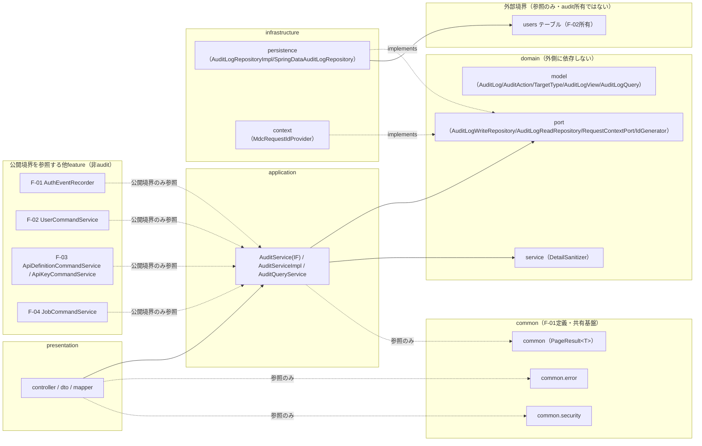
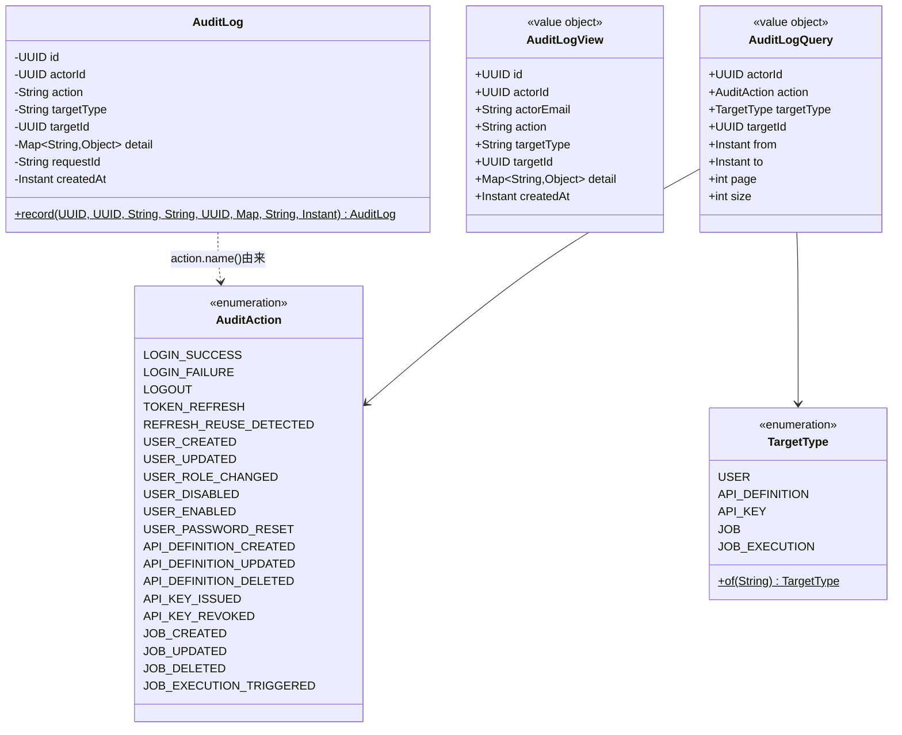
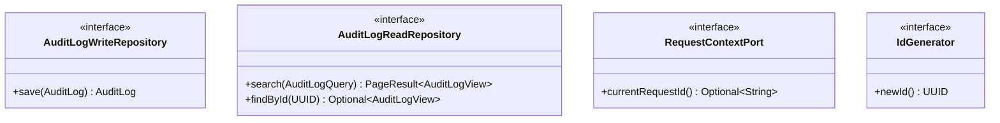
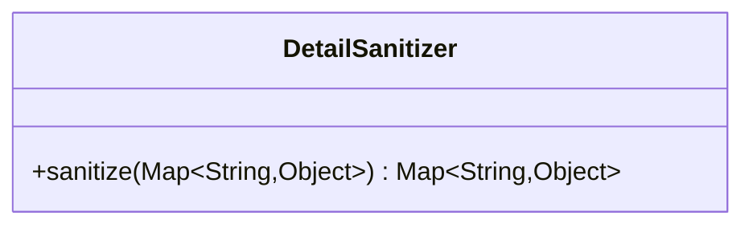
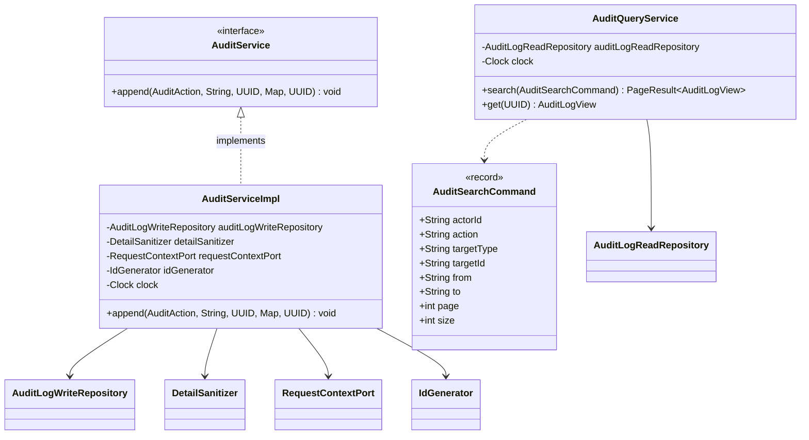
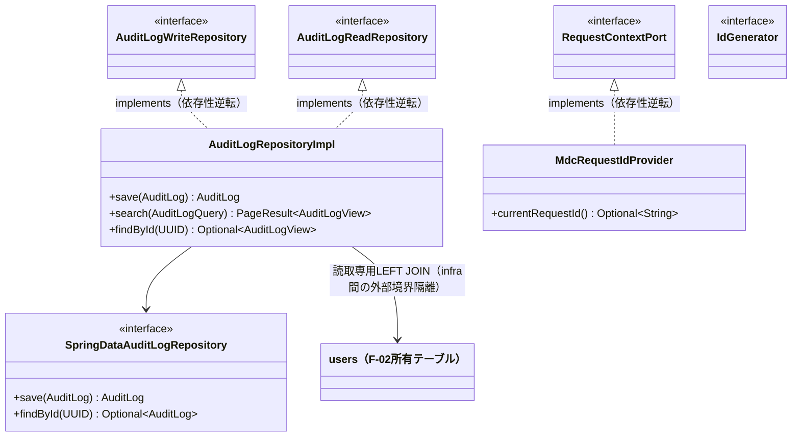
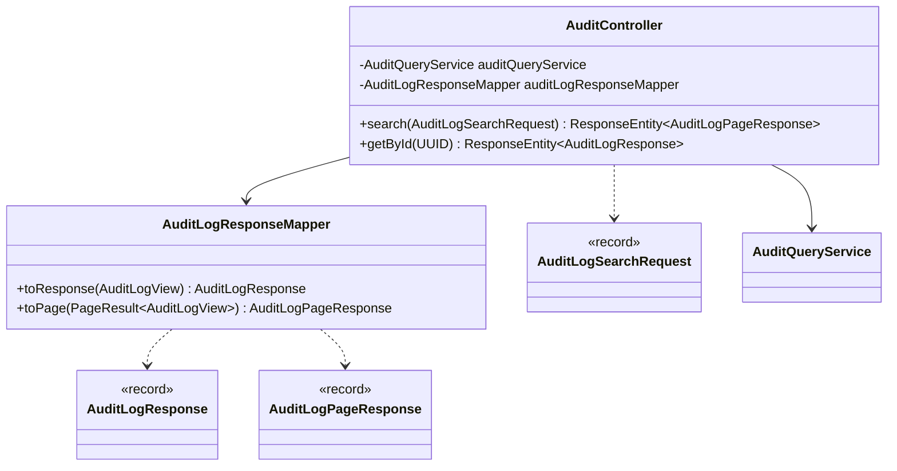
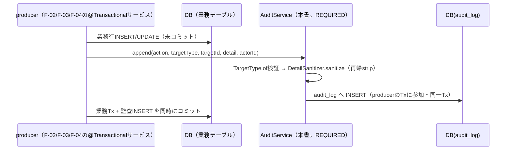
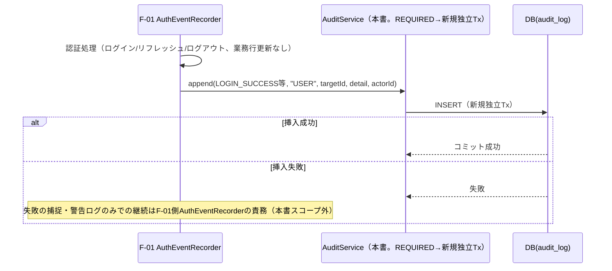

# F-05 監査ログ バックエンドクラス設計書（Phase1 MVP）

## 改訂履歴

| 版   | 日付       | 変更内容                     |
| ---- | ---------- | ---------------------------- |
| v0.1 | 2026-07-06 | 初版（backend-class-design-planner のプランを正式クラス設計書に展開） |

## 1. 位置付け・参照/絶対制約

本書は `docs/design/basic/f-05-audit-log.md`（詳細設計書）を実装可能な粒度のJava/Spring Bootクラス設計へ展開したものである。業務要件・API仕様・action語彙レジストリ・不変性防御・エラーコードの根拠は詳細設計書側にあり、本書はそれをクラス・パッケージ・依存関係・メソッドシグネチャへ変換することに専念する。詳細設計書およびプラン（backend-class-design-planner出力）に対して、本書が新たな業務決定を追加することはない。

**本書は`AuditService`／`AuditAction`／`AuditLog`／`AuditRepository`（`AuditLogWriteRepository`/`AuditLogReadRepository`）の唯一のcanonical（正典）オーナーである。** F-01（JWT認証）・F-02（ユーザー・ロール管理）・F-03（API管理）・F-04（ジョブ管理）の各backend-classは、いずれも「F-05側のシグネチャ・enum定義が最終オーナーであり突合が必要」という趣旨のOPENを残していた。本書はこれらの契約を確定させ、当該OPENを解消する（詳細は「10. 他feature連携（append契約canonical確定）」参照）。

参照: `docs/requirements.md`、`docs/design/basic/f-05-audit-log.md`、`docs/design/class/f-01-jwt-auth-backend-class.md`、`docs/design/class/f-02-user-role-management-backend-class.md`、`docs/design/class/f-03-api-management-backend-class.md`。

**絶対制約（再掲・全章共通）**: 以下はプラン段階での絶対制約であり、本書のいずれの章の実装判断もこれに反してはならない。詳細は各該当章および末尾「15. 未決事項」を参照。

1. `AuditService.append(AuditAction action, String targetType, UUID targetId, Map<String,Object> detail, UUID actorId)`を唯一のcanonicalシグネチャとして確定する。`targetType`は既存F-01〜F-04の文字列リテラル呼出しを破壊しないため`String`型のまま維持する（6章・10章参照）。
2. `append`は`@Transactional(propagation = Propagation.REQUIRED)`とする。F-02/F-03/F-04は業務Txへの参加により業務更新と監査INSERTが原子化される（F-05確定事項D準拠）。F-01のAUTH系5イベントは業務行の更新を伴わず非Tx下から呼び出されるため、`REQUIRED`により新規独立Txが開始される（best-effort化・失敗許容はF-01側`AuthEventRecorder`の責務であり本書のスコープ外。6章・10章参照）。
3. `AuditAction`は20値の単一enum（`com.forgehub.audit.domain.model`）を唯一のcanonicalとして確定する。F-01が保持するローカル5値`AuditAction`との重複は本書側の確定により解消可能だが、各featureのimport先を本enumへ差し替える実コード突合が別途必要である（※本項目は未決。詳細は「10章」「15. 未決事項」参照）。
4. `detail`に含まれるdenylistキー（`password`/`initial_password`/`api_key`/`key_hash`/`token`/`secret`/`authorization`）は`DetailSanitizer`によりネスト構造も含め再帰的にstripし、`append`実行時に必ず通過させる（5章参照）。
5. 不変性4層防御（アプリ層/DBトリガー/DB権限/HTTP層）のうち、本書（クラス設計）が実装を担当するのはアプリ層とHTTP層のみである。DBトリガー・DB権限REVOKEはマイグレーション/インフラ運用側のスコープであり、本書は実装分担を明記するに留める（9章参照）。
6. producer（F-01〜F-04）には`append`のみを公開し、検索能力（`AuditQueryService`）を注入しない（ISP。6章参照）。

## 2. パッケージ構成と依存方向

### 2.1 パッケージ一覧

| パッケージ | 役割 |
| ---------- | ---- |
| `com.forgehub.audit.domain.model` | エンティティ・値オブジェクト・enum（`AuditLog`/`AuditAction`/`TargetType`/`AuditLogView`/`AuditLogQuery`） |
| `com.forgehub.audit.domain.port` | domainが要求する抽象（`AuditLogWriteRepository`/`AuditLogReadRepository`/`RequestContextPort`/`IdGenerator`） |
| `com.forgehub.audit.domain.service` | 業務ルール本体（`DetailSanitizer`） |
| `com.forgehub.audit.application` | ユースケース調整（`AuditService`/`AuditServiceImpl`/`AuditQueryService`、Tx境界） |
| `com.forgehub.audit.infrastructure.persistence` | JPAによる`audit_log`永続の具象実装 |
| `com.forgehub.audit.infrastructure.context` | request_id取得（MDC）の具象実装 |
| `com.forgehub.audit.presentation.controller` | 監査ログ検索エンドポイントの公開 |
| `com.forgehub.audit.presentation.dto` | HTTP入出力DTO |
| `com.forgehub.audit.presentation.mapper` | domain⇔DTO変換 |
| `com.forgehub.common.error`（共有・再利用） | `ErrorResponse`・共有基底例外・共通`@RestControllerAdvice`（F-01定義） |
| `com.forgehub.common.security`（共有・再利用） | `SecurityConfig`・`EntryPoint`・`AccessDeniedHandler`（F-01定義、F-05は再利用のみ） |
| `com.forgehub.common`（共有・再利用） | `PageResult<T>`（F-05はF-02/F-03と同型のVOを再利用する前提。共通化昇格の要否は突合事項。15章参照） |
| 他feature（参照元・非オーナー） | F-01〜F-04の各applicationは本書の`AuditService`（IF）と`AuditAction`（enum）のみを参照する。`audit`パッケージの内部具象（`AuditServiceImpl`/`AuditLogRepositoryImpl`等）を参照することはない |

### 2.2 依存方向の規約

依存方向は `presentation → application → domain（model/port/service） ← infrastructure` を厳守する。

- `domain`（model/port/service）はいかなる外側レイヤ（application/infrastructure/presentation）にも依存しない。domainが必要とする外部機能（永続化、request_id取得、ID生成）はすべて`domain.port`のインターフェースとして宣言し、実装は`infrastructure`側に置く（依存性逆転）。
- `infrastructure`は`domain.port`のインターフェースを実装する（`implements`）ことでのみdomainと接続する。`AuditLogRepositoryImpl`が`users`テーブル（F-02所有）へ`actor_email`取得のためLEFT JOINするのは`infrastructure.persistence`層内での外部境界隔離であり、`domain`/`application`はF-02/usersを一切知らない。
- `application`は`domain.port`と`domain.service`にのみ依存し、`infrastructure`の具象クラス（`SpringDataAuditLogRepository`等）を直接注入・参照しない。
- `presentation`は`application`のユースケースクラス（`AuditQueryService`）にのみ依存し、`domain`や`infrastructure`を直接参照しない。`common.error`/`common.security`は参照のみ許容する。
- 他feature（F-01〜F-04）のapplicationは、公開境界である`com.forgehub.audit.application.AuditService`（IF）と`com.forgehub.audit.domain.model.AuditAction`（enum）のみを参照する。`audit`パッケージ内部の具象（`AuditServiceImpl`/`AuditLogWriteRepository`実装/`TargetType`等）は非公開であり、他featureからの参照は禁止する。
- DIはコンストラクタ注入のみを用いる。フィールド注入・セッター注入は用いない。
- `com.forgehub.common.*`はF-01が定義した全機能共有の基盤パッケージであり、F-05はこれを再利用するのみで独自に重複定義しない。



図中の破線（`-. implements .->`）は依存性逆転（infrastructureがdomainのportを実装する側であり、domainからinfrastructureへ向かう矢印は存在しない）を示す。`IP --> Users`はinfrastructure層内での外部境界隔離であり、domain/applicationはF-02/usersを直接参照しない。`F01〜F04 -.公開境界のみ参照.-> AS`は、他featureが`AuditService`（IF）と`AuditAction`（enum）のみを参照し、`audit`パッケージの内部具象には一切依存しないことを示す。

## 3. ドメインモデル

`com.forgehub.audit.domain.model`配下。

| クラス | 種別 | 責務 |
| ------ | ---- | ---- |
| `AuditLog` | JPAエンティティ | `audit_log`テーブルの追記専用不変レコード |
| `AuditAction` | enum | action語彙canonical単一レジストリ（20値） |
| `TargetType` | enum | `target_type`語彙（5値） |
| `AuditLogView` | 値オブジェクト（不変） | 検索結果1行（`actor_email`付projection） |
| `AuditLogQuery` | 値オブジェクト（不変） | 正規化済み検索条件＋ページ |

### 3.1 AuditAction

```java
public enum AuditAction {
    // AUTH（F-01由来。独立best-effort Txで記録。F-05確定事項A参照）
    LOGIN_SUCCESS,
    LOGIN_FAILURE,
    LOGOUT,
    TOKEN_REFRESH,
    REFRESH_REUSE_DETECTED,

    // USER（F-02由来。業務Txと同一コミット）
    USER_CREATED,
    USER_UPDATED,
    USER_ROLE_CHANGED,
    USER_DISABLED,
    USER_ENABLED,
    USER_PASSWORD_RESET,

    // API（F-03由来。業務Txと同一コミット）
    API_DEFINITION_CREATED,
    API_DEFINITION_UPDATED,
    API_DEFINITION_DELETED,
    API_KEY_ISSUED,
    API_KEY_REVOKED,

    // JOB（F-04由来。業務Txと同一コミット）
    JOB_CREATED,
    JOB_UPDATED,
    JOB_DELETED,
    JOB_EXECUTION_TRIGGERED
}
```

不変条件: 本enumが唯一のcanonical語彙レジストリであり、`docs/design/basic/f-05-audit-log.md` 4章の20アクション定義と1対1で対応する。action種別の追加は本enumへの追記のみで拡張し、呼出側でのswitch分岐の散在を許容しない（確定事項C）。

SOLID: S（action語彙定義のみを責務とする）。O（action追加は本enum追記のみで拡張可能。確定事項Cにより閉鎖性を保つ）。

※本項目は未決（F-01ローカル5値`AuditAction`との重複解消に実コード突合が必要）。詳細は末尾「15. 未決事項」参照。

### 3.2 TargetType

```java
public enum TargetType {
    USER, API_DEFINITION, API_KEY, JOB, JOB_EXECUTION;

    public static TargetType of(String value) {
        // Enum.valueOf(TargetType.class, value)相当。未知値はIllegalArgumentExceptionを送出する。
        // 呼出元（AuditQueryService）でAuditValidationExceptionへ変換する。
    }
}
```

SOLID: S（`target_type`語彙定義と外部文字列からの変換のみを責務とする）。

### 3.3 AuditLog

```java
@Entity
@Table(name = "audit_log")
public class AuditLog {

    @Id
    private UUID id;

    @Column(name = "actor_id")
    private UUID actorId; // nullable（未認証LOGIN_FAILURE等）

    @Column(nullable = false)
    private String action; // AuditAction.name()由来、NOT NULL

    @Column(name = "target_type", nullable = false)
    private String targetType;

    @Column(name = "target_id")
    private UUID targetId; // nullable

    @JdbcTypeCode(SqlTypes.JSON)
    @Column(nullable = false, columnDefinition = "jsonb")
    private Map<String, Object> detail; // NOT NULL、デフォルト{}

    @Column(name = "request_id")
    private String requestId; // nullable

    @Column(name = "created_at", nullable = false)
    private Instant createdAt;

    protected AuditLog() { } // JPA用

    public static AuditLog record(UUID id, UUID actorId, String action, String targetType,
                                   UUID targetId, Map<String, Object> detail,
                                   String requestId, Instant createdAt) {
        // 全フィールドをそのまま格納する。actionはAuditAction.name()由来であることを呼出元
        // （AuditServiceImpl）が保証し、detailはDetailSanitizer通過後の値のみを受け取る前提とする。
    }

    // 全フィールドgetterのみ
}
```

不変条件: setterは非公開・publicコンストラクタは持たず（生成は静的ファクトリ`record`経由のみ）、`protected`の引数なしコンストラクタはJPA専用とする。生成後のフィールド変更手段は一切提供しない。`action`は`AuditAction.name()`由来の値のみを格納し、`detail`は`DetailSanitizer`通過後の値のみを格納する（この2点の保証は呼出元`AuditServiceImpl`の責務であり、`AuditLog`自身は保持のみを行う）。JPAアノテーションは`@Entity`/`@Id`/`@Column`/`@JdbcTypeCode`等の宣言的アノテーションのみを許容する。

SOLID: S（記録保持のみを責務とし、永続化ロジック・sanitize処理・ID/時刻生成の関心事は一切持たない）。

### 3.4 AuditLogView

```java
public final class AuditLogView {

    private final UUID id;
    private final UUID actorId;       // nullable
    private final String actorEmail;  // nullable（actor_idがnull、またはusers側に該当なしの場合）
    private final String action;
    private final String targetType;
    private final UUID targetId;      // nullable
    private final Map<String, Object> detail;
    private final Instant createdAt;

    public AuditLogView(UUID id, UUID actorId, String actorEmail, String action, String targetType,
                         UUID targetId, Map<String, Object> detail, Instant createdAt) {
        // 各フィールドをそのまま保持する（不変）
    }

    // 全フィールドgetterのみ
}
```

SOLID: S（検索結果1行分のprojectionを保持するのみを責務とする）。

### 3.5 AuditLogQuery

```java
public final class AuditLogQuery {

    private final UUID actorId;          // nullable
    private final AuditAction action;    // nullable
    private final TargetType targetType; // nullable
    private final UUID targetId;         // nullable
    private final Instant from;          // NOT NULL
    private final Instant to;            // NOT NULL
    private final int page;
    private final int size;

    public AuditLogQuery(UUID actorId, AuditAction action, TargetType targetType, UUID targetId,
                          Instant from, Instant to, int page, int size) {
        // from<=to、0<=size<=100、from/to非null をここで防御的に検証する。
        // 呼出元（AuditQueryService）は正規化済みの値を渡す前提だが、VO自身も不変条件を保持する。
    }

    // 全フィールドgetterのみ
}
```

不変条件: `from<=to`、`0<=size<=100`、`from`/`to`は非null（生成時保証）。



## 4. ポート（domainインターフェース）

`com.forgehub.audit.domain.port`配下。すべてinterfaceであり、domain/applicationはこれらの抽象にのみ依存する。実装は「7. インフラ実装」参照。

| インターフェース | 責務 | 主メソッド |
| ---------------- | ---- | ---------- |
| `AuditLogWriteRepository` | 追記専用抽象（canonical `AuditRepository`書込側） | `save` |
| `AuditLogReadRepository` | 検索抽象（canonical `AuditRepository`読取側） | `search`/`findById` |
| `RequestContextPort` | request_id取得の抽象（MDC直参照排除） | `currentRequestId` |
| `IdGenerator` | `AuditLog`のUUID生成抽象（テスト差替可） | `newId` |

### 4.1 AuditLogWriteRepository

```java
public interface AuditLogWriteRepository {
    AuditLog save(AuditLog log); // INSERT専用。update/delete/deleteByIdは非定義（不変性8a、9章参照）
}
```

SOLID: I（`save`（INSERT）のみを公開し、`update`/`delete`/`deleteById`を一切定義しない。不変性8a参照）。D（`AuditServiceImpl`が依存する抽象であり、具象（`AuditLogRepositoryImpl`）を直接注入しない）。

### 4.2 AuditLogReadRepository

```java
public interface AuditLogReadRepository {
    PageResult<AuditLogView> search(AuditLogQuery query);
    Optional<AuditLogView> findById(UUID id);
}
```

SOLID: I（検索専用クライアント（`AuditQueryService`）のみに公開し、producer（`AuditServiceImpl`）には注入しない）。D（`AuditQueryService`が依存する抽象）。

### 4.3 RequestContextPort

```java
public interface RequestContextPort {
    Optional<String> currentRequestId();
}
```

SOLID: D（`org.slf4j.MDC`の静的呼出しを`AuditServiceImpl`から排除し、テスト時に決定的な値へ差替可能にする）。

### 4.4 IdGenerator

```java
public interface IdGenerator {
    UUID newId();
}
```

SOLID: D（`UUID.randomUUID()`の静的呼出しを排除する。`java.time.Clock`はSpring Bean注入で別途port化しない）。



## 5. ドメインサービス（業務ルール本体）

`com.forgehub.audit.domain.service`配下。

### 5.1 DetailSanitizer

```java
@Component
public class DetailSanitizer {

    private static final Set<String> DENYLIST = Set.of(
            "password", "initial_password", "api_key", "key_hash", "token", "secret", "authorization");

    public Map<String, Object> sanitize(Map<String, Object> detail) {
        // detail==null は Map.of() 扱いとする。
        // Map/Listを再帰的に走査し、キー名が DENYLIST に case-insensitive 一致する要素を除去する。
        // before/after/parameters等のネストしたjsonb構造の内部まで対象とし、
        // トップレベルのみのstripに留めない。
    }
}
```

- 依存: なし（純ロジック、Spring非依存で単体テスト可能）。
- 責務: `detail`からdenylistキーを再帰strip（全producer共通の最終防波堤）。producer（F-01〜F-04）側の実装ミスにより機密値がネスト構造の内部に混入した場合でも、この中央防御によって漏洩を遮断する（`docs/design/basic/f-05-audit-log.md` 12章と対応）。
- SOLID: S（機密除去の唯一実装。他の検証・変換責務を持たない）。



## 6. アプリケーション層とTx境界

`com.forgehub.audit.application`配下。

| クラス | 種別 | 責務 |
| ------ | ---- | ---- |
| `AuditService` | interface（公開境界。他feature参照） | producer向け追記契約canonical |
| `AuditServiceImpl` | `@Service` | `append`実装（sanitize→`AuditLog`組立→save） |
| `AuditQueryService` | `@Service` | 検索/単件取得ユースケース＋入力検証・正規化 |
| `AuditSearchCommand` | record | controller→application検索入力（生String保持、型変換前） |

### 6.1 AuditService

```java
public interface AuditService {
    void append(AuditAction action, String targetType, UUID targetId,
                Map<String, Object> detail, UUID actorId);
}
```

**本メソッドシグネチャは10章で確定するcanonical契約そのものであり、F-01〜F-04はこのインターフェース以外の`audit`パッケージ具象を参照してはならない。**

SOLID: I（producerは`append`のみを必要とし、`search`/`get`は本インターフェースに一切公開しない）。D（F-01〜F-04は本抽象にのみ依存する）。

### 6.2 AuditServiceImpl

```java
@Service
public class AuditServiceImpl implements AuditService {

    private final AuditLogWriteRepository auditLogWriteRepository;
    private final DetailSanitizer detailSanitizer;
    private final RequestContextPort requestContextPort;
    private final IdGenerator idGenerator;
    private final Clock clock;

    public AuditServiceImpl(AuditLogWriteRepository auditLogWriteRepository,
                             DetailSanitizer detailSanitizer,
                             RequestContextPort requestContextPort,
                             IdGenerator idGenerator,
                             Clock clock) {
        // 全依存はコンストラクタ注入
    }

    @Override
    @Transactional(propagation = Propagation.REQUIRED)
    public void append(AuditAction action, String targetType, UUID targetId,
                        Map<String, Object> detail, UUID actorId) {
        // TargetType.of(targetType) で検証（不正値はIllegalArgumentException）
        // id = idGenerator.newId()
        // createdAt = clock.instant()
        // requestId = requestContextPort.currentRequestId().orElse(null)
        // sanitized = detailSanitizer.sanitize(detail)
        // log = AuditLog.record(id, actorId, action.name(), targetType, targetId, sanitized, requestId, createdAt)
        // auditLogWriteRepository.save(log)
    }
}
```

- Tx: `append`は`@Transactional(propagation = Propagation.REQUIRED)`。producer（F-02/F-03/F-04）の既存Txに参加し、業務更新と原子化する。非Tx下（F-01 AUTH系）からの呼出しでは新規独立Txが開始される（best-effortの実現、失敗時に呼出しを再スローしない判断はF-01側`AuthEventRecorder`の責務。10章参照）。※本項目（Tx境界の実装位置）は本書の絶対制約であり、末尾「15. 未決事項」にも重複して明記する。
- 実装: `action.name()`を格納。`TargetType.of(targetType)`で検証（不正値は`IllegalArgumentException`）。`id`は`idGenerator.newId()`、`createdAt`は`clock.instant()`、`requestId`は`requestContextPort.currentRequestId().orElse(null)`、`detail`は`sanitizer.sanitize(detail)`通過後の値を使用する。
- SOLID: S（追記調整のみを責務とし、語彙検証ルールは`AuditAction`/`TargetType`へ、機密除去ルールは`DetailSanitizer`へ委譲する）。D（`AuditLogWriteRepository`/`DetailSanitizer`/`RequestContextPort`/`IdGenerator`/`Clock`の抽象にのみ依存する）。

### 6.3 AuditQueryService

```java
@Service
public class AuditQueryService {

    private final AuditLogReadRepository auditLogReadRepository;
    private final Clock clock;

    public AuditQueryService(AuditLogReadRepository auditLogReadRepository, Clock clock) {
        this.auditLogReadRepository = auditLogReadRepository;
        this.clock = clock;
    }

    @Transactional(readOnly = true)
    public PageResult<AuditLogView> search(AuditSearchCommand cmd) throws AuditValidationException {
        // actorId/targetId の uuid parse 不正 → AuditValidationException
        // action/target_type の enum 外 → AuditValidationException
        // from 省略 → clock.instant().minus(Duration.ofDays(30))
        // to 省略 → clock.instant()
        // from > to → AuditValidationException
        // size<0 または size>100 → AuditValidationException
        // 正規化した AuditLogQuery を生成し auditLogReadRepository.search(query) を呼び出す
    }

    @Transactional(readOnly = true)
    public AuditLogView get(UUID id) throws AuditNotFoundException {
        return auditLogReadRepository.findById(id).orElseThrow(AuditNotFoundException::new);
    }
}
```

- Tx: `search`/`get`いずれも`@Transactional(readOnly = true)`。
- 検証: `actorId`/`targetId`のuuid parse不正、`action`/`targetType`のenum外、`from>to`、`size`範囲外はすべて`AuditValidationException`（400）へ集約する（呼出元Controllerでの`MethodArgumentTypeMismatchException`由来500を回避する。11章参照）。`from`省略時は`now-30日`、`to`省略時は`now`をデフォルト適用する。
- SOLID: S（検索調整のみを責務とし、`AuditService`（追記）とはクラスを分離する。ISP: producerに検索能力を注入しない）。

### 6.4 AuditSearchCommand

```java
public record AuditSearchCommand(
        String actorId, String action, String targetType, String targetId,
        String from, String to, int page, int size) {
}
```

依存: なし。`AuditLogSearchRequest`（presentation.dto、8章）から生String（型変換前）のまま受け渡す。



## 7. インフラ実装

`com.forgehub.audit.infrastructure`配下。いずれも「4. ポート」で定義したインターフェースを実装し、domain/applicationからは抽象経由でのみ利用される（依存性逆転）。

| クラス | パッケージ | 実装インターフェース | 責務 |
| ------ | ---------- | -------------------- | ---- |
| `SpringDataAuditLogRepository` | `.infrastructure.persistence` | （Spring Data） | `Repository<AuditLog,UUID>`継承によるINSERT用途限定委譲 |
| `AuditLogRepositoryImpl` | `.infrastructure.persistence` | `AuditLogWriteRepository`/`AuditLogReadRepository` | 追記・検索・単件取得の実装 |
| `MdcRequestIdProvider` | `.infrastructure.context` | `RequestContextPort` | MDCからのrequest_id取得実装 |
| （`IdGenerator`実装） | `.infrastructure.persistence` | `IdGenerator` | `UUID.randomUUID()`によるID生成。クラス名は実装時決定（業務決定なし） |

### 7.1 SpringDataAuditLogRepository

```java
public interface SpringDataAuditLogRepository extends Repository<AuditLog, UUID> {
    AuditLog save(AuditLog log);
    Optional<AuditLog> findById(UUID id);
}
```

`CrudRepository`/`JpaRepository`ではなく`org.springframework.data.repository.Repository<AuditLog,UUID>`を直接継承することで、`delete`/`deleteById`等の破壊的メソッドを型レベルで排除する（不変性8a、9章参照）。

SOLID: I（`CrudRepository`/`JpaRepository`非継承によりdelete系を型レベルで排除し、INSERT/SELECT用途のみに絞る）。

### 7.2 AuditLogRepositoryImpl

```java
@Repository
public class AuditLogRepositoryImpl implements AuditLogWriteRepository, AuditLogReadRepository {

    private final SpringDataAuditLogRepository springDataAuditLogRepository;
    private final EntityManager entityManager;

    public AuditLogRepositoryImpl(SpringDataAuditLogRepository springDataAuditLogRepository,
                                   EntityManager entityManager) {
        // コンストラクタ注入
    }

    @Override
    public AuditLog save(AuditLog log) {
        return springDataAuditLogRepository.save(log);
    }

    @Override
    public PageResult<AuditLogView> search(AuditLogQuery query) {
        // JPA Criteria APIで動的述語を組立（actorId/action/targetType/targetId/created_at範囲）。
        // AuditLog(alias a) LEFT JOIN User（F-02所有、alias u）ON u.id = a.actorId で actor_email を投影。
        // AuditLogView(a.id, a.actorId, u.email, a.action, a.targetType, a.targetId, a.detail, a.createdAt)
        //   のコンストラクタ式でSELECTする。
        // 別途 count query で total を取得し、new PageResult<>(items, page, size, total) を返却する。
        // ORDER BY created_at DESC 固定。全フィルタは Criteria の ParameterExpression でバインドする（SQLi防止）。
    }

    @Override
    public Optional<AuditLogView> findById(UUID id) {
        // 上記 search と同一の projection 組立を id 一致条件で単発実行する。
    }

    // update/delete/deleteById は実装しない（不変性8a、9章参照）
}
```

- 実装: `save`は`SpringDataAuditLogRepository`へ委譲。`search`はJPA Criteria動的述語（`actorId`/`action`/`targetType`/`targetId`/`created_at`範囲）＋`User`（F-02所有）へのLEFT JOIN（`u.id = a.actorId`）で`actorEmail`を投影し、`AuditLogView`のコンストラクタ式で組み立てる。別途count queryで`total`を取得し`PageResult<>(items, page, size, total)`を返却する。`ORDER BY created_at DESC`固定。全フィルタはCriteriaのパラメータバインドとする（SQLインジェクション防止）。`update`/`delete`/`deleteById`は未実装（不変性8a）。
- `User`（F-02所有）エンティティへのJOIN参照はinfrastructure層内に隔離され、`domain`/`application`は`actorEmail`（`String`）のみを扱う。
- SOLID: L（`AuditLogWriteRepository`/`AuditLogReadRepository`の契約を満たす形で置換可能な実装である）。D（domainのportを実装し、application側はこの具象を一切知らない）。
- ※`actor_email`のLEFT JOIN先（F-02 `User`エンティティ）への越境参照可否は、F-02がこれをinfrastructure読取専用参照用に公開する前提であり、実コード突合が必要である（不可の場合`users`テーブルへのnative JOINへ切替）。詳細は末尾「15. 未決事項」参照。

### 7.3 MdcRequestIdProvider

```java
@Component
public class MdcRequestIdProvider implements RequestContextPort {

    @Override
    public Optional<String> currentRequestId() {
        return Optional.ofNullable(MDC.get("request_id"));
    }
}
```

- 依存: なし（`org.slf4j.MDC`）。
- 備考: request_id採番/伝播方式自体は未確定である（`docs/design/basic/f-05-audit-log.md` 16章-3）。本実装はMDCキー`"request_id"`を暫定前提とする。※本項目は未決。詳細は末尾「15. 未決事項」参照。
- SOLID: D（`MDC`の静的呼出しを`AuditServiceImpl`から排除し、テスト時に差替可能にする）。

### 7.4 IdGenerator実装

`UUID.randomUUID()`による生成を`.infrastructure.persistence`配下へ`@Component`として配置する。クラス名は実装時に決定する（プラン段階では業務決定を伴わないため未命名）。



## 8. プレゼンテーション/DTO/Mapper

`com.forgehub.audit.presentation`配下。

| クラス | パッケージ | 責務 |
| ------ | ---------- | ---- |
| `AuditController` | `.presentation.controller` | `/api/v1/audit-logs`公開・検索/単件EP・HTTP境界変換のみ |
| `AuditLogSearchRequest` | `.presentation.dto` | EP1クエリ入力バインド（record） |
| `AuditLogResponse` | `.presentation.dto` | 単件/検索item応答（record、snake_case） |
| `AuditLogPageResponse` | `.presentation.dto` | EP1ページ応答（record） |
| `AuditLogResponseMapper` | `.presentation.mapper` | `AuditLogView`⇔`AuditLogResponse`/`PageResult`変換 |

### 8.1 AuditController

```java
@RestController
@RequestMapping("/api/v1/audit-logs")
@PreAuthorize("hasAnyRole('ADMIN','OPERATOR')")
public class AuditController {

    private final AuditQueryService auditQueryService;
    private final AuditLogResponseMapper auditLogResponseMapper;

    public AuditController(AuditQueryService auditQueryService,
                            AuditLogResponseMapper auditLogResponseMapper) {
        // コンストラクタ注入
    }

    @GetMapping
    public ResponseEntity<AuditLogPageResponse> search(@Valid AuditLogSearchRequest req) {
        // AuditSearchCommand組立 → auditQueryService.search(...) → auditLogResponseMapper.toPage(...)
    }

    @GetMapping("/{id}")
    public ResponseEntity<AuditLogResponse> getById(@PathVariable UUID id) {
        // auditQueryService.get(id) → auditLogResponseMapper.toResponse(...)
    }
}
```

- 依存: `AuditQueryService`、`AuditLogResponseMapper`。コンストラクタ注入。
- 認可: クラスレベル`@PreAuthorize("hasAnyRole('ADMIN','OPERATOR')")`。DEVELOPERのアクセス試行は403 `AUTH_FORBIDDEN`（`RestAccessDeniedHandler`、F-01再利用）。未認証は401 `AUTH_UNAUTHENTICATED`（`RestAuthenticationEntryPoint`、F-01再利用）。所有スコープは設けない（横断参照。12章参照）。
- Tx: なし（HTTP境界変換のみを担う）。
- 制約: `AuditLog`エンティティを直接シリアライズすることは一切行わない。応答は`AuditLogView`由来のDTO（`AuditLogResponse`/`AuditLogPageResponse`）のみとする。書込系エンドポイント（`PUT`/`PATCH`/`DELETE`）は定義しない（不変性8d、9章参照。※本制約は絶対制約であり、末尾「15. 未決事項」にも重複して明記する）。
- SOLID: S（HTTP境界変換のみを責務とする）。

### 8.2 AuditLogSearchRequest

```java
public record AuditLogSearchRequest(
        String actor_id,
        String action,
        String target_type,
        String target_id,
        String from,
        String to,
        int page,
        int size
) {
    // page既定0、size既定20
}
```

備考: uuid/enum/from-toの意味検証はここでは行わず、`AuditQueryService`で実施し`AuditValidationException`へ集約する（型mismatch回避のため生Stringのまま受理する。6.3節参照）。

### 8.3 AuditLogResponse / AuditLogPageResponse

```java
public record AuditLogResponse(
        UUID id, UUID actor_id, String actor_email, String action, String target_type,
        UUID target_id, Map<String, Object> detail, Instant created_at
) {
    // request_idは非露出（内部相関用）
}

public record AuditLogPageResponse(List<AuditLogResponse> items, int page, int size, long total) { }
```

### 8.4 AuditLogResponseMapper

```java
@Component
public class AuditLogResponseMapper {

    public AuditLogResponse toResponse(AuditLogView v) {
        // id/actor_id/actor_email/action/target_type/target_id/detail/created_at をそのままマッピングする。
        // request_idはAuditLogViewにも保持しない設計であり、応答へも一切含めない。
    }

    public AuditLogPageResponse toPage(PageResult<AuditLogView> p) {
        // items(toResponseの配列)/page/size/total
    }
}
```

SOLID: S（`AuditLogView`からレスポンスDTOへの変換のみを責務とする）。



## 9. 不変性4層防御と本書実装分担

`docs/design/basic/f-05-audit-log.md` 8章が定める4層防御のうち、本書（クラス設計）が実装を分担する範囲を明記する。※本項目は絶対制約であり、実装漏れが生じやすいため末尾「15. 未決事項」にも重複して要点を配置する。

| 層 | 制御内容 | 本書での実装分担 |
| -- | -------- | ---------------- |
| (a) アプリケーション層 | `AuditLog`エンティティのsetter非公開、`update`/`delete`/`deleteById`を持たないRepository | 実装対象。`AuditLog`（3.3節）のsetter非公開、`AuditLogWriteRepository`/`AuditLogReadRepository`（4章）に`save`/`search`/`findById`のみを定義、`SpringDataAuditLogRepository`（7.1節）を`Repository<>`継承に限定して型レベルでdelete系を排除する。 |
| (b) DB層（トリガー） | `audit_log`への`BEFORE UPDATE OR DELETE`トリガーで`RAISE EXCEPTION` | 本書スコープ外（マイグレーション/DBスキーマ管理側の実装事項）。詳細設計書`docs/design/basic/f-05-audit-log.md` 8章(b)を参照。 |
| (c) DB権限層 | アプリケーション接続ロールへ`UPDATE`/`DELETE`権限を`REVOKE`し`INSERT`/`SELECT`のみ許可 | 本書スコープ外（インフラ運用/権限管理側の実装事項）。詳細設計書8章(c)を参照。 |
| (d) HTTP層 | 書込系エンドポイント（`PUT`/`PATCH`/`DELETE`）を定義しない | 実装対象。`AuditController`（8.1節）は`GET`のみを公開し、書込メソッドを一切定義しない。 |

アプリケーション実装（本書スコープ）はINSERT/SELECTのみを行い、UPDATE/DELETE経路を一切持たない。

## 10. 他feature連携（append契約canonical確定）

**本章は本書における最重要章である。** F-01〜F-04の各backend-classが残していた「F-05側のシグネチャ・enum定義との突合が必要」というOPENは、以下の確定によって解消可能である（ただし各featureの実コード側でのimport切替は別途必要。10.4節参照）。

### 10.1 確定事項（canonical契約）

```java
public interface AuditService {
    void append(AuditAction action, String targetType, UUID targetId,
                Map<String, Object> detail, UUID actorId);
}
```

- **シグネチャ確定**: `append(AuditAction action, String targetType, UUID targetId, Map<String,Object> detail, UUID actorId)`を唯一のcanonicalシグネチャとする。既存F-01/F-02/F-03の呼出し（`append(action, "USER"|"API_DEFINITION"|"API_KEY", id, detailMap, actorId)`）と一致しており、`targetType`は`String`のまま維持する（既存3書の文字列リテラル呼出しを破壊しない）。
- **Tx確定**: `append`は`@Transactional(propagation = Propagation.REQUIRED)`とする。F-02/F-03/F-04は業務Tx参加により原子化される（確定事項D）。F-01のAUTH系イベントは非Tx呼出しのため新規独立Txが開始され、best-effort（失敗許容）はF-01側`AuthEventRecorder`の責務とする。
- **enum確定**: `AuditAction`は20値の単一enum（`com.forgehub.audit.domain.model`）を唯一のcanonicalとする。F-01のローカル5値`AuditAction`、F-02/F-03からの参照は本enumへ集約する。

### 10.2 producer別 呼出契約対応表

| feature | 呼出元クラス（producer） | action group | 主なtarget_type | Tx方式 | 本書確定によるOPEN解消状況 |
| ------- | ------------------------ | ------------- | ---------------- | ------ | -------------------------- |
| F-01 | `AuthEventRecorder` | AUTH（5値） | `USER`（`target_id`はnull許容） | 独立best-effort Tx（`append`側は`REQUIRED`により新規独立Tx開始。失敗許容はF-01側責務） | シグネチャ・Tx方式は解消。ローカル5値enumの`com.forgehub.audit.domain.model.AuditAction`への置換・削除は実コード突合が必要（10.4節）。 |
| F-02 | `UserCommandService` | USER（6値） | `USER` | 業務Tx参加（`REQUIRED`、原子化） | シグネチャ・enum参照は解消。import先を`com.forgehub.audit.application.AuditService`へ確定する突合が必要。 |
| F-03 | `ApiDefinitionCommandService`/`ApiKeyCommandService` | API（5値） | `API_DEFINITION`/`API_KEY` | 業務Tx参加（`REQUIRED`、原子化） | 同上。 |
| F-04 | `JobCommandService`（想定） | JOB（4値） | `JOB`/`JOB_EXECUTION` | 業務Tx参加（`REQUIRED`、原子化） | 同上。 |

### 10.3 シーケンス

#### 10.3.1 業務Tx参加（F-02/F-03/F-04共通パターン）



#### 10.3.2 独立best-effort Tx（F-01 AUTHパターン）



### 10.4 実コード突合が必要な残作業（未解消部分）

上記10.1〜10.3の確定によりシグネチャ・Tx方式・enum語彙の**設計上の**OPENは解消されるが、以下は実コード側の突合作業が別途必要であり、本書のみでは完結しない（※本項目は未決。詳細は末尾「15. 未決事項」参照）。

- F-01の`com.forgehub.auth.domain.model.AuditAction`（ローカル5値）を削除し、`com.forgehub.audit.domain.model.AuditAction`のインポートへ置換する。
- F-02/F-03の`AuditService`参照先を`com.forgehub.audit.application.AuditService`へ確定する（現行の各backend-classは具体パッケージ名を明記していない）。
- F-04の`JobCommandService`（想定クラス）についても同様にimport先を確定する。

## 11. 例外階層とエラーコード対応

### 11.1 例外階層

```java
// 共有抽象基底（現状のクラス名はcom.forgehub.common.error.AuthException。
// F-01由来のauth特有命名であり、ドメイン中立名への改称は未決事項。15章参照）
public abstract class AuthException extends RuntimeException {
    public abstract String getCode();
    public abstract HttpStatus getStatus();
}

public class AuditValidationException extends AuthException {
    /* code=AUDIT_VALIDATION_ERROR, status=400 */
}

public class AuditNotFoundException extends AuthException {
    /* code=AUDIT_NOT_FOUND, status=404 */
}
```

SOLID: L（`AuditValidationException`/`AuditNotFoundException`はいずれも共有基底`AuthException`と同一契約（`getCode()`/`getStatus()`）のみを実装し、独自のHTTPステータス解決ロジックを持たない。これにより共通`@RestControllerAdvice`は`AuthException`型として一律にキャッチ・変換できる）。

### 11.2 例外ハンドラの分担

共通（グローバル）`@RestControllerAdvice`（F-01定義、`docs/design/class/f-01-jwt-auth-backend-class.md` 9.2節と同一実装）が`AuthException`型を一律に`ErrorResponse`へ変換する。本書は独自の`@RestControllerAdvice`を追加定義しない。

### 11.3 エラーコード対応表

| コード | HTTPステータス | 例外クラス／発生元 | 発生条件 |
| ------ | --------------- | ------------------- | -------- |
| `AUDIT_VALIDATION_ERROR` | 400 | `AuditValidationException`（`AuditQueryService`） | `action`/`target_type`がenum外、`actor_id`/`target_id`がuuid形式不正、`from>to`、`size`が範囲外 |
| `AUDIT_NOT_FOUND` | 404 | `AuditNotFoundException`（`AuditQueryService.get`） | EP2で指定した`id`が存在しない |
| `AUTH_FORBIDDEN` | 403 | （`RestAccessDeniedHandler`、F-01再利用） | DEVELOPERまたはロール不足の実行者による`/audit-logs`アクセス試行 |
| `AUTH_UNAUTHENTICATED` | 401 | （`RestAuthenticationEntryPoint`、F-01再利用） | 未認証 |

書込系エラーは存在しない（書込エンドポイント自体が存在しないため）。`AuditService.append`の内部失敗（F-02/F-03/F-04経由）は、業務Tx側のロールバックとして各producer側のエラーに帰着するものであり、本書自体が独自の書込系エラーコードを持つものではない。

## 12. 認可（RBAC実装位置）

- 認可基盤（`@EnableMethodSecurity`、`SecurityFilterChain`のSTATELESS設定、`RestAuthenticationEntryPoint`/`RestAccessDeniedHandler`、デフォルトdeny）は`com.forgehub.common.security`配下にF-01が定義したものをそのまま再利用する。本書は独自に`SecurityConfig`を重複定義しない。
- リソース単位の認可は`AuditController`クラスレベルの`@PreAuthorize("hasAnyRole('ADMIN','OPERATOR')")`で実現する。DEVELOPERのアクセス試行は403 `AUTH_FORBIDDEN`で拒否される。
- F-03（owner限定）・F-04（creator限定）とは異なり、監査ログには所有スコープを設けない。ADMIN・OPERATORは全レコードを横断的に参照できる（意図的な設計。`docs/design/basic/f-05-audit-log.md` 6章と対応）。
- 読取専用APIであるため、`AuditController`・`AuditQueryService`はactor（操作実行者）の特定を行わない。

## 13. 設計上の検討事項（敵対評価）

backend-class-design-plannerによるクラス設計レビュー段階で行われた攻撃的な観点からの指摘（ATTACK）と、それに対する対処（RESOLVED、最終的にCLASS/DECISIONSへどう反映されたか）を残す。実装者はこの章のみを読めば、本クラス設計が何を懸念しどう対処したかを把握できる。

### 13.1 SOLID原則ごとの検査結果

| 原則 | 指摘（シナリオ） | 対処（RESOLVED） |
| ---- | ---------------- | ----------------- |
| S（単一責任） | `AuditServiceImpl`に検索（Admin向け）まで載せると、producer向け追記とAdmin向け検索という2つの変更理由が同居してしまう。 | `append`専用の`AuditService`/`AuditServiceImpl`と、検索専用の`AuditQueryService`にクラスを分離した。`DetailSanitizer`の機密除去ロジックや`AuditQueryService`の入力検証ロジックも`AuditServiceImpl`へ混入させない構成とした（6章参照）。 |
| O（開放閉鎖） | action種別追加のたびにenum＋switch分岐が散在する懸念。 | `AuditAction`への追記のみで拡張する構成とし（確定事項C）、呼出側でのswitch分岐は持たない。ただしMVPでは`targetType`別Strategyパターン等の過剰な抽象化は導入しない（3.1節参照）。 |
| L（リスコフ置換） | `AuditLogWriteRepository`実装が`save`で既存id重複時にUPDATE（upsert）化すると、追記のみ契約を破り置換不能になる。 | `save`はINSERT専用契約に固定し、既存idを上書きする経路を作らない（不変性#3、4.1節・7.2節参照）。例外は`AuthException`契約（`getCode`/`getStatus`）のみを実装する（11.1節参照）。 |
| I（インターフェース分離） | 単一の`AuditRepository`に`save`＋`delete`＋`search`を全部載せると、producerに`delete`/`search`能力が漏れてしまう。 | `AuditLogWriteRepository`（`save`）と`AuditLogReadRepository`（`search`/`findById`）へ分離し、`delete`系はどちらのportにも定義しない。`SpringDataAuditLogRepository`も`Repository<>`継承に留めた（4章・7.1節参照）。 |
| D（依存性逆転） | `AuditServiceImpl`/`AuditQueryService`が`SpringDataAuditLogRepository`・MDC・`UUID`・`EntityManager`の具象へ直接依存すると層逆流が生じる。 | `AuditLogWriteRepository`/`AuditLogReadRepository`/`RequestContextPort`/`IdGenerator`/`Clock`という抽象にのみ依存させ、具象実装はすべて`infrastructure`へ配置した（4章・6章・7章参照）。 |

### 13.2 その他の観点

| # | 観点 | シナリオ | 対処（RESOLVED） |
| - | ---- | -------- | ----------------- |
| 1 | ドメインロジック漏出 | denylist stripや`from>to`検証をController/RepositoryImplに書いてしまうと、機密除去ルールが分散・貧血化（Anemic Domain）する。 | `DetailSanitizer`（domain.service）へ機密除去ルールを、`AuditQueryService`へ検索入力検証を集約し、`AuditLog`は自身の不変条件（setter非公開）のみを自己保持する構成とした（5章・6.3節・3.3節参照）。 |
| 2 | 依存関係（越境結合・逆流） | `AuditLogRepositoryImpl`が`User`（F-02）エンティティをJOIN参照する越境結合、Controllerが`AuditLogReadRepository`を直接呼び出す逆流。 | `User`参照は`infrastructure.persistence`層に隔離し、`domain`/`application`は`actorEmail`（`String`）のみを扱う。Controllerは`AuditQueryService`経由に限定した（2.2節・7.2節・8.1節参照）。 |
| 3 | トランザクション整合性 | `append`の自己呼出し（self-invocation）により`@Transactional`が不作動になる懸念、F-01 AUTHでbest-effortが成立せず認証処理を巻き込む懸念。 | `append`は常に別Bean（各producer）から呼び出されるためAOPプロキシが作動し、`REQUIRED`により非Tx下では新規Tx、Tx下では参加が実現される。best-effort化はF-01 `AuthEventRecorder`側のtry/catchと本書側のTx分離とで両立させる。監査同一Tx要件（確定事項D）はF-02/F-03/F-04の`@Transactional`メソッド内での`append`参加により満たす（6.2節・10.3節参照）。 |
| 4 | 例外・異常系 | EP2の不在時に500が発生する、または検索の不正uuid/enumで型mismatch由来の500・全件返却が発生する懸念。 | `get`不在時は`AuditNotFoundException`（404）、`AuditLogSearchRequest`は生Stringのまま受理して`AuditQueryService`側でパースし`AuditValidationException`（400）へ集約することで、`MethodArgumentTypeMismatchException`由来の500を回避した（6.3節・8.2節・11章参照）。 |
| 5 | セキュリティ（機密露出） | producer実装ミスにより`before`/`after`/`parameters`等のネスト内に平文機密が混入する懸念、`AuditLog`エンティティ直返しによる`request_id`等の露出懸念、`target_id`改ざんによるIDOR懸念。 | `DetailSanitizer`の再帰stripを最終防波堤とし、応答は`AuditLogView`由来のDTO（`AuditLogResponse`/`AuditLogPageResponse`）に限定した。`actor_id`は`append`第5引数（producerの検証済みAT `sub`由来）のみを採用し、リクエストボディ由来の値は一切採用しない。検索は横断参照でありIDOR該当ではないが、全フィルタはCriteriaパラメータバインドとした（5.1節・8.1節・8.4節参照）。 |
| 6 | テスト容易性 | `Instant.now()`/`UUID.randomUUID()`/MDC直参照によりモック不能になる懸念。 | `Clock`/`IdGenerator`/`RequestContextPort`を注入する構成とし、全依存をコンストラクタ注入とした。`DetailSanitizer`は純ロジックでSpring非依存の単体テストが可能である（4章・6章・14章参照）。 |
| 7 | 詳細設計書整合 | EP1/EP2、20 `AuditAction`、5 `TargetType`、エラー4コード、不変性4層、denylist 7キー、30日デフォルト、`size`最大100、`created_at DESC`、`actor_email` LEFT JOINがクラス設計から欠落する懸念。 | 各要素を本書の該当章（3章・4章・5章・6章・7章・8章・9章・11章）へ1対1で対応付け、欠落チェック済みである。 |

## 14. テスト方針

| レイヤ | 方針 |
| ------ | ---- |
| `domain.model`（`AuditLog`） | Spring非依存の純粋単体テスト。`record`静的ファクトリで生成後にsetterが存在しないこと、`protected`no-argコンストラクタがJPA専用であることを検証する。 |
| `domain.model`（`AuditAction`/`TargetType`） | 20値/5値の完全性、`TargetType.of`の不正値`IllegalArgumentException`送出を検証する。 |
| `domain.model`（`AuditLogQuery`） | `from<=to`、`0<=size<=100`の境界値検証を行う。 |
| `domain.service`（`DetailSanitizer`） | denylist 7キーのcase-insensitive一致除去、`before`/`after`/`parameters`等ネスト構造内部までの再帰除去、`detail==null`時の`Map.of()`扱いを検証する。Spring非依存で決定的な純粋関数として検証可能。 |
| `application`（`AuditServiceImpl`） | 全依存（`AuditLogWriteRepository`/`DetailSanitizer`/`RequestContextPort`/`IdGenerator`/`Clock`）をモック化し、`append`実行時に`sanitize`を必ず経由すること、`TargetType.of`不正値で例外送出すること、`requestContextPort`未設定時に`requestId=null`となることを検証する。 |
| `application`（`AuditQueryService`） | `AuditLogReadRepository`をモック化し、`from`/`to`省略時のデフォルト適用（30日/now）、`from>to`・`size`範囲外・uuid/enum不正時の`AuditValidationException`、`get`不在時の`AuditNotFoundException`を検証する。 |
| `infrastructure.persistence`（`AuditLogRepositoryImpl`） | `@DataJpaTest`で`search`のフィルタ（`actorId`/`action`/`targetType`/`targetId`/`created_at`範囲）、`actor_email` LEFT JOINの`null`許容（`actor_id`が`null`のレコード）、`created_at DESC`ソート、ページング/`total`算出を検証する。`update`/`delete`メソッドが型として存在しないことも確認する。 |
| `infrastructure.context`（`MdcRequestIdProvider`） | MDCキー未設定時に`Optional.empty()`を返すこと、設定済みの場合に値を返すことを検証する。 |
| `presentation`（`AuditController`） | `MockMvc`（`@WebMvcTest`＋`AuditQueryService`モック）でEP1/EP2のHTTPステータス、`@PreAuthorize`によるDEVELOPER 403・未認証401、書込メソッド（POST/PUT/PATCH/DELETE）が定義されていないことを検証する。 |
| `presentation`（`AuditLogResponseMapper`） | 変換結果に`request_id`が一切含まれないことを構造的に検証する。 |
| 例外階層 | 共通`AuthException`ハンドラの単体テストで、`AuditValidationException`/`AuditNotFoundException`それぞれについて`ErrorResponse`変換とHTTPステータスを検証する。 |

## 15. 未決事項

以下は本設計において解決に至らず`OPEN`として残された事項である。実装・レビュー時には特に注意すること（関連する各章の本文中にも同様の注記を配置済み）。

**絶対制約（再掲・全章共通）**: `append(AuditAction, String, UUID, Map, UUID)`シグネチャ・`@Transactional(REQUIRED)`伝播・単一20値`AuditAction` enumは本書で確定済みであり、以降の変更は本書の改版によってのみ行う。

1. **［再掲・最重要契約］実コード突合の残作業**: `append`シグネチャ・`REQUIRED`伝播・単一20値`AuditAction` enumは本書で確定済みであり、F-01（`docs/design/class/f-01-jwt-auth-backend-class.md` 2.5節ローカル5値`AuditAction`）・F-02/F-03の`AuditService`参照OPENは本確定により解消可能である。ただし各featureのimport先を`com.forgehub.audit.domain.model.AuditAction`/`com.forgehub.audit.application.AuditService`へ差し替える実コード突合（F-01ローカルenum削除を含む）が別途必要である（10.4節参照）。
2. **共有基底例外クラス名の命名**: 共有基底例外`com.forgehub.common.error.AuthException`はF-01由来の認証固有命名のままAUDIT_*例外が派生している。ドメイン中立名（例: `ApiException`/`DomainException`）への改称はF-01オーナーの判断であり、改称時は本書の派生例外も追従が必要である（11.1節参照）。
3. **request_id採番・MDC伝播方式の未確定**: `docs/design/basic/f-05-audit-log.md` 16章-3。`RequestContextPort`実装（`MdcRequestIdProvider`）は暫定実装であり、トレーシング設計統合で確定する必要がある（7.3節参照）。
4. **AUTH系best-effort追記の失敗許容度**: `docs/design/basic/f-05-audit-log.md` 16章-4。F-01側`AuthEventRecorder`のbest-effort独立Tx方式がセキュリティ要件上妥当かどうかのレビューは未了である（10.3.2節参照）。
5. **保持期間・パーティション・深いoffsetページング性能**: `docs/design/basic/f-05-audit-log.md` 16章-1。Phase2対応とし、MVPは`from`省略時30日デフォルト＋`size`最大100で緩和するに留める（6.3節参照）。
6. **改ざん検知の暗号ハッシュチェーン・署名**: `docs/design/basic/f-05-audit-log.md` 16章-2。Phase2検討事項であり、MVPでは「8. 不変性・改ざん防止強制」の4層防御（本書は(a)(d)のみ実装分担）で充足する（9章参照）。
7. **`AuditLogRepositoryImpl`の`actor_email` LEFT JOIN先（F-02 `User`エンティティ）への越境参照可否**: F-02がUserエンティティをinfrastructure読取参照用に公開する前提での突合が必要である。不可の場合は`users`テーブルへのnative JOINへ切替える（7.2節参照）。
