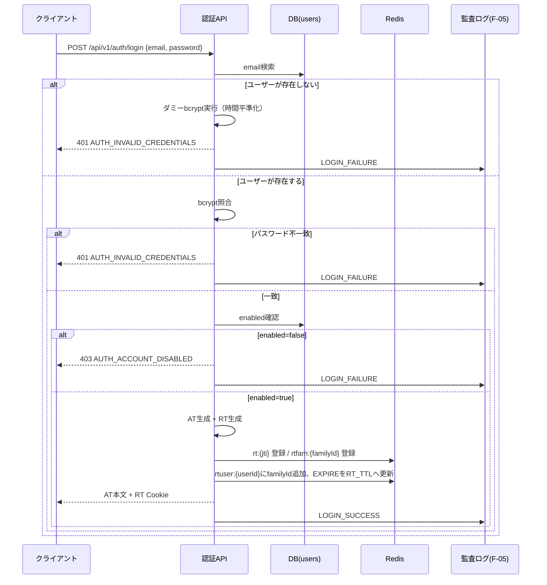
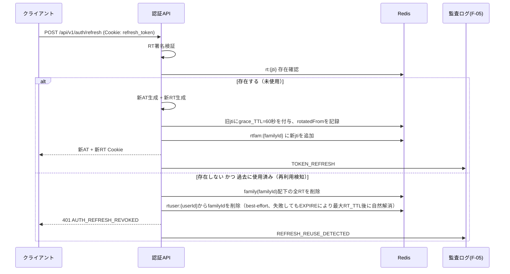

# F-01 JWT認証・認可 設計ドキュメント（Phase1 MVP）

## 改訂履歴

| 版   | 日付       | 変更内容                     |
| ---- | ---------- | ---------------------------- |
| v0.1 | 2026-07-04 | 初版（design-doc-planner のプランを正式設計書に展開） |
| v0.2 | 2026-07-04 | F-02（ユーザー・ロール管理）レビューで判明した「ユーザー単位でのセッション一括失効手段の欠如」を解消するため、`rtuser:{userId}`索引を追加。login/reuse検知フローを更新（5章・9.1・9.2・11章） |

## 1. 目的・スコープ

本書は ForgeHub Phase1（MVP）における認証・認可機能（F-01）の詳細設計を定めるものである。対象範囲は、ログイン、アクセストークン/リフレッシュトークンの発行・検証・リフレッシュ、ログアウト、およびロールベースアクセス制御（RBAC）による認可である。

以下は本書の対象外（非対象）とする。

- MFA（多要素認証）
- パスワードリセット
- SSO（外部IdP連携）
- アカウントロックの本実装（Phase1ではログ記録のみに留める。詳細は「15. スコープ境界」および末尾「未決事項」を参照）

参照要件: `docs/requirements.md` 4.1（認証・認可）、7（API設計方針）、9（アーキテクチャ）、10.1（セキュリティ）、15（今後の課題）。

## 2. 用語

| 用語   | 説明 |
| ------ | ---- |
| AT     | アクセストークン（Access Token）。短命なJWTで、APIリクエストの認証に用いる。 |
| RT     | リフレッシュトークン（Refresh Token）。長命で、ATの再発行に用いる。 |
| jti    | JWT ID。トークン1件ごとに割り当てる一意識別子（UUID）。 |
| family（familyId） | 同一ログイン起源のRT系列を束ねる識別子。ローテーションを繰り返しても同一familyIdを引き継ぐ。ログインのたびに新規に発行するため、同一ユーザーが複数端末から同時にログインしても、familyIdは端末（ログインセッション）ごとに独立し、一方の失効が他方に波及しない。 |

## 3. 認証方式決定

ForgeHubの認証方式はJWT-Bearer方式とし、以下の通り決定する。

| 決定事項 | 内容 |
| -------- | ---- |
| 署名アルゴリズム | HS256固定 |
| 選定理由 | Phase1は単一のSpring Bootサービス内でトークンの署名・検証が完結するため、対称鍵（共有鍵）方式のHS256で十分であり、鍵管理も単純になる。 |
| RS256への移行方針 | Phase2でトークン検証処理を別サービスへ分離する場合に、公開鍵配布が容易なRS256への移行を検討する。 |
| algの固定運用 | JWTデコーダは許可アルゴリズムをHS256のみに制限する。`alg=none`や`alg=RS256`を含む改ざんされたトークンは検証前に拒否する（詳細は「11. セキュリティ制御」参照）。 |
| パスワードハッシュ | bcrypt（cost=10）。平文パスワードはDB・ログ・例外メッセージのいずれにも出力しない。 |
| Spring Security構成 | `SessionCreationPolicy.STATELESS`によりセッションを保持しない構成とし、`OncePerRequestFilter`でJWTの検証を行うカスタムフィルタを実装する。 |

## 4. トークン設計

### 4.1 TTLとクレーム

| トークン種別 | TTL | クレーム |
| ------------ | --- | -------- |
| AT | 15分 | `iss=forgehub`, `aud=forgehub-api`, `sub=user.id（UUID）`, `role=単一ロール文字列`, `jti=UUID`, `iat`, `exp`, `typ=access` |
| RT | 7日 | `iss`, `aud`, `sub`, `jti=UUID`, `iat`, `exp`, `typ=refresh`, `fid=familyId` |

補足事項:

- クロックスキュー（サーバ間の時刻ずれ）の許容値は30秒とする。`exp`境界での誤拒否を防ぐためのleewayとして適用する。
- ロールはユーザーごとに単一とする（`docs/requirements.md` 4.2「ユーザーには単一のロールを割り当てる」に準拠）。複数ロール付与はスコープ外。
- AT検証時はDBアクセスを行わない。署名検証・`exp`・`iss`・`aud`・`typ=access`のみをチェックする（詳細は「9. シーケンス」SEQ_verify参照）。

## 5. トークン保存先

| 項目 | 内容 |
| ---- | ---- |
| AT保存先 | 保存しない（完全ステートレス）。クライアント側でJSメモリ変数として保持する。XSSが成立した場合はJSメモリ上のATも読み取られ得るリスクは残るが、`localStorage`等に永続化しないことで漏洩後の露出時間をAT自体のTTL（15分）以内に限定し、影響範囲を最小化する（RTは別途`httpOnly`Cookieで保護し、ATより長期の窃取リスクを回避する。詳細は「11. セキュリティ制御」参照）。 |
| RT保存先 | Redis。`docs/requirements.md` 8章「Cache」において「リフレッシュトークン/セッション管理」の用途がすでに定義されており、本設計でその用途をRTの永続化・失効管理として確定させる（`docs/requirements.md` 15章の「アクセストークン/リフレッシュトークンの保存先（Redis or DB）の最終決定」を、本書によりRedisに決定する）。 |
| 選定理由 | RedisのネイティブTTL機能により失効時刻の管理と即時削除が容易であり、DBに比べてp95応答が高速なため。 |
| Redisキー設計 | `rt:{jti}` → value = `{userId, familyId, issuedAt, rotatedFrom}`、`EXPIRE`をRT_TTL（7日）に設定。 |
| family索引 | `rtfam:{familyId}` → jtiのSet。ファミリ単位での一括失効（再利用検知時の全RT削除等）に用いる。 |
| user索引 | `rtuser:{userId}` → familyIdのSet。ユーザーが保有する全ファミリ（＝全ログインセッション）を横断的に把握するための索引。login時にfamilyId登録、`EXPIRE`はRT_TTL（7日）でSADDのたびに更新（ローリングTTL）。F-02（ユーザー・ロール管理）のアカウント無効化・パスワードリセット時に「当該ユーザーの全RTを即時一括失効」する用途で参照される（`docs/design/f-02-user-role-management.md` 10章参照）。 |
| 保存値の方針 | Redisに保存するのはRTのjtiとメタ情報のみであり、RTトークン文字列そのものは保存しない。検証時は署名検証＋Redis上のjti存在確認の2段階で行う。 |

クライアント側の保存方針:

- ATはSPAのJSメモリ変数に保持し、`localStorage`への保存は禁止する（XSS対策、詳細は「11. セキュリティ制御」参照）。
- RTは`httpOnly` + `Secure` + `SameSite=Strict`のCookieに保存し、Cookieの`path`は`/api/v1/auth`に限定する。
- CSRF対策として、RT用Cookieは`SameSite=Strict`であることに加え、`refresh`エンドポイントはPOSTメソッド限定とする。
- ATはJSメモリ変数のみに保持するため、ブラウザの再起動・タブの再読み込みが発生するとATは失われる（意図した挙動）。RTは`httpOnly` Cookieのためブラウザ再起動後も保持されるので、クライアントはアプリ起動時に`/api/v1/auth/refresh`を呼び出してATを再取得する。RTも無効・失効している場合はログイン画面へ遷移する。

## 6. データモデル

F-01としての新規DBテーブルは無い（RTはRedisで管理するため）。既存の`users`テーブルを流用する。

| カラム | 型 | 備考 |
| ------ | -- | ---- |
| id | uuid (PK) | |
| email | citext (UNIQUE) | ログイン一意性を保証。大文字小文字を区別しない一意制約。 |
| password_hash | string | bcrypt(cost=10)によるハッシュ値のみ保持。平文は保持しない。 |
| role | string | 単一ロール（Admin/Developer/Operator）。カラム定義自体はF-02設計と共有。 |
| enabled | boolean | `false`の場合、ログイン拒否（後述「10. エラー設計」`AUTH_ACCOUNT_DISABLED`）。 |
| created_at | timestamp | |

`users`テーブルのスキーマ自体はF-02（ユーザー・ロール管理）の設計文書と共有管理する。本書ではロール値を`Admin`/`Developer`/`Operator`の3種に固定することを前提とする。

## 7. API仕様

| メソッド | パス | リクエスト | レスポンス | 認可要件 |
| -------- | ---- | ---------- | ---------- | -------- |
| POST | `/api/v1/auth/login` | `{email, password}` | `{access_token, expires_in=900}` + `Set-Cookie: refresh_token` | 不要 |
| POST | `/api/v1/auth/refresh` | Cookie（`refresh_token`） | `{access_token, expires_in}` + 新しい`refresh_token` Cookie（ローテーション） | 有効なRT |
| POST | `/api/v1/auth/logout` | Cookie（`refresh_token`） | 204 No Content | 有効なRT/AT |

補足:

- ログアウト（`/api/v1/auth/logout`）は、当該RTが属するfamilyの全RTをRedisから削除し、RT Cookieをクリアする。
- エラーレスポンスは`docs/requirements.md` 7章の方針に従い、`{code, message, details}`の統一フォーマットで返却する。
- `/api/v1/users/me`等のプロフィール取得エンドポイントはF-02の管轄とし、本書のスコープ外とする。

## 8. 認可（RBAC）実装

- 認可方式はメソッドセキュリティ（`@PreAuthorize("hasRole(...)")`）によるアノテーションベース実装とする。
- ロール表記はSpring Securityの権限表現に合わせ、`ROLE_ADMIN` / `ROLE_DEVELOPER` / `ROLE_OPERATOR`とする。
- 認可マップは`docs/requirements.md` 7章の代表エンドポイント表と一致させる。

| リソース | 必要ロール |
| -------- | ---------- |
| `/api/v1/users` 系 | ADMIN |
| `/api/v1/apis` 系 | ADMIN, DEVELOPER |
| `/api/v1/jobs` 系 | ADMIN, DEVELOPER, OPERATOR |
| `/api/v1/audit-logs` 系 | ADMIN, OPERATOR |

- 認可失敗時は403（`AUTH_FORBIDDEN`）を返す。
- 未認証時は401（`AUTH_UNAUTHENTICATED`）を返す。
- デフォルトdeny原則: `@PreAuthorize`等の認可注釈が付いていないエンドポイントは、`SecurityConfig`側で「認証済みであること（authenticated）」をデフォルト要求とし、注釈忘れによる意図しない全ロール許可を防止する。

## 9. シーケンス

### 9.1 ログイン（SEQ_login）

ユーザーが存在しない場合でも、応答時間差からアカウントの存否を推測されないよう、ダミーのbcrypt演算を実行してから401を返す（ユーザー列挙防止、詳細は「11. セキュリティ制御」参照）。

### 9.2 リフレッシュ（SEQ_refresh）

grace期間（60秒）は、複数タブ・複数リクエストが同時にrefreshした際に、ローテーション直後の旧RTを一度だけ正当なものとして許容するための猶予であり、誤検知によるユーザーの強制ログアウトを防止する（詳細は「11. セキュリティ制御」参照）。

### 9.3 通常API呼び出し時の検証（SEQ_verify）

各APIへのリクエストは、`OncePerRequestFilter`によるフィルタで以下を検証する。

1. JWT署名検証（HS256、許可アルゴリズム限定）
2. `exp`検証（クロックスキュー30秒許容）
3. `typ=access`であることの検証
4. 検証成功時、AT内の`role`クレームをそのまま`SecurityContext`にセットする（DBへの再照会は行わない）

## 10. エラー設計

| コード | HTTPステータス | 発生条件 |
| ------ | --------------- | -------- |
| AUTH_INVALID_CREDENTIALS | 401 | ログイン失敗（ユーザー不存在の場合も同一コード・同一応答としてユーザー列挙を防止する） |
| AUTH_ACCOUNT_DISABLED | 403 | `enabled=false`のユーザーによるログイン試行 |
| AUTH_TOKEN_EXPIRED | 401 | ATの有効期限切れ |
| AUTH_TOKEN_INVALID | 401 | 署名不正、許可外アルゴリズム混入、`typ`不一致 |
| AUTH_REFRESH_REVOKED | 401 | RTがRedis上に存在しない、または再利用検知が成立した場合 |
| AUTH_UNAUTHENTICATED | 401 | トークンが付与されていない |
| AUTH_FORBIDDEN | 403 | ロール不足による認可失敗 |
| AUTH_SERVICE_UNAVAILABLE | 503 | Redis不通によりlogin/refreshが実行できない場合 |

いずれの401応答にも`WWW-Authenticate: Bearer`ヘッダを付与する。レスポンスボディは`docs/requirements.md`に定める`{code, message, details}`形式で統一する。

`AUTH_TOKEN_EXPIRED`・`AUTH_TOKEN_INVALID`・`AUTH_REFRESH_REVOKED`・`AUTH_UNAUTHENTICATED`はいずれもHTTPステータスとしては401で共通だが、クライアント側の後続動作が異なるため意図的にコードを分けている。クライアントはHTTPステータスではなく必ずレスポンスボディの`code`で分岐すること。

- `AUTH_TOKEN_EXPIRED`（ATのみ期限切れ、RTは有効な可能性）: `/api/v1/auth/refresh`を呼び出してAT再取得を試み、成功すれば元のリクエストを再実行する（サイレントリフレッシュ）。
- `AUTH_TOKEN_INVALID` / `AUTH_UNAUTHENTICATED`: トークン自体が不正または未提示であるため、リフレッシュを試みずログイン画面へ遷移する。
- `AUTH_REFRESH_REVOKED`: RTが失効・再利用検知済みであるため、リフレッシュを再試行せずログイン画面へ遷移する。

## 11. セキュリティ制御

| 観点 | 制御内容 |
| ---- | -------- |
| パスワード平文の非出力 | パスワード平文はDB・ログ・例外メッセージのいずれにも出力しない（`docs/requirements.md` 10.1準拠）。 |
| ユーザー列挙防止 | 存在しないメールアドレスに対してもダミーのbcrypt演算を実行し応答時間を平準化する。エラーコードも存在有無に関わらず`AUTH_INVALID_CREDENTIALS`に統一する。 |
| RTローテーション | refresh実行のたびに新しいRTを発行し、旧RTは無効化する（grace期間経過後は使用不可）。 |
| 再利用検知 | grace期間を超えた旧RTが提示された場合、そのRTが属するfamily配下の全RTをRedisから削除し、盗難後の永続的な不正利用を封じ込める。 |
| ユーザー単位の一括セッション失効 | `rtuser:{userId}`索引（5章参照）により、当該ユーザーが保有する全familyを列挙し、各family配下の全RTを一括削除できる。F-02のアカウント無効化・パスワードリセット時に用いられ、実行後は当該ユーザーの`/api/v1/auth/refresh`が即座に`401 AUTH_REFRESH_REVOKED`となる（発行済みATは別途「AT失効の限界」参照）。 |
| 失敗時の監査ログ | ログイン失敗は`LOGIN_FAILURE`として記録する。記録項目は`email`、`IP`、理由コードのみとし、パスワードは記録しない。 |
| 鍵管理 | JWT署名鍵はSecret Managerから注入する（`docs/requirements.md` 10.1準拠）。 |
| AT失効の限界 | ATはステートレスであるため個別無効化ができない。ロール変更・アカウント無効化後も、発行済みATは最大15分間有効なままとなる（※本項目は未決の残存事項。詳細は末尾「未決事項」参照）。 |
| アカウント無効化時のRT即時削除 | `enabled=false`に変更された場合、当該ユーザーの全RTを即時削除し、リフレッシュ経路を遮断する（ATの残存有効期間は上記の通り最大15分残る）。 |

## 12. 非機能

- 通常のAPI応答（署名検証のみで完結するリクエスト）はDB・Redisいずれも参照しないため、オーバーヘッドは最小限であり、`docs/requirements.md` 10.2のp95 500ms以内の目標に十分に収まる。
- `refresh`はRedisへの1往復のみを要する処理であり、`login`はbcrypt（cost=10、概ね50〜100ms）が主なコストとなるため、いずれもp95 500ms以内に収まる想定である。
- ログイン・リフレッシュ処理においてN+1クエリは発生しない（ユーザー検索は主キー/一意インデックスによる単発クエリ、RT管理はRedisキーの単発アクセス）。

## 13. 設定・鍵管理

| 設定項目 | 内容 |
| -------- | ---- |
| `jwt.secret` | HS256用共有鍵（32byte以上）。Secret Managerから注入する。 |
| `jwt.access-ttl` | 900秒（15分） |
| `jwt.refresh-ttl` | 604800秒（7日） |
| `bcrypt.strength` | 10 |
| 鍵ローテーション | Phase1では単一鍵運用とし、`kid`クレームによる複数鍵対応はPhase2で検討する（※未決事項、末尾参照）。 |
| ローカル開発 | `.env.example`に鍵のプレースホルダーを用意し、実際の鍵はコミットしない（`docs/requirements.md` 11.2準拠）。 |

## 14. 他機能依存

- **F-05（監査ログ）**: 以下のアクションを`AUDIT_LOG`テーブル（`actor_id`, `action`, `target_type=USER`, `detail`(jsonb)）へ追記する。これにより`docs/requirements.md` 4.1の「ログイン失敗のログ記録」要件を満たす。
  - `LOGIN_SUCCESS`
  - `LOGIN_FAILURE`
  - `LOGOUT`
  - `TOKEN_REFRESH`
  - `REFRESH_REUSE_DETECTED`

  なお、これらの認証イベントの監査ログ記録は、`docs/requirements.md` 4.5に列挙される「CUD操作」の対象外であるため、F-05設計側との整合確認が必要である（※未決事項、末尾参照）。

- **F-02（ユーザー・ロール管理）**: `users`テーブルおよび`role`カラムの定義はF-02設計文書と共有する。本書ではロール値が`Admin`/`Developer`/`Operator`に固定されていることを前提とする。

## 15. スコープ境界

Phase1（MVP）における明確な非対応事項は以下の通り。

| 項目 | 扱い |
| ---- | ---- |
| アカウントロック | 本実装は行わない。ログイン失敗は監査ログへの記録のみとし、一定回数での自動ロックはPhase2以降で検討する（`docs/requirements.md` 4.1準拠）。 |
| MFA | 対象外 |
| パスワードリセット | 対象外 |
| SSO | 対象外 |
| RT保存先 | Redisに確定。DB採用は不採用（「5. トークン保存先」で決定済み）。 |
| APIキー認証（F-03） | JWTとは別系統の認証方式であり、本書のスコープ外。 |

## 16. 未決事項

以下は本設計において解決に至らず、`OPEN`として残された事項である。実装・レビュー時には特に注意すること（各該当章の本文中にも同様の注記を配置済み）。

1. **AT無効化不可による権限降格・無効化反映の遅延（最大15分）**: ロール変更やアカウント無効化を行っても、既に発行済みのATは最大15分間有効なまま残る。短命化（15分TTL）によりリスクは緩和しているが、完全な即時失効を実現するには、Phase2でATのブラックリストをRedis等に導入することを検討する（「11. セキュリティ制御」参照）。
2. **認証イベントの監査ログ記録とF-05設計との整合**: `LOGIN_SUCCESS` / `LOGIN_FAILURE` / `LOGOUT` / `TOKEN_REFRESH` / `REFRESH_REUSE_DETECTED`の記録は、`docs/requirements.md` 4.5の「CUD操作」を対象とした監査ログ要件には明示的に含まれていない。セキュリティ観点から本書側で追加提案しているが、F-05の設計文書との整合を別途確認する必要がある（「14. 他機能依存」参照）。
3. **HS256単一鍵のローテーション手順**: Phase1では鍵は単一かつ手動ローテーションを前提とする。`kid`クレームを用いた複数鍵対応・自動ローテーションはPhase2で検討する（「13. 設定・鍵管理」参照）。
