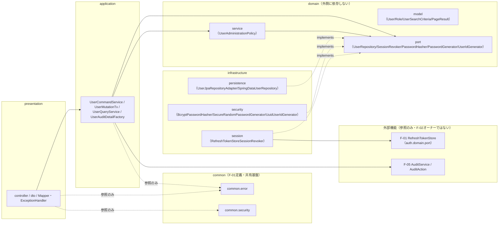
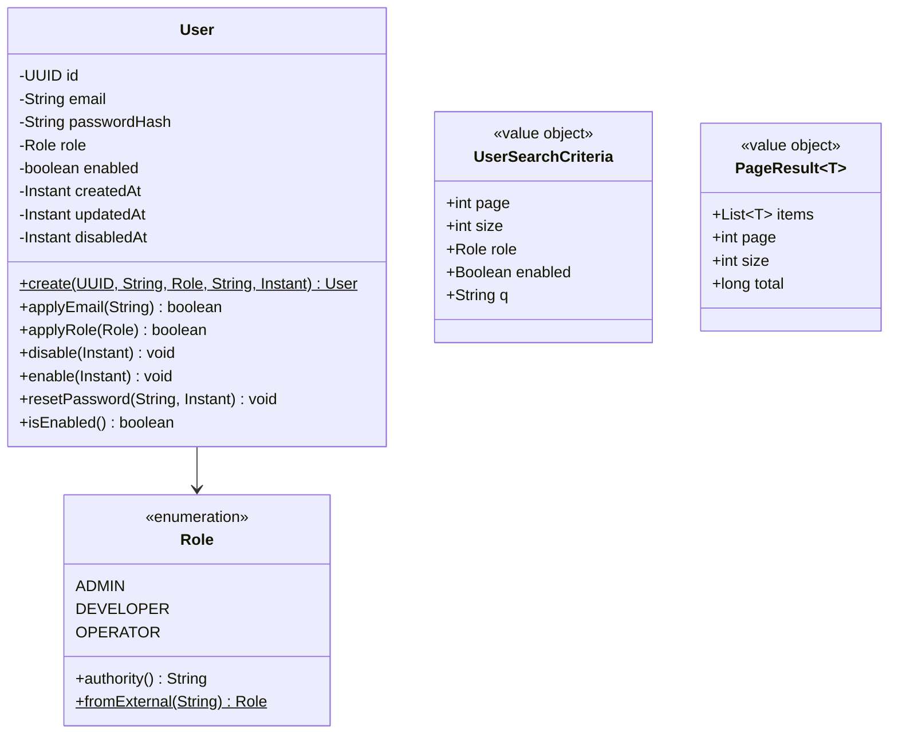
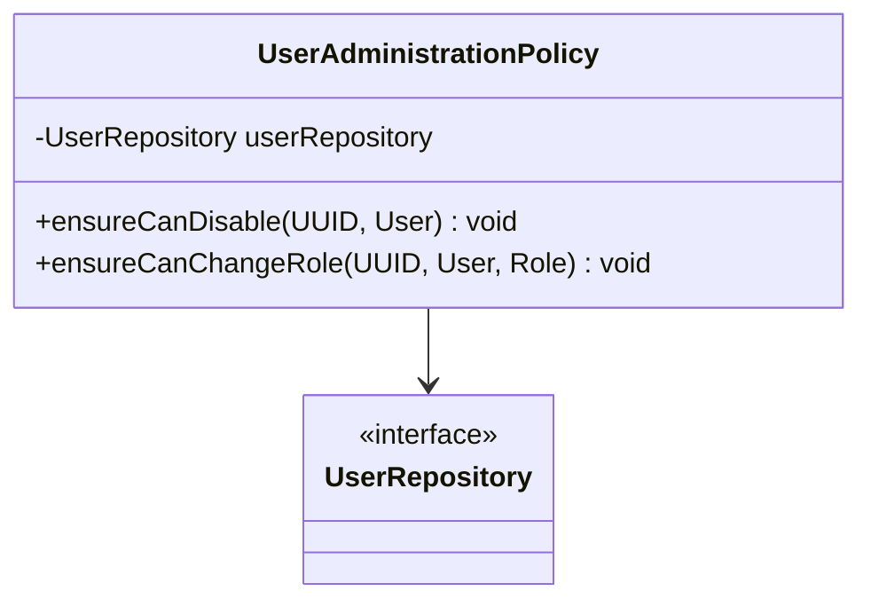
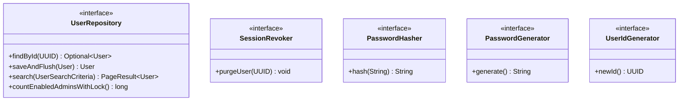
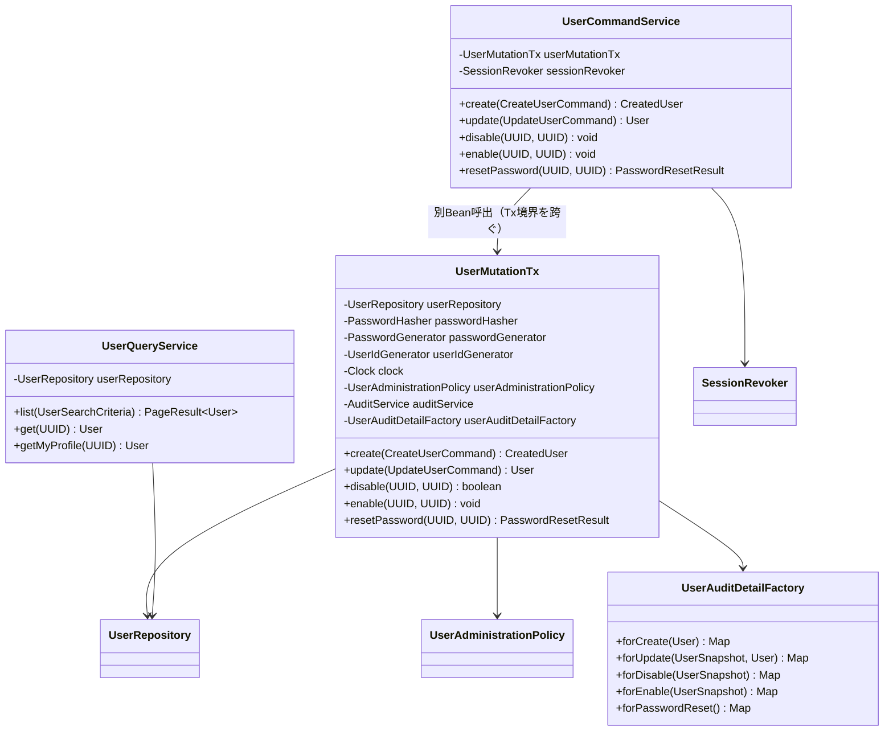
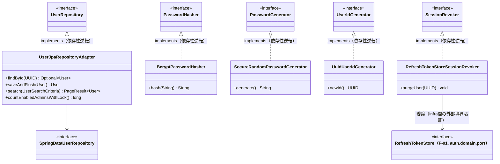
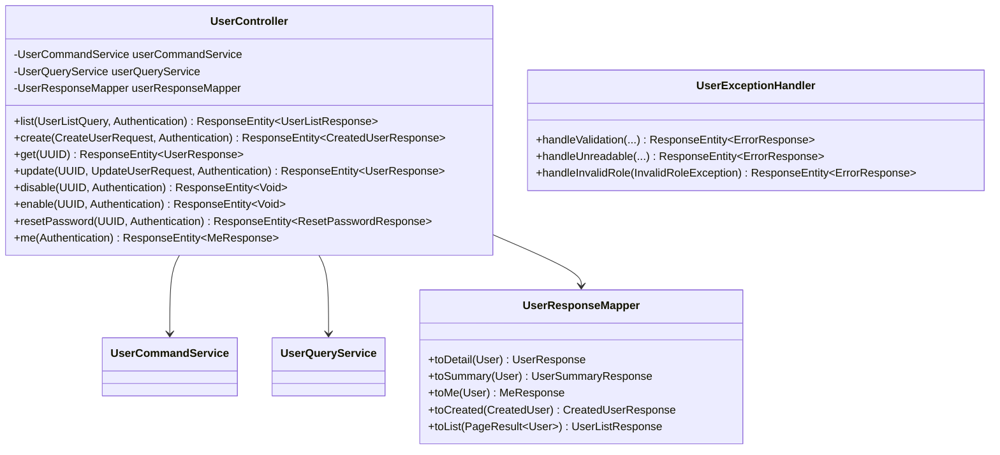
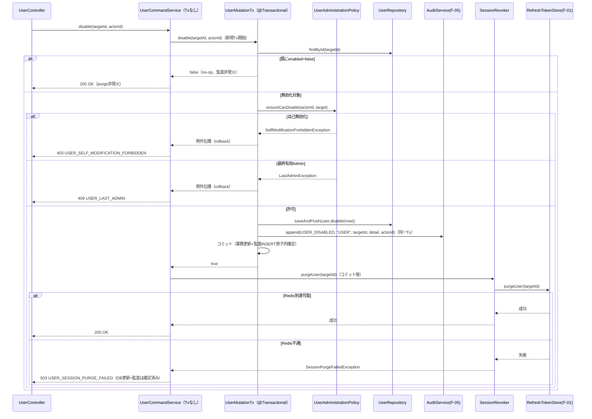

# F-02 ユーザー・ロール管理 バックエンドクラス設計書（Phase1 MVP）

## 改訂履歴

| 版   | 日付       | 変更内容                     |
| ---- | ---------- | ---------------------------- |
| v0.1 | 2026-07-06 | 初版（backend-class-design-planner のプランを正式クラス設計書に展開） |

## 0. 位置付け・参照

本書は `docs/design/f-02-user-role-management.md`（詳細設計書）を実装可能な粒度のJava/Spring Bootクラス設計へ展開したものである。業務要件・API仕様・シーケンス・エラーコードの根拠は詳細設計書側にあり、本書はそれをクラス・パッケージ・依存関係・メソッドシグネチャへ変換することに専念する。詳細設計書およびプラン（backend-class-design-planner出力）に対して、本書が新たな業務決定を追加することはない。

参照: `docs/requirements.md`、`docs/design/f-02-user-role-management.md`、`docs/design/f-01-jwt-auth-backend-class.md`、`docs/design/f-01-jwt-auth.md`、`docs/design/f-05-audit-log.md`。

**絶対制約（再掲・全章共通）**: 以下はプラン段階での絶対制約であり、本書のいずれの章の実装判断もこれに反してはならない。詳細は各該当章および末尾「14. 共有クラス突合・未決事項」を参照。

1. 監査ログINSERTは`UserMutationTx`の各`@Transactional`メソッド内で業務DB更新と**同一トランザクション**で行う（F-05確定事項D準拠）。
2. RTセッション失効（`SessionRevoker.purgeUser`）はTxコミット後に`UserCommandService`が実行する。purge失敗は503（`USER_SESSION_PURGE_FAILED`）としても、無効化・パスワード再格納・監査記録は既に確定済みとする。
3. 最終有効Admin判定（`countEnabledAdminsWithLock`）は悲観ロックにより更新と同一Tx内で行い、並行実行時のレースを防止する。
4. 自己変更禁止・最終Admin保護の業務ルールは`UserAdministrationPolicy`（domain.service）に集約し、application/controllerへ漏出させない。
5. 平文パスワード（初期パスワード・リセットパスワード）は監査`detail`・ログ・例外メッセージを含むあらゆる経路へ一切出力しない。
6. ロール値は`ADMIN`/`DEVELOPER`/`OPERATOR`の3種に固定する。

## 1. パッケージ構成と依存方向

### 1.1 パッケージ一覧

| パッケージ | 役割 |
| ---------- | ---- |
| `com.forgehub.user.domain.model` | エンティティ・値オブジェクト・enum |
| `com.forgehub.user.domain.port` | domainが要求する抽象（インターフェース） |
| `com.forgehub.user.domain.service` | 業務ルール本体（ドメインサービス） |
| `com.forgehub.user.application` | ユースケース調整（アプリケーションサービス、Tx境界） |
| `com.forgehub.user.infrastructure.persistence` | JPAによるユーザー永続の具象実装 |
| `com.forgehub.user.infrastructure.security` | パスワードハッシュ・生成・ID生成の具象実装 |
| `com.forgehub.user.infrastructure.session` | F-01 RTストアへの委譲によるセッション失効の具象実装 |
| `com.forgehub.user.presentation.controller` | ユーザー管理エンドポイントの公開 |
| `com.forgehub.user.presentation.dto` | HTTP入出力DTO |
| `com.forgehub.user.presentation`（Mapper/ExceptionHandler） | domain⇔DTO変換、F-02固有例外のHTTP変換 |
| `com.forgehub.common.error`（共有・再利用） | `ErrorResponse`・共有基底例外・共通`@RestControllerAdvice` |
| `com.forgehub.common.security`（共有・再利用） | `SecurityConfig`・`EntryPoint`・`AccessDeniedHandler`（F-01が定義、F-02は再利用のみ） |
| `com.forgehub.auth.domain.port.RefreshTokenStore`（参照・F-01オーナー） | ユーザー単位RT一括失効の実体操作先 |
| F-05 `AuditService`/`AuditAction`（参照・F-05オーナー） | 監査記録の抽象・語彙 |

### 1.2 依存方向の規約

依存方向は `presentation → application → domain ← infrastructure` を厳守する。

- `domain`（model/port/service）はいかなる外側レイヤ（application/infrastructure/presentation）にも依存しない。domainが必要とする外部機能（DB、bcrypt、乱数生成、RTストア）はすべて`domain.port`のインターフェースとして宣言し、実装は`infrastructure`側に置く（依存性逆転）。domainがF-01の具象`RefreshTokenStore`実装やRedisクライアントを直接参照することは一切ない。
- `infrastructure`は`domain.port`のインターフェースを実装する（`implements`）ことでのみdomainと接続する。`infrastructure.session`はF-01の抽象`RefreshTokenStore`（`com.forgehub.auth.domain.port`）へ委譲するが、これはinfrastructure層内での外部境界隔離であり、domain自体はF-01を一切知らない。
- `application`は`domain.port`と`domain.service`にのみ依存し、`infrastructure`の具象クラス（`BCryptPasswordEncoder`、`SpringDataUserRepository`等）を直接注入・参照しない。加えて`application`はF-05の`AuditService`（抽象）にのみ依存する。
- `presentation`は`application`のユースケースクラス（`UserCommandService`/`UserQueryService`）にのみ依存し、`domain`や`infrastructure`を直接参照しない。`common.error`/`common.security`は参照のみ許容する。
- DIはコンストラクタ注入のみを用いる。フィールド注入・セッター注入は用いない（テスト容易性・不変性確保のため）。
- `com.forgehub.common.*`はF-01が定義した全機能共有の基盤パッケージであり、F-02はこれを再利用するのみで独自に重複定義しない。



図中の破線（`-. implements .->`）は依存性逆転（infrastructureがdomainのportを実装する側であり、domainからinfrastructureへ向かう矢印は存在しない）を示す。`ISess --> F01`はinfrastructure層内での外部境界隔離であり、domain/applicationはF-01を直接参照しない。実線はレイヤ間の通常の呼び出し依存を示す。

## 2. ドメインモデル（User/Role/VO）

`com.forgehub.user.domain.model`配下。本パッケージが`User`/`Role`の最終オーナーである（F-01は参照のみ。※本項目は「14. 共有クラス突合・未決事項」の突合事項4参照）。

| クラス | 種別 | 責務 |
| ------ | ---- | ---- |
| `User` | JPAエンティティ | ユーザー識別と状態遷移の不変条件（email/role/enabled/disabledの整合）保持 |
| `Role` | enum | ロール定義とSpring権限文字列変換（F-02が最終オーナー） |
| `UserSearchCriteria` | 値オブジェクト | 一覧検索条件 |
| `PageResult<T>` | 値オブジェクト | ページング結果（Spring Data Pageをdomainに漏らさない） |

### 2.1 User

```java
@Entity
@Table(name = "users")
public class User {

    @Id
    private UUID id;

    @Column(nullable = false)
    private String email;

    @Column(name = "password_hash", nullable = false)
    private String passwordHash;

    @Enumerated(EnumType.STRING)
    @Column(nullable = false)
    private Role role;

    @Column(nullable = false)
    private boolean enabled;

    @Column(name = "created_at", nullable = false)
    private Instant createdAt;

    @Column(name = "updated_at", nullable = false)
    private Instant updatedAt;

    @Column(name = "disabled_at")
    private Instant disabledAt; // nullable（有効時はnull）

    protected User() { } // JPA用

    public static User create(UUID id, String email, Role role, String passwordHash, Instant now) {
        // role非null検証、email/passwordHash設定、enabled=true、createdAt=updatedAt=now
    }

    public boolean applyEmail(String email) {
        // 変化が無ければfalseを返しupdatedAtも更新しない（no-op検出用）
    }

    public boolean applyRole(Role newRole) {
        // 変化が無ければfalseを返す。呼出前提としてUserAdministrationPolicyの検査済みであること
    }

    public void disable(Instant now) {
        // enabled=false、disabledAt=now、updatedAt=now
    }

    public void enable(Instant now) {
        // enabled=true、disabledAt=null、updatedAt=now
    }

    public void resetPassword(String newHash, Instant now) {
        // passwordHash差替、updatedAt=now（平文は一切受け取らずハッシュのみ受領）
    }

    public boolean isEnabled() { return enabled; }
    public UUID getId() { return id; }
    public String getEmail() { return email; }
    public Role getRole() { return role; }
    public Instant getUpdatedAt() { return updatedAt; }
    public Instant getDisabledAt() { return disabledAt; }
}
```

不変条件: `role`は非null。`passwordHash`はbcryptハッシュのみを保持し、平文・生成直後のパスワードは一切保持しない。`disable()`は`enabled=false`かつ`disabledAt=now`を同時に設定し、`enable()`は`enabled=true`かつ`disabledAt=null`に戻す。全変異メソッドは`updatedAt`を更新する。setterは非公開とし、永続化ロジック自体はエンティティに書かない。`applyEmail`/`applyRole`は変化の有無を`boolean`で返し、呼出側（`UserMutationTx`）でno-op判定（監査発火の要否判断）に用いる。

JPAアノテーションは`@Entity`/`@Id`/`@Column`/`@Enumerated(STRING)`等の宣言的アノテーションのみを許容し、永続化ロジック自体はエンティティに書かない。

SOLID: S（状態遷移の不変条件のみを責務とし、CRUD調整・監査・HTTPの関心事は一切持たない）。

### 2.2 Role

```java
public enum Role {
    ADMIN, DEVELOPER, OPERATOR;

    public String authority() {
        return "ROLE_" + name();
    }

    public static Role fromExternal(String v) throws InvalidRoleException {
        // 大文字小文字等の外部表現からenumへ変換。一致しない場合はInvalidRoleException(400)
    }
}
```

SOLID: O（enum外の値は`fromExternal`により400（`USER_INVALID_ROLE`）へ拒否され、DB `CHECK`制約との二重防御となる。ロール種別追加時は本enumのみを変更すればよく、呼出元の分岐追加を要しない）。

### 2.3 UserSearchCriteria

```java
public final class UserSearchCriteria {
    private final int page;
    private final int size;
    private final Role role;      // nullable
    private final Boolean enabled; // nullable
    private final String q;        // nullable（emailの部分一致検索）

    public UserSearchCriteria(int page, int size, Role role, Boolean enabled, String q) {
        // size<=100へのclampはpresentation側で実施済みであることを前提とする
        // page>=0
    }

    // 全フィールドgetterのみ（不変）
}
```

不変条件: `size<=100`へのclampは`presentation`層（`UserListQuery`）で行い、本クラスへは既にclamp済みの値が渡される前提とする。`page>=0`。

### 2.4 PageResult\<T\>

```java
public final class PageResult<T> {
    private final List<T> items;
    private final int page;
    private final int size;
    private final long total;

    public PageResult(List<T> items, int page, int size, long total) {
        this.items = List.copyOf(items);
        this.page = page;
        this.size = size;
        this.total = total;
    }

    // 全フィールドgetterのみ（不変）
}
```

Spring Data JPAの`Page<T>`をdomain/applicationへ漏らさないための変換専用値オブジェクトである。`UserJpaRepositoryAdapter`（7章）が`Page<User>`から本クラスへ変換する。



## 3. ドメインサービス（業務ルール本体）

`com.forgehub.user.domain.service`配下。最終有効Admin保護・自己変更禁止の業務ルールは本層の`UserAdministrationPolicy`に集約し、application層やcontrollerへ漏出させない（プランDECISIONSの絶対方針）。

### 3.1 UserAdministrationPolicy

```java
public class UserAdministrationPolicy {

    private final UserRepository userRepository;

    public UserAdministrationPolicy(UserRepository userRepository) {
        this.userRepository = userRepository;
    }

    public void ensureCanDisable(UUID actorId, User target)
            throws SelfModificationForbiddenException, LastAdminException {
        // actorId.equals(target.getId()) → SelfModificationForbiddenException
        // target.getRole()==ADMIN && target.isEnabled()
        //   && userRepository.countEnabledAdminsWithLock()==1 → LastAdminException
    }

    public void ensureCanChangeRole(UUID actorId, User target, Role newRole)
            throws SelfModificationForbiddenException, LastAdminException {
        // actorId.equals(target.getId()) → SelfModificationForbiddenException
        // target.getRole()==ADMIN && target.isEnabled() && newRole!=ADMIN（降格）
        //   && userRepository.countEnabledAdminsWithLock()==1 → LastAdminException
    }
}
```

- 依存: `UserRepository`（`countEnabledAdminsWithLock()`）。コンストラクタ注入のみ。
- 判定ルール: `actorId.equals(target.getId())`であれば無条件に`SelfModificationForbiddenException`を送出する（自己無効化・自己ロール変更の禁止）。`target.getRole()==ADMIN`かつ`target.isEnabled()`かつ操作が降格または無効化に該当し、かつ`countEnabledAdminsWithLock()==1`であれば`LastAdminException`を送出する。
- ルール配置: 最終有効Admin計数と判定は**Tx内**（`UserMutationTx`から呼出される時点で既にアクティブなTxが存在する）で行い、`countEnabledAdminsWithLock`の行ロックにより並行実行時のレースを防止する（※Tx境界の詳細は6章・11章参照。本件は致命的制約であり両章に重複して明記する）。
- SOLID: S（Admin保護・自己変更禁止という認可安全ルールのみを責務とし、DB更新・監査発火・HTTP変換の関心事は一切持たない）。



## 4. ポート（domainインターフェース）

`com.forgehub.user.domain.port`配下。すべてinterfaceであり、domain/applicationはこれらの抽象にのみ依存する。実装は「7. インフラ実装」参照。

| インターフェース | 責務 | 主メソッド |
| ---------------- | ---- | ---------- |
| `UserRepository` | ユーザー永続の抽象（F-02オーナー、CRUD/検索/Admin計数） | 下記参照 |
| `SessionRevoker` | ユーザー単位RT一括失効の狭小抽象 | `purgeUser` |
| `PasswordHasher` | bcryptハッシュ生成の抽象 | `hash` |
| `PasswordGenerator` | CSPRNG初期パスワード生成の抽象 | `generate` |
| `UserIdGenerator` | ユーザーUUID生成の抽象（テスト差替可） | `newId` |

### 4.1 UserRepository

```java
public interface UserRepository {
    Optional<User> findById(UUID id);
    User saveAndFlush(User user) throws EmailConflictException;
    PageResult<User> search(UserSearchCriteria criteria);
    long countEnabledAdminsWithLock();
}
```

SOLID: I（F-01の認証用`findByEmail`とは別インターフェースに分離し、認証クライアント（`AuthenticationService`）にCRUD/検索/計数を流入させない）。D（`application`は本抽象のみに依存する）。

### 4.2 SessionRevoker

```java
public interface SessionRevoker {
    void purgeUser(UUID userId) throws SessionPurgeFailedException;
}
```

SOLID: I（F-01 `RefreshTokenStore`の8メソッドをF-02に晒さず、必要な1操作（`purgeUser`相当）のみに絞ったポートとする）。D（`application`（`UserCommandService`）は本抽象のみに依存し、F-01の具象・Redisを一切知らない）。

### 4.3 PasswordHasher

```java
public interface PasswordHasher {
    String hash(String raw);
}
```

### 4.4 PasswordGenerator

```java
public interface PasswordGenerator {
    String generate(); // 24文字のCSPRNG初期パスワード
}
```

### 4.5 UserIdGenerator

```java
public interface UserIdGenerator {
    UUID newId();
}
```

SOLID: D（`UUID.randomUUID()`の静的呼出をdomain/applicationから排除し、テスト時に決定的な値へ差替可能にする）。



## 5. アプリケーション層とTx境界

`com.forgehub.user.application`配下。変更系ユースケースは「業務DB更新＋監査INSERTの原子的Tx」（`UserMutationTx`）と「Txコミット後のセッション失効調整」（`UserCommandService`）の2Beanに分離する。**この2Bean分離はTx境界とcommit後purgeを両立させるための致命的な設計判断であり、本章末尾および11章に重複して明記する**。

| クラス | 種別 | 責務 |
| ------ | ---- | ---- |
| `UserMutationTx` | サービス（Tx境界あり） | 業務DB更新＋監査INSERTの原子的単位（RTセッション失効は含めない） |
| `UserCommandService` | サービス（Tx境界なし） | 変更系ユースケース調整。Tx確定後にセッション失効を実行し順序保証 |
| `UserQueryService` | サービス（Tx境界=readOnly） | 参照系ユースケース（一覧/詳細/自己プロフィール） |
| `UserAuditDetailFactory` | ファクトリ | 監査detailのbefore/after組立 |
| `CreateUserCommand` | record | 作成入力 |
| `UpdateUserCommand` | record | 更新入力（email/roleのみ、nullは非変更） |
| `CreatedUser` | record | 作成結果（initial_passwordを一度だけ運ぶ） |
| `PasswordResetResult` | record | パスワードリセット結果 |
| `UserSnapshot` | record | 変更前の非機密スナップショット（監査before用） |

### 5.1 UserMutationTx

```java
public class UserMutationTx {

    private final UserRepository userRepository;
    private final PasswordHasher passwordHasher;
    private final PasswordGenerator passwordGenerator;
    private final UserIdGenerator userIdGenerator;
    private final Clock clock;
    private final UserAdministrationPolicy userAdministrationPolicy;
    private final AuditService auditService; // F-05
    private final UserAuditDetailFactory userAuditDetailFactory;

    public UserMutationTx(UserRepository userRepository,
                           PasswordHasher passwordHasher,
                           PasswordGenerator passwordGenerator,
                           UserIdGenerator userIdGenerator,
                           Clock clock,
                           UserAdministrationPolicy userAdministrationPolicy,
                           AuditService auditService,
                           UserAuditDetailFactory userAuditDetailFactory) {
        // 全依存はコンストラクタ注入
    }

    @Transactional
    public CreatedUser create(CreateUserCommand cmd) throws EmailConflictException {
        // userIdGenerator.newId() → passwordGenerator.generate() → passwordHasher.hash(raw)
        // → User.create(...) → userRepository.saveAndFlush(user)
        // → auditService.append(USER_CREATED, "USER", user.getId(), userAuditDetailFactory.forCreate(user), cmd.actorId())（同一Tx）
        // → CreatedUser(id, email, role, enabled, rawInitialPassword) を返却（rawは戻り値のみで永続化・監査へは非出力）
    }

    @Transactional
    public User update(UpdateUserCommand cmd)
            throws UserNotFoundException, EmailConflictException,
                   SelfModificationForbiddenException, LastAdminException {
        // userRepository.findById(cmd.targetId()) 不在 → UserNotFoundException
        // before = UserSnapshot(user) を変更前に取得
        // cmd.role()!=null時: userAdministrationPolicy.ensureCanChangeRole(cmd.actorId(), user, cmd.role())
        // roleChanged = user.applyRole(cmd.role())（null時skip）
        // emailChanged = user.applyEmail(cmd.email())（null時skip）
        // userRepository.saveAndFlush(user)
        // roleChanged時: auditService.append(USER_ROLE_CHANGED, ..., userAuditDetailFactory.forUpdate(before, user), actorId)
        // roleChanged==false かつ emailChanged時: auditService.append(USER_UPDATED, ...)（同一Tx）
        // 変化なしの場合は監査を発火しない
    }

    @Transactional
    public boolean disable(UUID targetId, UUID actorId)
            throws UserNotFoundException, SelfModificationForbiddenException, LastAdminException {
        // findById不在 → UserNotFoundException
        // 既にenabled=false → no-op（監査非発火）でfalseを返す（冪等200の実現）
        // userAdministrationPolicy.ensureCanDisable(actorId, user)
        // before = UserSnapshot(user) → user.disable(clock.instant()) → saveAndFlush
        // auditService.append(USER_DISABLED, "USER", targetId, userAuditDetailFactory.forDisable(before), actorId)（同一Tx）
        // trueを返す（UserCommandServiceにpurge要否を伝える）
    }

    @Transactional
    public void enable(UUID targetId, UUID actorId) throws UserNotFoundException {
        // findById不在 → UserNotFoundException
        // 既にenabled=true → no-op（監査非発火、早期return）
        // before = UserSnapshot(user) → user.enable(clock.instant()) → saveAndFlush
        // auditService.append(USER_ENABLED, "USER", targetId, userAuditDetailFactory.forEnable(before), actorId)（同一Tx）
    }

    @Transactional
    public PasswordResetResult resetPassword(UUID targetId, UUID actorId) throws UserNotFoundException {
        // findById不在 → UserNotFoundException
        // raw = passwordGenerator.generate() → hash = passwordHasher.hash(raw)
        // user.resetPassword(hash, clock.instant()) → saveAndFlush
        // auditService.append(USER_PASSWORD_RESET, "USER", targetId, userAuditDetailFactory.forPasswordReset(), actorId)（同一Tx）
        // PasswordResetResult(raw) を返却（rawは戻り値のみ）
    }
}
```

- 依存: `UserRepository`、`PasswordHasher`、`PasswordGenerator`、`UserIdGenerator`、`Clock`、`UserAdministrationPolicy`、`AuditService`（F-05）、`UserAuditDetailFactory`。すべてコンストラクタ注入。
- Tx: 全メソッド`@Transactional(REQUIRED)`（デフォルト伝播）。各メソッド内で`saveAndFlush` → `auditService.append(action, "USER", targetId, detail, actorId)`を同一Tx内で実行する（F-05確定事項D準拠）。**RTセッション失効（`SessionRevoker.purgeUser`）は本クラスの責務に含めない**（Tx内にRedis操作を含めるとRedis不通時にDB更新までロールバックしてしまい、詳細設計書の「DB確定＋503」仕様に反するため。11章参照）。
- `disable`/`enable`は既存状態と一致する場合はno-opとし、監査発火・戻り値による後続purge要求のいずれも発生させない（冪等200の実現）。
- SOLID: S（原子的DB＋監査書込という単一の変更理由のみを持ち、commit後の副作用（RT失効）は一切持たない）。

### 5.2 UserCommandService

```java
public class UserCommandService {

    private final UserMutationTx userMutationTx;
    private final SessionRevoker sessionRevoker;

    public UserCommandService(UserMutationTx userMutationTx, SessionRevoker sessionRevoker) {
        this.userMutationTx = userMutationTx;
        this.sessionRevoker = sessionRevoker;
    }

    public CreatedUser create(CreateUserCommand cmd) throws EmailConflictException {
        return userMutationTx.create(cmd);
    }

    public User update(UpdateUserCommand cmd)
            throws UserNotFoundException, EmailConflictException,
                   SelfModificationForbiddenException, LastAdminException {
        return userMutationTx.update(cmd);
    }

    public void disable(UUID targetId, UUID actorId)
            throws UserNotFoundException, SelfModificationForbiddenException, LastAdminException {
        boolean disabled = userMutationTx.disable(targetId, actorId);
        if (disabled) {
            sessionRevoker.purgeUser(targetId); // Tx確定後（コミット後）に実行。失敗時はSessionPurgeFailedException(503)
        }
    }

    public void enable(UUID targetId, UUID actorId) throws UserNotFoundException {
        userMutationTx.enable(targetId, actorId);
    }

    public PasswordResetResult resetPassword(UUID targetId, UUID actorId) throws UserNotFoundException {
        PasswordResetResult result = userMutationTx.resetPassword(targetId, actorId);
        sessionRevoker.purgeUser(targetId); // Tx確定後に実行。失敗時はSessionPurgeFailedException(503)（DB更新+監査は確定済み）
        return result;
    }
}
```

- 依存: `UserMutationTx`、`SessionRevoker`。コンストラクタ注入。
- Tx: 本クラスには`@Transactional`を付与しない。`userMutationTx.*`の呼出しはBean境界を越えるため、Spring AOPプロキシによる`@Transactional`が正しく作動し、`disable`/`resetPassword`メソッド内で`purgeUser`を呼び出す時点では既に業務Txはコミット済みとなる（**self-invocationによる`@Transactional`無効化を、Tx境界クラス`UserMutationTx`と調整役クラス`UserCommandService`の別Bean分離により回避している**。この構成は致命的なTx境界規約であり、6章冒頭・11章にも重複して明記する）。
- `disable`は`userMutationTx.disable()`が`true`（実際に無効化が行われた）を返した場合のみ`purgeUser`を実行する。既に無効化済み（no-op）の場合は`purgeUser`を呼ばない。
- `resetPassword`は常に`purgeUser`を実行する（パスワード再格納は必ず新規発生する操作であるため）。
- purgeの失敗（`SessionPurgeFailedException`、503）はそのまま呼出元（`UserController`）へ伝播する。DB更新・監査記録は`UserMutationTx`側で既にコミット済みであるため、この例外はセッション失効の失敗のみを表す。
- SOLID: S（Tx確定後の調整のみを責務とし、業務ルール・監査detail組立は一切持たない）。

### 5.3 UserQueryService

```java
public class UserQueryService {

    private final UserRepository userRepository;

    public UserQueryService(UserRepository userRepository) {
        this.userRepository = userRepository;
    }

    @Transactional(readOnly = true)
    public PageResult<User> list(UserSearchCriteria criteria) {
        return userRepository.search(criteria);
    }

    @Transactional(readOnly = true)
    public User get(UUID id) throws UserNotFoundException {
        return userRepository.findById(id).orElseThrow(UserNotFoundException::new);
    }

    @Transactional(readOnly = true)
    public User getMyProfile(UUID actorId) throws UserNotFoundException {
        return userRepository.findById(actorId).orElseThrow(UserNotFoundException::new);
    }
}
```

- 依存: `UserRepository`のみ。
- Tx: 全メソッド`@Transactional(readOnly = true)`。
- SOLID: S（参照系ユースケースの調整のみを責務とする）。

### 5.4 UserAuditDetailFactory

```java
public class UserAuditDetailFactory {

    public Map<String, Object> forCreate(User after) {
        // {after: {role, email, enabled}}（beforeは存在しないため省略またはnull）
    }

    public Map<String, Object> forUpdate(UserSnapshot before, User after) {
        // {before: {role, email, enabled}, after: {role, email, enabled}}
    }

    public Map<String, Object> forDisable(UserSnapshot before) {
        // {before: {enabled: true, ...}, after: {enabled: false}}
    }

    public Map<String, Object> forEnable(UserSnapshot before) {
        // {before: {enabled: false, ...}, after: {enabled: true}}
    }

    public Map<String, Object> forPasswordReset() {
        // before/after共に空のMap（パスワード自体はいかなる形式でも一切出力しない）
    }
}
```

SOLID: S（`role`/`email`/`enabled`の差分detail生成のみを責務とし、`passwordHash`・`initial_password`をいかなるフィールドとしても一切参照・出力しない）。F-05側`denylist`ストリップとの二重防御を構成する（11章参照）。

### 5.5 コマンド/結果 record

```java
public record CreateUserCommand(String email, Role role, UUID actorId) { }

public record UpdateUserCommand(UUID targetId, String email, Role role, UUID actorId) {
    // email/roleはnullable（nullは「変更なし」を意味する）
}

public record CreatedUser(UUID id, String email, Role role, boolean enabled, String initialPassword) {
    // initialPasswordは非永続・非監査。呼出元（Controller）でのレスポンス組立にのみ一度使用される
}

public record PasswordResetResult(String initialPassword) { }

public record UserSnapshot(String email, Role role, boolean enabled) {
    // 監査before用の非機密スナップショット。passwordHash等の機密フィールドを一切保持しない
}
```



**致命的制約の再掲**: `UserMutationTx`と`UserCommandService`の2Bean分離は、Tx境界内での業務DB更新＋監査INSERTの原子性（F-05確定事項D）と、Txコミット後のRTセッション失効（絶対制約2）を両立させるための構成である。この分離を崩し1クラスへ統合すると、self-invocationにより`@Transactional`が無効化されるか、あるいはpurge失敗によりDB更新までロールバックされる不具合が生じる。詳細は11章参照。

## 6. インフラ実装

`com.forgehub.user.infrastructure`配下。いずれも「4. ポート」で定義したインターフェースを実装し、domain/applicationからは抽象経由でのみ利用される（依存性逆転）。

| クラス | パッケージ | 実装インターフェース | 責務 |
| ------ | ---------- | -------------------- | ---- |
| `UserJpaRepositoryAdapter` | `.infrastructure.persistence` | `UserRepository` | Spring Data JPA委譲、email重複の同期例外化、Admin計数の悲観ロック |
| `SpringDataUserRepository` | `.infrastructure.persistence` | （Spring Data JPA、`UserRepository`ポートとは別物） | JpaRepository/JpaSpecificationExecutor |
| `BcryptPasswordHasher` | `.infrastructure.security` | `PasswordHasher` | bcrypt（cost=10）ハッシュ生成 |
| `SecureRandomPasswordGenerator` | `.infrastructure.security` | `PasswordGenerator` | CSPRNG24文字初期パスワード生成 |
| `UuidUserIdGenerator` | `.infrastructure.security` | `UserIdGenerator` | UUID生成 |
| `RefreshTokenStoreSessionRevoker` | `.infrastructure.session` | `SessionRevoker` | F-01 `RefreshTokenStore.purgeUser`への委譲、Redis障害の業務例外変換 |

### 6.1 UserJpaRepositoryAdapter

```java
@Repository
public class UserJpaRepositoryAdapter implements UserRepository {

    private final SpringDataUserRepository springDataUserRepository;

    public UserJpaRepositoryAdapter(SpringDataUserRepository springDataUserRepository) {
        this.springDataUserRepository = springDataUserRepository;
    }

    @Override
    public Optional<User> findById(UUID id) {
        return springDataUserRepository.findById(id);
    }

    @Override
    public User saveAndFlush(User user) throws EmailConflictException {
        try {
            return springDataUserRepository.saveAndFlush(user);
        } catch (DataIntegrityViolationException e) {
            // citext UNIQUE(email)違反を捕捉し、業務例外へ同期変換（Tx内でrollbackさせ監査コミットを防止）
            throw new EmailConflictException(e);
        }
    }

    @Override
    public PageResult<User> search(UserSearchCriteria criteria) {
        // Specification/JPQLでrole/enabled/q(email部分一致)フィルタ+ページングを適用し、
        // Page<User> を PageResult<User> へ変換して返却
    }

    @Override
    @Lock(LockModeType.PESSIMISTIC_WRITE)
    public long countEnabledAdminsWithLock() {
        // SELECT COUNT(*) FROM users WHERE enabled=true AND role='Admin' FOR UPDATE 相当
    }
}
```

実装: `saveAndFlush`で`DataIntegrityViolationException`を同期捕捉し`EmailConflictException`へ変換する（呼出元のTxをrollbackさせ、監査INSERTがコミットされる事態を防ぐ）。`countEnabledAdminsWithLock`は`@Lock(PESSIMISTIC_WRITE)`による行ロックで計数する。`search`はSpecification/JPQLで`role`/`enabled`/`q`（emailの部分一致）フィルタとページングを実装する。

SOLID: D（domainの`UserRepository`ポートを実装し、application側はこの具象を一切知らない）。L（`UserRepository`契約を満たす形で置換可能な実装であり、将来別ストアへ差し替えてもdomain/application側の契約は変わらない）。

### 6.2 SpringDataUserRepository

```java
public interface SpringDataUserRepository
        extends JpaRepository<User, UUID>, JpaSpecificationExecutor<User> {
    // 派生クエリ + Specificationにより role/enabled/q フィルタと検索を実現
}
```

### 6.3 BcryptPasswordHasher

```java
@Component
public class BcryptPasswordHasher implements PasswordHasher {

    private final BCryptPasswordEncoder encoder; // strength = 10（F-01と同cost）

    public BcryptPasswordHasher(BCryptPasswordEncoder encoder) {
        this.encoder = encoder;
    }

    @Override
    public String hash(String raw) {
        return encoder.encode(raw);
    }
}
```

制約: 平文をログ・例外へ一切出力しない。SOLID: S。

### 6.4 SecureRandomPasswordGenerator

```java
@Component
public class SecureRandomPasswordGenerator implements PasswordGenerator {

    @Override
    public String generate() {
        // SecureRandomにより24文字のランダム文字列を生成する。生成値はログへ一切出力しない
    }
}
```

### 6.5 UuidUserIdGenerator

```java
@Component
public class UuidUserIdGenerator implements UserIdGenerator {

    @Override
    public UUID newId() {
        return UUID.randomUUID();
    }
}
```

### 6.6 RefreshTokenStoreSessionRevoker

```java
@Component
public class RefreshTokenStoreSessionRevoker implements SessionRevoker {

    private final com.forgehub.auth.domain.port.RefreshTokenStore refreshTokenStore; // F-01

    public RefreshTokenStoreSessionRevoker(
            com.forgehub.auth.domain.port.RefreshTokenStore refreshTokenStore) {
        this.refreshTokenStore = refreshTokenStore;
    }

    @Override
    public void purgeUser(UUID userId) throws SessionPurgeFailedException {
        try {
            refreshTokenStore.purgeUser(userId);
        } catch (Exception e) {
            // AuthServiceUnavailableException等のRedis由来例外を業務例外へ変換
            throw new SessionPurgeFailedException(e);
        }
    }
}
```

実装: `refreshTokenStore.purgeUser(userId)`（F-01が提供する`rtuser:{userId}`索引経由の一括失効）へ委譲し、`AuthServiceUnavailableException`等のRedis由来例外を`SessionPurgeFailedException`（503、`USER_SESSION_PURGE_FAILED`）へ変換する。

SOLID: D（F-02の`SessionRevoker`ポートをinfrastructureで実装し、F-01の具象境界（Redis/`RefreshTokenStore`の8メソッド）をここに隔離する。domain/applicationはF-01を一切知らない）。



## 7. プレゼンテーション/DTO/Mapper

`com.forgehub.user.presentation`配下。

| クラス | パッケージ | 責務 |
| ------ | ---------- | ---- |
| `UserController` | `.presentation.controller` | `/api/v1/users`公開・DTO⇄command変換・actor解決 |
| `UserResponseMapper` | `.presentation` | domain `User` → レスポンスDTO変換 |
| `UserExceptionHandler` | `.presentation` | F-02固有例外のHTTP変換 |
| `CreateUserRequest` | `.presentation.dto` | 作成入力（record、ホワイトリスト） |
| `UpdateUserRequest` | `.presentation.dto` | 更新入力（record、ホワイトリスト） |
| `UserListQuery` | `.presentation.dto` | 一覧クエリ（record） |
| `UserResponse` | `.presentation.dto` | 詳細レスポンス（record） |
| `UserSummaryResponse` | `.presentation.dto` | 一覧行レスポンス（record） |
| `UserListResponse` | `.presentation.dto` | 一覧レスポンス（record） |
| `CreatedUserResponse` | `.presentation.dto` | 作成レスポンス（record） |
| `ResetPasswordResponse` | `.presentation.dto` | パスワードリセットレスポンス（record） |
| `MeResponse` | `.presentation.dto` | 自己プロフィールレスポンス（record） |

### 7.1 UserController

```java
@RestController
@RequestMapping("/api/v1/users")
@PreAuthorize("hasRole('ADMIN')")
public class UserController {

    private final UserCommandService userCommandService;
    private final UserQueryService userQueryService;
    private final UserResponseMapper userResponseMapper;

    public UserController(UserCommandService userCommandService,
                           UserQueryService userQueryService,
                           UserResponseMapper userResponseMapper) {
        // コンストラクタ注入
    }

    @GetMapping
    public ResponseEntity<UserListResponse> list(@Valid UserListQuery q, Authentication auth) {
        // UserSearchCriteria組立（size clamp込み） → userQueryService.list(...) → userResponseMapper.toList(...)
    }

    @PostMapping
    @ResponseStatus(HttpStatus.CREATED)
    public ResponseEntity<CreatedUserResponse> create(@Valid @RequestBody CreateUserRequest req,
                                                        Authentication auth) {
        // actorId = auth.getName()相当（sub）から解決 → CreateUserCommand組立
        // → userCommandService.create(...) → userResponseMapper.toCreated(...)
    }

    @GetMapping("/{id}")
    public ResponseEntity<UserResponse> get(@PathVariable UUID id) {
        // userQueryService.get(id) → userResponseMapper.toDetail(...)
    }

    @PatchMapping("/{id}")
    public ResponseEntity<UserResponse> update(@PathVariable UUID id,
                                                 @Valid @RequestBody UpdateUserRequest req,
                                                 Authentication auth) {
        // actorId解決 → UpdateUserCommand(id, req.email(), Role.fromExternal(req.role())相当, actorId)
        // → userCommandService.update(...) → userResponseMapper.toDetail(...)
    }

    @PostMapping("/{id}/disable")
    public ResponseEntity<Void> disable(@PathVariable UUID id, Authentication auth) {
        // actorId解決 → userCommandService.disable(id, actorId) → 200
    }

    @PostMapping("/{id}/enable")
    public ResponseEntity<Void> enable(@PathVariable UUID id, Authentication auth) {
        // actorId解決 → userCommandService.enable(id, actorId) → 200
    }

    @PostMapping("/{id}/reset-password")
    public ResponseEntity<ResetPasswordResponse> resetPassword(@PathVariable UUID id, Authentication auth) {
        // actorId解決 → userCommandService.resetPassword(id, actorId)
        // → new ResetPasswordResponse(result.initialPassword())
    }

    @GetMapping("/me")
    @PreAuthorize("isAuthenticated()")
    public ResponseEntity<MeResponse> me(Authentication auth) {
        // actorId = auth由来のsubのみから解決（リクエストのidは一切採らない、IDOR防止）
        // → userQueryService.getMyProfile(actorId) → userResponseMapper.toMe(...)
    }
}
```

- 依存: `UserCommandService`、`UserQueryService`、`UserResponseMapper`。コンストラクタ注入。
- 認可: クラスに`@PreAuthorize("hasRole('ADMIN')")`を付与し、`me()`のみメソッドレベルで`@PreAuthorize("isAuthenticated()")`により上書きする（9章参照）。
- Tx: 無し（HTTP境界変換のみを担い、業務ロジック・Tx制御は持たない）。
- 制約: `actorId`および`/users/me`の対象ユーザーは常に`Authentication`（検証済みAT `sub`）から解決し、リクエストの`id`は一切採らない（IDOR防止。※本項目は詳細設計書「5. Admin認可とF-01整合」の絶対制約であり、9章にも重複して明記する）。`User`エンティティ・`passwordHash`を直接シリアライズすることは一切行わない。
- SOLID: S（HTTP境界変換のみを責務とする）。

### 7.2 UserResponseMapper

```java
@Component
public class UserResponseMapper {

    public UserResponse toDetail(User user) {
        // id/email/role/enabled/created_at/updated_at/disabled_at のみ（password_hashを含めない）
    }

    public UserSummaryResponse toSummary(User user) {
        // id/email/role/enabled/created_at のみ
    }

    public MeResponse toMe(User user) {
        // id/email/role/enabled のみ
    }

    public CreatedUserResponse toCreated(CreatedUser created) {
        // id/email/role/enabled/initial_password（一度のみ）
    }

    public UserListResponse toList(PageResult<User> pageResult) {
        // items(toSummaryの配列)/page/size/total
    }
}
```

SOLID: S（domain `User`からレスポンスDTOへの変換のみを責務とし、`password_hash`をいかなる変換先にも含めない単一防御箇所とする）。

### 7.3 UserExceptionHandler

```java
@RestControllerAdvice(assignableTypes = UserController.class)
public class UserExceptionHandler {

    @ExceptionHandler(MethodArgumentNotValidException.class)
    public ResponseEntity<ErrorResponse> handleValidation(MethodArgumentNotValidException e) {
        // 400 USER_VALIDATION_ERROR
    }

    @ExceptionHandler(HttpMessageNotReadableException.class)
    public ResponseEntity<ErrorResponse> handleUnreadable(HttpMessageNotReadableException e) {
        // role enumパース不能時 → 400 USER_INVALID_ROLE
    }

    @ExceptionHandler(InvalidRoleException.class)
    public ResponseEntity<ErrorResponse> handleInvalidRole(InvalidRoleException e) {
        // 400 USER_INVALID_ROLE
    }
}
```

`@RestControllerAdvice(assignableTypes = UserController.class)`により`UserController`にのみ適用範囲を限定し、共通（グローバル）`@RestControllerAdvice`との二重登録衝突を回避する。`UserNotFoundException`/`EmailConflictException`/`SelfModificationForbiddenException`/`LastAdminException`/`SessionPurgeFailedException`は共有基底例外として、共通の`@RestControllerAdvice`が一律変換する（10章参照）。

### 7.4 DTO

```java
public record CreateUserRequest(
        @Email @NotBlank String email,
        @NotNull String role
) { }

public record UpdateUserRequest(
        @Email String email, // nullable
        String role          // nullable
) { }

public record UserListQuery(
        Integer page,   // 既定0
        Integer size,   // 既定20、上限100にclamp
        String role,
        Boolean enabled,
        String q
) { }

public record UserResponse(
        UUID id, String email, String role, boolean enabled,
        Instant created_at, Instant updated_at, Instant disabled_at
) { }

public record UserSummaryResponse(
        UUID id, String email, String role, boolean enabled, Instant created_at
) { }

public record UserListResponse(
        List<UserSummaryResponse> items, int page, int size, long total
) { }

public record CreatedUserResponse(
        UUID id, String email, String role, boolean enabled, String initial_password
) { }

public record ResetPasswordResponse(String initial_password) { }

public record MeResponse(UUID id, String email, String role, boolean enabled) { }
```

`CreateUserRequest`/`UpdateUserRequest`はフィールドを`email`/`role`のみに限定し、`id`・`enabled`・`password_hash`を受理不能とする（mass-assignment防止）。`enabled`変更はdisable/enable専用エンドポイントのみに限定する。`role`文字列は`Role.fromExternal`で検証する。`UserListQuery`は`size`既定20・上限100へclampし、既定`page=0`とする。いずれのレスポンスDTOも`password_hash`を含まない。



## 8. 認可（RBAC実装位置）

- 認可基盤（`@EnableMethodSecurity`、`SecurityFilterChain`のSTATELESS設定、`RestAuthenticationEntryPoint`/`RestAccessDeniedHandler`、デフォルトdeny）は`com.forgehub.common.security`配下にF-01が定義したものをそのまま再利用する。F-02は独自に`SecurityConfig`を重複定義しない。
- リソース単位の認可（`@PreAuthorize`）は各機能のControllerが個別に付与する規約（`docs/design/f-01-jwt-auth-backend-class.md` 8章）に従い、`UserController`がクラスレベルで`@PreAuthorize("hasRole('ADMIN')")`を付与し、`/api/v1/users`配下の全操作をADMIN限定とする。`me()`のみメソッドレベルで`@PreAuthorize("isAuthenticated()")`により上書きし、認証済み全ロールを許可する。
- デフォルトdeny原則もF-01と同一とする。注釈のないエンドポイントは`SecurityConfig`側で「認証済みであること」をデフォルト要求し、注釈忘れによる意図しない全許可を防ぐ。
- 操作実行者（actor）の特定は、検証済みAT `SecurityContext`上の`sub`クレームのみを用い、DBへの再照会は行わない。`/users/me`および全操作の`actorId`はクライアント指定の値を一切採らない（IDOR防止。※本項目は絶対制約であり、7.1節にも重複して明記済み）。
- `AUTH_FORBIDDEN`（403）/`AUTH_UNAUTHENTICATED`（401）は`RestAccessDeniedHandler`/`RestAuthenticationEntryPoint`（F-01定義）がそのまま送出する。F-02では再定義しない。

## 9. 例外階層とエラーコード対応

`com.forgehub.common.error`配下（全機能共有、F-01が定義）に、F-02固有の6例外を追加する。

### 9.1 例外階層

```java
// 共有抽象基底（現状のクラス名は com.forgehub.common.error.AuthException。
// F-01由来のauth特有命名であり、ドメイン中立名への改称は未決事項5参照）
public abstract class AuthException extends RuntimeException {
    public abstract String getCode();
    public abstract HttpStatus getStatus();
}

public class UserNotFoundException extends AuthException {
    /* code=USER_NOT_FOUND, status=404 */
}

public class EmailConflictException extends AuthException {
    /* code=USER_EMAIL_CONFLICT, status=409（citext UNIQUE違反のDataIntegrityViolationExceptionから変換） */
}

public class InvalidRoleException extends AuthException {
    /* code=USER_INVALID_ROLE, status=400 */
}

public class SelfModificationForbiddenException extends AuthException {
    /* code=USER_SELF_MODIFICATION_FORBIDDEN, status=403（自己無効化/自己ロール変更） */
}

public class LastAdminException extends AuthException {
    /* code=USER_LAST_ADMIN, status=409（最終有効Admin降格/無効化） */
}

public class SessionPurgeFailedException extends AuthException {
    /* code=USER_SESSION_PURGE_FAILED, status=503（Redis不通でRT一括失効失敗。DB更新+監査は確定済み） */
}
```

SOLID: L（F-02の全サブ型が`getCode()`/`getStatus()`という同一契約のみを実装し、独自のHTTPステータス解決ロジックを個別に持たない。これにより共通`@RestControllerAdvice`は`AuthException`型として一律にキャッチ・変換でき、F-01 `AuthException`階層と同一契約でリスコフ置換に反しない）。

### 9.2 例外ハンドラの分担

共通（グローバル）`@RestControllerAdvice`が`AuthException`型を一律に`ErrorResponse`へ変換する（`docs/design/f-01-jwt-auth-backend-class.md` 9.2節と同一実装を再利用）。`UserExceptionHandler`（`@RestControllerAdvice(assignableTypes = UserController.class)`）は`UserController`のみに適用範囲を限定し、`MethodArgumentNotValidException`・`HttpMessageNotReadableException`・`InvalidRoleException`のバリデーション系のみを固有処理する（7.3節参照）。

### 9.3 エラーコード対応表

| コード | HTTPステータス | 例外クラス／発生元 | 発生条件 |
| ------ | --------------- | ------------------- | -------- |
| `USER_NOT_FOUND` | 404 | `UserNotFoundException` | 指定されたユーザーIDが存在しない |
| `USER_EMAIL_CONFLICT` | 409 | `EmailConflictException` | emailが既存ユーザーと重複（citext一意制約違反） |
| `USER_INVALID_ROLE` | 400 | `InvalidRoleException` | `role`が許可されたenum値（Admin/Developer/Operator）以外 |
| `USER_VALIDATION_ERROR` | 400 | `MethodArgumentNotValidException`（`UserExceptionHandler`） | email形式不正・必須フィールド欠落等 |
| `USER_SELF_MODIFICATION_FORBIDDEN` | 403 | `SelfModificationForbiddenException` | 自己に対する無効化・ロール変更の試行 |
| `USER_LAST_ADMIN` | 409 | `LastAdminException` | 最終有効Adminの降格・無効化の試行 |
| `USER_SESSION_PURGE_FAILED` | 503 | `SessionPurgeFailedException` | Redis不通で当該ユーザーのRT一括失効に失敗 |
| `AUTH_FORBIDDEN` | 403 | （`RestAccessDeniedHandler`、F-01再利用） | ロール不足による認可失敗 |
| `AUTH_UNAUTHENTICATED` | 401 | （`RestAuthenticationEntryPoint`、F-01再利用） | 未認証 |

エラーコード8種は詳細設計書「9. エラー設計」と1対1で対応しており、本書での追加・削除はない。

## 10. F-01/F-05連携（同一Tx監査・commit後セッション失効）

**絶対制約（再掲）**: 監査INSERTは`UserMutationTx`各`@Transactional`メソッド内で業務DB更新と同一Tx（F-05確定事項D）。RTセッション失効（`SessionRevoker.purgeUser`）はTxコミット後に`UserCommandService`が実行する。purge失敗は503でも無効化/パスワード再格納/監査は確定済みとする。この2点は本書全体を通した致命的制約であり、5章・6章にも重複して明記済みである。

### 10.1 Tx境界の仕組み

- `UserMutationTx`の全メソッドは`@Transactional(REQUIRED)`である。呼出元（`UserCommandService`）にアクティブなTxは存在しないため、`UserMutationTx`呼出時に新規Txが開始される。
- `UserCommandService`は別Bean（`@Transactional`なし）であるため、`userMutationTx.disable(...)`の呼出しはBean境界を越え、Spring AOPプロキシによる`@Transactional`が正しく作動する。呼出しがリターンした時点で業務Tx（DB更新＋監査INSERT）は既にコミット済みである。
- 同一クラス内の自己呼出し（self-invocation）によるプロキシ非作動の問題は、`UserMutationTx`と`UserCommandService`が別Beanであるため該当しない。
- `sessionRevoker.purgeUser(...)`は`UserMutationTx`の`@Transactional`メソッドの**外側**（`UserCommandService`側、Txコミット後）で呼び出されるため、Redis不通による`SessionPurgeFailedException`が送出されても、既にコミット済みのDB更新・監査記録がロールバックされることはない。

### 10.2 シーケンス（disableフロー、詳細設計書10.1節と対応）



`resetPassword`も同型のフローであり、`UserMutationTx.resetPassword`のコミット後に`UserCommandService`が必ず`sessionRevoker.purgeUser`を実行する点のみが異なる（`disable`は`true`返却時のみpurgeするが、`resetPassword`は無条件にpurgeする）。

### 10.3 F-01との境界

`SessionRevoker`（F-02のdomain.port）とその実装`RefreshTokenStoreSessionRevoker`（infrastructure.session）は、F-01の`RefreshTokenStore`（8メソッド）のうち`purgeUser`のみをF-02へ狭小公開するための境界層である。F-02のdomain/applicationはF-01の`RefreshTokenStore`を直接知らず、`SessionRevoker`抽象のみに依存する（4.2節・6.6節参照）。

### 10.4 F-05との境界

`UserMutationTx`は`AuditService`（F-05オーナー）の抽象にのみ依存し、`AuditAction`語彙（`USER_CREATED`/`USER_UPDATED`/`USER_ROLE_CHANGED`/`USER_DISABLED`/`USER_ENABLED`/`USER_PASSWORD_RESET`の6値）はF-05側のcanonical enumを参照する（F-02側で重複定義しない）。`detail`の`before`/`after`組立は`UserAuditDetailFactory`が非機密フィールド（`role`/`email`/`enabled`）のみで行い、F-05側`AuditService.append`実行時のdenylistストリップ（`docs/design/f-05-audit-log.md` 12章）と二重防御を構成する。`AuditService`のシグネチャ・`AuditAction`単一canonical enumの最終オーナーはF-05であり、F-01が別途定義したAUTH専用`AuditAction`との統合（単一enum化）は未確定である（※本項目は未決。詳細は「14. 共有クラス突合・未決事項」の突合事項3参照）。

## 11. テスト方針

| レイヤ | 方針 |
| ------ | ---- |
| `domain.model`（`User`） | Spring非依存の純粋単体テスト。`create`/`applyEmail`/`applyRole`のno-op検出（`boolean`戻り値）、`disable`/`enable`の`disabledAt`整合、`resetPassword`後に平文が一切保持されないことを検証する。 |
| `domain.model`（`Role`） | `fromExternal`の正常系・enum外値での`InvalidRoleException`送出、`authority()`の`"ROLE_"`プレフィックス付与を検証する。 |
| `domain.service`（`UserAdministrationPolicy`） | `UserRepository`をモック化し、自己変更禁止（`actorId==target.id`）と最終有効Admin保護（`countEnabledAdminsWithLock()==1`）の各分岐を検証する。 |
| `application`（`UserMutationTx`） | `UserRepository`/`PasswordHasher`/`PasswordGenerator`/`UserIdGenerator`/`Clock`/`UserAdministrationPolicy`/`AuditService`/`UserAuditDetailFactory`をすべてモック化し、各メソッドで`saveAndFlush`→`auditService.append`が同一呼出し内で発生すること、disable/enableのno-op時に監査が発火しないこと、`initialPassword`が戻り値のみに現れモック検証対象の引数（監査detail等）に一切含まれないことを検証する。 |
| `application`（`UserCommandService`） | `UserMutationTx`/`SessionRevoker`をモック化し、`disable`が`true`返却時のみ`purgeUser`を呼ぶこと、`resetPassword`が常に`purgeUser`を呼ぶこと、`purgeUser`が`SessionPurgeFailedException`を送出した場合にそのまま伝播すること（DB系例外とは独立して扱われること）を検証する。 |
| `application`（`UserQueryService`） | `UserRepository`をモック化し、`get`/`getMyProfile`の`UserNotFoundException`送出、`list`の委譲を検証する。 |
| `application`（`UserAuditDetailFactory`） | 各`forXxx`メソッドの返却Mapに`password`/`initial_password`等の機密キーが一切含まれないことをアサーションで検証する。 |
| `infrastructure.persistence`（`UserJpaRepositoryAdapter`） | `@DataJpaTest`でemail重複時の`DataIntegrityViolationException`→`EmailConflictException`変換、`countEnabledAdminsWithLock`の悲観ロック（同時実行時の直列化）、`search`のフィルタ・ページングを検証する。 |
| `infrastructure.security`（`BcryptPasswordHasher`/`SecureRandomPasswordGenerator`/`UuidUserIdGenerator`） | `hash`のbcrypt形式検証、`generate`の24文字長・文字種、`newId`のUUID形式を検証する。 |
| `infrastructure.session`（`RefreshTokenStoreSessionRevoker`） | F-01 `RefreshTokenStore`をモック化し、正常委譲と、Redis由来例外の`SessionPurgeFailedException`への変換を検証する。 |
| `presentation`（`UserController`） | `MockMvc`（`@WebMvcTest`＋`UserCommandService`/`UserQueryService`モック）で8エンドポイントのHTTPステータス、`actorId`が常に`Authentication`から解決されリクエストパラメータが採用されないこと（IDOR回帰防止）、`UpdateUserRequest`に`enabled`/`id`フィールドが存在せず受理されないことを検証する。 |
| `presentation`（`UserResponseMapper`） | 全変換メソッドの返却DTOに`password_hash`フィールドが存在しないことを構造的に検証する。 |
| `presentation`（`UserExceptionHandler`） | バリデーションエラー・enum外role指定時のコード・ステータスを検証する。 |
| 例外階層 | 共通`AuthException`ハンドラの単体テストで、F-02の6サブ型それぞれについて`ErrorResponse`変換とHTTPステータスを検証する。 |

## 12. 設計上の検討事項（敵対評価）

backend-class-design-plannerによるクラス設計レビュー段階で行われた攻撃的な観点からの指摘（ATTACK）と、それに対する対処（RESOLVED、最終的にCLASS/DECISIONSへどう反映されたか）を残す。実装者はこの章のみを読めば、本クラス設計が何を懸念しどう対処したかを把握できる。

### 12.1 SOLID原則ごとの検査結果

| 原則 | 指摘（シナリオ） | 対処（RESOLVED） |
| ---- | ---------------- | ----------------- |
| S（単一責任） | `UserMutationTx`が「原子的DB＋監査書込」とコミット後の「RT失効」を1メソッドに持つと、変更理由が業務Tx変更とセッション連携変更で複数化する。 | purge（RTセッション失効）を`UserCommandService`（別Bean、Txなし）へ分離し、`UserMutationTx`は原子的DB＋監査書込のみに縮退させた（5.1節・5.2節参照）。 |
| O（開放閉鎖） | role別分岐やAdmin保護をController内switchで散在させると、認可要件追加のたびにControllerの改修が必要になる。 | `UserAdministrationPolicy`と`Role.fromExternal`/`Role.authority()`へ拡張点を集約した。ただしMVPで不要な通知種別Strategyやセッション失効戦略の過剰な抽象化（例: RT失効方式のStrategyパターン先取り導入）は行わない（3章・2.2節参照）。 |
| L（リスコフ置換） | 共有基底例外のサブ型が独自のHTTPステータス解決ロジックを個別に持つと、共通ハンドラで型ごとの分岐が必要になり基底型と置換不能になる。 | F-02の全サブ型が`getCode()`/`getStatus()`のみを実装する構成とし（F-01 `AuthException`階層と同契約）、共通`@RestControllerAdvice`が一律キャッチ・変換できるようにした（9章参照）。 |
| I（インターフェース分離） | F-01 `RefreshTokenStore`（8メソッド）や認証用`findByEmail`をF-02が丸ごと依存すると、必要以上のメソッドが流入する。 | `SessionRevoker`（`purgeUser`のみ）と、F-02独自の`UserRepository`（CRUD/検索/計数、F-01の`findByEmail`とは別インターフェース）へ分離した（4.1節・4.2節参照）。 |
| D（依存性逆転） | applicationが`RedisTemplate`/`BCryptPasswordEncoder`/`UUID.randomUUID()`を直接参照すると、application層がinfrastructure具象へ依存してしまう。 | `PasswordHasher`/`PasswordGenerator`/`UserIdGenerator`/`SessionRevoker`/`Clock`という抽象へ反転し、具象実装（`BcryptPasswordHasher`等）はinfrastructureに配置してDIで解決する構成とした（1章・4章・6章参照）。 |

### 12.2 その他の観点

| # | 観点 | シナリオ | 対処（RESOLVED） |
| - | ---- | -------- | ----------------- |
| 1 | ドメインロジック漏出 | 最終Admin保護・自己変更禁止のルールを`UserCommandService`やControllerに書いてしまうと、ドメインが貧血化（Anemic Domain）し業務ルールが分散する。 | `UserAdministrationPolicy`（domain.service）と`User`の状態遷移メソッド（`disable`/`enable`/`applyRole`等）へルールを封入した（3章・2.1節参照）。 |
| 2 | 依存循環・逆流 | domainがF-01の具象`RefreshTokenStore`実装やRedisクライアントを直接参照すると、依存の逆流（domain→infrastructure）が生じる。 | ポート（`SessionRevoker`）をdomain、実装（`RefreshTokenStoreSessionRevoker`）をinfrastructure.sessionに配置し、F-01への委譲はinfrastructure層内に隔離した。domain/applicationはF-01を一切知らない（1章・6.6節参照）。 |
| 3 | レイヤ規約違反 | ControllerがRepositoryを直接呼び出すと、application層を迂回してしまう。 | `UserController`は`UserCommandService`/`UserQueryService`経由のみに限定し、`UserRepository`等のdomain.portをControllerから直接参照しない構成とした（1章・7.1節参照）。 |
| 4 | トランザクション | purgeを`UserMutationTx`の`@Transactional`内に置くと、purge失敗時にDB無効化までロールバックされ、詳細設計書の「DB確定＋503」仕様に反する。 | `UserMutationTx`（Tx境界あり）と`UserCommandService`（Tx境界なし）を別Beanに分離し、コミット後にpurgeを実行する構成とした。self-invocationによる`@Transactional`無効化にも該当しない（5章・10章参照）。 |
| 5 | 整合性（監査欠落） | 監査INSERTをコミット後の別処理として行うと、「業務操作は成功したが監査ログに記録されていない」という証跡欠落が生じる。 | 監査INSERTを`UserMutationTx`の各メソッド内で業務DB更新と同一Tx実行とし、原子性を保証した（F-05確定事項D準拠、5.1節・10.1節参照）。 |
| 6 | 整合性（最終Adminレース） | 2名のAdminが同時に相互降格・無効化を実行し、有効Adminが0名になる。 | `countEnabledAdminsWithLock`の悲観ロックを`update`/`disable`と同一Tx内で実行し、並行実行時のレースを防止した（3章・6.1節参照）。 |
| 7 | 例外設計（握りつぶし） | Redis不通を成功応答化してしまうと、実際には旧セッションが生存し続ける危険がある。email重複時のDB例外を無視すると無言のINSERT失敗が起こる。 | Redis不通は`SessionPurgeFailedException`（503）として明示的に送出する。`DataIntegrityViolationException`は`saveAndFlush`内で同期的に`EmailConflictException`へ変換し、無言失敗を排除した（6.1節・6.6節参照）。 |
| 8 | セキュリティ（機密露出） | `User`エンティティや`passwordHash`/`initial_password`をレスポンスへ直返しする、あるいは監査`detail`に混入させる。 | `UserResponseMapper`が全変換で`password_hash`を除外し、`UserAuditDetailFactory`が`role`/`email`/`enabled`のみを生成する構成とした。F-05側denylistストリップとの二重防御も維持する（7.2節・5.4節・10.4節参照）。 |
| 9 | セキュリティ（IDOR） | `/users/me`や操作対象にクライアント指定のIDを渡し、他人の情報を取得・操作する。 | `UserController`の全操作で`actorId`を`Authentication`（AT `sub`）からのみ解決し、リクエスト由来の`id`を採用しない構成とした（7.1節・8章参照）。 |
| 10 | セキュリティ（mass-assignment） | PATCHのリクエストボディに`enabled`/`id`/パスワードを混入させ、無効化バイパスや別ユーザー上書きを狙う。 | `CreateUserRequest`/`UpdateUserRequest`をemail/roleの2フィールドに限定したrecordとし、`enabled`変更はdisable/enable専用エンドポイントに限定した（7.4節参照）。 |
| 11 | テスト容易性 | `UUID.randomUUID()`/`Instant.now()`/乱数生成の静的呼出しにより、単体テストで決定的な値を注入できない。 | `UserIdGenerator`/`Clock`/`PasswordGenerator`をポート化し、全依存をコンストラクタ注入とすることでテストダブルの差替を容易にした（4章・11章参照）。 |
| 12 | 設計書との整合 | EP1〜8、`USER_*`監査6種、エラー8コード、冪等no-op、悲観ロック等の詳細設計書側の要素がクラス設計へ欠落する。 | `UserController`の8メソッド、`UserMutationTx`の5メソッド、`UserAuditDetailFactory`の5メソッド、例外6クラスをそれぞれ1対1で対応付けた（3〜9章参照）。 |

## 13. 共有クラス突合・未決事項

以下は本設計において解決に至らず`OPEN`として残された事項である。実装・レビュー時には特に注意すること（関連する各章の本文中にも同様の注記を配置済み）。

**絶対制約（再掲・全章共通）**: 監査は業務と同一Tx、purgeはコミット後、平文パスワードは監査detailを含む全経路へ非出力、ロールはAdmin/Developer/Operator固定を厳守する。

1. **発行済みATの無効化不可によるロール変更/アカウント無効化の反映遅延（最大15分）**: ATのステートレス性に起因し、F-02クラス設計では解消不可。`docs/design/f-01-jwt-auth.md`未決事項1、本書「9.3 エラーコード対応表」「10章 F-01/F-05連携」参照。Phase2でのATブラックリスト導入が候補となる。
2. **self-serviceパスワード変更/forgot-password/MFA/複数ロール/ハード削除はMVP対象外**: `docs/design/f-02-user-role-management.md` 1章・13章参照。本書のクラス設計にも該当機能のクラスは含まれない。
3. **共有クラス突合（F-05 backend-class未確定）**: `AuditService.append(action, targetType, targetId, detail, actorId)`シグネチャと`AuditAction`単一canonical enum（`USER_CREATED`/`USER_UPDATED`/`USER_ROLE_CHANGED`/`USER_DISABLED`/`USER_ENABLED`/`USER_PASSWORD_RESET`を含む全20値）の最終オーナーはF-05である。F-01が別途定義したAUTH専用`AuditAction`との統合（単一enum化）は要突合（10.4節参照）。
4. **`User`/`Role`の再配置に伴うF-01側調整**: `User`/`Role`を`com.forgehub.user.domain.model`へ集約する本書の配置は、F-01（`com.forgehub.auth.domain.model.User`/`Role`を参照）側のimport変更を伴うため、確定時にF-01と同時調整が必要である（2章参照）。
5. **共有基底例外の命名改称**: 共有基底例外が`AuthException`という F-01由来のauth特有命名であるため、ドメイン中立名（例: `ApiException`/`DomainException`）への改称と共通`@RestControllerAdvice`の命名整理を推奨する（要F-01/共通側合意、9.1節参照）。
6. **`EmailConflict`変換の前提**: `saveAndFlush`での`DataIntegrityViolationException`→`EmailConflictException`変換は、`users`テーブルの一意制約が`email`（citext）単独であることを前提とする。将来別の`UNIQUE`制約が追加された場合、`DataIntegrityViolationException`だけではどの制約に違反したかの識別が曖昧になるため、制約名による判別が別途必要になる（6.1節参照）。

（上記のうち#1・#2はプラン段階の`OPEN`をそのまま引き継いだものであり、本書（クラス設計）のスコープでは解決しない。#3〜#6はF-01/F-05側backend-class設計の確定と歩調を合わせて解消される突合事項である。）
</content>
