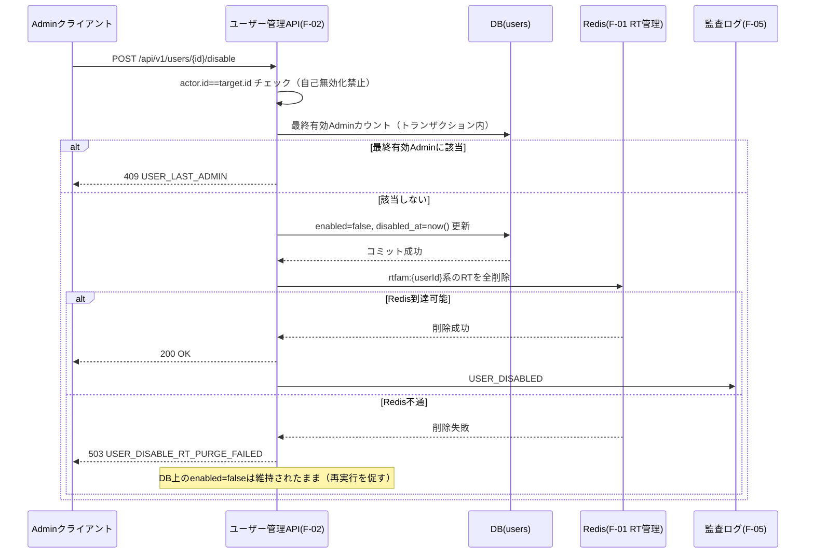

# F-02 ユーザー・ロール管理 設計ドキュメント（Phase1 MVP）

## 改訂履歴

| 版   | 日付       | 変更内容                     |
| ---- | ---------- | ---------------------------- |
| v0.1 | 2026-07-04 | 初版（design-doc-planner のプランを正式設計書に展開） |

## 1. 目的・スコープ境界

本書は ForgeHub Phase1（MVP）におけるユーザー・ロール管理機能（F-02）の詳細設計を定めるものである。対象範囲は、Adminによるユーザーの作成・一覧・詳細参照・更新・無効化・再有効化・パスワードリセット、および認証済み全ロールが利用する自己プロフィール取得（`/users/me`）である。

`/users/me` は本来F-01（認証）に近い機能に見えるが、`docs/design/f-01-jwt-auth.md`（7章、L104）にて「F-02の管轄とし、本書のスコープ外とする」と明記されているため、本書F-02側で設計する。

以下は本書の対象外（非対象）とする。

| 項目 | 対象外とする理由 |
| ---- | ---------------- |
| ハード削除 | `AUDIT_LOG.actor_id` の外部キー整合性を保つため、ユーザーの物理削除は行わずソフト無効化（`enabled=false`）のみを提供する。 |
| 複数ロール割当 | `docs/requirements.md` 4.2に準拠し、ユーザーには単一ロールのみを割り当てる。 |
| self-serviceパスワード変更 | ログイン中ユーザー自身によるパスワード変更エンドポイントはMVPでは提供しない（※本項目は未決。詳細は末尾「13. 未決事項」参照）。 |
| forgot-passwordリセット（パスワード忘れ時の自己リセット） | F-01設計文書の4.1準拠でスコープ外とされている領域であり、F-02側でも実装しない。 |
| MFA（多要素認証） | 対象外。F-01と同様の理由による。 |
| `must_change_password` 強制（初回ログイン時の強制パスワード変更） | 自己パスワード変更エンドポイントが存在しないため、強制フラグを持たせても実行手段がなく不採用とした。 |

参照要件: `docs/requirements.md` 4.2（ユーザー・ロール管理）、7章（API設計方針）、`docs/design/f-01-jwt-auth.md` 6章・7章・11章。

## 2. データモデル

`users` テーブルはF-01（JWT認証）と共有管理する。F-01が参照する6カラム（`id`, `email`, `password_hash`, `role`, `enabled`, `created_at`）は変更せず、F-02側では管理機能に必要なカラムのみを追加する。これによりF-01の動作を壊さないことを担保する。

| カラム | 型 | 制約・備考 | 由来 |
| ------ | -- | ---------- | ---- |
| id | uuid | PK | F-01共有（不変更） |
| email | citext | UNIQUE（大文字小文字を区別しない一意制約） | F-01共有（不変更） |
| password_hash | text | bcrypt（cost=10）のみを格納。平文は一切保持しない | F-01共有（不変更） |
| role | varchar | `CHECK (role IN ('Admin','Developer','Operator'))` | F-01共有（不変更） |
| enabled | boolean | `DEFAULT true` | F-01共有（不変更） |
| created_at | timestamptz | | F-01共有（不変更） |
| updated_at | timestamptz | ユーザーレコード更新時刻 | F-02追加 |
| disabled_at | timestamptz | 無効化時刻。`null`許容（有効時は`null`） | F-02追加 |

インデックス方針:

| 対象 | 種別 | 目的 |
| ---- | ---- | ---- |
| email | UNIQUE（citext） | ログイン・作成時の一意性保証 |
| role | 通常インデックス | 一覧APIの`role`フィルタ高速化 |
| enabled | 通常インデックス | 一覧APIの`enabled`フィルタ高速化 |

ロール値の表現方針: DBには`'Admin'` / `'Developer'` / `'Operator'`の文字列をそのまま格納する。Spring Security側の権限表現（`ROLE_ADMIN`等）へは、`docs/design/f-01-jwt-auth.md` 8章（L109）と整合する形でアプリケーション層がマッピングを行う。DB格納値そのものを`ROLE_`プレフィックス付きに変更することはしない。

## 3. API仕様

すべてのエンドポイントは`/api/v1/users`配下に置く。エラーレスポンスは`docs/requirements.md` 7章の方針に従い`{code, message, details}`形式で統一する（詳細は「9. エラー設計」参照）。`password_hash`はいかなるレスポンスにも含めない。

| # | メソッド | パス | 認可 | 概要 |
| - | -------- | ---- | ---- | ---- |
| EP1 | GET | `/api/v1/users` | ADMIN | ユーザー一覧（ページング・フィルタ） |
| EP2 | POST | `/api/v1/users` | ADMIN | ユーザー作成（初期パスワード自動生成） |
| EP3 | GET | `/api/v1/users/{id}` | ADMIN | ユーザー詳細 |
| EP4 | PATCH | `/api/v1/users/{id}` | ADMIN | ユーザー更新（`email`・`role`のみ） |
| EP5 | POST | `/api/v1/users/{id}/disable` | ADMIN | 無効化 |
| EP6 | POST | `/api/v1/users/{id}/enable` | ADMIN | 再有効化 |
| EP7 | POST | `/api/v1/users/{id}/reset-password` | ADMIN | Admin主導パスワードリセット |
| EP8 | GET | `/api/v1/users/me` | 認証済み全ロール | 自己プロフィール取得 |

### EP1: GET /api/v1/users

クエリパラメータ: `page`（デフォルト0）、`size`（デフォルト20、最大100）、`role`（フィルタ）、`enabled`（フィルタ）、`q`（emailの部分一致検索）。

レスポンス例（200）:

```json
{
  "items": [
    { "id": "...", "email": "...", "role": "Developer", "enabled": true, "created_at": "..." }
  ],
  "page": 0,
  "size": 20,
  "total": 42
}
```

`password_hash`は返却しない。`size`の上限100はフルスキャン防止のための制約であり、「11. 非機能」参照。

### EP2: POST /api/v1/users

リクエストボディ: `{ email, role }`。

処理: システムがCSPRNGにより24文字のランダム初期パスワード（`initial_password`）を生成し、bcrypt（cost=10）でハッシュ化して格納する。Adminがパスワードを直接指定する経路は提供しない（弱いパスワードの混入・リクエストログへの平文混入を防ぐため）。

レスポンス（201）:

```json
{ "id": "...", "email": "...", "role": "Developer", "enabled": true, "initial_password": "..." }
```

`initial_password`はこのレスポンスで一度だけ返却され、以降は再表示されない。監査ログの`detail`にも出力しない（詳細は「6. パスワード取扱」「8. 監査ログ」参照）。F-03のAPIキー発行（発行時のみ平文表示・以降ハッシュのみ保持）と同じパターンを踏襲している。

### EP3: GET /api/v1/users/{id}

レスポンス（200）: `{ id, email, role, enabled, created_at, updated_at, disabled_at }`。存在しない場合は404（`USER_NOT_FOUND`）。

### EP4: PATCH /api/v1/users/{id}

リクエストボディで許可するフィールドは`email`と`role`のみとする。`id`・`enabled`・`password_hash`はリクエストボディに含まれていても無視ではなく仕様上受け付けない（許可フィールドのホワイトリスト方式によるmass-assignment防止）。`enabled`の変更は専用のEP5/EP6でのみ行う。

`role`を変更した場合は`USER_ROLE_CHANGED`として監査ログに記録する（`email`のみの変更であれば`USER_UPDATED`）。

自己（`actor.id == target.id`）に対する`role`変更は禁止であり、詳細は「7. エッジケース」参照。

### EP5: POST /api/v1/users/{id}/disable

効果: `enabled=false`かつ`disabled_at`に現在時刻を設定するDB更新をコミットした後、F-01が管理するRedis上の当該ユーザーの全リフレッシュトークン（RT）を削除する連携を行う。詳細フローは「10. F-01/F-05整合フロー」参照。

冪等性: 既に`enabled=false`のユーザーに対する再実行は200（no-op）とする。

### EP6: POST /api/v1/users/{id}/enable

効果: `enabled=true`とし`disabled_at=null`に戻す。既に`enabled=true`のユーザーに対する再実行は200（no-op、冪等）。

### EP7: POST /api/v1/users/{id}/reset-password

効果: 新しいCSPRNG24文字パスワードを生成しbcryptで再格納したうえで、当該ユーザーのRTを全削除し旧セッションを遮断する。レスポンス（200）で`initial_password`を一度だけ返却する。

本エンドポイントはAdmin主導のリセットであり、F-01がスコープ外としているself-serviceのパスワードリセット（`docs/design/f-01-jwt-auth.md` 4.1参照）とは別物である。ユーザー自身が忘れた場合のセルフリセット手段はMVPには存在しない。

### EP8: GET /api/v1/users/me

認可は「認証済みであること」のみで、Adminに限定しない。リクエストにユーザーIDを含めることは許可せず、常にアクセストークン（AT）の`sub`クレームから対象ユーザーを解決する。クライアントが他人のIDをパスパラメータ等で指定してもそれを無視することで、IDOR（Insecure Direct Object Reference）を防止する。

レスポンス（200）: `{ id, email, role, enabled }`。

## 4. ロール割当ルール

- ユーザーには単一ロールの割当を必須とする（`null`は許容しない）。
- 許可される値は`Admin` / `Developer` / `Operator`の3種に固定する（`docs/design/f-01-jwt-auth.md` 6章L90と整合）。
- enum外の値が指定された場合は400（`USER_INVALID_ROLE`）を返す。DBレベルでも`CHECK`制約により二重に防御する。
- ロールの変更手段はEP4（PATCH）の`role`フィールド経由のみとし、それ以外の変更経路は設けない。
- 最終的に有効な（`enabled=true`）Adminロールが1名のみになる操作（降格・無効化）は禁止する。詳細は「7. エッジケース」参照。
- `enabled=false`となったユーザーもロール情報自体は保持し続け、再有効化（EP6）時に元のロールへ復帰する。

## 5. Admin認可とF-01整合

認可方式は`docs/design/f-01-jwt-auth.md` 8章のRBAC実装をそのまま踏襲する。`@PreAuthorize("hasRole('ADMIN')")`アノテーションにより、`/api/v1/users`系のすべてのエンドポイント（`/users/me`を除く）をADMINロール限定とする。`/users/me`のみ「認証済みであれば全ロール可」とする。

デフォルトdeny原則もF-01と同一とする。注釈のないエンドポイントは`SecurityConfig`側で「認証済みであること」をデフォルト要求し、注釈忘れによる意図しない全許可を防ぐ（`docs/design/f-01-jwt-auth.md` 8章L121参照）。

操作実行者（actor）の特定は、検証済みATの`SecurityContext`上の`sub`クレームのみを用い、DBへの再照会は行わない（`docs/design/f-01-jwt-auth.md` 9.3節SEQ_verify、L197と整合）。

制約として、ロール変更・アカウント無効化を行っても、発行済みのATは最大15分間（F-01のAT TTL）有効なまま残る。これはATがステートレスであり個別失効ができないためであり、`docs/design/f-01-jwt-auth.md` 11章L230および同書「未決事項1」と同一の制約である（※本項目は未決。詳細は末尾「13. 未決事項」参照）。この残存リスクに対しては、無効化時にRTを全削除しリフレッシュ経路を遮断することで、少なくとも新規のAT再取得を防ぐ（`docs/design/f-01-jwt-auth.md` 11章L231整合、詳細は「10. F-01/F-05整合フロー」参照）。

## 6. パスワード取扱

- 初期パスワードはシステムがCSPRNGにより自動生成する24文字の文字列とし、Adminが任意の文字列を入力する経路は提供しない。これは弱いパスワードの混入や、リクエストボディ経由での平文パスワードのアクセスログ混入を避けるためである。
- 格納時は`docs/design/f-01-jwt-auth.md`と同じくbcrypt（cost=10）でハッシュ化する。平文パスワードはDB・アプリケーションログ・例外メッセージ・監査ログの`detail`のいずれにも一切出力しない（`docs/requirements.md` 10.1準拠）。
- 平文パスワードは、ユーザー作成（EP2）またはAdminパスワードリセット（EP7）の実行時に限り、そのレスポンスボディで一度だけ返却する。以降は再表示手段を持たない。
- ログイン中ユーザー自身によるパスワード変更エンドポイントはMVPでは提供しない。初期生成パスワードはAdminによる再リセット（EP7）が行われるまで固定される。（※本項目は未決事項。Phase2でのself-service変更エンドポイント追加を検討。詳細は末尾「13. 未決事項」参照。）
- 前項の制約により、初回ログイン時の強制パスワード変更（`must_change_password`）も採用しない。実行手段となる自己変更APIが存在しないためである。
- 自己パスワード変更・忘却時のセルフリセットが必要な場合は、Adminへ依頼しEP7（Adminパスワードリセット）で代替する運用とする。

## 7. エッジケース

| ケース | 挙動 | 実装上の要点 |
| ------ | ---- | ------------ |
| 自己無効化（`actor.id == target.id`かつdisable） | 403 `USER_SELF_MODIFICATION_FORBIDDEN` | Admin自身が自らを無効化し、誰も管理操作を行えなくなる事態を防ぐ。 |
| 自己ロール変更（`actor.id == target.id`かつrole変更） | 403 `USER_SELF_MODIFICATION_FORBIDDEN` | 自己昇格や、誤操作による自己権限固定化・喪失を防ぐ。無効化と同一エラーコードを用いる。 |
| 最終有効Adminの降格・無効化 | 409 `USER_LAST_ADMIN` | `enabled=true`かつ`role=Admin`の件数が1件のときに、当該Adminへのdisable/降格操作を拒否する。カウントと更新を同一トランザクション内で行い、行ロック等により並行実行時のレースを防止する。 |
| email重複 | 409 `USER_EMAIL_CONFLICT` | `citext UNIQUE`制約により、同時作成・同時更新のレースをDB制約レベルで吸収する。アプリケーション側は`DataIntegrityViolationException`を捕捉し409へ変換する。 |
| 存在しないid指定 | 404 `USER_NOT_FOUND` | EP3〜EP7のいずれについても共通。 |
| 既に無効化済みユーザーへの再無効化 | 200（no-op、冪等） | EP5参照。 |
| 既に有効なユーザーへの再有効化 | 200（no-op、冪等） | EP6参照。 |
| ハード削除要求 | 提供しない | 該当エンドポイント自体を用意しない（「1. 目的・スコープ境界」参照）。 |

## 8. 監査ログ（F-05連携）

F-05が提供する`AUDIT_LOG`テーブル（`actor_id`, `action`, `target_type`, `target_id`, `detail`(jsonb), `created_at`）へ、以下のアクションを追記する。これにより`docs/requirements.md` 4.2「ユーザーの作成・更新・無効化は監査ログに記録される」を満たす。

| action | 発生タイミング |
| ------ | -------------- |
| USER_CREATED | EP2実行時 |
| USER_UPDATED | EP4実行時（`email`のみ変更等、`role`変更を伴わない場合） |
| USER_ROLE_CHANGED | EP4実行時（`role`変更を伴う場合） |
| USER_DISABLED | EP5実行時 |
| USER_ENABLED | EP6実行時 |
| USER_PASSWORD_RESET | EP7実行時 |

記録内容の方針:

- `actor_id`にはAT `sub`クレーム（実行者のユーザーID）を記録する。
- `target_type='USER'`、`target_id`には操作対象ユーザーのIDを記録する。
- `detail`には`role`・`email`・`enabled`の差分（`before`/`after`）のみを記録する。`password_hash`・`initial_password`・その他の平文パスワードは、いかなる形式であっても`detail`に含めない（「6. パスワード取扱」参照）。
- 監査ログへの追記はDBコミット成功後に行う。
- 監査ログは追記のみとし、UI/APIからの更新・削除経路は持たない（`docs/requirements.md` 4.5「改ざん防止」準拠）。

なお、本章で定義した`USER_*`アクション語彙および`detail`のbefore/after形式が、F-05側の設計文書と最終的に整合しているかどうかは未確認である（※本項目は未決。詳細は末尾「13. 未決事項」参照）。

## 9. エラー設計

| コード | HTTPステータス | 発生条件 |
| ------ | --------------- | -------- |
| USER_NOT_FOUND | 404 | 指定されたユーザーIDが存在しない |
| USER_EMAIL_CONFLICT | 409 | emailが既存ユーザーと重複（citext一意制約違反） |
| USER_INVALID_ROLE | 400 | `role`が許可されたenum値（Admin/Developer/Operator）以外 |
| USER_VALIDATION_ERROR | 400 | email形式不正・必須フィールド欠落等 |
| USER_SELF_MODIFICATION_FORBIDDEN | 403 | 自己に対する無効化・ロール変更の試行 |
| USER_LAST_ADMIN | 409 | 最終有効Adminの降格・無効化の試行 |
| USER_DISABLE_RT_PURGE_FAILED | 503 | 無効化時にRedisが不通でRT削除に失敗 |
| AUTH_FORBIDDEN | 403 | ロール不足による認可失敗（F-01のコードを再利用） |
| AUTH_UNAUTHENTICATED | 401 | 未認証（F-01のコードを再利用） |

レスポンスボディは`docs/requirements.md` 7章および`docs/design/f-01-jwt-auth.md` 10章と同様に`{code, message, details}`形式で統一する。

## 10. F-01/F-05整合フロー

### 10.1 無効化フロー（EP5: disable）



DB更新は既にコミットされているため、Redis不通時もアカウント無効化自体は成立している。ただしRT削除が完了するまでの間、当該ユーザーの既存RTを用いた`/api/v1/auth/refresh`が理論上成功しうる残存ギャップが生じる（F-01のrefresh処理は現状`enabled`をDB照合していないため）。ログイン時（`/api/v1/auth/login`）は`enabled`をDB照合済みのため新規ログインは拒否できるが、既存RTからのrefreshは遮断できない場合がある。この残存ギャップの解消には、F-01のrefresh処理側に`enabled`の再チェックを追加する対応が必要であり、F-01設計側とのコーディネートが未完了である（※本項目は未決。詳細は末尾「13. 未決事項」参照）。

### 10.2 パスワードリセットフロー（EP7: reset-password）

処理の骨子は無効化フローと同様であり、(1)新パスワードのbcrypt再格納をコミット、(2)当該ユーザーのRTを全削除して旧セッションを遮断する。Redis不通時は同様に503（`USER_DISABLE_RT_PURGE_FAILED`）を返却し、Adminに再実行を促す。

### 10.3 ロール変更時のAT反映遅延

ロール変更（EP4）では、無効化と異なりRTの削除は行わない（再ログインを要求しない）。ただし、既に発行済みのATには変更前の`role`クレームが最大15分間残存する。これは`docs/design/f-01-jwt-auth.md` 11章の「AT失効の限界」および同書「未決事項1」と同一の既知の制約である（※本項目は未決。詳細は末尾「13. 未決事項」参照）。即時反映が必要な場合はPhase2でのATブラックリスト導入等が候補となるが、本書のスコープでは対応しない。

## 11. 非機能

- ユーザー一覧（EP1）は`role`を`users`テーブルの非正規化カラムとして直接保持しているため、ロール取得のためのJOINは発生せずN+1クエリを生まない。
- ページングを必須（`size`デフォルト20、最大100）とし、無制限のフルスキャンを防止する。
- `role` / `enabled` / `email`に対するインデックスにより、一覧のフィルタ検索を高速化する。
- 上記の対策により、`docs/requirements.md` 10.2のp95 500ms以内の目標を充足する見込みである。
- bcrypt演算（cost=10、概ね50〜100ms）はユーザー作成（EP2）・パスワードリセット（EP7）実行時にのみ発生し、一覧・詳細・更新等の他操作には影響しない。

## 12. 設計上の検討事項（敵対評価）

design-doc-plannerによる設計レビュー段階で、以下の攻撃的な観点からの指摘（ATTACK）と、それに対する対処（RESOLVED、最終的な設計への反映内容）を残す。実装者はこの章のみを読めば、本設計が何を懸念しどう対処したかを把握できる。

| # | 観点 | シナリオ | 対処（RESOLVED） |
| - | ---- | -------- | ----------------- |
| 1 | セキュリティ／権限昇格 | 単一のAdminが自分自身をDeveloperへPATCHし、Admin不在で管理不能になる | 自己ロール変更を禁止（403 `USER_SELF_MODIFICATION_FORBIDDEN`）し、加えて最終有効Adminの降格を禁止（409 `USER_LAST_ADMIN`）を追加した（「4. ロール割当ルール」「7. エッジケース」参照）。 |
| 2 | セキュリティ／mass-assignment | PATCHのリクエストボディに`enabled:true`や`id`を混入させ、無効化バイパスや別ユーザーの上書きを狙う | PATCH（EP4）で許可するフィールドを`email`・`role`のみにホワイトリスト化し、`enabled`の変更は専用のdisable/enable EPに限定、`id`はimmutable、パスワードはreset-password EP限定とした（「3. API仕様」EP4参照）。 |
| 3 | セキュリティ／機密露出 | 作成レスポンスの`initial_password`や`password_hash`を監査ログの`detail`やアプリケーションログに記録し漏洩させる | `initial_password`・`password_hash`を監査ログ`detail`・構造化ログ・例外メッセージのいずれからも除外し、一覧・詳細レスポンスも`password_hash`を返却しない仕様とした（「6. パスワード取扱」「8. 監査ログ」参照）。 |
| 4 | セキュリティ／IDOR | `/users/me`にクライアント指定のIDを渡し、他人のプロフィールを取得する | `/users/me`はATの`sub`クレームのみを用いて対象ユーザーを解決し、クライアント指定のIDは無視する仕様とした（「3. API仕様」EP8、「5. Admin認可とF-01整合」参照）。 |
| 5 | 競合・整合性 | 同一emailでの同時POST二重作成、あるいはPATCHによるemail更新の衝突 | `citext UNIQUE`制約により並行実行の競合をDB層で吸収し、`DataIntegrityViolationException`を捕捉して409 `USER_EMAIL_CONFLICT`へ変換する仕様とした（「7. エッジケース」参照）。 |
| 6 | 競合・整合性 | disableでDB上`enabled=false`とした後、Redis上のRT削除が漏れ、無効化済みユーザーがrefreshでAT再取得を継続する | 無効化フローをDBコミット後にF-01管理下のRTを全削除する構成とし、Redis不通時は503 `USER_DISABLE_RT_PURGE_FAILED`を返却してAdminへ再実行を促すこととした。ただし、RT削除完了までの間はrefreshが成立しうる残存ギャップが残るため、F-01のrefresh処理へ`enabled`再チェックの追加をF-01設計側へ要請する対応とした（完全解消には至らず、未決事項として残存。「10.1 無効化フロー」「13. 未決事項」参照）。 |
| 7 | 整合性 | `role`に`admin`（小文字）や`SuperAdmin`等、enum外の値を投入し認可回避を試みる | DBの`CHECK`制約とアプリケーション層のenum検証の二重チェックとし、enum外の値は400 `USER_INVALID_ROLE`で拒否する仕様とした（「4. ロール割当ルール」参照）。 |
| 8 | スケール・性能 | `/users`一覧にページングが無くフルスキャンが発生する、または一覧取得時に`role`別のJOINが発生しN+1になる | ページングを必須化（デフォルト20、最大100）し、`role`は`users`テーブルの非正規化カラムとしてJOIN不要とした。加えて`role`・`enabled`・`email`にフィルタ用インデックスを追加した（「11. 非機能」参照）。 |
| 9 | 境界・異常系 | 既に無効化済みのユーザーへの再無効化、存在しないIDへの操作、最終Adminの降格試行 | 再無効化・再有効化は冪等な200応答、存在しないIDは404 `USER_NOT_FOUND`、最終Adminの降格・無効化は409 `USER_LAST_ADMIN`でそれぞれカバーした（「7. エッジケース」参照）。 |
| 10 | スコープ逸脱 | self-serviceパスワードリセットやMFAをF-02側で実装してしまい、F-01のスコープ外方針（`docs/requirements.md` 4.1）と矛盾する | self-serviceパスワード変更・forgot-passwordリセット・MFA・複数ロール割当をMVP対象外として「1. 目的・スコープ境界」に明記し、F-02はAdmin主導のパスワードリセット（EP7）のみを提供する方針とした。 |

上記のうち#6（RT削除失敗中の残存ギャップ）は完全な解消には至らず、F-01側とのコーディネートが必要な未決事項として引き続き扱う（「13. 未決事項」参照）。

## 13. 未決事項

以下は本設計において解決に至らず、`OPEN`として残された事項である。実装・レビュー時には特に注意すること（各該当章の本文中にも同様の注記を配置済み）。

1. **self-serviceパスワード変更エンドポイントの未提供**: ログイン中ユーザー自身によるパスワード変更エンドポイントはMVPでは提供しない。初期生成パスワードはAdminによるリセット（EP7）が行われるまで固定される。これに伴い`must_change_password`（初回ログイン時強制変更）も、実行手段となるAPIが存在しないため不採用とした。Phase2での自己変更エンドポイント追加を検討する（「1. 目的・スコープ境界」「6. パスワード取扱」参照）。
2. **ロール変更後のAT反映遅延（最大15分）**: ロール変更を行っても、発行済みATは最大15分間旧`role`のまま有効である。これは`docs/design/f-01-jwt-auth.md`の未決事項1と同一の制約であり、AT即時失効を実現するにはPhase2でのブラックリスト導入等の検討が必要である（「5. Admin認可とF-01整合」「10.3 ロール変更時のAT反映遅延」参照）。
3. **無効化時のRT削除信頼性とF-01との連携未完了**: 無効化フロー（EP5）実行時、Redis不通の場合は503を返しDB上の無効化は維持されるが、RTが残存している間はF-01の`refresh`処理経由でAT再取得が成立しうる残存ギャップがある。F-01の`refresh`処理へ`enabled`のDB再チェックを追加する対応が必要だが、F-01設計側との最終的なコーディネートは未完了である（「10.1 無効化フロー」参照）。
4. **F-05監査ログスキーマとの最終整合確認**: 本書で定義した`USER_*`アクション語彙（`USER_CREATED`等）および`detail`のbefore/after形式が、F-05（監査ログ）の設計文書側と最終的に整合しているかどうかは未確認である（「8. 監査ログ（F-05連携）」参照）。

**再掲・絶対制約**: 平文パスワードは監査ログの`detail`を含むあらゆる経路に一切出力しない。ロール値は`Admin` / `Developer` / `Operator`の3種に固定する。MFA・forgot-passwordリセット・複数ロール割当・ハード削除はいずれもMVP対象外である。
</content>
