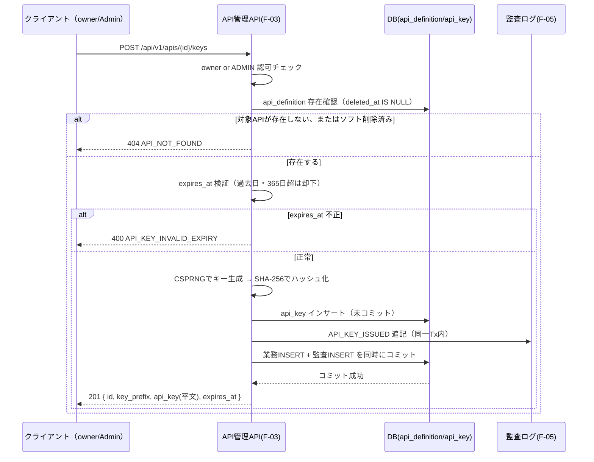
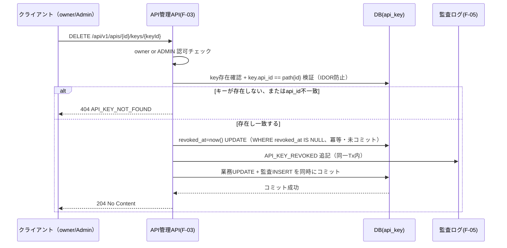
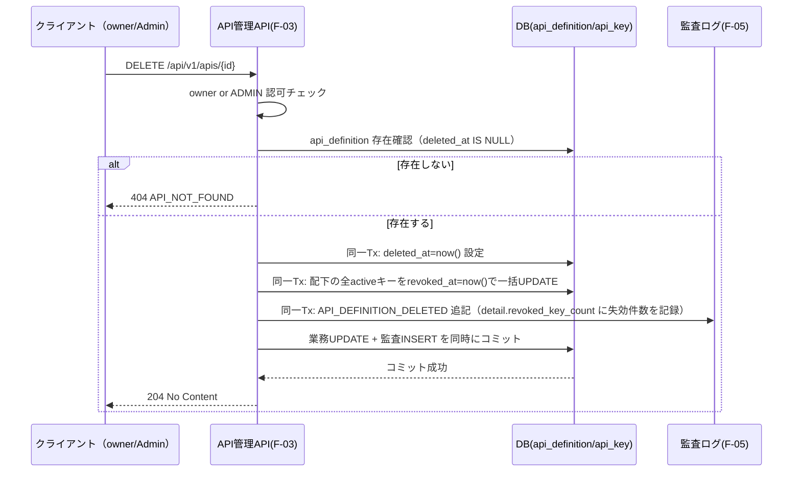

# F-03 API管理 設計ドキュメント（Phase1 MVP）

## 改訂履歴

| 版   | 日付       | 変更内容                     |
| ---- | ---------- | ---------------------------- |
| v0.1 | 2026-07-04 | 初版（design-doc-planner のプランを正式設計書に展開） |
| v0.2 | 2026-07-04 | design-doc-reviewerの指摘を反映。`name`一意制約をソフト削除対応の部分UNIQUEに変更、EP4のowner再割当に対象ユーザーの役割・有効状態検証を追加（3章・5章・9章・13章）。あわせて`docs/requirements.md`側のAPIキー発行/失効の認可を所有者限定に修正し本書と整合させた |
| v0.3 | 2026-07-05 | F-05設計書（`docs/design/f-05-audit-log.md`）の確定を反映。監査ログ追記を「DBコミット成功後」から業務操作と同一Txへ変更（確定事項D準拠、8章・10章）。`API_DEFINITION_*`/`API_KEY_*`アクション語彙・`detail`形式のF-05整合を確定しOPENを解消（15章） |

## 1. 目的・スコープ境界

本書は ForgeHub Phase1（MVP）におけるAPI管理機能（F-03）の詳細設計を定めるものである。対象範囲は、社内APIの仕様レコード（API定義）のCRUD（参照・登録・更新・ソフト削除）、およびAPIキーの発行・一覧・失効である。

以下は本書の対象外（非対象）とする。

| 項目 | 対象外とする理由 |
| ---- | ---------------- |
| APIキーによる外部呼び出しの実行時認証（ゲートウェイ／検証） | `docs/design/f-01-jwt-auth.md` 15章「APIキー認証（F-03）」に「JWTとは別系統の認証方式であり、本書のスコープ外」と明記されており、`docs/requirements.md` 4.3の受け入れ条件にも検証要件の記載がない。格納設計（`key_hash`のUNIQUE index等）は将来対応を見据えて用意するが、検証経路自体はPhase2で設計する（※本項目は未決。詳細は末尾「15. 未決事項」参照）。 |
| Webhook管理・GitHub連携 | `docs/requirements.md` 3.2でPhase2以降と明記されている。 |

参照要件: `docs/requirements.md` 4.3（API管理）、5章 S-04（API一覧・詳細画面）、6章（データモデル）、7章（API設計方針）、10.1・10.4（セキュリティ・ログ監査）。

ロールはF-02準拠でAdmin/Developer/Operatorの3種に固定する。本機能へアクセス可能なのはAdminとDeveloperのみであり、Operatorはアクセス不可とする（`docs/requirements.md` 5章 S-04、`docs/design/f-01-jwt-auth.md` 8章 L117と整合。詳細は「6. 認可・所有権モデル」参照）。

## 2. 用語

| 用語 | 説明 |
| ---- | ---- |
| API定義（`api_definition`） | 社内APIの仕様レコード。名称・概要・エンドポイント・所有者を保持する。 |
| APIキー（`api_key`） | API定義に紐づく、外部利用のためのシークレット。発行時のみ平文を表示し、以降はハッシュのみを保持する。 |
| `key_prefix` | UI上でキーを識別するための非機密な先頭文字列（例: `fgh_ab12cd`）。平文キー全体とは異なり、漏洩しても実害がないよう設計する。 |
| active（有効） | `revoked_at IS NULL AND expires_at > now()` を満たすAPIキーの状態。「7. APIキーライフサイクル」参照。 |

## 3. API定義データモデル

`api_definition` テーブルを新規に設ける。

| カラム | 型 | 制約・備考 |
| ------ | -- | ---------- |
| id | uuid | PK |
| name | citext | NOT NULL（一意性は部分UNIQUEインデックスで保証。下記「インデックス方針」参照） |
| description | text | NULL許容 |
| endpoint | varchar | NOT NULL |
| owner_id | uuid | FK `users.id`、NOT NULL |
| created_at | timestamptz | |
| updated_at | timestamptz | |
| deleted_at | timestamptz | NULL許容。非NULLの場合ソフト削除済みを意味する |

インデックス方針:

| 対象 | 種別 | 目的 |
| ---- | ---- | ---- |
| name | 部分UNIQUE（citext, `WHERE deleted_at IS NULL`） | 有効なAPI定義内でのみ名称の一意性を保証し、同時作成時の競合を検出する |
| owner_id | 通常インデックス | 一覧APIの`owner_id`フィルタおよびJOIN高速化 |
| deleted_at | 部分インデックス（`WHERE deleted_at IS NULL`） | 有効なAPI定義のみを対象とした一覧・検索の高速化 |

削除方式はソフト削除（`deleted_at`）に固定し、ハード削除は提供しない。これは`docs/design/f-02-user-role-management.md`が採用する方針と同様、`AUDIT_LOG.target_id`の参照整合性および監査証跡を保持するためである。

`name`のUNIQUE制約は`deleted_at IS NULL`の部分インデックスとする（全行対象の単純UNIQUEにはしない）。ソフト削除済みのレコードは一意性判定から除外されるため、削除済みと同名のAPI定義を新規作成（EP2）できる。これにより、削除済みレコードが永久に名称を占有し続ける（削除済みと同名では二度と作成できなくなる）事態を避ける。

`owner_id`は作成時にリクエスト実行者（`actor.sub`）が初期値として設定される。作成後のowner再割当はAdmin限定のPATCH操作でのみ可能とする（詳細は「5. API仕様」EP4、「6. 認可・所有権モデル」参照）。

## 4. APIキーデータモデル・ハッシュ方式

`api_key` テーブルを新規に設ける。

| カラム | 型 | 制約・備考 |
| ------ | -- | ---------- |
| id | uuid | PK |
| api_id | uuid | FK `api_definition.id`、NOT NULL |
| user_id | uuid | FK `users.id`、NOT NULL（発行者） |
| name | varchar | NULL許容（ラベル） |
| key_prefix | varchar(12) | NOT NULL。例: `fgh_ab12cd` |
| key_hash | char(64) | UNIQUE NOT NULL。SHA-256のhex表現 |
| expires_at | timestamptz | NOT NULL |
| revoked_at | timestamptz | NULL許容 |
| created_at | timestamptz | |
| last_used_at | timestamptz | NULL許容。実行時認証（Phase2）用の予約カラム |

インデックス方針:

| 対象 | 種別 | 目的 |
| ---- | ---- | ---- |
| key_hash | UNIQUE | 実行時認証（将来）における提示キーのハッシュ一致検索をO(1)化する。MVP時点では未使用だが格納設計として先行して用意する。 |
| api_id | 通常インデックス | キー一覧API（EP6）の`api_id`絞り込みを高速化 |

### キー生成方式

32byteのCSPRNG（暗号論的擬似乱数生成器）で乱数を生成し、base64urlエンコード（43文字）した文字列の先頭に`fgh_`を付与したものを平文APIキー全体とする。`key_hash`にはこの平文キー全体をSHA-256でハッシュ化したhex文字列（64文字）を格納する。

### ハッシュ方式の選定

ハッシュ方式は**SHA-256（ソルトなし）に固定**する。選定理由は以下の通り。

- APIキーは32byte（256bit）のCSPRNGにより生成される高エントロピーな値であり、総当たり攻撃が現実的でない。したがって、bcrypt等の意図的に低速なKDF（Key Derivation Function）は不要である。
- 外部呼び出し（実行時認証、Phase2）のたびに`key_hash`の等値検索を行う必要があり、この検索をO(1)（UNIQUE index）で実現する必要がある。bcryptは72byte切り詰め仕様を持ち、また出力がソルト込みの非決定的な値であるためindexによる等値検索ができない。この理由からbcryptは不採用とする。
- ソルトは、値自体が既に高エントロピーであるため付与する必要がなく、かつソルトを付与すると`key_hash`によるハッシュ一致検索そのものが成立しなくなる（同一平文キーでもソルトが異なれば異なるハッシュ値になるため）。したがって意図的にソルトなしとする。

## 5. API仕様

すべてのエンドポイントは`/api/v1/apis`配下に置く。エラーレスポンスは`docs/requirements.md` 7章の方針に従い`{code, message, details}`形式で統一する（詳細は「9. エラー設計」参照）。

| # | メソッド | パス | 認可 | 概要 |
| - | -------- | ---- | ---- | ---- |
| EP1 | GET | `/api/v1/apis` | ADMIN, DEVELOPER | API定義一覧 |
| EP2 | POST | `/api/v1/apis` | ADMIN, DEVELOPER | API定義作成 |
| EP3 | GET | `/api/v1/apis/{id}` | ADMIN, DEVELOPER | API定義詳細 |
| EP4 | PATCH | `/api/v1/apis/{id}` | owner or ADMIN | API定義更新 |
| EP5 | DELETE | `/api/v1/apis/{id}` | owner or ADMIN | API定義ソフト削除 |
| EP6 | GET | `/api/v1/apis/{id}/keys` | ADMIN, DEVELOPER | APIキー一覧（メタ情報のみ） |
| EP7 | POST | `/api/v1/apis/{id}/keys` | owner or ADMIN | APIキー発行 |
| EP8 | DELETE | `/api/v1/apis/{id}/keys/{keyId}` | owner or ADMIN | APIキー失効 |

EP2・EP4・EP5・EP6は`docs/requirements.md` 7章の代表エンドポイント表には明示されていないが、同4.3のユーザーストーリー「社内APIの仕様を登録・参照し」に基づく妥当な補完として本書で追加した。

### EP1: GET /api/v1/apis

クエリパラメータ: `page`（デフォルト0）、`size`（デフォルト20、最大100）、`owner_id`（フィルタ）、`q`（`name`の部分一致検索）。ソフト削除済み（`deleted_at`が非NULL）のレコードは一覧に含めない。

### EP2: POST /api/v1/apis

リクエストボディ: `{ name, description, endpoint }`。`owner_id`はリクエストボディで指定させず、常に実行者（`actor.sub`）を初期ownerとして設定する（mass-assignment防止）。レスポンスは201。

### EP3: GET /api/v1/apis/{id}

詳細を返却する。存在しない、またはソフト削除済みの場合は404（`API_NOT_FOUND`）。

### EP4: PATCH /api/v1/apis/{id}

リクエストボディで許可するフィールドは`name`・`description`・`endpoint`、および`owner_id`（ADMIN限定）のホワイトリストとする。owner本人がPATCHする場合でも`owner_id`の変更は許可しない。認可はowner本人またはADMINに限定する（非owner・非ADMINの書込は403 `API_NOT_OWNER`）。

`owner_id`再割当時は、割当先ユーザーが`role IN ('Admin', 'Developer')`かつ`enabled=true`であることを検証する。Operatorや無効化済み（`enabled=false`）のユーザーを新ownerに指定した場合は400（`API_INVALID_OWNER`）を返す。これは、Operatorをownerにすると当該APIの書込系エンドポイント（EP4/5/7/8）にowner権限で到達できる者が存在しなくなり（Operatorは本機能へのアクセス自体が不可、「1. 目的・スコープ境界」参照）、実質ADMINしか触れないAPIが生まれてしまうことを防ぐためである。

### EP5: DELETE /api/v1/apis/{id}

ソフト削除（`deleted_at=now()`）を行うと同時に、同一トランザクション内で配下の全active APIキーを失効（`revoked_at=now()`）する。レスポンスは204。詳細は「7. APIキーライフサイクル」「8. シーケンス」参照。

### EP6: GET /api/v1/apis/{id}/keys

APIキーのメタ情報一覧を返す。レスポンス項目は`{id, key_prefix, name, expires_at, revoked_at, status}`とし、平文キーおよび`key_hash`はいずれも返却しない。`status`は`active`/`expired`/`revoked`のいずれかを算出して返す（「7. APIキーライフサイクル」参照）。

### EP7: POST /api/v1/apis/{id}/keys

リクエストボディ: `{ name?, expires_at? }`（いずれも任意）。認可はowner本人またはADMINに限定する。レスポンス（201）: `{ id, key_prefix, api_key, expires_at }`。`api_key`（平文）はこのレスポンスでのみ、一度だけ返却され、以降は再表示手段を持たない。

### EP8: DELETE /api/v1/apis/{id}/keys/{keyId}

認可はowner本人またはADMINに限定する。失効時は必ず`key.api_id == path{id}`を検証する（IDOR防止、「6. 認可・所有権モデル」参照）。既に失効済みのキーに対する再実行は冪等に204を返す。

## 6. 認可・所有権モデル

認可基盤は`docs/design/f-01-jwt-auth.md` 8章のRBAC実装（`@PreAuthorize("hasRole(...)")`）をそのまま踏襲する。`/api/v1/apis`系のすべてのエンドポイントはADMINまたはDEVELOPERロールに限定し、**Operatorはアクセス不可**とする（`docs/requirements.md` 5章 S-04、`docs/design/f-01-jwt-auth.md` 8章 L117と整合。※本制約は絶対制約であり、Phase2以降でも変更予定はない）。

読取系（EP1・EP3・EP6）はADMIN・DEVELOPERであれば全件参照可能とする。所有者に限定しないのは、社内APIの仕様は組織横断で参照できる必要があるためである。

書込系（EP4・EP5・EP7・EP8）は「`owner_id == actor.sub` またはADMIN」に限定する（所有権モデル）。所有者本人でもADMINでもない実行者が書込を試みた場合は403（`API_NOT_OWNER`）を返す。

実行者（actor）の特定は、検証済みアクセストークンの`sub`クレームのみを用い、DBへの再照会は行わない（`docs/design/f-01-jwt-auth.md` 9.3節SEQ_verifyと整合）。

owner再割当（`owner_id`の変更）はEP4においてADMIN限定のホワイトリストフィールドとして提供する。owner本人であってもこのフィールドを変更することはできない（「5. API仕様」EP4参照）。

APIキーの所有権判定として、EP8（失効）では`key.api_id == path{id}`を必ず検証する。これにより、あるAPI定義の配下にないキーIDを別APIのパスに指定して操作するIDOR（Insecure Direct Object Reference）を防止する（「11. セキュリティ制御」参照）。

## 7. APIキーライフサイクル

### 発行

CSPRNGによりキーを生成し、SHA-256ハッシュを`key_hash`に格納する。平文キーは発行レスポンス（201）でのみ一度だけ返却され、以降はDB・アプリケーションのいずれからも再表示する手段を持たない。

### 有効期限

`expires_at`は必須項目とする。リクエストボディで省略された場合は既定90日とする。最大許容期間は365日とし、過去日時の指定または365日を超える指定は400（`API_KEY_INVALID_EXPIRY`）で拒否する。

### 失効

`revoked_at = now()`を、`WHERE revoked_at IS NULL`の条件付きUPDATEで設定する。既に失効済みのキーに対する再実行（二重失効）はエラーとせず、no-opの204で応答する（冪等性）。

### API削除に伴うカスケード失効

EP5（API定義のソフト削除）実行時には、同一トランザクション内で配下の全activeなAPIキーの`revoked_at`を一括して`now()`に設定する。これにより、削除されたAPI定義に紐づく有効なキーが残存することを防ぐ。

### ステータス導出

APIキーの状態（`active`/`expired`/`revoked`）はDBカラムとして保持せず、都度算出する。判定式は「`revoked_at IS NULL AND expires_at > now()`ならば`active`、`revoked_at`が非NULLならば`revoked`、それ以外（`expires_at`超過）は`expired`」とする。

## 8. シーケンス

### 8.1 APIキー発行（EP7）

### 8.2 APIキー失効（EP8）

### 8.3 API定義ソフト削除（EP5）

## 9. エラー設計

| コード | HTTPステータス | 発生条件 |
| ------ | --------------- | -------- |
| API_NOT_FOUND | 404 | 指定されたAPI定義IDが存在しない、または`deleted_at`が設定済み（ソフト削除済み） |
| API_KEY_NOT_FOUND | 404 | 指定されたキーIDが存在しない、または`api_id`がパスの`{id}`と一致しない |
| API_NAME_CONFLICT | 409 | `name`が既存の有効なAPI定義と重複（`deleted_at IS NULL`の部分UNIQUE制約違反）。`DataIntegrityViolationException`を捕捉して変換する |
| API_NOT_OWNER | 403 | 所有者本人でもADMINでもない実行者による書込（EP4/5/7/8）の試行 |
| API_INVALID_OWNER | 400 | EP4の`owner_id`再割当で、割当先が`role IN ('Admin','Developer')`かつ`enabled=true`を満たさない場合 |
| API_KEY_INVALID_EXPIRY | 400 | `expires_at`が過去日、または365日を超える指定 |
| API_VALIDATION_ERROR | 400 | 必須フィールドの欠落、または形式不正 |
| AUTH_UNAUTHENTICATED | 401 | 未認証（`docs/design/f-01-jwt-auth.md`のコードを再利用） |
| AUTH_FORBIDDEN | 403 | ロール不足による認可失敗（Operatorのアクセス試行を含む。`docs/design/f-01-jwt-auth.md`のコードを再利用） |

二重失効（既に失効済みのAPIキーへの失効リクエスト）はエラーではなく204（冪等）として扱う（「7. APIキーライフサイクル」参照）。レスポンスボディは`docs/requirements.md` 7章および`docs/design/f-01-jwt-auth.md` 10章と同様に`{code, message, details}`形式で統一する。

## 10. 監査ログ（F-05連携）

F-05が提供する`AUDIT_LOG`テーブル（`actor_id`, `action`, `target_type`, `target_id`, `detail`(jsonb), `created_at`）へ、以下のアクションを追記する。これにより`docs/requirements.md` 4.3「API定義・APIキー操作は監査ログに記録される」を満たす。

| action | target_type | 発生タイミング |
| ------ | ----------- | -------------- |
| API_DEFINITION_CREATED | API_DEFINITION | EP2実行時 |
| API_DEFINITION_UPDATED | API_DEFINITION | EP4実行時 |
| API_DEFINITION_DELETED | API_DEFINITION | EP5実行時 |
| API_KEY_ISSUED | API_KEY | EP7実行時 |
| API_KEY_REVOKED | API_KEY | EP8実行時 |

記録内容の方針:

- `actor_id`にはアクセストークンの`sub`クレーム（実行者のユーザーID）を記録する。
- `target_id`には対象（API定義またはAPIキー）のIDを記録する。
- `detail`には`name`・`endpoint`・`owner_id`・`expires_at`・`key_prefix`・`revoked_key_count`（EP5でのカスケード失効件数）等の**非機密情報のみ**を記録する。
- **平文APIキー・`key_hash`は、いかなる形式であっても`detail`に一切含めない。** これは本書における絶対制約であり、「11. セキュリティ制御」でも重複して明記する。
- 監査ログへの追記は、業務操作のDB更新と**同一DBトランザクション内**で行い、業務コミットと監査挿入の原子性を保証する（`docs/design/f-05-audit-log.md` 7章 確定事項D準拠。「業務操作は成功したが監査ログに記録されていない」という証跡欠落を排除する）。
- 監査ログは追記のみとし、UI/APIからの更新・削除経路は持たない（`docs/requirements.md` 4.5・10.4「改ざん防止」準拠）。

本章で定義した`API_DEFINITION_*`/`API_KEY_*`アクション語彙および`detail`形式は、F-05側のaction語彙レジストリ（`docs/design/f-05-audit-log.md` 4章）にcanonical（正典）として採録され、整合確認済みである。

## 11. セキュリティ制御

| 観点 | 制御内容 |
| ---- | -------- |
| 平文キーの非表示 | 平文APIキーは発行レスポンス（EP7の201）でのみ一度だけ返却し、以降は再表示手段を持たない。一覧（EP6）・詳細レスポンス、監査ログの`detail`、アプリケーションログ、例外メッセージのいずれにも一切出力しない。 |
| ハッシュ保存 | APIキーはSHA-256のhex文字列（`key_hash`）としてのみ保存し、平文は保持しない（選定理由は「4. APIキーデータモデル・ハッシュ方式」参照）。 |
| 実行時認証（将来） | 提示された平文キーをSHA-256でハッシュ化し、`key_hash`との等値検索で照合する方式を将来的に採用する想定である。ハッシュ値同士の等値比較であるため、比較処理の所要時間差がキーの秘匿性に影響を与えることはない。ただし検証経路自体はMVP対象外（※本項目は未決。詳細は「1. 目的・スコープ境界」「15. 未決事項」参照）。 |
| IDOR防止 | キーID（`keyId`）を対象とする操作（EP8）では、`key.api_id == path{id}`を必須検証する。 |
| mass-assignment防止 | EP4はリクエストボディの許可フィールドを`name`・`description`・`endpoint`・（ADMIN限定の）`owner_id`にホワイトリスト化する。EP2でも`owner_id`はリクエストボディでは受け付けず、常に実行者IDを用いる。 |
| 鍵・シークレット管理 | APIキー自体はハッシュのみをDBに保存するため、Secret Manager等での別管理は不要である。 |
| 通信経路 | HTTPS前提とする（`docs/requirements.md` 10.1準拠）。 |

## 12. 非機能

- p95 500ms以内（`docs/requirements.md` 10.2）を満たすため、以下の対策を講じる。
    - キー一覧（EP6）は`api_id`インデックスへの単発クエリで完結し、N+1クエリを生まない。
    - API一覧（EP1）は`owner_id`へのJOINを1回のみ行い、ページングを必須（デフォルト20、最大100）とすることでフルスキャンを防止する。
- 実行時認証（Phase2対応時）についても、`key_hash`のUNIQUE indexによりO(1)検索が可能な設計としているため、将来的な性能要件も担保できる見込みである。
- SHA-256のハッシュ計算は高速であり、発行・（将来の）検証いずれにおいてもリクエスト遅延への影響は無視できる水準である。

## 13. 設計上の検討事項（敵対評価）

design-doc-plannerによる設計レビュー段階で、以下の攻撃的な観点からの指摘（ATTACK）と、それに対する対処（RESOLVED、最終的な設計への反映内容）を残す。実装者はこの章のみを読めば、本設計が何を懸念しどう対処したかを把握できる。

| # | 観点 | シナリオ | 対処（RESOLVED） |
| - | ---- | -------- | ----------------- |
| 1 | セキュリティ／認可漏れ | Developer-AがDeveloper-B所有のAPIに対してEP7を叩き、キーを勝手に発行して他チームのAPIになりすましたキーを量産する | 書込系エンドポイント（EP4/5/7/8）に「`owner_id == actor.sub` またはADMIN」の所有権チェックを追加し、非owner・非ADMINの書込は403 `API_NOT_OWNER`とした（「6. 認可・所有権モデル」参照）。 |
| 2 | セキュリティ／権限昇格 | OperatorがGET/POST `/apis`系を直接叩き、権限外の操作を行う | `/api/v1/apis`系をADMIN・DEVELOPERロールに限定し、Operatorのアクセスを403 `AUTH_FORBIDDEN`で拒否する仕様とした（「1. 目的・スコープ境界」「6. 認可・所有権モデル」参照）。 |
| 3 | セキュリティ／機密露出 | 発行時の平文`api_key`や`key_hash`を監査ログの`detail`・構造化ログ・一覧/詳細レスポンスに含めてしまい漏洩する | 平文キー・`key_hash`のいずれも監査ログ`detail`・アプリケーションログ・例外メッセージ・list/detailレスポンスから除外し、発行時（EP7）のレスポンスのみで一度だけ表示する方式とした（「10. 監査ログ」「11. セキュリティ制御」参照）。 |
| 4 | セキュリティ／キー漏洩経路 | `key_hash`が低エントロピーなハッシュであれば、逆算によって元のAPIキーが復元されうる | 平文キーは32byte（256bit）のCSPRNGで生成される高エントロピーな値であり総当たり攻撃が非現実的であることを明記し、ソルトが不要である理由（高エントロピーであることに加え、ソルトを付与すると等値検索が成立しなくなること）を「4. APIキーデータモデル・ハッシュ方式」に明記した。 |
| 5 | セキュリティ／IDOR | `/apis/{A}/keys/{Bのkey}`のように、別のAPI配下のキーIDを指定して他API配下のキーを失効・参照しようとする | EP8において`key.api_id == path{id}`の一致を必須検証し、不一致の場合は404 `API_KEY_NOT_FOUND`とする仕様とした（「6. 認可・所有権モデル」「11. セキュリティ制御」参照）。 |
| 6 | セキュリティ／監査改ざん | F-03側から`AUDIT_LOG`を更新・削除しようとする | 監査ログは追記のみとし、UI/APIからの更新・削除経路は一切設けない（`docs/requirements.md` 4.5準拠。「10. 監査ログ」参照）。 |
| 7 | 競合・整合性 | 同一`name`のAPI定義を同時に複数リクエストでPOSTし、二重作成を狙う。またソフト削除後に同名で再作成しようとすると恒久的に409になる懸念 | `name`列を`deleted_at IS NULL`の部分`UNIQUE`制約とし、`DataIntegrityViolationException`を捕捉して409 `API_NAME_CONFLICT`に変換する仕様とした。部分UNIQUEのため、ソフト削除済みレコードは一意性判定から除外され、削除済みと同名の再作成が可能である（「3. API定義データモデル」「9. エラー設計」参照）。 |
| 8 | 競合・整合性／二重実行 | 同一APIキーへの並行失効リクエスト、またはソフト削除済みAPIへのキー発行試行 | 失効は`WHERE revoked_at IS NULL`を条件としたUPDATEにより冪等な204とし、発行前には`deleted_at`の確認を行い、ソフト削除済みであれば404 `API_NOT_FOUND`とする仕様とした（「7. APIキーライフサイクル」「9. エラー設計」参照）。 |
| 9 | スケール・性能 | API一覧・キー一覧の取得時にN+1クエリやフルスキャンが発生する | キー一覧は`api_id`インデックスへの単発クエリ、API一覧は`owner_id`への単発JOINとし、いずれもページングを必須（最大100）とすることでフルスキャンを防止した（「12. 非機能」参照）。 |
| 10 | 境界・異常系 | `expires_at`に過去日や365日超の値を指定する、あるいはAPI削除時に配下のactiveキーが失効されず残存する | 有効期限のバリデーションを400 `API_KEY_INVALID_EXPIRY`で実施し、API定義のソフト削除時には同一トランザクション内で配下の全activeキーをカスケード失効する仕様とした（「7. APIキーライフサイクル」「8. シーケンス」参照）。 |
| 11 | スコープ逸脱 | APIキーの実行時認証（ゲートウェイでの検証）やWebhook連携をMVPで実装してしまう | 実行時認証・Webhook連携はいずれもMVP対象外であることを「1. 目的・スコープ境界」「14. スコープ境界」に明記した。`key_hash`のUNIQUE index等、格納設計のみは将来対応を見据えて先行して用意する方針とした。 |
| 12 | セキュリティ・整合性／権限昇格の逆パターン | ADMINがEP4で`owner_id`をOperatorや無効化済み（`enabled=false`）ユーザーに再割当し、当該APIをowner権限で誰も管理できない状態にする | EP4の`owner_id`再割当時に割当先が`role IN ('Admin','Developer')`かつ`enabled=true`であることを検証し、満たさない場合は400 `API_INVALID_OWNER`とする仕様とした（「5. API仕様」EP4、「9. エラー設計」参照）。 |

## 14. スコープ境界

Phase1（MVP）における明確な非対応事項は以下の通り。

| 項目 | 扱い |
| ---- | ---- |
| APIキーの実行時認証（外部呼び出しのキー検証エンドポイント／ゲートウェイ） | 対象外。`key_hash`のUNIQUE indexなど格納設計のみ将来対応可能な形にしておくが、検証経路・レート制限・`last_used_at`の更新方式自体はPhase2で設計する（※本項目は未決。詳細は末尾「15. 未決事項」参照）。 |
| Webhook管理・GitHub連携 | 対象外（`docs/requirements.md` 3.2、Phase2以降）。 |
| ハード削除 | 提供しない。API定義はソフト削除（`deleted_at`）、APIキーは失効（`revoked_at`）のみとする（「3. API定義データモデル」「7. APIキーライフサイクル」参照）。 |
| owner無効化（F-02 disable）連動の自動失効 | 現案では自動失効は行わず、レコードを保持したままAdminによる`owner_id`再割当（EP4）に委ねる。自動失効ポリシーの要否は未決である（※本項目は未決。詳細は末尾「15. 未決事項」参照）。 |

## 15. 未決事項

以下は本設計において解決に至らず、`OPEN`として残された事項である。実装・レビュー時には特に注意すること（各該当章の本文中にも同様の注記を配置済み）。

1. **APIキーの実行時認証（外部呼び出しのキー検証エンドポイント／ゲートウェイ）が未設計**: MVPでは対象外とする。`key_hash`のUNIQUE indexなど格納設計は将来対応可能な形にしておくが、検証経路そのもの・レート制限・`last_used_at`の更新方式はPhase2で設計する必要がある（「1. 目的・スコープ境界」「11. セキュリティ制御」「14. スコープ境界」参照）。
2. **owner無効化時のAPI/APIキーの扱い**: F-02のユーザー無効化（disable）が発生した場合、当該ユーザーがownerであるAPI定義・発行者であるAPIキーを自動的に失効させるか、レコードをそのまま保持しAdminによる再割当（EP4の`owner_id`変更）に委ねるかは未決である。現案は後者（レコード保持＋Admin再割当）だが、自動失効ポリシーの採否は要検討である（「14. スコープ境界」参照）。
3. **`endpoint`の重複許容・形式バリデーションの厳密仕様**: 複数のAPI定義が同一`endpoint`を指すことを許容するか、また`endpoint`をURL形式として厳密にバリデーションするかパス表記も許容するかについては、本書では確定していない。

（F-05監査ログスキーマとの最終整合確認については、`API_DEFINITION_*`/`API_KEY_*`アクション語彙・`detail`形式が`docs/design/f-05-audit-log.md` 4章のaction語彙レジストリにcanonicalとして採録され、追記方式も同7章 確定事項D「業務操作と同一Tx」に改めたことで解消済みのため本節から削除した。「10. 監査ログ（F-05連携）」参照。）

**再掲・絶対制約**: 平文APIキーは発行レスポンスで一度だけ返却し、以降は再表示不可（監査ログ`detail`・アプリケーションログ・例外メッセージへの出力も禁止）。APIキーはSHA-256ハッシュのみを保存し平文を保持しない。監査ログは追記のみで更新・削除経路を持たない。OperatorはF-03（`/api/v1/apis`系）にアクセス不可。APIキーの実行時認証（外部呼び出しの検証）はMVP対象外。
</content>
