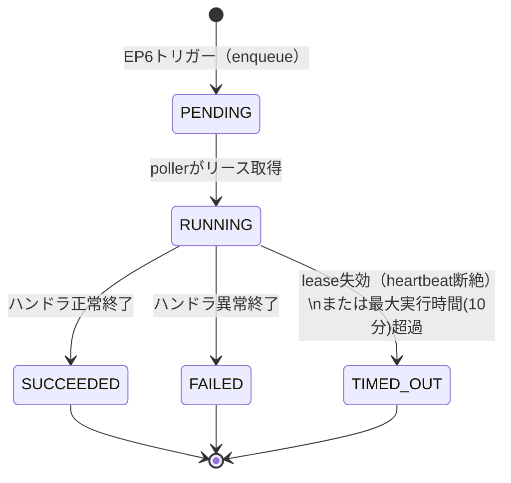
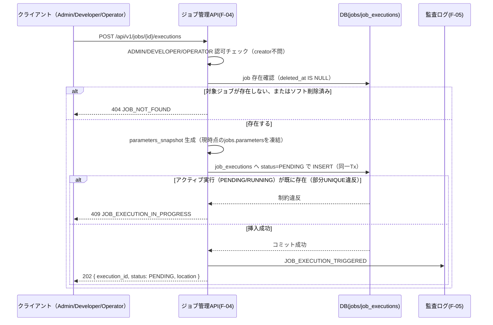
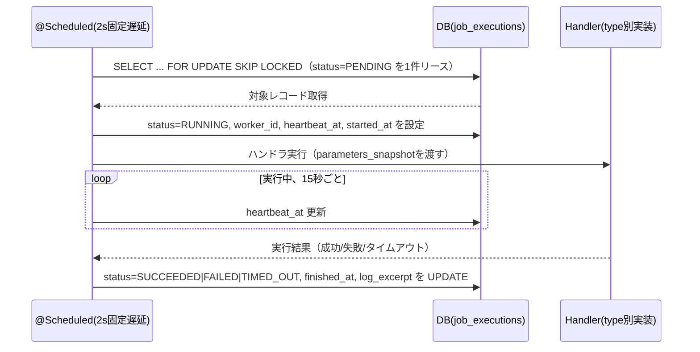
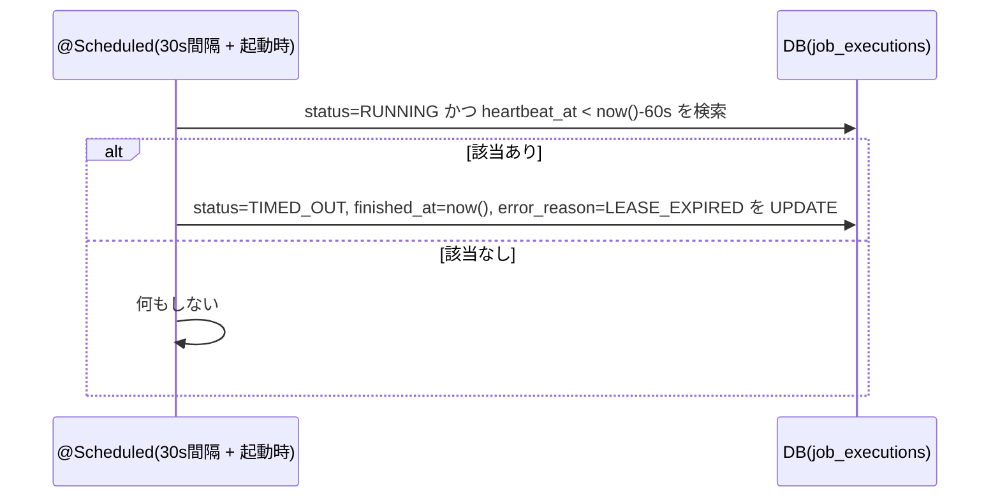
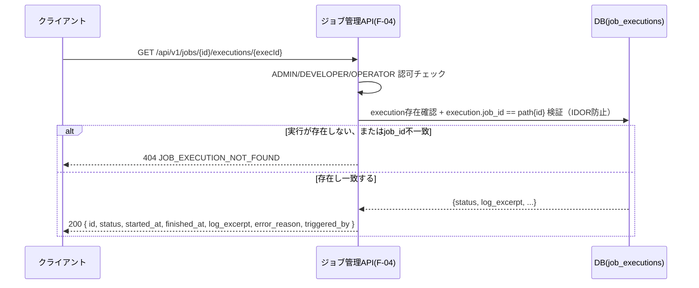

# F-04 ジョブ管理 設計ドキュメント（Phase1 MVP）

## 改訂履歴

| 版   | 日付       | 変更内容                     |
| ---- | ---------- | ---------------------------- |
| v0.1 | 2026-07-05 | 初版（design-doc-planner のプランを正式設計書に展開） |

## 1. 目的・スコープ境界

本書は ForgeHub Phase1（MVP）におけるジョブ管理機能（F-04）の詳細設計を定めるものである。対象範囲は、ジョブ定義のCRUD（登録・一覧・詳細・更新・ソフト削除）、手動実行トリガー（非同期実行）、および実行履歴の参照である。

以下は本書の対象外（非対象）とする。

| 項目 | 対象外とする理由 |
| ---- | ---------------- |
| cron等のスケジュール実行 | `docs/requirements.md` 4.4「スケジュール実行（cron等）はPhase3のScheduler機構で対応するため、MVPでは手動実行のみとする」と明記されている（3.2章のPhase3ロードマップとも整合）。 |
| 任意のスクリプト・シェル・バイナリの実行 | ジョブの`type`は登録済みハンドラに限定し、任意コード実行（RCE）を許容しない。この制約は将来のPhaseを含め恒久的なものである（詳細は「5. ジョブハンドラ／typeレジストリ」「12. セキュリティ制御」参照）。 |
| 実行キャンセルエンドポイント | Phase2で対応予定（※本項目は未決。詳細は末尾「16. 未決事項」参照）。 |
| Cloud Tasks／Pub/Sub等の外部キュー基盤 | Phase3のイベント処理基盤（`docs/requirements.md` 3.2）で対応する。MVPはDBバックの在プロセスキュー（poller）で代替する（詳細は「4. job_executionデータモデル・実行基盤」「15. スコープ境界」参照。※Cloud Runとの両立には制約があり未決。末尾「16. 未決事項」参照）。 |

参照要件: `docs/requirements.md` 4.4（ジョブ管理）、5章 S-05（ジョブ一覧・詳細画面）、6章（データモデル）、7章（API設計方針）、10.2（性能）、10.4（ログ・監査）。

ロールはF-02準拠でAdmin/Developer/Operatorの3種に固定する。本機能へは**3ロールすべてがアクセス可能**とする（`docs/design/f-01-jwt-auth.md` 8章 L118「`/api/v1/jobs`系 | ADMIN, DEVELOPER, OPERATOR」、`docs/requirements.md` 5章 S-05と整合）。`docs/design/f-03-api-management.md`ではOperatorのアクセスを不可としているが、本機能はOperatorが正規のユースケース（実行状況の監視・履歴確認・手動実行）を持つため、F-03とは逆にOperatorを許可する点に注意すること（詳細は「7. 認可・所有権モデル」参照）。

## 2. 用語

| 用語 | 説明 |
| ---- | ---- |
| ジョブ（`job`） | 定型処理の定義。名称（`name`）・種別（`type`）・パラメータ（`parameters`）を保持する。 |
| ジョブ実行（`job_execution`） | ジョブの1回の実行インスタンス。トリガーごとに1レコードが作成される。 |
| ハンドラ（Handler） | `type`に対応する実装済みのJavaコンポーネント。パラメータのJSON Schemaを併せ持つ。任意のtypeを自由に指定することはできず、コード側のレジストリに登録済みのものに限定される（「5. ジョブハンドラ／typeレジストリ」参照）。 |
| lease（リース） | `heartbeat_at`により実行を占有していることを示す、在プロセスの生存確認の仕組み。ワーカー（poller）がジョブ実行をピックアップした際に開始し、定期的に更新（heartbeat）することで生存を示す。 |
| single-flight | 1つのジョブにつき、同時にアクティブな実行（`PENDING`/`RUNNING`）が1件のみであることを保証する制約。 |

## 3. jobデータモデル

`jobs`テーブルを新規に設ける。

| カラム | 型 | 制約・備考 |
| ------ | -- | ---------- |
| id | uuid | PK |
| name | citext | NOT NULL（一意性は部分UNIQUEインデックスで保証。下記「インデックス方針」参照） |
| type | varchar | NOT NULL。CHECK制約により「5. ジョブハンドラ／typeレジストリ」で列挙するハンドラレジストリの識別子のみを許可する |
| parameters | jsonb | NOT NULL、デフォルト`'{}'` |
| created_by | uuid | FK `users.id`、NOT NULL。作成者。リクエストボディでは受け付けず、常に実行者（`actor.sub`）を設定する（mass-assignment防止） |
| created_at | timestamptz | |
| updated_at | timestamptz | |
| deleted_at | timestamptz | NULL許容。非NULLの場合ソフト削除済みを意味する |

インデックス方針:

| 対象 | 種別 | 目的 |
| ---- | ---- | ---- |
| name | 部分UNIQUE（citext, `WHERE deleted_at IS NULL`） | 有効なジョブ内でのみ名称の一意性を保証する。違反時は409 `JOB_NAME_CONFLICT`として処理する |
| type | 通常インデックス | 一覧APIの`type`フィルタを高速化する |
| deleted_at | 部分インデックス（`WHERE deleted_at IS NULL`） | 有効なジョブのみを対象とした一覧・検索の高速化 |

削除方式はソフト削除（`deleted_at`）に固定し、ハード削除は提供しない。これは`docs/design/f-02-user-role-management.md`・`docs/design/f-03-api-management.md`と同様の方針であり、`job_executions`および`AUDIT_LOG.target_id`の参照整合性・監査証跡を保持するためである。

`name`のUNIQUE制約は`deleted_at IS NULL`の部分インデックスとする（全行対象の単純UNIQUEにはしない）。ソフト削除済みのレコードは一意性判定から除外されるため、削除済みと同名のジョブを新規作成できる。これにより、削除済みレコードが永久に名称を占有し続ける事態を避ける。

`type`は作成後**immutable**（変更不可）とする。ジョブ作成後に`type`を変更する経路は提供しない（「6. API仕様」EP4の許可フィールドに`type`は含めない）。これは、`type`変更によりパラメータのJSON Schemaが変わり、既存の`parameters`との不整合が生じる事態を防ぐためである。処理内容を変えたい場合は新規ジョブとして作成する運用とする。

## 4. job_executionデータモデル・実行基盤

### 4.1 job_executionsテーブル

`job_executions`テーブルを新規に設ける。

| カラム | 型 | 制約・備考 |
| ------ | -- | ---------- |
| id | uuid | PK |
| job_id | uuid | FK `jobs.id`、NOT NULL |
| triggered_by | uuid | FK `users.id`、NOT NULL。実行トリガーを行った実行者 |
| status | varchar | NOT NULL。CHECK制約: `PENDING` / `RUNNING` / `SUCCEEDED` / `FAILED` / `TIMED_OUT` |
| parameters_snapshot | jsonb | NOT NULL。トリガー時点の`jobs.parameters`を凍結保存する。ジョブ定義が事後に変更されても、当該実行がどのパラメータで動いたかの履歴再現性を担保するため |
| heartbeat_at | timestamptz | NULL許容。lease用。ワーカーが生存確認のため定期更新する |
| worker_id | varchar | NULL許容。実行を占有しているワーカーの識別子 |
| started_at | timestamptz | NULL許容。`RUNNING`へ遷移した時点で設定 |
| finished_at | timestamptz | NULL許容。終端状態（`SUCCEEDED`/`FAILED`/`TIMED_OUT`）到達時点で設定 |
| log_excerpt | text | NULL許容。最大8KB。超過分は末尾を切り詰め、機密情報はredact（マスキング）する（詳細は「12. セキュリティ制御」参照） |
| error_reason | varchar | NULL許容 |
| created_at | timestamptz | enqueue（`PENDING`挿入）時点 |

インデックス方針:

| 対象 | 種別 | 目的 |
| ---- | ---- | ---- |
| job_id | 通常インデックス | 実行履歴一覧（EP7）の高速化 |
| job_id（部分UNIQUE, `WHERE status IN ('PENDING','RUNNING')`） | 部分UNIQUE | **single-flightをDB制約として強制する。** 同一ジョブに対する並行二重トリガーのレースをDBレベルで吸収し、違反時は409 `JOB_EXECUTION_IN_PROGRESS`として処理する（「8. 実行ライフサイクル・状態遷移」「10. エラー設計」参照） |
| status（部分, `WHERE status='PENDING'`） | 部分インデックス | pollerによる`PENDING`ピックアップの高速化 |
| (status, heartbeat_at) | 複合インデックス | reconcilerによる孤児実行（lease失効）検出の高速化 |

### 4.2 実行基盤（DBバックドキュー・在プロセスpoller）

Phase1では専用のキュー基盤（Cloud Tasks / Pub/Sub）を導入せず、PostgreSQLをキューとして用いる**DBバックドキュー方式**を採用する。実行の流れは以下の通り。

- **トリガー**: EP6の呼び出しにより`job_executions`へ`status=PENDING`のレコードを挿入する。挿入は同一トランザクション内で完結させ、コミット後202を返却する（実際のハンドラ実行はAPIレスポンスに含めない、非同期処理）。
- **poller**: `@Scheduled`による固定遅延2秒間隔のポーリングで、`SELECT ... FOR UPDATE SKIP LOCKED`により`PENDING`のレコードを1件リースする。リース時に`status=RUNNING`・`worker_id`・`heartbeat_at`・`started_at`を設定する。`SKIP LOCKED`により、複数インスタンス・複数スレッドが同時にポーリングしても多重ピックアップが発生しない。
- **heartbeat**: 実行中は`heartbeat_at`を15秒ごとに更新し、ワーカーの生存を示す。
- **reconciler**: `@Scheduled`による30秒間隔、および起動時（アプリ起動直後）の実行により、`status=RUNNING`かつ`heartbeat_at < now() - 60秒`のレコードを`TIMED_OUT`へ回収する（`finished_at=now()`、`error_reason=LEASE_EXPIRED`）。これは、Cloud Runインスタンスのスケールイン等によりワーカーが消滅した場合に、実行が永久に`RUNNING`のまま滞留してしまう事態（孤児実行）を防ぐための仕組みである。
- **最大実行時間**: 10分を超える実行は、ハンドラ側のタイムアウト処理またはreconcilerにより`TIMED_OUT`とする。

なお、この在プロセスpoller/reconciler方式はCloud Runの「無操作時はスケールインする」運用（`docs/requirements.md` 10.3）と部分的に緊張関係にある。※本項目は未決。詳細は末尾「16. 未決事項」参照。

## 5. ジョブハンドラ／typeレジストリ

`type`はコード側の`HandlerRegistry`が保持する**固定enum（レジストリ）**に限定される。各typeは以下の3要素からなる。

- 識別子（`type`カラムに格納する文字列）
- パラメータのJSON Schema
- 実装済みのHandlerクラス

**任意のコード・シェルコマンド・OSコマンド・ユーザー指定URLの実行は一切許容しない**（RCE / SSRF防止）。外部通信を伴うハンドラを実装する場合であっても、通信先はサーバ側で定義したallowlistのみに限定し、ユーザーが指定した任意のホストへの通信は許可しない。

MVPで同梱するハンドラは、最小限の安全なもの（例: `sample.echo`、`sample.sleep`など、外部依存を持たないハンドラ）のみとする。実務で利用する具体的なハンドラ（外部API連携、ファイル処理等）の追加はPhase2以降とする。※本項目は未決。詳細は末尾「16. 未決事項」参照。

パラメータ検証は以下のタイミングで、対応するJSON Schemaと照合する。不一致の場合は400 `JOB_PARAMS_INVALID`とする。

- ジョブ登録時（EP2）
- ジョブ更新時（EP4、`parameters`変更時）
- 実行トリガー時（`parameters_snapshot`生成時点）

`parameters`の最大サイズは8KBとする。また、`parameters`にシークレット・トークン等の機密情報を直値として格納してはならない。機密情報が必要なハンドラは、Secret Managerの参照キー名のみを`parameters`に格納する方式とする（詳細は「12. セキュリティ制御」参照）。

## 6. API仕様

すべてのエンドポイントは`/api/v1/jobs`配下に置く。エラーレスポンスは`docs/requirements.md` 7章の方針に従い`{code, message, details}`形式で統一する（詳細は「10. エラー設計」参照）。

| # | メソッド | パス | 認可 | 概要 |
| - | -------- | ---- | ---- | ---- |
| EP1 | GET | `/api/v1/jobs` | ADMIN, DEVELOPER, OPERATOR | ジョブ一覧 |
| EP2 | POST | `/api/v1/jobs` | ADMIN, DEVELOPER, OPERATOR | ジョブ登録 |
| EP3 | GET | `/api/v1/jobs/{id}` | ADMIN, DEVELOPER, OPERATOR | ジョブ詳細 |
| EP4 | PATCH | `/api/v1/jobs/{id}` | creator or ADMIN | ジョブ更新 |
| EP5 | DELETE | `/api/v1/jobs/{id}` | creator or ADMIN | ジョブソフト削除 |
| EP6 | POST | `/api/v1/jobs/{id}/executions` | ADMIN, DEVELOPER, OPERATOR | ジョブ手動実行トリガー |
| EP7 | GET | `/api/v1/jobs/{id}/executions` | ADMIN, DEVELOPER, OPERATOR | 実行履歴一覧 |
| EP8 | GET | `/api/v1/jobs/{id}/executions/{execId}` | ADMIN, DEVELOPER, OPERATOR | 実行詳細（ポーリング用） |

`docs/requirements.md` 7章の代表エンドポイント表にはEP1（一覧）・EP6（手動実行）のみが明示されている。EP2〜5・EP7・EP8は同4.4のユーザーストーリー「定型処理をジョブとして登録し、手動実行および実行履歴の確認を行いたい」に基づく妥当な補完として本書で追加した。

### EP1: GET /api/v1/jobs

クエリパラメータ: `page`（デフォルト0）、`size`（デフォルト20、最大100）、`type`（フィルタ）、`q`（`name`の部分一致検索）。ソフト削除済み（`deleted_at`が非NULL）のレコードは一覧に含めない。

### EP2: POST /api/v1/jobs

リクエストボディ: `{ name, type, parameters }`。`created_by`・`id`・`deleted_at`はリクエストボディで指定させず、`created_by`は常に実行者（`actor.sub`）を設定する（mass-assignment防止）。`type`はレジストリ外の値であれば400 `JOB_INVALID_TYPE`、`parameters`がJSON Schemaに不適合または8KB超であれば400 `JOB_PARAMS_INVALID`を返す。レスポンスは201。

### EP3: GET /api/v1/jobs/{id}

詳細を返却する。存在しない、またはソフト削除済みの場合は404（`JOB_NOT_FOUND`）。

### EP4: PATCH /api/v1/jobs/{id}

リクエストボディで許可するフィールドは`name`・`parameters`のホワイトリストとする。`type`・`created_by`・`id`は変更不可（`type`のimmutableな理由は「3. jobデータモデル」参照）。認可はcreator本人（`created_by == actor.sub`）またはADMINに限定する（非creator・非ADMINの書込は403 `JOB_NOT_OWNER`）。`parameters`変更時は当該ジョブの`type`に対応するJSON Schemaで再検証する。

### EP5: DELETE /api/v1/jobs/{id}

ソフト削除（`deleted_at=now()`）を行う。認可はcreator本人またはADMINに限定する。レスポンスは204。削除後は新規の実行トリガーができなくなる（EP6が404 `JOB_NOT_FOUND`を返す）。ただし、削除時点で実行中（`RUNNING`）の`job_execution`は中断せず継続実行させ、完了後もDBに履歴として保持する。

### EP6: POST /api/v1/jobs/{id}/executions

手動実行トリガー。認可はADMIN・DEVELOPER・OPERATORいずれも可（creator限定ではない、「7. 認可・所有権モデル」参照）。非同期処理として即座に202 Acceptedを返し、レスポンスボディは`{ execution_id, status: "PENDING", location: <EP8のURL> }`とする。対象ジョブに既にアクティブな実行（`PENDING`/`RUNNING`）が存在する場合は409 `JOB_EXECUTION_IN_PROGRESS`とする（`job_executions`の部分UNIQUE違反を捕捉してハンドリングする）。対象ジョブが存在しない、またはソフト削除済みの場合は404 `JOB_NOT_FOUND`とする。

### EP7: GET /api/v1/jobs/{id}/executions

実行履歴一覧。クエリパラメータ: `page`（デフォルト0）、`size`（デフォルト20、最大100）、`status`（フィルタ）。`started_at`降順でソートする。

### EP8: GET /api/v1/jobs/{id}/executions/{execId}

クライアントがポーリングして実行状況を確認するためのエンドポイント。レスポンス: `{ id, status, started_at, finished_at, log_excerpt, error_reason, triggered_by }`。`execution.job_id == path{id}`を必ず検証する（IDOR防止）。不一致の場合は404 `JOB_EXECUTION_NOT_FOUND`とする（詳細は「7. 認可・所有権モデル」「12. セキュリティ制御」参照）。

## 7. 認可・所有権モデル

認可基盤は`docs/design/f-01-jwt-auth.md` 8章のRBAC実装（`@PreAuthorize("hasRole(...)")`）をそのまま踏襲する。

`/api/v1/jobs`系のすべてのエンドポイントはADMIN・DEVELOPER・OPERATORの全ロールに許可する（`docs/requirements.md` 5章 S-05、`docs/design/f-01-jwt-auth.md` 8章 L118と整合）。`jobs`テーブルには`owner_id`に相当するカラムはER図上存在せず、要件上も所有制約はない。したがってジョブは組織横断の資産として扱い、全ロールが実行トリガー（EP6）を含む読取・実行系操作を行える（Operatorによる実行トリガーは要件上の正規ユースケースである）。

一方、破壊的な書込系（EP4更新・EP5削除）についてはdefensiveな設計として、「creator（`created_by == actor.sub`）またはADMIN」に限定する（`docs/design/f-03-api-management.md`の所有権モデルに準じた方針）。creator本人でもADMINでもない実行者が更新・削除を試みた場合は403 `JOB_NOT_OWNER`を返す。これは、他者が登録したジョブの無断改変・削除（例: パラメータを書き換えて意図しない処理を実行させる、他者の定型処理を勝手に削除する）を防ぐためである。

実行者（actor）の特定は、検証済みアクセストークンの`sub`クレームのみを用い、DBへの再照会は行わない（`docs/design/f-01-jwt-auth.md` 9.3節SEQ_verifyと整合）。

`created_by`はEP2において常に実行者（`actor.sub`）で固定し、リクエストボディでの指定は受け付けない（mass-assignment防止）。

EP8（実行詳細）では`execution.job_id == path{id}`の一致を必ず検証する。これにより、あるジョブ配下にない実行IDを別ジョブのパスに指定して参照するIDOR（Insecure Direct Object Reference）を防止する（「12. セキュリティ制御」参照）。

## 8. 実行ライフサイクル・状態遷移

`job_execution.status`は以下の遷移を取る。

- `started_at`は`RUNNING`遷移時に設定する。
- 終端状態は`SUCCEEDED`・`FAILED`・`TIMED_OUT`の3種であり、いずれも`finished_at`を設定する。
- `log_excerpt`は終端到達時に確定させる（8KB上限・redact済みの内容、「12. セキュリティ制御」参照）。
- single-flight制約: アクティブ（`PENDING`または`RUNNING`）な実行は1ジョブにつき常に1件のみとする（`job_executions`の部分UNIQUE制約により強制、「4. job_executionデータモデル・実行基盤」参照）。
- 冪等性: 同一`execId`に対するGET（EP8）は何度呼び出しても同一の結果を返す（副作用なし）。
- 実行キャンセルはMVPでは提供しない（Phase2対応。※本項目は未決。詳細は末尾「16. 未決事項」参照）。

## 9. シーケンス

### 9.1 手動実行トリガー（EP6）

### 9.2 ワーカー実行（poller、SEQ_worker）

### 9.3 reconciler（孤児実行の回収、SEQ_reconcile）

### 9.4 実行状況ポーリング（EP8、SEQ_poll）

## 10. エラー設計

| コード | HTTPステータス | 発生条件 |
| ------ | --------------- | -------- |
| JOB_NOT_FOUND | 404 | 指定されたジョブIDが存在しない、または`deleted_at`が設定済み（ソフト削除済み） |
| JOB_NAME_CONFLICT | 409 | `name`が既存の有効なジョブと重複（`deleted_at IS NULL`の部分UNIQUE制約違反）。`DataIntegrityViolationException`を捕捉して変換する |
| JOB_INVALID_TYPE | 400 | `type`が「5. ジョブハンドラ／typeレジストリ」で定義するレジストリ外の値 |
| JOB_PARAMS_INVALID | 400 | `parameters`がJSON Schemaに不適合、または8KBを超過 |
| JOB_VALIDATION_ERROR | 400 | 必須フィールドの欠落、または形式不正 |
| JOB_NOT_OWNER | 403 | creator本人でもADMINでもない実行者によるEP4（更新）・EP5（削除）の試行 |
| JOB_EXECUTION_NOT_FOUND | 404 | 指定された実行IDが存在しない、または`job_id`がパスの`{id}`と一致しない |
| JOB_EXECUTION_IN_PROGRESS | 409 | 対象ジョブに既にアクティブな実行（`PENDING`/`RUNNING`）が存在する状態でのEP6呼び出し（部分UNIQUE違反をハンドリング） |
| AUTH_UNAUTHENTICATED | 401 | 未認証（`docs/design/f-01-jwt-auth.md`のコードを再利用） |
| AUTH_FORBIDDEN | 403 | ロール不足による認可失敗。ただしOperatorは本機能（`/api/v1/jobs`系）では許可ロールに含まれるため、この経路には該当しない |

`docs/design/f-03-api-management.md`のAPIキー失効のような「二重失効」に相当する冪等no-opケースは、本機能には該当しない（EP6のsingle-flight違反は409エラーとして扱い、no-opにはしない。「8. 実行ライフサイクル・状態遷移」参照）。レスポンスボディは`docs/requirements.md` 7章および`docs/design/f-01-jwt-auth.md` 10章と同様に`{code, message, details}`形式で統一する。

## 11. 監査ログ（F-05連携）

F-05が提供する`AUDIT_LOG`テーブル（`actor_id`, `action`, `target_type`, `target_id`, `detail`(jsonb), `created_at`）へ、以下のアクションを追記する。これにより`docs/requirements.md` 4.4「ジョブの登録・実行は監査ログに記録される」を満たす。

| action | target_type | 発生タイミング |
| ------ | ----------- | -------------- |
| JOB_CREATED | JOB | EP2実行時 |
| JOB_UPDATED | JOB | EP4実行時 |
| JOB_DELETED | JOB | EP5実行時 |
| JOB_EXECUTION_TRIGGERED | JOB_EXECUTION | EP6実行時（トリガー成功時） |

記録内容の方針:

- `actor_id`にはアクセストークンの`sub`クレーム（実行者のユーザーID）を記録する。
- `target_id`には対象（ジョブまたはジョブ実行）のIDを記録する。
- `detail`には`name`・`type`・`execution_id`・`parameters`等の**非機密情報のみ**を記録する。機密（シークレット・トークン等）の直値は`parameters`内であっても除外する。

実行の完了（`SUCCEEDED`/`FAILED`/`TIMED_OUT`への遷移）は、pollerやreconcilerといったシステムが自律的に行うイベントであり、人間のactorが存在しない。このため、実行完了自体はAUDIT_LOGには記録せず、`job_executions.status`の遷移で追跡する方針とする。`docs/requirements.md` 4.4「ジョブの登録・実行は監査ログに記録される」の「実行」は、EP6によるトリガー記録（`JOB_EXECUTION_TRIGGERED`）をもって充足するものと解釈する。

監査ログへの追記はDBコミット成功後に行う。監査ログは追記のみとし、UI/APIからの更新・削除経路は持たない（`docs/requirements.md` 4.5・10.4「改ざん防止」準拠）。

なお、本章で定義した`JOB_*`アクション語彙および`detail`形式が、F-05側の設計文書と最終的に整合しているかどうかは未確認である（※本項目は未決。`docs/design/f-01-jwt-auth.md`・`docs/design/f-02-user-role-management.md`・`docs/design/f-03-api-management.md`と同種のOPEN。詳細は末尾「16. 未決事項」参照）。

## 12. セキュリティ制御

| 観点 | 制御内容 |
| ---- | -------- |
| 任意コード実行の禁止（RCE防止） | `type`は固定のハンドラレジストリに限定し、CHECK制約でも列挙値に制限する。シェル・OSコマンド・任意コードの実行は一切許容しない（「5. ジョブハンドラ／typeレジストリ」参照）。 |
| SSRF防止 | 外部通信を伴うハンドラは、サーバ側で定義したallowlistのみを許可し、ユーザー指定の任意ホストへの通信は不可とする（「5. ジョブハンドラ／typeレジストリ」参照）。 |
| mass-assignment防止 | EP2・EP4はリクエストボディの許可フィールドをホワイトリスト化する。`created_by`・`status`・`id`・`deleted_at`はいずれのボディでも受け付けない。 |
| IDOR防止 | EP8では`execution.job_id == path{id}`の一致を必須検証する。 |
| パラメータインジェクション防止 | `parameters`はJSON Schema検証および8KB上限のサイズ制約を課す。 |
| 機密非露出 | `parameters`・`log_excerpt`・監査ログの`detail`のいずれにも、シークレット・トークン・パスワード等を出力しない。`log_excerpt`はredact（マスキング）処理を施した上で8KBを上限に切り詰める。 |
| 監査改ざん防止 | 監査ログは追記のみとし、更新・削除経路は設けない。 |
| 通信経路 | HTTPS前提とする（`docs/requirements.md` 10.1準拠）。 |

## 13. 非機能

- p95 500ms以内（`docs/requirements.md` 10.2）を満たすため、以下の対策を講じる。
    - 実行トリガー（EP6）は`job_executions`への`PENDING`挿入のみで完結し、即座に202を返却する。実際のハンドラ実行はAPIレスポンスのレイテンシに含まれない。
    - 長時間処理はDBバックドキュー＋pollerにより非同期化し、`docs/requirements.md` 10.2「ジョブ実行など長時間処理は非同期化し、実行状況をポーリング/履歴で確認できるようにする」を充足する。
    - 実行履歴一覧（EP7）は`job_id`インデックスへの単発クエリで完結し、ページング（デフォルト20、最大100）を必須とすることでフルスキャン・N+1クエリを防止する。
    - ポーリング（EP8）はPK（主キー）への単発クエリで完結する。
- pollerは`SKIP LOCKED`を用いることで、複数インスタンス・複数スレッドが同時に稼働しても同一レコードの多重ピックアップを防止する。

## 14. 設計上の検討事項（敵対評価）

design-doc-plannerによる設計レビュー段階で、以下の攻撃的な観点からの指摘（ATTACK）と、それに対する対処（RESOLVED、最終的な設計への反映内容）を残す。実装者はこの章のみを読めば、本設計が何を懸念しどう対処したかを把握できる。

| # | 観点 | シナリオ | 対処（RESOLVED） |
| - | ---- | -------- | ----------------- |
| 1 | セキュリティ／RCE | ジョブの`type`にシェルコマンドやスクリプトを渡すことで任意コード実行を狙う | `type`を固定のハンドラレジストリに限定し、CHECK制約と合わせて任意実行を不可とした（「5. ジョブハンドラ／typeレジストリ」参照）。 |
| 2 | セキュリティ／SSRF | ユーザーが指定したURLを叩くハンドラを介して、内部メタデータサーバや内部専用サービスへ到達させる | 外部通信を伴うハンドラはサーバ側allowlistのみを許可し、MVP同梱ハンドラは外部依存なしのものに限定した（「5. ジョブハンドラ／typeレジストリ」参照）。 |
| 3 | セキュリティ／パラメータインジェクション | 巨大または悪性の`jsonb`を`parameters`に投入し、DoSやインジェクションを引き起こす | JSON Schemaによる検証と8KB上限のサイズ制約を課し、さらに実行時は`parameters_snapshot`として凍結保存することで、ジョブ定義側の事後変更が実行中の処理に影響しないようにした（「4. job_executionデータモデル・実行基盤」「5. ジョブハンドラ／typeレジストリ」参照）。 |
| 4 | 競合・整合性／二重実行 | 同一ジョブに対して並行してPOSTし、多重実行や多重課金処理を引き起こす | `job_executions`に`(job_id WHERE status IN ('PENDING','RUNNING'))`の部分UNIQUE制約を設け、DBレベルでsingle-flightを強制した。違反時は409 `JOB_EXECUTION_IN_PROGRESS`とする（「4. job_executionデータモデル・実行基盤」「8. 実行ライフサイクル・状態遷移」参照）。 |
| 5 | 可用性／孤児実行 | Cloud Runのスケールインやインスタンス消滅により、`RUNNING`状態の実行が永久に滞留する | heartbeatによるlease方式を導入し、reconciler（30秒間隔＋起動時）が`heartbeat_at < now()-60秒`のレコードを`TIMED_OUT`として回収する仕組みを設けた（「4. job_executionデータモデル・実行基盤」「9. シーケンス」参照）。 |
| 6 | セキュリティ／認可漏れ | 作成者以外の利用者が他者のジョブを無断で改変・削除する | EP4（更新）・EP5（削除）を「creator本人（`created_by == actor.sub`）またはADMIN」に限定し、それ以外は403 `JOB_NOT_OWNER`とした（「7. 認可・所有権モデル」参照）。 |
| 7 | セキュリティ／IDOR | `/jobs/{A}/executions/{Bのexec}`のように、別ジョブに属する実行IDを指定して他ジョブの実行結果を参照する | EP8で`execution.job_id == path{id}`の一致を必須検証し、不一致の場合は404 `JOB_EXECUTION_NOT_FOUND`とした（「6. API仕様」「12. セキュリティ制御」参照）。 |
| 8 | セキュリティ／機密露出 | `log_excerpt`・`parameters`・監査ログの`detail`にシークレットが混入し漏洩する | `log_excerpt`はredact処理＋8KB切詰、`parameters`・監査`detail`ともに機密の直値出力を禁止する方針とした（「11. 監査ログ」「12. セキュリティ制御」参照）。 |
| 9 | セキュリティ／監査改ざん | F-04側から`AUDIT_LOG`を更新・削除しようとする | 監査ログは追記のみの経路のみを提供する（「11. 監査ログ」参照）。 |
| 10 | スコープ逸脱 | cron実行・実行キャンセル・外部キュー基盤（Cloud Tasks等）をMVPで実装してしまう | cronはPhase3、実行キャンセルはPhase2、Cloud Tasks等の外部キュー基盤はPhase3として、それぞれ本書「1. 目的・スコープ境界」「15. スコープ境界」に明記した。 |
| 11 | スケール・性能 | 実行履歴一覧の取得時にフルスキャンやN+1クエリが発生する | `job_id`インデックスへの単発クエリとページング必須（最大100）により、フルスキャンおよびN+1を防止した（「13. 非機能」参照）。 |
| 12 | 競合・整合性 | 同一名称のジョブを同時に複数リクエストでPOSTし、二重作成を狙う | `name`列を`deleted_at IS NULL`の部分UNIQUE制約とし、違反時は409 `JOB_NAME_CONFLICT`に変換する。部分UNIQUEのため、ソフト削除済みのジョブと同名での再作成は可能である（「3. jobデータモデル」参照）。 |

## 15. スコープ境界

Phase1（MVP）における明確な非対応事項は以下の通り。

| 項目 | 扱い |
| ---- | ---- |
| cron等のスケジュール実行 | 対象外。Phase3のScheduler機構で対応する（`docs/requirements.md` 3.2・4.4）。 |
| 実行キャンセルエンドポイント | 対象外。Phase2で対応予定（※本項目は未決。詳細は末尾「16. 未決事項」参照）。 |
| Cloud Tasks / Pub/Sub等の外部キュー基盤 | 対象外。Phase3のイベント処理基盤で対応する。MVPは在プロセスのDBバックドキュー（poller）で代替する（※本項目は未決。詳細は末尾「16. 未決事項」参照）。 |
| 任意スクリプト・シェル実行 | 恒久的に非提供。将来Phaseにおいても`type`はレジストリ限定を維持する方針である（「5. ジョブハンドラ／typeレジストリ」参照）。 |
| ハード削除 | 提供しない。ジョブはソフト削除（`deleted_at`）のみとする（「3. jobデータモデル」参照）。 |
| 実務用ハンドラの実装 | MVPは`sample.echo`等の最小安全ハンドラのみとし、実務用ハンドラの具体実装はPhase2以降とする（※本項目は未決。詳細は末尾「16. 未決事項」参照）。 |

## 16. 未決事項

以下は本設計において解決に至らず、`OPEN`として残された事項である。実装・レビュー時には特に注意すること（各該当章の本文中にも同様の注記を配置済み）。

1. **Cloud Run制約と非同期実行の両立**: 在プロセスのpoller/reconcilerが背景処理を継続するためには、backend用Cloud Runサービスを`min-instances=1`かつCPU常時割当（`--no-cpu-throttling`）とする必要がある。これは`docs/requirements.md` 10.3・14章の「最小インスタンス数を0にし、無操作時はスケールインする（コスト優先）」という方針と部分的に矛盾する（frontend側は0スケールを維持する前提）。恒久的な解決策はPhase3のCloud Tasks / Pub/Subによるキュー化であり、MVPでは`min-instances=1`＋heartbeatによる孤児実行回収というトレードオフを受容する。design-doc-reviewerおよびインフラ担当との合意が必要である（「1. 目的・スコープ境界」「4. job_executionデータモデル・実行基盤」「15. スコープ境界」参照）。
2. **F-05監査ログスキーマとの最終整合確認**: 本書で定義した`JOB_*`アクション語彙・`detail`形式、および実行完了を監査対象とするか否かが、F-05（監査ログ）の設計文書側と最終的に整合しているかは未確認である。`docs/design/f-01-jwt-auth.md`・`docs/design/f-02-user-role-management.md`・`docs/design/f-03-api-management.md`と同種のOPENである（「11. 監査ログ（F-05連携）」参照）。
3. **MVP同梱ハンドラの具体セット・各パラメータJSON Schemaの確定**: MVPで実際に同梱するハンドラの種類と、各typeに対応するJSON Schemaの詳細仕様は実装時に確定する（「5. ジョブハンドラ／typeレジストリ」「15. スコープ境界」参照）。
4. **`parameters`／`log_excerpt`内の機密自動redactの具体ルール**: 機密情報を自動検出・マスキングするための具体的なルール（キー名パターンのマッチング方式等）は未確定である（「12. セキュリティ制御」参照）。
5. **実行完了通知**: Slack等への実行完了通知はPhase2の通知基盤に依存するため、本書の対象外である（`docs/requirements.md` 3.2）。

**再掲・絶対制約**: 任意のコード・シェルコマンド・ユーザー指定URLの実行は一切不可（`type`はハンドラレジストリに限定）。`parameters`・`log_excerpt`・監査ログの`detail`にシークレット・トークン・パスワードを出力しない。監査ログは追記のみで更新・削除経路を持たない。OperatorはF-04（`/api/v1/jobs`系）にアクセス可能（F-03とは逆の扱い）。実行トリガー（EP6）は非同期202を返し、長時間処理はAPIレスポンスの範囲外で行う。cron・実行キャンセル・外部キュー基盤はMVP対象外。
