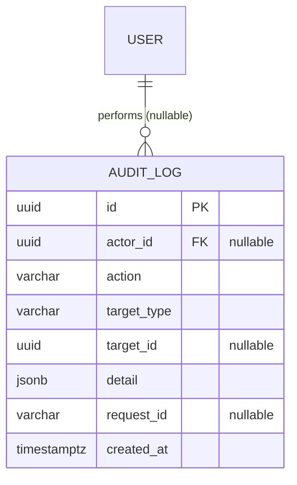
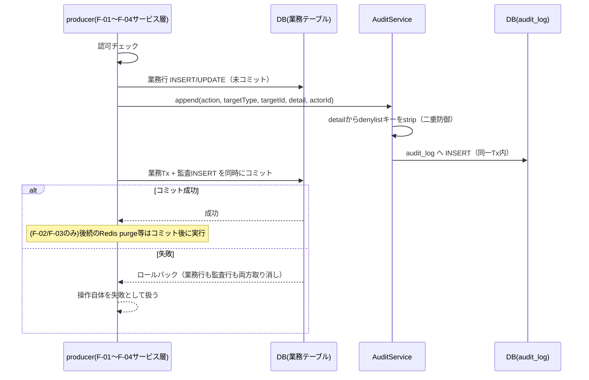
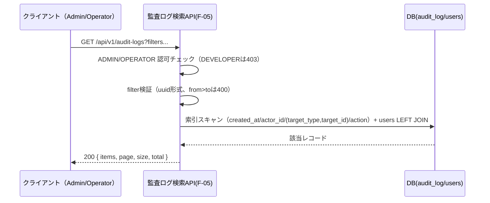
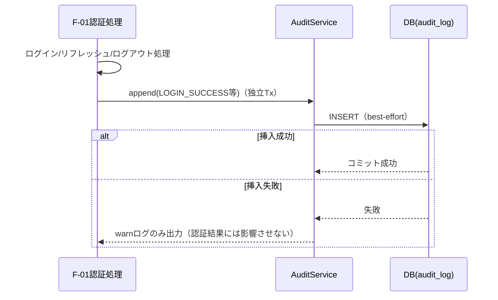

# F-05 監査ログ 設計ドキュメント（Phase1 MVP）

## 改訂履歴

| 版   | 日付       | 変更内容                     |
| ---- | ---------- | ---------------------------- |
| v0.1 | 2026-07-05 | 初版（design-doc-planner のプランを正式設計書に展開）。F-01〜F-04の各設計書に散在していた「F-05整合未確認」のOPENを本書で確定・解消 |

## 1. 目的・スコープ境界

本書は ForgeHub Phase1（MVP）における監査ログ機能（F-05）の詳細設計を定めるものである。本書は単に監査ログの検索APIを設計するだけでなく、**`AUDIT_LOG`テーブルのスキーマとaction語彙（アクション種別の文字列一覧）についての唯一の正典（single source of truth）**として位置付けられる。F-01（JWT認証）・F-02（ユーザー・ロール管理）・F-03（API管理）・F-04（ジョブ管理）の各設計書は、それぞれ独自にaction語彙や`detail`形式を定義した上で「F-05側の設計文書と最終的に整合しているかは未確認」という未決事項を残していた。本書はこれらすべてを確認し、確定・解消する。

対象範囲は以下の通り。

- 監査ログの検索・絞込API（`AuditController`）
- 追記コンポーネント（`AuditService`、F-01〜F-04の各サービス層からin-processで呼び出される）
- 不変性（追記のみ・改ざん防止）の強制
- action語彙・`target_type`・`detail`形式のcanonical（正典）定義

以下は本書の対象外（非対象）とする。

| 項目 | 対象外とする理由 |
| ---- | ---------------- |
| 保持期間・パーティション・アーカイブ | Phase2で`docs/requirements.md` 3.2「可観測性強化」と合わせて検討する（※本項目は未決。詳細は末尾「16. 未決事項」参照）。 |
| 改ざん検知のハッシュチェーン・署名 | `docs/requirements.md` 4.5は「追記のみ（UI/APIから更新・削除できない）」を要求しているのみであり、暗号的完全性の保証はMVP対象外とする（Phase2検討）。 |
| 監査ログのエクスポート・外部SIEM連携 | `docs/requirements.md` 3.2でPhase2以降と整理されている通知基盤・外部連携と同様に扱う。 |

参照要件: `docs/requirements.md` 4.5（監査ログ）、5章 S-06（監査ログ検索画面）、6章（データモデル）、7章（API設計方針）、10.4（ログ・監査）。

## 2. 用語

| 用語 | 説明 |
| ---- | ---- |
| `AUDIT_LOG` | 「誰が（actor）」「いつ」「何を（action）」「どの対象に（target）」行ったかを記録する、追記専用の不変レコード。 |
| actor | 操作を実行した主体。検証済みアクセストークン（AT）の`sub`クレームに由来するユーザーIDで特定する。リクエストボディ由来の値を採用することは一切ない（「7. 追記経路・書込アーキテクチャ」参照）。 |
| producer | 監査対象操作を実行するF-01〜F-04の各サービス層。`AuditService.append(...)`の呼び出し元となる。 |
| `AuditService` | 各producerがin-processで呼び出す追記専用コンポーネント。HTTPエンドポイントとしては公開しない。 |
| `detail` | 操作に付帯する非機密情報を保持する`jsonb`カラム。シークレット・パスワード等は一切格納しない（絶対制約、「8章」「12章」参照）。 |

## 3. データモデル（`AUDIT_LOG` canon）

`docs/requirements.md` 6章のER図に定義された`AUDIT_LOG`テーブルを正典として採用しつつ、本書で以下の通り拡張・確定する。

| カラム | 型 | 制約・備考 |
| ------ | -- | ---------- |
| id | uuid | PK |
| actor_id | uuid | FK `users.id`。**NULLABLE**。`docs/requirements.md` 6章のER図ではNOT NULLを想定していたが、本書で明示的にNULL許容へ確定する。未認証状態でのログイン失敗（例: 未登録emailに対する`LOGIN_FAILURE`）等、actorを特定できないイベントに対応するため。 |
| action | varchar | NOT NULL。「4. action語彙レジストリ」で定義するcanonical値のいずれかを取る。アプリケーション層の`AuditAction` enumで検証し、DBレベルの`CHECK`制約は意図的に付けない（今後のaction追加を許容するため）。 |
| target_type | varchar | NOT NULL。値は`USER` / `API_DEFINITION` / `API_KEY` / `JOB` / `JOB_EXECUTION`の5種。 |
| target_id | uuid | **NULLABLE**。対象が不明・不存在の場合（例: 未登録emailに対する`LOGIN_FAILURE`）は`null`とする。 |
| detail | jsonb | NOT NULL、デフォルト`'{}'`。非機密の付帯情報のみを格納する。 |
| request_id | varchar | NULLABLE。`docs/requirements.md` 10.4「構造化ログはリクエストIDで追跡可能にする」との相関を取るための追加カラム。 |
| created_at | timestamptz | NOT NULL、デフォルト`now()` |

`actor_id`のFK整合性は、`docs/design/f-02-user-role-management.md` 1章が定める「ユーザーのハード削除は行わずソフト無効化（`enabled=false`）のみを提供する」という方針により恒久的に担保される。ユーザーが物理削除されることがないため、`AUDIT_LOG.actor_id`が指す先が消失することはない。

いずれのカラムもINSERT時にのみ設定され、UPDATEされる経路は存在しない（「8. 不変性・改ざん防止強制」参照）。



## 4. action語彙レジストリ（F-01〜F-04統合）

本章は本書における最重要章である。以下がアプリケーション層`AuditAction` enumの全定義であり、F-01〜F-04が参照するcanonical（正典）である。合計20アクション。

| グループ | action | target_type | 出典（元設計） |
| -------- | ------ | ----------- | -------------- |
| AUTH | LOGIN_SUCCESS | USER（`target_id`=user.id） | `docs/design/f-01-jwt-auth.md` 14章 |
| AUTH | LOGIN_FAILURE | USER（`target_id`=user.id または`null`） | 同上 |
| AUTH | LOGOUT | USER | 同上 |
| AUTH | TOKEN_REFRESH | USER | 同上 |
| AUTH | REFRESH_REUSE_DETECTED | USER | 同上 |
| USER | USER_CREATED | USER | `docs/design/f-02-user-role-management.md` 8章 |
| USER | USER_UPDATED | USER | 同上 |
| USER | USER_ROLE_CHANGED | USER | 同上 |
| USER | USER_DISABLED | USER | 同上 |
| USER | USER_ENABLED | USER | 同上 |
| USER | USER_PASSWORD_RESET | USER | 同上 |
| API | API_DEFINITION_CREATED | API_DEFINITION | `docs/design/f-03-api-management.md` 10章 |
| API | API_DEFINITION_UPDATED | API_DEFINITION | 同上 |
| API | API_DEFINITION_DELETED | API_DEFINITION | 同上 |
| API | API_KEY_ISSUED | API_KEY | 同上 |
| API | API_KEY_REVOKED | API_KEY | 同上 |
| JOB | JOB_CREATED | JOB | `docs/design/f-04-job-management.md` 11章 |
| JOB | JOB_UPDATED | JOB | 同上 |
| JOB | JOB_DELETED | JOB | 同上 |
| JOB | JOB_EXECUTION_TRIGGERED | JOB_EXECUTION | 同上 |

### `detail`形式（アクション種別ごと）

| action | `detail`形式 |
| ------ | ------------ |
| `USER_*`（USER_CREATED/UPDATED/ROLE_CHANGED/DISABLED/ENABLED/PASSWORD_RESET） | `{before, after}`。`role` / `email` / `enabled`の差分のみを記録する。 |
| `API_DEFINITION_CREATED` / `API_DEFINITION_UPDATED` | `{name, endpoint, owner_id}`（`docs/design/f-03-api-management.md` 10章と整合） |
| `API_DEFINITION_DELETED` | `{revoked_key_count}`（カスケード失効したAPIキー件数） |
| `API_KEY_ISSUED` / `API_KEY_REVOKED` | `{key_prefix, expires_at}` |
| `JOB_*`（JOB_CREATED/UPDATED/DELETED） | `{name, type}` |
| `JOB_EXECUTION_TRIGGERED` | `{execution_id, parameters}`（`parameters`は非機密のもののみ） |
| `LOGIN_FAILURE`等AUTH系 | `{email, ip, reason_code}` |

### 確定事項

本書は以下3点を確定事項として、F-01〜F-04のOPENを解消する。

- **確定事項A**: `docs/requirements.md` 4.5は「主要な書き込み系操作（CUD、ジョブ実行）」を監査対象と規定しているが、これに加えてAUTH系5イベント（`LOGIN_SUCCESS`等）も監査対象に含める。これは`docs/design/f-01-jwt-auth.md`の未決事項2として提起されていた提案を、本書で承認・解消するものである。※要件書側4.5の文言更新は別途必要（「16. 未決事項」参照）。
- **確定事項B**: ジョブ実行の完了（`SUCCEEDED`/`FAILED`/`TIMED_OUT`への遷移）は、poller/reconcilerが自律的に行うシステムイベントでありhuman actorが存在しないため、`AUDIT_LOG`には記録しない。`job_executions.status`の遷移履歴で追跡する。これは`docs/design/f-04-job-management.md` 11章の決定を本書で承認・解消するものである。
- **確定事項C**: actionの追加は本レジストリ（本章）への追記によってのみ許可する。feature側の実装が任意の文字列をactionとして送出することは、アプリケーション層の`AuditAction` enum検証によって拒否される。

※本章のcanonical定義がF-01〜F-04設計書側の記述と完全に同期されているかは、各ドキュメントの改版が必要であり未決である（「16. 未決事項」参照）。

## 5. 検索API仕様

すべてのエンドポイントは`/api/v1/audit-logs`配下に置く。**書込系エンドポイントは一切設けない**（追記のみ。`docs/requirements.md` 4.5・10.4準拠）。

| # | メソッド | パス | 概要 |
| - | -------- | ---- | ---- |
| EP1 | GET | `/api/v1/audit-logs` | 監査ログ検索 |
| EP2 | GET | `/api/v1/audit-logs/{id}` | 監査ログ単件詳細 |

### EP1: GET /api/v1/audit-logs

クエリパラメータ:

| パラメータ | 型 | 備考 |
| ---------- | -- | ---- |
| `actor_id` | uuid | フィルタ |
| `action` | enum | 「4章」のcanonical値との完全一致 |
| `target_type` | enum | `USER`/`API_DEFINITION`/`API_KEY`/`JOB`/`JOB_EXECUTION` |
| `target_id` | uuid | フィルタ |
| `from` | timestamptz | 省略時は`now() - 30日`をデフォルト適用する（無制限スキャン防止、「9章」参照） |
| `to` | timestamptz | 省略時は`now()` |
| `page` | int | デフォルト0 |
| `size` | int | デフォルト20、最大100 |

ソートは`created_at DESC`固定とする。`from > to`の場合は400（`AUDIT_VALIDATION_ERROR`）を返す。

レスポンス（200）:

```json
{
  "items": [
    {
      "id": "...",
      "actor_id": "...",
      "actor_email": "...",
      "action": "USER_ROLE_CHANGED",
      "target_type": "USER",
      "target_id": "...",
      "detail": { "before": {}, "after": {} },
      "created_at": "..."
    }
  ],
  "page": 0,
  "size": 20,
  "total": 42
}
```

`actor_email`は`users`テーブルへの単発`LEFT JOIN`で取得する。`actor_id`が`null`のレコード（未認証イベント）では`actor_email`も`null`となる。

### EP2: GET /api/v1/audit-logs/{id}

単件詳細を返却する。存在しない場合は404（`AUDIT_NOT_FOUND`）。

## 6. 認可

認可基盤は`docs/design/f-01-jwt-auth.md` 8章のRBAC実装（`@PreAuthorize("hasRole(...)")`）をそのまま踏襲する。

`/api/v1/audit-logs`系はADMIN・OPERATOR限定とする（`docs/requirements.md` 5章 S-06、`docs/design/f-01-jwt-auth.md` 8章 L119と整合）。**DEVELOPERは本機能へアクセス不可であり、アクセス試行は403（`AUTH_FORBIDDEN`）で拒否する。**

F-03（owner限定の書込）やF-04（creator限定の書込）とは異なり、監査ログには所有スコープを設けない。ADMIN・OPERATORは全レコードを横断的に参照できる。これは監査の性質上（「誰が何をしたか」を横断的に把握できる必要がある）意図的な設計である。

読取専用のAPIであるため、actorの特定は不要である。デフォルトdeny原則（`docs/design/f-01-jwt-auth.md` 8章 L123）も踏襲し、認可注釈のないエンドポイントは「認証済みであること」をデフォルト要求する。

## 7. 追記経路・書込アーキテクチャ

各producer（F-01〜F-04のサービス層）は、`AuditService.append(action, targetType, targetId, detail, actorId)`をin-processで呼び出す。HTTP経由の書込エンドポイントは存在しない。

### 確定事項D: 業務操作と同一トランザクションでのappend

append挿入は、業務操作のDB更新と**同一DBトランザクション内**で実行し、原子性を保証する。すなわち、業務コミットと監査挿入は常に同時にcommit/rollbackされ、「業務操作は成功したが監査ログには記録されていない」「監査ログには記録されたが業務操作自体は失敗した」という不整合を排除する。

これは、F-01〜F-04の各本文に記載されている「監査ログへの追記はDBコミット成功後に行う」という記述を、**同一トランザクション方式へ改める調整**である。各ドキュメントの該当箇所（例: `docs/design/f-02-user-role-management.md` 8章「監査ログへの追記はDBコミット成功後に行う」等）は、本書の確定を受けて改版が必要である（design-doc-reviewerとの合意が未了。「16. 未決事項」参照）。

### 例外: AUTH系イベントの独立best-effort Tx

F-01の`LOGIN_SUCCESS` / `LOGIN_FAILURE` / `LOGOUT` / `TOKEN_REFRESH` / `REFRESH_REUSE_DETECTED`は、業務行の更新を伴わない（`users`テーブルへの書込がない）イベントであるため、同一Tx方式の対象外とし、独立した短命のINSERTトランザクションでbest-effort記録する。これらのイベント記録に失敗しても、認証処理本体（ログイン成否等）には影響させない（「10. シーケンス」SEQ_auth_event参照）。

### 具体例: F-02 USER_DISABLED

`docs/design/f-02-user-role-management.md` 10.1章の無効化フローでは、`users`テーブル更新（`enabled=false`）と監査ログ挿入（`USER_DISABLED`）を同一Txでコミットした後に、Redis上のRT一括削除（purge）を実行する。Redisが不通で503を返す場合でも、監査ログは既に確定済みである（DB更新と監査挿入が同一Txであるため）。

`detail`は常にproducer側で非機密情報のみを組み立てて渡す。`AuditService`側でも二重防御として、`detail`に対する denylist ベースのstrip処理を行う（「12. セキュリティ制御」参照）。

## 8. 不変性・改ざん防止強制

`AUDIT_LOG`は多層防御によって「追記のみ・改ざん不可」を実装レベルで強制する。

| 層 | 制御内容 |
| -- | -------- |
| (a) アプリケーション層 | `AuditLog`エンティティのsetterを非公開とし、Repositoryには`save`（INSERT用途）と検索系メソッドのみを実装する。`update`・`delete`・`deleteById`は実装しない。 |
| (b) DB層（トリガー） | `audit_log`テーブルに`BEFORE UPDATE OR DELETE`トリガー`audit_log_immutable`を設定し、`RAISE EXCEPTION`によってUPDATE/DELETEそのものを不可能にする。 |
| (c) DB権限層 | アプリケーションが接続するDBロールには`audit_log`テーブルの`UPDATE`/`DELETE`権限を付与しない（`REVOKE`）。付与するのは`INSERT`/`SELECT`のみとする。 |
| (d) HTTP層 | 書込系エンドポイント（`PUT`/`PATCH`/`DELETE`）自体を定義しない。 |

上記4層は`docs/requirements.md` 4.5「監査ログは改ざん防止のため、UI/APIから更新・削除できない（追記のみ）」および10.4「アプリケーションからの更新・削除経路を持たない」に準拠する。※これは本書における絶対制約であり、Phase2以降も変更予定はない。

## 9. 検索インデックス・ページング

| 対象 | 種別 | 目的 |
| ---- | ---- | ---- |
| created_at | btree（DESC） | 時間範囲フィルタおよびデフォルトソート（`created_at DESC`）の高速化 |
| actor_id | btree | `actor_id`フィルタの高速化 |
| (target_type, target_id) | 複合btree | 対象フィルタの高速化 |
| action | btree | action種別フィルタの高速化 |

ページングはoffset方式（`page`/`size`）とし、他のfeature（F-02/F-03/F-04）と統一する。`size`の最大値は100とする。

`from`/`to`の時間窓はデフォルト30日とし、指定がない場合のスキャン範囲を有界化する（無制限フルスキャンの防止）。`actor_email`は`users`テーブルへの単発`LEFT JOIN`で取得し、N+1クエリを回避する。

深いoffset（例: page番号が非常に大きい場合）のページング性能劣化は、根本的には保持期間・パーティション対策（Phase2）で解決すべき事項であり、MVPでは時間窓のデフォルト適用と`size`上限で緩和するに留める（※本項目は未決。詳細は「16. 未決事項」参照）。

## 10. シーケンス

### 10.1 追記（同一Tx、SEQ_append）



### 10.2 検索（SEQ_search）



### 10.3 AUTH系イベント（独立best-effort Tx、SEQ_auth_event）



## 11. エラー設計

| コード | HTTPステータス | 発生条件 |
| ------ | --------------- | -------- |
| AUDIT_VALIDATION_ERROR | 400 | `action`/`target_type`がenum外、`target_id`/`actor_id`がuuid形式不正、`from > to`、`size`が範囲外 |
| AUDIT_NOT_FOUND | 404 | EP2で指定した`id`が存在しない |
| AUTH_FORBIDDEN | 403 | DEVELOPERまたはロール不足の実行者による`/audit-logs`アクセス試行（`docs/design/f-01-jwt-auth.md`のコードを再利用） |
| AUTH_UNAUTHENTICATED | 401 | 未認証（`docs/design/f-01-jwt-auth.md`のコードを再利用） |

レスポンスボディは`docs/requirements.md` 7章と同様に`{code, message, details}`形式で統一する。

書込系エラーは存在しない（書込エンドポイント自体が存在しないため）。`AuditService.append`の内部失敗は、業務Tx側のロールバックとして各producer側のエラー（例: F-02の`USER_SESSION_PURGE_FAILED`等）に帰着するものであり、F-05自体が独自のHTTPエラーコードを持つものではない。

## 12. セキュリティ制御

| 観点 | 制御内容 |
| ---- | -------- |
| denylist-strip（機密混入の最終防波堤） | `AuditService.append`実行時に、`detail`から`password` / `initial_password` / `api_key` / `key_hash` / `token` / `secret` / `authorization`のキーを除去する。この走査は`detail`のトップレベルキーのみを対象とせず、`parameters`（`JOB_EXECUTION_TRIGGERED`）・`before`/`after`（`USER_*`）等のネストしたjsonb構造の内部まで**再帰的に**キー名を走査し、一致するキーをすべて除去する。F-01〜F-04の各producerが実装ミスで機密値をネスト構造の内部に混入させた場合でも、この中央防御によって漏洩を遮断する（全producer共通の最終防波堤）。 |
| 不変性4層防御 | 「8. 不変性・改ざん防止強制」参照。 |
| actor偽装防止 | `actor_id`は検証済みAT `sub`クレーム由来のみを採用し、リクエストボディ・クライアント指定の値は一切採らない。 |
| SQLインジェクション防止 | 検索フィルタ（`actor_id`/`action`/`target_type`/`target_id`/`from`/`to`）はすべてprepared statementでバインドする。`target_id`・`actor_id`はuuid型として検証し、文字列連結によるクエリ構築を行わない。`detail`はjsonbパラメータとしてバインドされるため、構造化データゆえログ行汚染（改行等の混入によるログ偽装）は成立しない。 |
| RBAC | ADMIN・OPERATOR限定。DEVELOPERは403（「6. 認可」参照）。 |
| 通信経路 | HTTPS前提（`docs/requirements.md` 10.1準拠）。 |
| 監査行自体の露出範囲 | `detail`は非機密情報のみを保持する設計であるため、閲覧をAdmin/Operatorに限定することで十分な保護となる。 |

## 13. 非機能

`docs/requirements.md` 10.2「p95 500ms以内」を満たすため、以下の対策を講じる。

- 検索（EP1）は時間窓のデフォルト30日適用と、`created_at`/`actor_id`/`(target_type,target_id)`/`action`の各索引により、スキャン範囲を限定する。
- ページングを必須化（`size`最大100）し、フルスキャンを防止する。
- `actor_email`の取得は`users`への単発`LEFT JOIN`とし、N+1クエリを回避する。
- 追記（append）は単一INSERTであり、業務トランザクションに数ms程度しか上乗せしない。
- 大規模データ蓄積時の深いoffsetページングの性能劣化は、保持期間・パーティション対応（Phase2）で恒久的に解決する方針であり、MVPでは時間窓のデフォルト適用による緩和に留める（※本項目は未決。詳細は「16. 未決事項」参照）。

## 14. 設計上の検討事項（敵対評価）

design-doc-plannerによる設計レビュー段階で、以下の攻撃的な観点からの指摘（ATTACK）と、それに対する対処（RESOLVED、最終的な設計への反映内容）を残す。実装者はこの章のみを読めば、本設計が何を懸念しどう対処したかを把握できる。

| # | 観点 | シナリオ | 対処（RESOLVED） |
| - | ---- | -------- | ----------------- |
| 1 | セキュリティ／認可漏れ | DEVELOPERが`GET /api/v1/audit-logs`を叩き、全社の操作履歴（誰がいつ何をしたか）を窃取する | `/api/v1/audit-logs`系をADMIN・OPERATOR限定とし、DEVELOPERは403 `AUTH_FORBIDDEN`で拒否する仕様とした（「6. 認可」参照）。 |
| 2 | セキュリティ／権限昇格 | OperatorがUPDATE/DELETE相当の操作を狙い、監査行を改変・削除して自分の不正操作の証跡を消す | HTTPに書込エンドポイントを設けず、アプリ層でsetter/update系Repositoryメソッドを未実装とし、DBロールから`UPDATE`/`DELETE`権限を`REVOKE`し、さらにDBトリガーで`UPDATE`/`DELETE`自体を例外化する4層防御で不能化した（「8. 不変性・改ざん防止強制」参照）。 |
| 3 | セキュリティ／監査改ざん | アプリ経由で`repository.save`が既存idを上書き保存する、あるいはSQL直接実行で過去ログを書き換える | 上記4層防御（#2と同一の「8章」防御）により、アプリ経由・SQL直接いずれの経路もUPDATE/DELETEが成立しない構成とした。 |
| 4 | セキュリティ／機密露出 | producer（F-02/F-03）が`detail`にAPIキー平文やパスワードを誤って積み、AUDIT_LOG経由で漏洩する（各featureが個別に「禁止」と定めていても実装ミスで混入し得る） | `AuditService.append`実行時にdenylistキー（`password`/`initial_password`/`api_key`/`key_hash`/`token`/`secret`/`authorization`）を`detail`からstripする中央防御を追加し、producer側の実装ミスがあっても漏洩を遮断する仕様とした（「7章」「12. セキュリティ制御」参照）。 |
| 5 | 整合性／監査欠落 | 業務操作はコミット済みだが、コミット後の別処理として行う監査挿入が失敗し、「実行したが記録されていない」証跡欠落が生じる（F-01〜F-04の旧「コミット後に追記」記述の穴） | appendを業務操作と同一トランザクションへ確定し、原子性を保証した（確定事項D、「7. 追記経路・書込アーキテクチャ」参照）。旧「コミット後に追記」の記述はこの確定を受けて改版が必要（「16. 未決事項」参照）。 |
| 6 | 整合性／actor偽装 | 攻撃者がリクエストに`actor_id`を混入させ、他人になりすました監査行を捏造する | `actor_id`は検証済みAT `sub`クレーム固定とし、リクエストボディ由来の値は採用しない仕様とした（「7章」「12. セキュリティ制御」参照）。 |
| 7 | 競合・境界／actor不在イベント | 同一操作の並行実行による二重監査行、またはactor不在イベント（未登録emailに対する`LOGIN_FAILURE`）で`actor_id NOT NULL`制約違反によりログイン処理自体が500化する | `actor_id`・`target_id`をNULLABLEとすることで、未登録emailに対する`LOGIN_FAILURE`等を制約違反なく記録できるようにした。AUTH系は独立best-effort Txとし、認証本処理の成否には影響させない（「3章」「7章」参照）。 |
| 8 | スケール | `audit_log`の無制限増加と深いoffsetページングにより、p95 500ms（`docs/requirements.md` 10.2）を超過し全表スキャンが発生する | `created_at`他4索引の付与、`from`省略時30日デフォルトによるスキャン範囲有界化、`size`最大100を組み合わせて対応した（「9. 検索インデックス・ページング」参照）。深いoffsetの根本対策は保持期間対策（Phase2）に持ち越す（※本項目は未決）。 |
| 9 | 境界・異常系 | `from > to`や不正なuuidフィルタを指定し、500エラーまたは全件返却を引き起こす | いずれも400 `AUDIT_VALIDATION_ERROR`として明示的にバリデーションする仕様とした（「11. エラー設計」参照）。 |
| 10 | セキュリティ／インジェクション | `action`/`target_id`フィルタや検索値経由のSQLインジェクション、`detail`値の改行等によるログ汚染 | 全フィルタをprepared statementでバインドし、`target_id`/`actor_id`はuuid型検証を行う。`detail`はjsonbパラメータバインドであり構造化されているため、ログ行汚染は成立しない（「12. セキュリティ制御」参照）。 |
| 11 | 可用性 | 同一Tx方式を採用したことで監査挿入が失敗し続けると、全業務書込がロールバックされDoS化する | 業務系（F-01〜F-04）の書込操作は本質的に監査記録が要件（`docs/requirements.md` 4.5）であるため、監査挿入の恒常的失敗は業務DBそのものの障害と同義であり、通常のDB障害対応（可用性監視・アラート）の範囲で扱う方針とした。AUTH系のみ業務行更新を伴わないため独立Txでbest-effort化し、監査記録の失敗が認証処理自体を巻き込まない設計とした（「7章」参照）。 |
| 12 | スコープ逸脱 | 保持期間ポリシー・ハッシュチェーン・SIEM連携をMVPで作り込んでしまう | いずれもPhase2としてスコープ外であることを「1. 目的・スコープ境界」「15. スコープ境界」に明記した。 |

## 15. スコープ境界

Phase1（MVP）における明確な非対応事項は以下の通り。

| 項目 | 扱い |
| ---- | ---- |
| 保持期間・自動パージ・パーティション | Phase2（`docs/requirements.md` 3.2「可観測性強化」と整合）。大規模時の深いoffset性能劣化もこれに依存する（※本項目は未決。「16. 未決事項」参照）。 |
| 改ざん検知のハッシュチェーン・署名 | Phase2。`docs/requirements.md` 4.5は「追記のみ」で充足しており、暗号的完全性の保証はMVP対象外である（※本項目は未決。「16. 未決事項」参照）。 |
| 監査ログのエクスポート・外部SIEM連携・Slack通知 | Phase2（`docs/requirements.md` 3.2）。 |
| ハード削除 | 恒久的に非提供。 |
| 書込HTTP API | 恒久的に非提供。追記経路はin-processの`AuditService`のみとする。 |

## 16. 未決事項

以下は本設計において解決に至らず、`OPEN`として残された事項である。実装・レビュー時には特に注意すること（各該当章の本文中にも同様の注記を配置済み）。

1. **append同一Tx化の全社調整が未了**: F-01〜F-04の各設計書に記載されている「監査ログへの追記はDBコミット成功後に行う」という記述を、本書の確定事項D「業務と同一Tx」へ改める必要がある。各ドキュメントの改版とdesign-doc-reviewerの合意が未了である（「7. 追記経路・書込アーキテクチャ」参照）。
2. **`docs/requirements.md` 4.5の文言更新**: 「CUD操作＋ジョブ実行」に加えてAUTH系5イベントを監査対象に含める旨を、要件書側4.5に反映する必要がある。現状はF-05側（本書）で承認しただけであり、要件書自体は未更新である（「4. action語彙レジストリ」確定事項A参照）。
3. **保持期間・パーティション・アーカイブ方針が未定**: Phase2で検討する。大規模時の深いoffsetページング性能もこの方針に依存する（「9. 検索インデックス・ページング」「15. スコープ境界」参照）。
4. **改ざん検知の暗号的手段の採否が未定**: ハッシュチェーン・署名等の導入可否はPhase2で検討する（「15. スコープ境界」参照）。
5. **`request_id`の採番・伝播方式が未確定**: MDC（Mapped Diagnostic Context）やフィルタによる採番・伝播方式は、`docs/requirements.md` 10.4のトレーシング設計と統合する必要があり、詳細は未確定である（「3. データモデル」参照）。
6. **AUTH系best-effort追記の失敗許容度が要レビュー**: AUTH系イベント（`LOGIN_SUCCESS`等）の記録失敗を許容する設計（best-effort独立Tx）が、セキュリティ要件上妥当かどうかは別途レビューが必要である（「7. 追記経路・書込アーキテクチャ」参照）。

**再掲・絶対制約**: 監査ログは追記のみとし、HTTP・アプリケーション・DB権限・DBトリガーの4層でUPDATE/DELETEを不能化する。`detail`にはシークレット・平文パスワード・APIキー・`key_hash`・トークンを一切格納しない（`AuditService.append`実行時にdenylistキーをstripする）。`actor_id`はアクセストークンの`sub`クレーム由来の値のみを採用する。
