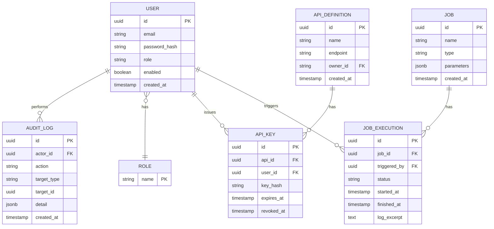
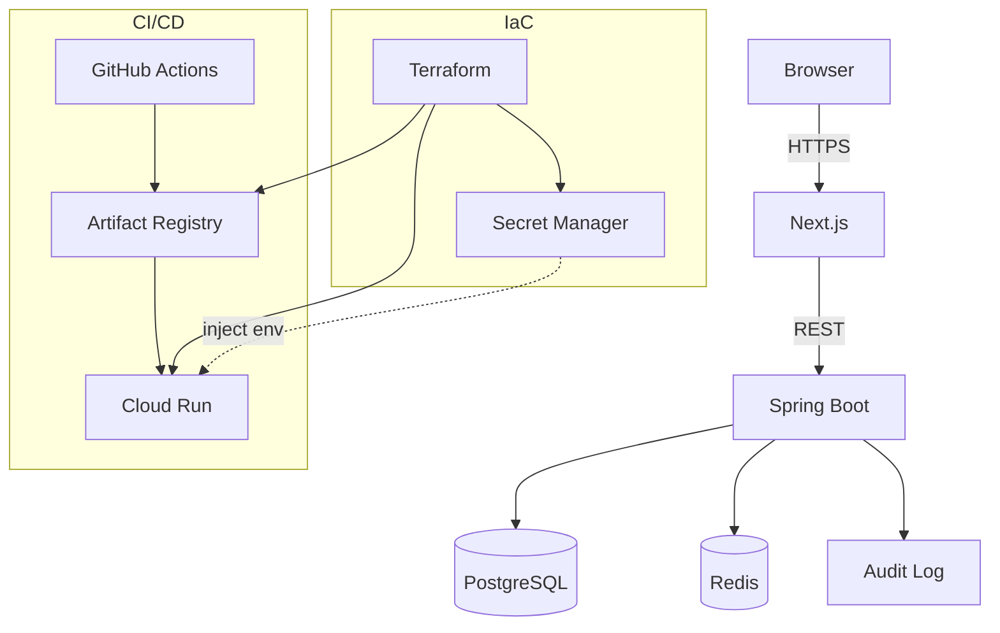

# ForgeHub 要件定義書 v0.4

## 改訂履歴

| 版   | 日付       | 変更内容                                                             |
| ---- | ---------- | ---------------------------------------------------------------- |
| v0.1 | -          | 初版（スコープ・技術スタック・アーキテクチャ概要）                     |
| v0.2 | 2026-07-04 | ポートフォリオ向けに全面改訂。背景/ペルソナ、機能要件詳細、画面一覧、データモデル、API設計方針、非機能要件、開発・テスト方針、CI/CD、リスクを追加 |
| v0.3 | 2026-07-04 | APIキー発行・失効の認可をAdmin/所有者Developerに限定するよう修正（4.3・7章）。他Developerが所有するAPIのキーを無断操作できてしまう権限昇格・可用性リスクを解消 |
| v0.4 | 2026-07-05 | 監査ログの記録対象に認証イベント5種（ログイン成功・ログイン失敗・ログアウト・トークンリフレッシュ・リフレッシュトークン再利用検知）を追加（4.5）。`docs/design/f-05-audit-log.md` 4章の確定事項Aを反映 |

## 1. プロジェクト概要

### 1.1 システム名

ForgeHub

### 1.2 背景・目的

多くの開発組織では、API仕様・バッチ/ジョブの実行管理・操作履歴（監査ログ）がそれぞれ別のツールやスプレッドシートに散在し、「誰が」「いつ」「何を」実行したのかを横断的に追跡することが難しい。ForgeHub は、この課題を模した **社内向け Internal Developer Platform (IDP)** を個人開発することで、以下を実現するポートフォリオプロジェクトである。

-   API・ジョブ・監査ログを一元管理し、権限（ロール）に応じて安全に扱えるプラットフォームを提供する。
-   フルスタック（Next.js + Spring Boot）でのアプリケーション設計・実装力を示す。
-   認証・認可（JWT / RBAC）、Docker Compose によるローカル開発環境、Terraform による IaC、GitHub Actions による CI/CD といった、実務で求められる非機能領域への理解を示す。

### 1.3 想定利用者（ペルソナ）

| ロール    | 概要                                       | 主なユースケース                                   |
| --------- | ------------------------------------------ | --------------------------------------------------- |
| Admin     | プラットフォーム管理者                     | ユーザー・ロールの管理、全体設定、監査ログ閲覧       |
| Developer | API・ジョブを開発・登録するエンジニア      | API仕様の登録・APIキー発行、ジョブの登録・手動実行   |
| Operator  | 運用担当者                                 | ジョブ実行状況の監視、履歴確認、監査ログ閲覧         |

### 1.4 本ドキュメントの位置付け

本書は ForgeHub の MVP（Phase1）を対象とした要件定義書であり、以降の Phase2 / Phase3 の要件は概要レベルに留める。実装が進むにつれて版を更新し、実際のスキーマ・API仕様は別途 OpenAPI / ER図として管理する。

## 2. 用語定義

| 用語        | 説明                                                                 |
| ----------- | -------------------------------------------------------------------- |
| IDP         | Internal Developer Platform。社内向けに開発基盤機能を提供するプラットフォーム |
| JWT         | JSON Web Token。認証情報を署名付きトークンとしてやり取りする方式       |
| RBAC        | Role-Based Access Control。ロールに基づくアクセス制御                  |
| ジョブ      | 登録された処理（バッチ/スクリプト等）の実行単位                        |
| 監査ログ    | 誰が・いつ・何を行ったかを記録する不変の操作履歴                       |
| Cloud Run   | GCP のフルマネージドコンテナ実行サービス                               |

## 3. スコープ

### 3.1 MVP機能一覧（Phase1）

| 機能ID | 機能            | 概要                                             |
| ------ | --------------- | ------------------------------------------------ |
| F-01   | JWT認証         | ログイン、トークン発行・検証、リフレッシュ        |
| F-02   | ユーザー・ロール管理 | ユーザーCRUD、ロール（Admin/Developer/Operator）割当 |
| F-03   | API管理         | API仕様の一覧・詳細表示、APIキーの発行・失効       |
| F-04   | ジョブ管理      | ジョブ登録、手動実行、実行履歴の参照               |
| F-05   | 監査ログ        | 主要操作（作成・更新・削除・実行）の記録・検索      |

### 3.2 MVP対象外（将来フェーズへ）

| 項目                  | 対象外とする理由                                             |
| --------------------- | -------------------------------------------------------------- |
| Webhook管理           | 外部連携はコア機能（認証・API・ジョブ・監査）確立後に着手      |
| Terraform Apply実行   | MVPではTerraformコードの提供のみとし、実行はローカル/手動運用   |
| GitHub連携            | Webhook管理と合わせてPhase2以降で対応                          |
| Slack通知             | 通知基盤（キュー・リトライ等）の設計が必要なためPhase2以降      |
| メトリクス            | 可観測性強化はPhase3のイベント処理基盤と合わせて対応            |
| ダッシュボード        | メトリクス基盤が前提となるためPhase3で対応                     |

## 4. 機能要件

各機能は「ユーザーストーリー」「主な受け入れ条件」の形式で記述する。

### 4.1 認証・認可（F-01）

-   **ユーザーストーリー**: 利用者として、メールアドレスとパスワードでログインし、以降のAPI呼び出しをJWTで認証したい。
-   **受け入れ条件**:
    -   ログイン成功時にアクセストークン（短命）とリフレッシュトークン（長命）を発行する。
    -   アクセストークン失効後、リフレッシュトークンで再発行できる。
    -   トークンにはユーザーID・ロールをクレームとして含み、APIごとにロールベースで認可する。
    -   パスワードは bcrypt 等でハッシュ化して保存し、平文を保持しない。
    -   ログイン失敗を一定回数繰り返した場合の挙動（アカウントロック等）は Phase1 では簡易実装（ログ記録のみ）とし、Phase2で強化を検討する。

### 4.2 ユーザー・ロール管理（F-02）

-   **ユーザーストーリー**: Adminとして、ユーザーを登録・編集・無効化し、ロールを割り当てたい。
-   **受け入れ条件**:
    -   Adminのみがユーザーの作成・ロール変更・無効化を実行できる。
    -   ユーザーには単一のロール（Admin / Developer / Operator）を割り当てる。
    -   ユーザーの作成・更新・無効化は監査ログに記録される。

### 4.3 API管理（F-03）

-   **ユーザーストーリー**: Developerとして、社内APIの仕様を登録・参照し、外部からの利用のためのAPIキーを発行したい。
-   **受け入れ条件**:
    -   API定義（名称・概要・エンドポイント・所有者等）の一覧・詳細を参照できる。
    -   APIキーの発行・失効ができ、キーそのものは発行時のみ表示し、以降は再表示しない（ハッシュ化して保存）。
    -   APIキーの発行・失効は、Adminは任意のAPIに対して、Developerは自身が`owner_id`であるAPIに対してのみ実行できる。他のDeveloperが所有するAPIのキー操作は403で拒否する（他チームのAPIキーを無断で失効・発行できてしまう権限昇格・可用性リスクを防ぐため）。
    -   API定義・APIキー操作は監査ログに記録される。

### 4.4 ジョブ管理（F-04）

-   **ユーザーストーリー**: Developer/Operatorとして、定型処理をジョブとして登録し、手動実行および実行履歴の確認を行いたい。
-   **受け入れ条件**:
    -   ジョブの登録（名称・種別・パラメータ）ができる。
    -   ジョブを手動でトリガーでき、実行結果（成功/失敗・開始/終了時刻・ログ抜粋）が履歴として残る。
    -   スケジュール実行（cron等）はPhase3のScheduler機構で対応するため、MVPでは手動実行のみとする。
    -   ジョブの登録・実行は監査ログに記録される。

### 4.5 監査ログ（F-05）

-   **ユーザーストーリー**: Admin/Operatorとして、誰が・いつ・何を行ったかを検索・確認したい。
-   **受け入れ条件**:
    -   操作種別・対象・実行者・日時で検索・絞り込みができる。
    -   監査ログは改ざん防止のため、UI/APIから更新・削除できない（追記のみ）。
    -   主要な書き込み系操作（ユーザー・API・ジョブに対するCUD、ジョブ実行）はすべて記録対象とする。
    -   認証イベント5種（ログイン成功・ログイン失敗・ログアウト・トークンリフレッシュ・リフレッシュトークン再利用検知）も記録対象とする。

## 5. 画面一覧

| 画面ID | 画面名                 | 概要                                   | 主なロール             |
| ------ | ---------------------- | -------------------------------------- | ---------------------- |
| S-01   | ログイン               | メール/パスワードでログイン            | 全ロール               |
| S-02   | ダッシュボード（簡易） | 自分に関連するAPI/ジョブのサマリ表示   | 全ロール               |
| S-03   | ユーザー一覧・詳細     | ユーザーCRUD、ロール割当               | Admin                  |
| S-04   | API一覧・詳細          | API定義の参照、APIキー発行・失効       | Admin, Developer       |
| S-05   | ジョブ一覧・詳細       | ジョブ登録、手動実行、実行履歴参照     | Admin, Developer, Operator |
| S-06   | 監査ログ検索           | 監査ログの検索・絞り込み               | Admin, Operator         |

## 6. データモデル（概要）

主要エンティティと関連は以下のとおり。詳細なカラム定義はDB設計書（別紙）で管理する。



## 7. API設計方針

-   REST + JSON。エンドポイントは `/api/v1/{resource}` の形式で統一する。
-   認証は `Authorization: Bearer <access_token>` ヘッダーで行う。
-   エラーレスポンスは統一フォーマット（`code` / `message` / `details`）で返却する。
-   代表的なエンドポイント例:

| メソッド | パス                         | 概要                     | 必要ロール              |
| -------- | ---------------------------- | ------------------------ | ----------------------- |
| POST     | /api/v1/auth/login            | ログイン                 | -                        |
| POST     | /api/v1/auth/refresh          | トークン再発行           | 認証済み                 |
| GET      | /api/v1/users                 | ユーザー一覧             | Admin                    |
| POST     | /api/v1/users                 | ユーザー作成             | Admin                    |
| GET      | /api/v1/apis                  | API一覧                  | Admin, Developer         |
| POST     | /api/v1/apis/{id}/keys        | APIキー発行              | Admin, Developer（所有者のみ） |
| DELETE   | /api/v1/apis/{id}/keys/{keyId}| APIキー失効              | Admin, Developer（所有者のみ） |
| GET      | /api/v1/jobs                  | ジョブ一覧               | Admin, Developer, Operator |
| POST     | /api/v1/jobs/{id}/executions  | ジョブ手動実行           | Admin, Developer, Operator |
| GET      | /api/v1/audit-logs             | 監査ログ検索             | Admin, Operator          |

詳細なリクエスト/レスポンススキーマは実装時に OpenAPI (springdoc) で自動生成し、`docs/openapi.yaml` として管理する。

## 8. 技術スタック

### Frontend

-   Next.js
-   TypeScript
-   Tailwind CSS

### Backend

-   Java
-   Spring Boot（Spring Security, Spring Data JPA）

### Database

-   PostgreSQL（ローカルは Docker Compose）

### Cache

-   Redis（ローカルは Docker Compose、リフレッシュトークン/セッション管理に利用）

### Infrastructure

-   Docker Compose（ローカル）
-   Terraform（IaCコード提供、applyは手動）
-   GCP Cloud Run（アプリ実行基盤）
-   Artifact Registry（コンテナイメージ）
-   Secret Manager（機密情報管理）

### CI/CD

-   GitHub Actions

## 9. アーキテクチャ



## 10. 非機能要件

### 10.1 セキュリティ

-   通信はHTTPS前提（Cloud Run標準のTLS終端を利用）。
-   パスワードはbcryptでハッシュ化し、平文を保存・ログ出力しない。
-   JWTは署名アルゴリズム（HS256 または RS256）を用い、アクセストークンは短命（例: 15分）、リフレッシュトークンは長命（例: 7日）とする。
-   APIキーはハッシュ化して保存し、発行時のみ平文を表示する。
-   Secret（DB接続情報・JWT署名鍵等）はSecret Managerで管理し、リポジトリにはコミットしない。

### 10.2 性能

-   通常操作のAPI応答目標: 500ms以内（p95）。
-   ジョブ実行など長時間処理は非同期化し、実行状況をポーリング/履歴で確認できるようにする。

### 10.3 可用性・運用

-   ローカル開発はDocker Composeで一式起動できること。
-   本番相当環境はCloud Runで、無操作時はスケールインすることを許容する（ポートフォリオ用途のためコスト優先）。

### 10.4 ログ・監査

-   アプリケーションログは構造化（JSON）し、リクエストIDで追跡可能にする。
-   監査ログは追記のみとし、アプリケーションからの更新・削除経路を持たない。

### 10.5 テスト戦略

| レイヤー         | 手法                                             | 目安カバレッジ |
| ---------------- | ------------------------------------------------ | -------------- |
| Backend 単体      | JUnit 5 + Mockito                                | ドメイン層 80%以上 |
| Backend 結合      | Testcontainers（PostgreSQL/Redis）による統合テスト | 主要APIの正常系/異常系 |
| Frontend 単体      | Jest + React Testing Library                     | 主要コンポーネント |
| E2E              | Playwright（主要ユーザーストーリーのシナリオ）    | ログイン〜各機能の主要導線 |

### 10.6 コーディング規約

-   Backend: Checkstyle / Spotless 等でフォーマットを統一。
-   Frontend: ESLint + Prettier。
-   CIでLint/テストをPRごとに実行し、失敗時はマージ不可とする。

## 11. 開発・実行環境

### 11.1 リポジトリ構成（案）

```
ForgeHub/
├── apps/
│   ├── frontend/        # Next.js
│   └── backend/         # Spring Boot
├── infra/
│   └── terraform/       # Cloud Run / Artifact Registry / Secret Manager
├── docs/
│   ├── requirements.md
│   └── openapi.yaml
├── docker-compose.yml    # PostgreSQL / Redis / backend / frontend
└── .github/
    └── workflows/        # CI/CD
```

### 11.2 ローカル起動

-   `docker compose up` で PostgreSQL・Redis・backend・frontend を一括起動できることを目標とする。
-   環境変数は `.env` テンプレート（`.env.example`）を提供し、Secretはコミットしない。

## 12. CI/CDパイプライン

-   ブランチ戦略: `main` を安定ブランチとし、feature ブランチからPRを作成。
-   PR時: Lint・単体テスト・ビルドをGitHub Actionsで実行し、グリーンでないとマージ不可。
-   `main` マージ時: Dockerイメージをビルドし、Artifact Registryへpush。
-   Cloud Runへのデプロイは、MVP段階では手動トリガー（`workflow_dispatch`）とし、Phase2以降で自動デプロイ化を検討する。

## 13. ロードマップ

| Phase  | スコープ                                       | 目安期間（個人開発） |
| ------ | ------------------------------------------------ | -------------------- |
| Phase1 | 認証・ユーザー/ロール管理・API管理・ジョブ管理・監査ログ（本書対象） | 6〜8週間             |
| Phase2 | Webhook管理・Terraform管理・GitHub連携・Slack通知 | 4週間                |
| Phase3 | イベント処理・Scheduler・メトリクス・プラグイン機構 | 4週間以上            |

## 14. リスクと対応

| リスク                                   | 影響                         | 対応方針                                             |
| ---------------------------------------- | ---------------------------- | ------------------------------------------------------ |
| 個人開発のため開発リソースが限られる     | スケジュール遅延             | MVPスコープを厳格に守り、Phase2以降へ機能を先送りする   |
| GCP利用コストの増大                      | 想定外の課金                 | Cloud Runの最小インスタンス数を0にし、無料枠中心で運用   |
| 認可設計の不備によるロール権限の抜け漏れ | セキュリティインシデント     | ロールごとのアクセス制御をテストコードで網羅的に検証     |
| スコープクリープ（対象外機能への着手）   | MVPの完成遅延                | 本書「6. MVP対象外」を都度参照し、Phase外の着手を抑制する |

## 15. 今後の課題（Open Issues）

-   OpenAPIスキーマ・ER図の正式版を実装と並行して確定する。
-   アクセストークン/リフレッシュトークンの保存先（Redis or DB）の最終決定。
-   Terraformのstate管理方法（ローカル/GCSバックエンド）の選定。
